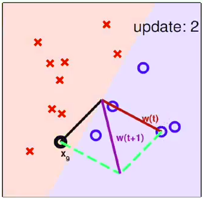
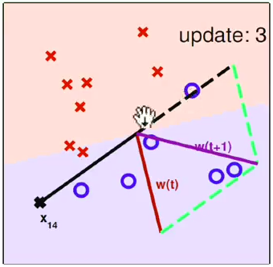

## 感知机（perceptron）

感知器（perceptron）1957年由Rosenblatt提出，是神经网络与支持向量机的基础。感知器是二类分类的线性分类模型，其输入为实例的特征向量，输出为实例的类别，取+1和-1二值。感知机对应于输入空间（特征空间）中将实例划分为正负两类的分离超平面，属于判别模型。感知机学习旨在求出将训练数据进行线性划分的分离超平面。

## 分离超平面分类法

分离超平面进行分类的过程是构造线性判定边界，试图显示地、尽可能好地将数据分到不同的类。

### 超平面分离定理

超平面分离定理是应用凸集到最优化理论中的重要结果，这个结果在最优化理论中有重要的位置。所谓两个凸集分离，直观地看是指两个凸集合没有交叉和重合的部分，因此可以用一张超平面将两者隔在两边。

## 感知机定义

H: 所有感知机集合，我们想利用训练集D得到g≈f,即g\(xn\)=f\(xn\)=yn  

## 感知机几何解释

## 感知机学习算法（perception learning algorithm）

下面的图片给出了感知机的原始学习过程：

从图中可以看出，如果2D平面中向量w与向量x呈钝角，而x为正例，这说明w·x的角度太大了，（ 向量w和向量x相乘，如果两个方向相反，W∗X=\|W\|∗\|X\|∗cosθ=−\|W\|∗\|X\| ，则乘积为复数。但如果X是正例，即y=+1的话，说明W与X的角度太大， ）这样，将w调整成w+y·x，即将w向x转动一下，接近x向量；同理，如果分离超平面错将正例数据分成负例数据时（2D平面中，向量w与向量x呈锐角），那么将w调整成w+y·x，实际上是向量w-x，则w要远离x一点。

## 问题：H中有无限多感知机，如何选择？

解决： 从某一元素g0开始，用数据集D逐步纠正\(correct\)

## 问题：如何判断已经没有犯错误？

逐个检查1....N个点是否分在了错误的位置。next can follow naive cycle\(1...N\) or precomputed random cycle

2D感知机学习算法演示

update 1:初始情况下，分类器认为所有数据都是错误的，所以任意找一个数据进行修正。

update1: 这里，w为分离平面的法向量，分离平面垂直于法向量。

update 2:xg是被错分的数据，所以将原来的法向量和数据的向量相加，得到一个旋转之后的法向量。

如此，进行下去，不断地修正，直到所有的数据都被正确的分类。

最后，找到了“完美”分类的线

|  |  |  |  |
| --- | --- | --- | --- |
|  |  |  |  |
|  |  |  |  |

### 问题：

### 1. 算法何时停下来？无错时停下来？但若不存在无错的g?

### 2. 在训练集D上，g也许表现很好，但对于D之外的样本？

          

