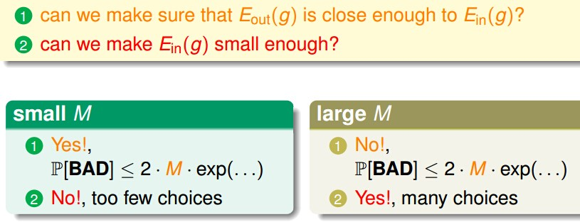

上一讲的一开始我们说Learning好像不可行，后来我们逐步发现Learning在某些条件下是可行的。这些条件就是：
- Learning的Data符合统计学意义上的某种分布（因此可以映射为从罐子里抽弹珠这样的问题）；
- 另外hypothesis set的选择是有限的。这样看起来Learning是可行的。

if |H|=M finite,N large enough,for wahtever g picked by A,$$E_{out}(g)$$≈$$E_{in}(g)$$

if A finds one g with $$E_{in}(g)≈0$$，PAC guarantee for $$E_{out}(g)≈0$$ => learning pissible

由此可见，Learning的核心已经被拆成如下的两个问题，
- $$E_{in}(g)$$与$$E_{out}(g)$$是否接近
- 如何将$$E_{in}(g)$$变得越小
    
那hypothesis set的大小M是否会影响这两个问题的解决呢：
- M很小的时候，$$P[BAD]≤2*M*exp(...)$$ ,所以坏事情发生的几率很小，$$E_in(g)$$与$$E_out(g)$$可以认为是很接近了，可是学习算法选择有限了，不一定能选到一个$$E_in(g)$$很小接近0的hypothesis；
- M很大的时候，选择很多，学习算法可以选到一个很好的hypothesis，但是$$E_in(g)$$与$$E_out(g)$$不一致的坏情况发生的概率就变大了。

对于无限大M,现在用$$m_H$$代替M,$$m_H$$是有限数量，且与H有关
