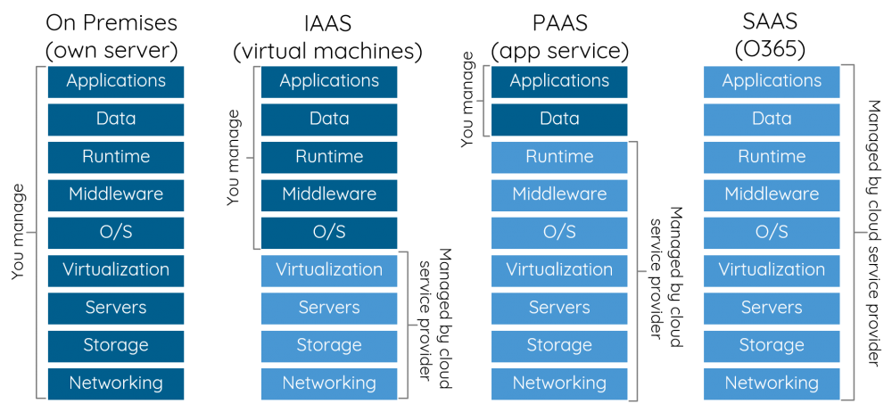
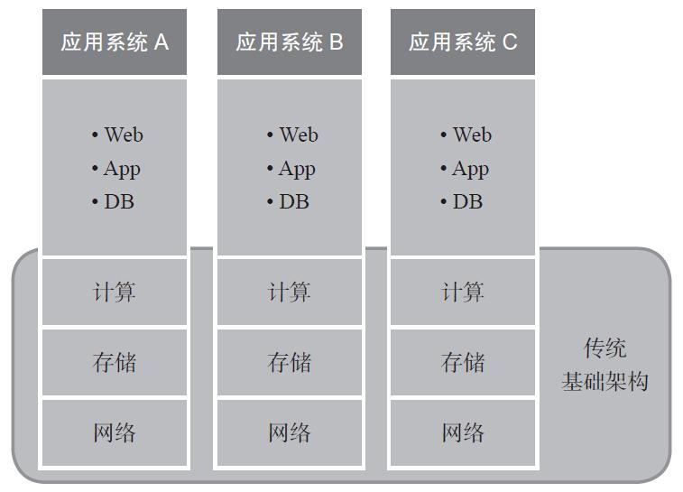

## 1.2 云计算分类

### 1.2.1按服务模式分类，云服务模式：

* On-Premise:  本地部署. (物理主机)。（买所有原材料包饺子）
* IaaS：基础设施及服务 （阿里云、亚马逊AWS）（买速冻饺子）
* PaaS：平台及服务（外卖饺子，自己提供桌子）
* SaaS：软件及服务 （北森tita）（去店里吃饺子）

#### 1.2.1.1 IaaS infrastructure as a service ——AWS\(Amazon Wed Service\)

提供用户之间访问底层计算资源、存储资源和网络资源的能力。

将基础架构进行云化，形成计算、存储和网络的虚拟化资源池，从而更好地为应用系统的上线、部署和运维提供支撑、提升效率、降低TCO。

通过虚拟化技术将服务器等计算平台同存储和网络资源打包，通过API接口等形式提供给用户。用户不用再租用机房，不用自己维护服务器和交换机，只需要购买IAAS服务就能够获得这些资源。Amazon是目前最大的IaaS服务提供商之一。

例：虚拟机、服务器、存储空间、网络带宽、安全防护

公司：Amazon，Microsoft，VMWare。Rackspace，Red Hat

传统IT业务部署架构：

云基础业务部署架构：

相较于传统基础架构，云基础架构通过虚拟化整合与自动化，应用系统共享基础架构资源池，实现高利用率、高可用性、低成本、低能耗，并且通过云平台层的自动化管理，实现快速部署、易于扩展、智能管理，帮助用户构建Iaas云业务模式。

#### 1.2.2 PaaS platform as a service —— Google App Engine，Microsoft Azure

提供软件业务运行的环境

PaaS在基础架构之外提供了业务软件的运行环境，通常还具备相应的存储接口，这些资源可以直接通过FTP等方式调用，用户无需从头进行裸盘的初始化工作。PAAS面向的用户是没有能力或不愿维护一个完整运行环境的开发人员和企事业单位，通过PaaS服务，他们可以从繁琐的环境搭建中抽身出来，将更多精力投入到业务软件开发中。个人网站常用到的“虚拟主机”实际属于PaaS范畴，个人站长只需将源码上传到“虚拟主机”的地址，“虚拟主机”会自动运行这些代码生成对应的web页面。PaaS平台包括网页的应用管理、应用设计、应用虚拟主机、存储、安全以及应用开发协作工具等功能。

例：数据库、开发工具、web服务器、软件运行环境

公司：Google App Engine, Microsoft Azure, Force.com, Heroku, Engine Yard, AppFog, Mendix, Stanging Cloud.

#### 1.2.3 SaaS Software as a service —— Salesforce.com

将软件以服务的形式提过网络传递到客户端

例：Saleforce的CRM、ADP、Workday、SuccessFactors，Citrix的GoToMeeting，电子邮件、虚拟桌面、统一通信、在线游戏，Cisco的Webex，Netflix，Dropbox, 

SaaS目标是将一切业务运行的后台环境放入云端，通过将一个瘦客户端——通常是web浏览器——向最终用户直接提供服务。最终用户按需向云端请求服务，而本地无需维护任何基础架构或软件运行环境。

SaaS和PaaS的区别：

使用SaaS的不是软件的开发人员，而是软件的最终用户。一个PaaS用户如果提供web方式向外分发其服务，则其提供的也就是SaaS服务。

### 1.2.2 按部署模式\(交付模式\)分类，云交付模式：

- **私有云**：部署于企业内部，服务于内部用户的云计算类型。例：企业的软件开发部门
- **公有云**：由云服务运营商搭建，面向公众、企业的云计算类型。例：Microsoft office 365，Amazon Elastic cloud computing，Dropbox
- **社区云**：由数个有共同利益关系或目标的企业和组织共同构建的云计算业务，服务面向这几个组织的内部人员。例：大学等教育机构维护的教育云，用户除在校学生，还包括在职进修学生，其他科研机构研究人员。社区云和公有云虽都面向公众提供服务，但与公有云的区别在云，社区云目的性更强，其发起者往往有着共同的目的和利益机构。公有云面向公众提供特定类型的服务，这个服务被用于不同的目的，一般没有限制。所以社区云规模通常比公有云小。
- **混合云**：包含两种以上类型的云计算形式。当企业既有私有云又采用公有云计算服务时，这两种云形成一种内外数据相互流动的形态，就是混合云的模式。

