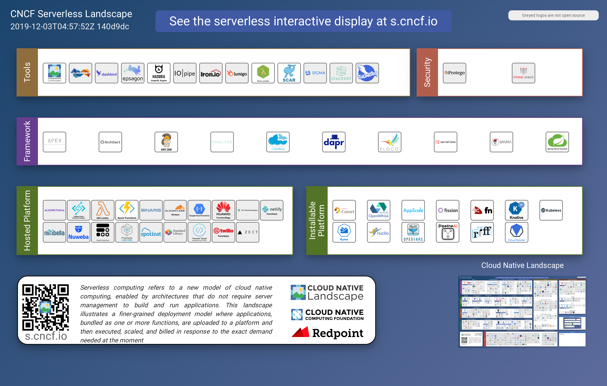

# 云原生技术

## 云原生技术发展简史

2004 年— 2007 年，Google 已在内部大规模地使用像 Cgroups 这样的容器技术；

2008 年，Google 将 Cgroups 合并进入了 Linux 内核主干；

2013 年，Docker 项目正式发布。

2014 年，Kubernetes 项目也正式发布。这样的原因也非常容易理解，因为有了容器和 Docker 之后，就需要有一种方式去帮助大家方便、快速、优雅地管理这些容器，这就是 Kubernetes 项目的初衷。在 Google 和 Redhat 发布了 Kubernetes 之后，这个项目的发展速度非常之快。

2015 年，由Google、Redhat 以及微软等大型云计算厂商以及一些开源公司共同牵头成立了 CNCF 云原生基金会。CNCF 成立之初，就有 22 个创始会员，而且 Kubernetes 也成为了 CNCF 托管的第一个开源项目。在这之后，CNCF 的发展速度非常迅猛；

2017 年，CNCF 达到 170 个成员和 14 个基金项目；

2018 年，CNCF 成立三周年有了 195 个成员，19 个基金会项目和 11 个孵化项目，如此之快的发展速度在整个云计算领域都是非常罕见的。

## 云原生技术生态

如今我们所讨论的云原生技术生态是一个庞大的技术集合。CNCF 有一张云原生全景图（https://github.com/cncf/landscape），在这个全景图里已经有 200 多个项目和产品了，这些项目和产品也都是和 CNCF 的观点所契合的。所以如果以这张全景图作为背景，加以思考就会发现，我们今天所讨论的云原生其实主要谈论了以下几点：

* 云原生基金会：CNCF（Cloud Native Computing Foundation），云计算领域最成功的开源基金会之一

* 云原生技术社区，比如像 CNCF 目前正式托管的 20 多个项目共同构成了现代云计算生态的基石，其中像 Kubernetes 这样的项目已经成为了世界第四活跃的开源项目；
* 除了前面两点之外，现在全球各大公有云厂商都已经支持了 Kubernetes。此外，还有 100 多家技术创业公司也在持续地进行投入。各大公司也在谈全面上云，而且上云就要上云原生，这也是各大技术公司拥抱云原生的一个例子。

## 云原生的定义

 实际上，云原生是一条最佳路径或者最佳实践。更详细的说，**云原生为用户指定了一条低心智负担的、敏捷的、能够以可扩展、可复制的方式最大化地利用云的能力、发挥云的价值的最佳路径。**

 因此，云原生其实是一套指导进行软件架构设计的思想。按照这样的思想而设计出来的软件：首先，天然就“**生在云上，长在云上**”；其次，能够最大化地发挥云的能力，使得我们开发的软件和“云”能够天然地集成在一起，发挥出“云”的最大价值。

 所以，云原生的最大价值和愿景，就是认为未来的软件，会从诞生起就生长在云上，并且遵循一种新的软件开发、发布和运维模式，从而使得软件能够最大化地发挥云的能力。说到了这里，大家可以思考一下为什么容器技术具有革命性？

 其实，容器技术和集装箱技术的革命性非常类似，即：容器技术使得应用具有了一种“自包含”的定义方式。所以，这样的应用才能以敏捷的、以可扩展可复制的方式发布在云上，发挥出云的能力。这也就是容器技术对云发挥出的革命性影响所在，所以说，容器技术正是云原生技术的核心底盘。

## 云原生的技术范畴

云原生的技术范畴包括了以下几个方面：

- 第一部分是云应用定义与开发流程。这包括
  - 应用定义与镜像制作、
  - 配置 CI/CD、
  - 消息和 Streaming 
  - 数据库
- 第二部分是云应用的编排与管理流程。这也是 Kubernetes 比较关注的一部分，包括了
  - 应用编排与调度、
  - 服务发现治理、
  - 远程调用、
  - API 网关
  - Service Mesh。
- 第三部分是监控与可观测性。这部分所强调的是云上应用如何进行
  - 监控、
  - 日志收集、
  - Tracing 
  - 在云上如何实现破坏性测试，也就是混沌工程的概念。
- 第四部分就是云原生的底层技术，比如
  - 容器运行时、
  - 云原生存储技术、
  - 云原生网络技术等。
- 第五部分是云原生工具集，在前面的这些核心技术点之上，还有很多配套的生态或者周边的工具需要使用，比如
  - 流程自动化与配置管理、
  - 容器镜像仓库、
  - 云原生安全技术以及
  - 云端密码管理等。
- 最后则是 Serverless。Serverless 是一种 PaaS 的特殊形态，它定义了一种更为“极端抽象”的应用编写方式，包含了 FaaS 和 BaaS 这样的概念。而无论是 FaaS 还是 BaaS，其最为典型的特点就是按实际使用计费（Pay as you  go），因此 Serverless 计费也是重要的知识和概念。
  - Faas
  - Baas
  - Serverless 计费

## 云原生思想的两个理论

 在了解完云原生的技术范畴之后你就会发现，其所包含的技术内容还是很多的，但是这些内容的技术本质却是类似的。云原生技术的本质是两个理论基础。

- **第一个理论基础是：不可变基础设施**。这一点目前是通过**容器镜像**来实现的，其含义就是应用的基础设施应该是不可变的，是一个自包含、自描述可以完全在不同环境中迁移的东西；
- **第二个理论基础就是：云应用编排理论**。当前的实现方式就是 Google 所提出来的“**容器设计模式**”，这也是本系列课程中的 Kubernetes 部分所需主要讲解的内容。

基础设施向云演进的过程：

* 传统的应用基础设施：可变

  比如：SSH连接到服务器，手动升级或降级软件包，逐个服务器地调整配置文件，以及将新代码直接部署到现有服务器上。

  基础设施是第一无二的宠物，需细心呵护。

* 对“云”友好的应用基础设施：不可变
  * 比如：部署完成后基础设施不会被修改，如需更新，则先更改的公共镜像构建新服务以替换旧服务。经过验证后，新服务投入使用，旧服务则退役。基础设施是可以替代的。可以随时替换。

基础设施向云演进的意义：

* 基础设施一致性和可靠性：
  * 容器镜像
  * 自包含：包含所有依赖
  * 可漂移
* 简单可预测的部署和运维
  * 自描述、自运维
  * 流程自动化
  * 容易水平扩张
  * 可快速复制的管控系统与支撑组件

## 云原生关键技术点

 当我们回过头来看云原生关键技术点或者说它所依赖的技术理论的时候，可以看到主要有这样的四个方向 ：

1. 如何构建自包含、可定制的应用镜像；
2. 能不能实现应用快速部署与隔离能力；
3. 应用基础设施创建和销毁的自动化管理；
4. 可复制的管控系统和支撑组件。

##  CNCF Trail map

## CNCF  Lanscape

## CNCF serverless

