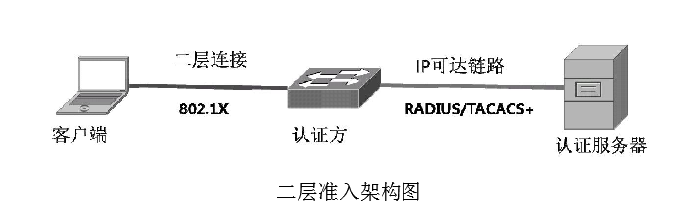
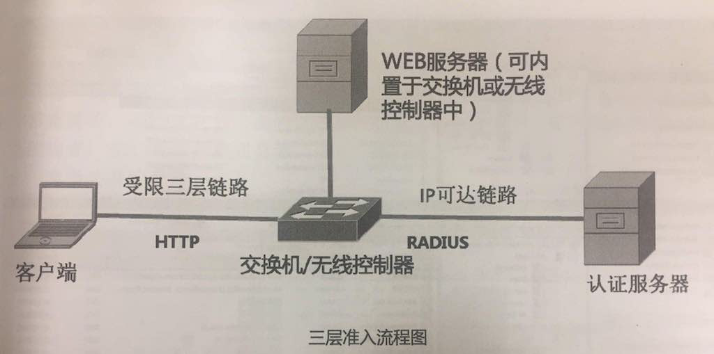
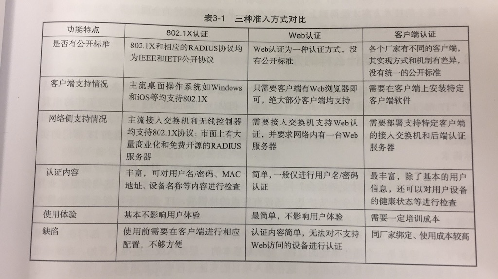

### 3.2.1 安全的网络通道

安全是网络设计永恒话题。云计算时代，网络安全的重要性更加突出，安全机制是云服务能落地的前提条件。云计算任何一个环节对安全防护都提出相当高的要求。

将云计算的网络安全策略划分到两个维度：

* 网络准入：对用户的认证和授权，保证只有正确的用户才能访问网络资源
  * 二层准入：在数据链路层上完成准入认证方式
  * 三层准入：在IP层\(网络层\)完成认证
  * 基于客户端方式的认证
* 网络加密：对网络链路加密，用户使用云服务时产生的数据都经过加密保护，防止数据在传输过程中被暴露给没有授权的第三方。 

#### 3.2.1.1 网络准入

* 二层准入
* 三层准入
* 基于客户端方式的认证

这三种方式基本囊括市面上绝大部分网络准入产品，很多用户会同时采用其中两种，以弥补单一准入方案的不足。  
三种方案目前仍面向不同用户群和使用环境，很难说哪种方案有压倒性优势。完美的产品：

* 可延续性
* 可用性
* 灵活性
* 整合性

##### 3.2.1.1.1 二层准入

大型企业往往用**DHCP**协议进行IP地址分发，用户电脑无需配置IP地址，接入网络时，网络上的DHCP服务器自动为每个电脑网卡分配一个可以IP地址。

二层准入时用户在获得三层IP地址前必须提供认证，当用户在接入网络初，需要同网络侧提过二层连接进行认证数据的交互，只有成功提过认证才能向DHCP服务器申请IP地址，从而收发数据。

二层准入的代表实现方式时**802.1X**，是IEEE802.1协议集的一部分，定义了**EAP\(Extensible Authentication Protocol**——可扩展验证协议\)在以太网环境中的实现方式。802.1X可以工作在有线环境中，也可以在无线环境中。

**EAP**是IETF在RFC3748中制定的在数据链路层中进行认证行为的一种机制，以满足在不同的二层环境下进行统一认证的需求。EAP不是802.1X专用的认证方式，EAP可以被运用在任何一种数据链路层之上，例如PPP或以太。

**802.1X协议包含三种基本元素：**

* **Supplicant客户端**：支持802.1X功能的设备。例：笔记本、智能手机
* **Authentication认证方**：将客户端接入网络的接入设备，负责接受客户端的认证请求，本身没有处理这些请求的能力，他会将信息转达到认证服务器，🈶️认证服务器辨别客户端的合法性。如：在有线网络中是接入交换机，在无线网络中是无线AP和控制器，在VPN连接中是VPN服务器。
* **Authentication Server认证服务器**：通常集中部署在网络内的一台安全设备，当收到转发来的用户请求后，认证服务器将请求信息与已有用户资料做对比，将结果返回给认证方。

**802.1X的认证流程：**  
**1. 端口初始化**  
    作为认证方的接入交换机探测到有一个客户连接到一个端口后，它会马上把这个端口置于“未授权”状态，处于“未授权”状态的端口除了802.1X报文不会转发其他任何流量，包括DHCP和HTTP流量。  
**2. EAP初始化**  
    交换机会定时向一个二层广播地址发出EAP请求信令，开启了802.1X功能的客户端在连上交换机后会保持侦听发往这个二层地址的信号，一旦捕捉到交换机发出的EAP请求，客户端便马上回复一个包含自己ID的EAP应答。交换机收到应答后会通知后台的认证服务器，告诉它有一个新客户端需要进行开始EAP认证。  
**3. EAP 协商**  
    接下来的这个工作准确说来是包含在EAP协议里的标准步骤，由于EAP按照实现方式不同，分为好几个类型，所以在真正开始用户的身份认证之前，客户端同网络侧要协商一个双方都支持的EAP类型来进行后续的流程。  
    认证服务器收到交换机发来的通知后，马上通过交换机向客户端回送一个EAP报文，这个报文说明了认证服务器希望在接下来的流程中采用的EAP类型，如果客户端对此没有异议，那么双方便可以进行下一步，否则客户端可以同网络侧展开NAK（Negative Acknowledgement——消极认可）协商，知道双方取得共识。  
    IETF定义了种类繁多的EAP方式，包括EAP-MD5、EAP-OTP、EAP-GTC、EAP-TLS、EAP-IKEv2、EAP-SIM、EAP-AKA等，除此之外，还有不少厂家自己开发的EAP版本，如LEAP、EAP-FAST等。因此进行802.1X设计的一个重要原则就是根据实际需求选择恰当的EAP模式，如果你在交换机上配置了EAP-FAST，却发现用户电脑的操作系统不支持这种EAP类型，两边就没法接上头了。  
**4. 用户身份验证**  
    当客户端和认证服务器成功约定了一种EAP方式后，客户端就可以同交换机开始真正的验证过程。代表用户身份的信息被发送给交换机，交换机又将这个信息转发给认证服务器，根据认证服务器判断的结果，交换机向客户端发出“认证成功”或“认证失败”的报文。  
    如果用户身份验证成功，交换机端口会被放开，用户获得访问网络的权限；如果验证失败，交换机端口则保持在“未授权”状态，客户端无法通过这个端口收发流量。  
    当客户端注销时，它会向交换机发出一个表示自己离网的EAP报文，交换机随即将这个端口重新置于“未授权”状态。如果交换机发现这个链路层连接中断，它也会将这个端口设置为“未授权”状态，因为这时用户可能直接断开网线离开了，如果这个端口再次连通，也许是一个新用户，那就需要重新进行用户身份验证了。  
    在整个过程中，认证方和认证服务器之间通过特定的协议通信，目前采用最普遍的两个协议时RADIUS（Remote Authentication Dial In User Service——远程认证拨号接入用户服务）和TACACS+（Terminal Access Controller Access-Control System Plus——增强型终端访问控制器访问控制系统）。总体说来，TACACS+的稳定性、安全性和灵活性更高，但TACACS+是思科私有协议，因此，在一般的用户接入场合，RADIUS更加常见。  
    二层准入正如其名所示，所有的流程都是在二层环境下完成的，客户端与交换机之间不会进行IP层面的信令交互。实际上，在客户端通过验证之前，它甚至无法通过DHCP获取IP地址，如果你查看一个802.1X验证失败的电脑网卡，你会发现上面没有可以使用的IP地址。  
    经过多年的发展，802.1X+RADIUS的实现方式已经发展成为一个功能非常强大的准入方案，RADIUS丰富的字段使得认证不仅可以针对用户名与密码，还可以根据接入设备的MAC地址、IP地址、交换机端口等信息来进行认证。

##### 3.2.1.1.2 三层准入

随着网络的发展，接入环境越来越复杂，802.1X在某些方面渐渐显得力不从心了。例如，某些企业需要为访客提供无线网络接入，但不可能每次有访客人员时都在访客的笔记本电脑上配置802.1X策略，这就需要一个快捷的办法将没有经过认证的第三方设备接入到网络中。

三层准入就在这种背景下应运而生了。

三层准入又被称为Web认证，顾名思义，认证过程是通过一个Web页面完成的。三层准入可以独立工作，也可以跟802.1X形成混合部署。当Web认证同802.1X部署在一台接入交换机上时，前者可以作为后者的备份机制。当有新的设备需要接入时，接入交换机会首先尝试802.1X的认证流程，如果客户端设备上没有启用802.1X的客户端，则交换机发起的802.1X认证会因为得不到回应而超时，这时便进入Web认证的阶段。除了客户端不支持802.1X的情况，当客户端支持802.1X但是却没有通过认证的时候，交换机也可以回退到Web认证流程。**之所以有这种设置时因为802.1X是一种非常普遍的的技术，一个酒店客人的笔记本电脑很可能开启了802.1X客户端用来接入办公室的网络**，但是这台电脑显然无法通过酒店的二层准入检查，如果因为二层认证失败而就此将客户端设备屏蔽在外，那么绝大部分酒店客人可能都会遇到网络接入问题。

不管是802.1X认证超时还是失败，配置了Web认证的交换机接下来就会自动进入三层准入的阶段，这个阶段可以大致分为以下几步：

**1、交换机端口进入有限接入状态**

按照802.1X的标准流程，凡是没有成功通过认证的交换机端口都会被置于禁止转发状态，连接在这个端口的客户端设备网卡虽然链路层是接通的，但只能发送802.1X报文。这样一来别说发送数据，客户端网络设备连IP地址都拿不到。

因此，进行Web认证的接入交换机不会完全屏蔽端口，相反，它会将这个端口放入一个可用转发数据的VLAN（Virtual LAN——虚拟局域网）。VLAN是数据网络中的一个重要概念，一个VLAN代表一个虚拟网络，**只有处于同一个VLAN内部的IP地址之间才能互相通信，不同VLAN之间需要通过三层网关设备才能连通**。**VLAN的这一特性被广泛用来隔离不同属性的网络设备**。

容纳有限接入状态端口的这个VLAN通常是交换机上的默认VLAN，也可以根据实际情况配置为其他任何VLAN。但在放开数据转发的同时，这个端口会被自动放上一组预先配置的ACL（Access Control List——访问控制列表），用户可以自定定义ACL的内容，其目的是限制端口的数据类型，仅仅为其提供一些基本数据的转发服务，如DHCP、DNS等。客户端可以通过DHCP拿到地址，但没有办法获得完全的网络权限，其他类型的数据包将被阻断，这个时候如果想上个QQ啥的是没戏的。

**2、客户端触发认证流程**

当交换机端口进入有限转发的状态后，就可以正式开始对客户端设备进行验证了。但真正出发认证流程的并不是交换机，而是客户端设备。

**一块标准的网卡在二层也就是链路层就绪后的第一个动作，一般是向DHCP请求IP地址，**这个DHCP的广播包就是出发Web认证的信号；如果客户端的IP地址是手动配置的，那么网卡发出的ARP报文同样能够触发认证流程。前文提到过DHCP是用来向终端设备分配IP地址的一种协议，而ARP则是用于请求特定IP地址对应的MAC地址的机制，如果你需要向一台设备发送一个数据包，可是只知道它的IP地址而不知道MAC地址，那么就可以使用ARP请求来尝试获取这个IP对应的MAC。**DHCP和ARP是最常见的以太网报文**，通过听取这些报文交换机可以确定这是一个基本功能正常的网卡。如果既没有DHCP，也没有ARP信号，那么这个网卡八成有些问题，交换机也无需徒劳地发起Web认证了。

当交换机听到来自客户端的DHCP和ARP后，它便将这个设备记录在册，并且周期性地对其发出ARP探针，确保其在线状态。在交换机记录客户端设备的同一时刻，它还会启动一个Web认证的计时器，客户端设备必须在计时器超时前成功通过交换机的认证，否则，此次认证将作废，客户端设备必须重新发起一个新的认证过程。

**3、用户身份验证**

客户端设备通过DHCP获得IP地址后，网卡便可以利用这个地址与外界进行三层通讯了。这个时候用户需要发起一个HTTP请求，打开你的浏览器，任意输入一个网址——例如www.baidu.com——即可。交换机端口在有限转发状态下一般允许DNS流量，因此操作系统会取得www.baidu.com这个URL对应的IP地址。操作系统随即会生成一个以这个IP地址的80端口为目的地的HTTP请求报文，并通过网卡发给交换机。

但是这个HTTP并不会真正转发给百度的Web服务器，交换机截取到用户的这个HTTP请求后，会将用户重定向到一个预先写好的认证页面上（这个页面可以放在任意一个IP可达的Web服务器上，某些接入交换机也可兼任Web服务器的工作）。

这个认证页面包含用户名、密码的填写区域，用户在这个页面上输入自己的身份信息，这些信息被回传给接入交换机进行验证。

接入交换机对于收到的用户身份有两种方式进行验证，它可以使用自己保存的本地信息库，也可以将身份信息送给后台的认证服务器，由认证服务器完成身份验证。Web认证使用的认证服务器同802.1X环境类似，部署最广泛的也是RADIUS服务器，从扩展性的角度考虑，企业用户一般会选择集中式的认证服务器，而不是交换机上的本地信息库。

认证服务器将验证结果返回给接入交换机，如果用户身份合法，接入交换机就会在端口上部署一系列事先制定的策略，包括下发预置的ACL等，从而为最终用户提供与之身份匹配的网络访问权限。

当用户离开网络时有两种情况，如果用户在Web页面上主动点击注销按钮，交换机会按预设流程将端口关闭。但如果用户直接拔出网线，那么情况就同802.1X不一样了。Web认证是一个三层机制，且没有客户端软件，网络侧无从探知用户什么时候离线，这就给端口的管理带来了一定的麻烦。所以你常常能在Web登陆成功的页面上发现提示性的语言，告诉你“不要将这个页面关闭”，这是因为网络侧的服务器会周期性地同这个页面交换心跳信息，如果这个页面没有反应，那么交换机会认为用户已经离线，随之将端口关闭。

同二层准入一样，三层准入也可以部署在无线环境中，在标准的集中式“瘦AP”企业级无线架构中，无线控制器将承担Web页面推送、RADIUS认证等有线环境中由接入交换机完成的工作。

##### 3.2.1.1.3 基于客户端方式的认证

通过客户端对接入的用户进行认证，比如杀毒软件。这类软件主要干两件事：

* 从操作系统接手802.1X的认证流程。

* 对操作系统的健康状况做检查，例如是否安装了最新补丁，杀毒软件是否更新到最新病毒库等，若操作系统处于可靠状态则允许接入网络，否则拒绝。

##### 3.2.1.1.4 三种准入方式对比

安全性：客户端&gt;二层准入&gt;三层准入  
部署复杂度：客户端&gt;二层准入&gt;三层准入

1. 二层准入特点——成熟、实用  
   认证方和认证服务器都不难找到多家厂商馋哦，主流桌面操作系统和智能手机都支持802.1X。  
    基于802.1X是一个成熟的方案，具备以下三个特点：

   * 完全公开的架构：每一环都有多个厂家甚至开源的产品可供选择
   * 成熟的技术标准
   * 完善的认证和授权机制：802.1X支持密码验证、单点登录、所有主流认证服务器

2. 三层准入特点——轻便、简单  
    在无线、大型园区得到大规模部署。  
    三层准入的特点：

   * 零客户端
   * 使用简单
   * 安全较弱：802.1X不但可基于USB key进行验证，验证失败的客户端连IP地址都获取不到
   * 不支持Single Sign-on：在公司上网不需输密码，插上网线就能用，是因为IT 部门在电脑上配置了Single sign-on功能
   * 不支持机器认证：MAB\(MAC Address Bypass，硬件地址旁路\)是常见的机器认证方式

3. 客户端方式特点——功能全面、无统一标准  
    在三种准入策略中功能最全面，客户端方式最大的问题是其实现方式的不统一，每个厂家解决方案从原理到界面都不千差万别。

   

#### 3.2.1.1.5 虚拟桌面的机会

目前虚拟桌面在企业内部的应用逐渐铺开，员工对数据库的访问全部通过虚拟桌面完成，而硬件本身可能是一个简单的瘦客户端，不具备复杂功能。在企业网络内部对虚拟桌面流量设置高优先级QoS策略，对其余流量以及网络接入采取从简思路。

#### 3.2.1.2 网络加密——确保访问过程安全、可靠

目前部署最广泛的网络安全机制：VPN——通用的链路加密方式。

VPN两个基本特性：

* 长连接：每条VPN隧道都是有状态的，通信双方通过类似三次握手的机制保证通信对端的唯一性，及数据传输的可靠性。
* 加密：使隧道内的数据对外不可见，保证传输对保密性

VPN不是一种具体的网络协议，甚至不是一种具体的网络技术。VPN只是用来描述一种架设在基础网络上的加密隧道，至于实现它的技术则五花八门。在不同的场景下有不同的理解，例：L2TP\(Layer 2 Tunneling Protocol——二层隧道协议\)、VPLS\(Virtual Private LAN Service——虚拟私有局域网服务\)、IPsec\(Internet Protocol Security——网际协议安全\)、EoMPLS\(Ethernet over MPLS——基于多协议标签交换的以太网协议\) 。个人用户使用最多的两种VPN是IPsec和SSL。IPsec和SSL是目前企业市场最常见的两种VPN技术。

IPsec 是目前部署最广泛的点对点VPN技术之一。大量的云计算业务并没有选择IPsec作为网络加密的方式，而选择SSL。

