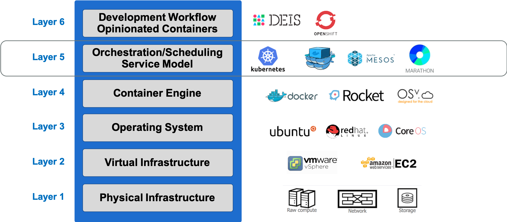
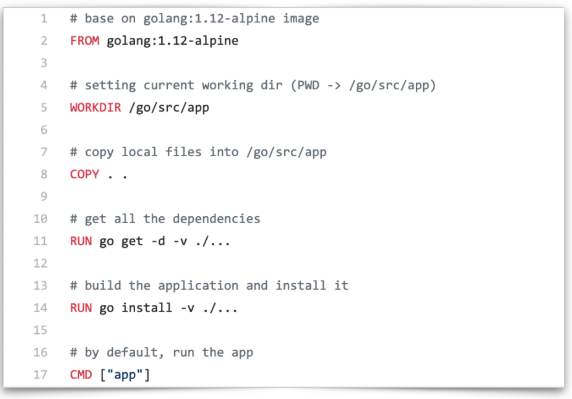

# Container

## 1. Container Overview

Container ecosystem layers



### **1.1 What** is Container (容器)?

* A group of processes run in isolaAon
  * Similar to VMs but managed at the **process level**
  * All processes MUST be able to run on the **shared kernel**
* Each container has its own set of "namespaces" (isolated view)
  * PID - process IDs
  * USER - user and group IDs
  * UTS - hostname and domain name
  * NS - mount points
  * NET - Network devices, stacks, ports
  * IPC - inter-process communications, message queues
  * cgroups - controls limits and monitoring of resources
* Docker gives it its own root filesystem


linux container技术

容器技术：容器有效地将由单个操作系统管理的资源划分到孤立的组中，以更好地在孤立的组之间平衡有冲突的资源使用需求。于虚拟化相比，这样既不需要指令级模拟，也不需要即使编译。容器可以在核心CPU本地运行指令，而不需要任何专门的解释机制。此外，也避免了准虚拟化和系统调用替换中的复杂性。

容器虚拟化：充分利用操作系统自身机制和特性

容器技术：新一代虚拟化技术

- chroot(1982,UNIX) -> Linux Container(LXC,集成到Linux内核中) -> Docker(提供容器管理工具，分层文件系统，镜像；早起Docker完全基于LXC，之后开发了libcontainer，之后Dokcer推动runC项目，使容器不局限于Linux操作系统，而是更安全、更具扩展性。)
- Docker(工具：Machine、Compose、Swarm，容器平台：Kubernetes，Mesos，CoreOS)

容器也是对服务器资源进行隔离，包括CPU份额、网络I/O、带宽、存储I/O、内存等。同一台主机上的多台容器之间可以公平友好地共享资源，而不互相影响。

容器就是和系统其它部分隔离开来的进程集合，具有自己独特的视图视角；这里的其他部分包括进程、网络资源以及文件系统等.

在介绍容器的具体概念之前，先简单回顾一下操作系统是如何管理进程的。

首先，当我们登录到操作系统之后，可以通过 ps 等操作看到各式各样的进程，这些进程包括系统自带的服务和用户的应用进程。那么，这些进程都有什么样的特点？

- 第一，这些进程可以相互看到、相互通信；
- 第二，它们使用的是同一个文件系统，可以对同一个文件进行读写操作；
- 第三，这些进程会使用相同的系统资源。

这样的三个特点会带来什么问题呢？

- 因为这些进程能够相互看到并且进行通信，高级权限的进程可以攻击其他进程；
- 因为它们使用的是同一个文件系统，因此会带来两个问题：这些进程可以对于已有的数据进行增删改查，具有高级权限的进程可能会将其他进程的数据删除掉，破坏掉其他进程的正常运行；此外，进程与进程之间的依赖可能会存在冲突，如此一来就会给运维带来很大的压力；
- 因为这些进程使用的是同一个宿主机的资源，应用之间可能会存在资源抢占的问题，当一个应用需要消耗大量 CPU 和内存资源的时候，就可能会破坏其他应用的运行，导致其他应用无法正常地提供服务。

针对上述的三个问题，如何为进程提供一个独立的运行环境呢？

- 针对不同进程使用同一个文件系统所造成的问题而言，Linux 和 Unix 操作系统可以通过 **chroot 系统调用**将子目录变成根目录，达到视图级别的隔离；进程在 chroot 的帮助下可以具有独立的文件系统，对于这样的文件系统进行增删改查不会影响到其他进程；
- 因为进程之间相互可见并且可以相互通信，使用 Namespace 技术来实现进程在资源的视图上进行隔离。在 **chroot** 和 **Namespace** 的帮助下，进程就能够运行在一个独立的环境下了；
- 但在独立的环境下，进程所使用的还是同一个操作系统的资源，一些进程可能会侵蚀掉整个系统的资源。为了减少进程彼此之间的影响，可以通过 **Cgroup** 来限制其资源使用率，设置其能够使用的 CPU 以及内存量。

那么，应该如何定义这样的进程集合呢？

其实，容器就是一个视图隔离、资源可限制、独立文件系统的进程集合。**所谓“视图隔离”就是能够看到部分进程以及具有独立的主机名等；控制资源使用率则是可以对于内存大小以及 CPU 使用个数等进行限制。容器就是一个进程集合，它将系统的其他资源隔离开来，具有自己独立的资源视图。

容器具有一个独立的文件系统，因为使用的是系统的资源，所以在独立的文件系统内不需要具备内核相关的代码或者工具，我们只需要提供容器所需的二进制文件、配置文件以及依赖即可。只要容器运行时所需的文件集合都能够具备，那么这个容器就能够运行起来。

容器的核心技术：

namesapce

cgroup


### **1.2 Why** Containers?

* Fast startup Ame - only takes milliseconds to:
  * Create a new directory
  * Lay-down the container's filesystem
  * Setup the networks, mounts, ...
  * Start the process
* Better resource uAlizaAon
  * Can fit far more containers than VMs into a host

### 容器特性

- 安全性：天然隔离
- 隔离性：namespce
- 便携性：overlay FS + namespace
- 可配额：cgroup

### 1.3 容器的发展历史

早期，大家都认为硬件抽象层基于hypervisor的虚拟化方式可以最大程度上提供虚拟化管理的灵活性。各种不同操作系统的虚拟机都能通过hypervisor（KVM、XEN等）来衍生、运行、销毁。然而，随着时间推移，用户发现hypervisor这种方式麻烦越来越多。为什么？因为对于hypervisor环境来说，每个虚拟机都需要运行一个完整的操作系统以及其中安装好的大量应用程序。但实际生产开发环境里，我们更关注的是自己部署的应用程序，如果每次部署发布我都得搞一个完整操作系统和附带的依赖环境，那么这让任务和性能变得很重和很低下。

基于上述情况，人们就在想，有没有其他什么方式能让人更加的关注应用程序本身，底层多余的操作系统和环境我可以共享和复用？换句话来说，那就是我部署一个服务运行好后，我再想移植到另外一个地方，**我可以不用再安装一套操作系统和依赖环境。**这就像集装箱运载一样，我把货物一辆兰博基尼跑车（好比开发好的应用APP），打包放到一容器集装箱里，它通过货轮可以轻而易举的从上海码头（CentOS7.2环境）运送到纽约码头（Ubuntu14.04环境）。而且运输期间，我的兰博基尼（APP）没有受到任何的损坏（文件没有丢失），在另外一个码头卸货后，依然可以完美风骚的赛跑（启动正常）

Linux Container容器技术的诞生（2008年）就解决了IT世界里“集装箱运输”的问题。**Linux Container**（简称LXC）它是一种**内核轻量级的操作系统层**虚拟化技术。Linux Container主要由**Namespace**和**Cgroup**两大机制来保证实现。那么Namespace和Cgroup是什么呢？刚才我们上面提到了集装箱，集装箱的作用当然是可以对货物进行打包隔离了，不让A公司的货跟B公司的货混在一起，不然卸货就分不清楚了。那么Namespace也是一样的作用，做隔离。光有隔离还没用，我们还需要对货物进行资源的管理。同样的，航运码头也有这样的管理机制：货物用什么样规格大小的集装箱，货物用多少个集装箱，货物哪些优先运走，遇到极端天气怎么暂停运输服务怎么改航道等等... 通用的，与此对应的Cgroup就负责资源管理控制作用，比如进程组使用CPU/MEM的限制，进程组的优先级控制，进程组的挂起和恢复等等。

容器的本质，一句话解释，就是**一组受到资源限制，彼此间相互隔离的进程**。隔离所用到的技术都是由linux内核本身提供的（所以说目前绝大部分的容器都是必须要跑在linux里面的）。其中namespace用来做访问隔离（每个容器进程都有自己独立的进程空间，看不到其他进程），cgroups用来做资源限制（cpu、内存、存储、网络的使用限制）。

作者：暴走的初号机
链接：https://www.jianshu.com/p/517e757d6d17
来源：简书
著作权归作者所有。商业转载请联系作者获得授权，非商业转载请注明出处。

在同一台服务器上部署容器，其密度相较于虚拟机可以提升约10倍。

但是容器并不是一个新的技术，它至少可以追溯到2000年FreeBSD jails 的出现，而 FreeBSD jails 则是基于 1982 年 BSD UNIX 的 **chroot C** 命令。再往前，chroot最早源于1979年UNIX7版本。通过chroot可以改变进程和子进程所能看到的根目录，这意味着可以在指定的根目录下独立运行程序，所以说从早期的chroot中就可以看出容器的踪迹。但是chroot仅适合于运行简单的应用，往往只是一个shell程序。虽然chroot会为程序创造一个jail, jail通过虚拟对文件系统、网络等的访问，限制用户的行为，但是还是有些方法很容易发生"越狱"，这使得chroot很难应用于大型复杂系统。

SUN利用了 jail的概念，将其演化成Solaris Zones。但这一技术是Solaris特有的，所以虽然我们可以在Zone中运行Solaris应用或者一个更早版本的Solaris,但是无法在AIX或者Linux中运用这一技术。

在 Solaris 基于 FreeBSD jail 开发 Solaris Zone 的同时，Google、RedHat、 Canonical等公司也基于Linux进行了容器的相关研究。Parallels在2001年研发了 **Virtuozzo**,并获得了一定的商业成功。Parallels Virtuozzo在2005年演变为**OpenVZ** 其后又作为**LXC**开源进入Linux内核。而Google于2013年开源了 Imctfy项目，虽然Google容器项目开源得很晚，但事实上，Parallels. RedHat以及Google自身的Imctfy项目都是依托于Google的**cgroup**技术。cgroup技术使得开发者可以进一步抽象系统资源，增强了 Linux系统安全性。Google内部也一直在使用容器支持日常的公司运作，甚至支持Google Doc、Gmailₛ Google Search等商业应用。Google每周要运行约20亿个容器。

但是，对于大部分公司，容器还是一个神秘甚至有些令人畏惧的技术。直到Docker的出现才改变了业界开发、运维模式。Docker使得人们认识了又一个开源容器项目libcontainer, Docker自身也成为了 Linux容器的事实标准。早期docker代码实现是直接基于LXC的。自0.9版本后，docker开发了**libcontainer**项目作为更广泛的容器驱动实现。目前docker还积极推动成立了runC标准项目。并贡献给开发容器联盟，试图让容器的支持不再局限于linux操作系统，而是更安全、更开放、更具扩展性。

## 2. Image 镜像

**容器镜像**就是容器运行时所需要的所有文件集合，其具备一次构建、到处运行的特点。

那么，一般都是通过什么样的方式来构建镜像的呢？通常情况下，我们会采用 **Dockerfile** **来构建镜像**，这是因为 Dockerfile 提供了非常便利的语法糖，能够帮助我们很好地描述构建的每个步骤。当然，每个构建步骤都会对已有的文件系统进行操作，这样就会带来文件系统内容的变化，我们将这些变化称之为 **changeset**。当我们把构建步骤所产生的变化依次作用到一个空文件夹上，就能够得到一个完整的镜像。


changeset 的分层以及复用特点能够带来几点优势：

- 第一，能够提高分发效率，简单试想一下，对于大的镜像而言，如果将其拆分成各个小块就能够提高镜像的分发效率，这是因为镜像拆分之后就可以并行下载这些数据；
- 第二，因为这些数据是相互共享的，也就意味着当本地存储上包含了一些数据的时候，只需要下载本地没有的数据即可，举个简单的例子就是 golang 镜像是基于 alpine 镜像进行构建的，当本地已经具有了 alpine 镜像之后，在下载 golang 镜像的时候只需要下载本地 alpine 镜像中没有的部分即可；
- 第三，因为镜像数据是共享的，因此可以节约大量的磁盘空间，简单设想一下，当本地存储具有了 alpine 镜像和 golang 镜像，在没有复用的能力之前，alpine 镜像具有 5M 大小，golang 镜像有 300M 大小，因此就会占用 305M 空间；而当具有了复用能力之后，只需要 300M 空间即可。

## 3. 容器运行时的生命周期

容器是一组具有隔离特性的进程集合，在使用 docker run 的时候会选择一个镜像来提供独立的文件系统并指定相应的运行程序。这里指定的运行程序称之为 initial 进程，这个 initial 进程启动的时候，容器也会随之启动，当 initial 进程退出的时候，容器也会随之退出。

因此，可以认为**容器的生命周期和 initial 进程的生命周期是一致的**。当然，因为容器内不只有这样的一个 initial 进程，initial 进程本身也可以产生其他的子进程或者通过 docker exec 产生出来的运维操作，也属于 initial 进程管理的范围内。当 initial 进程退出的时候，所有的子进程也会随之退出，这样也是为了防止资源的泄漏。

但是这样的做法也会存在一些问题，首先应用里面的程序往往是有状态的，其可能会产生一些重要的数据，当一个容器退出被删除之后，数据也就会丢失了，这对于应用方而言是不能接受的，所以需要将容器所产生出来的重要数据持久化下来**。容器能够直接将数据持久化到指定的目录上，这个目录就称之为数据卷。

数据卷有一些特点，其中非常明显的就是数据卷的生命周期是独立于容器的生命周期的，也就是说容器的创建、运行、停止、删除等操作都和数据卷没有任何关系，因为它是一个特殊的目录，是用于帮助容器进行持久化的。简单而言，我们会将数据卷挂载到容器内，这样一来容器就能够将数据写入到相应的目录里面了，而且容器的退出并不会导致数据的丢失。

通常情况下，数据卷管理主要有两种方式：

- 第一种是通过 bind 的方式，直接将宿主机的目录直接挂载到容器内；这种方式比较简单，但是会带来运维成本，因为其依赖于宿主机的目录，需要对于所有的宿主机进行统一管理。
- 第二种是将目录管理交给运行引擎。


## 4. 容器项目的架构

### moby 容器引擎架构

moby 是目前最流行的容器管理引擎，moby daemon 会对上提供有关于容器、镜像、网络以及 Volume的管理。moby daemon 所依赖的最重要的组件就是 **containerd**，containerd 是一个容器运行时管理引擎，其独立于 moby daemon ，可以对上提供容器、镜像的相关管理。

containerd 底层有 **containerd shim** 模块，其类似于一个守护进程，这样设计的原因有几点：

- 首先，containerd 需要管理容器生命周期，而容器可能是由不同的容器运行(不通容器虚拟化技术的解决方案：runc, kata, gVisor)时所创建出来的，因此需要提供一个灵活的插件化管理。而 shim 就是针对于不同的容器运行时所开发的，这样就能够从 containerd 中脱离出来，通过插件的形式进行管理。
- 其次，因为 shim 插件化的实现，使其能够被 containerd 动态接管。如果不具备这样的能力，当 moby daemon 或者 containerd daemon 意外退出的时候，容器就没人管理了，那么它也会随之消失、退出，这样就会影响到应用的运行。
- 最后，因为随时可能会对 moby 或者 containerd 进行升级，如果不提供 shim 机制，那么就无法做到原地升级，也无法做到不影响业务的升级，因此 containerd shim 非常重要，它实现了动态接管的能力。

本节课程只是针对于 moby 进行一个大致的介绍，在后续的课程也会详细介绍。

## OCI容器标准

Open Container Initiative•

* OCI组织于2015年创建，是一个致力于定义容器镜像标准和运行时标准的开放式组织。•
* OCI定义了镜像标准（Image Specification）、运行时标准（Runtime Specification）和分发标准（DistributionSpecification）•
  * 镜像标准定义应用如何打包•
  * 运行时标准定义如何解压应用包并运行•
  * 分发标准定义如何分发容器镜像


## 5. Container Runtime

容器标准

### 5.1 OCI

Open Container Initiative，是由多家公司共同成立的项目，并由linux基金会进行管理，致力于container runtime的标准的制定和runc的开发等工作。所谓container runtime，主要负责的是容器的生命周期的管理。oci的runtime spec标准中对于容器的状态描述，以及对于容器的创建、删除、查看等操作进行了定义。

OCI主要定义两个规范

* Runtime Specification
  * 文件系统包如何解压至硬盘，共运行时运行。
* Image Specification
  * 如何通过构建系统打包，生成镜像清单（Manifest）、文件系统序列化文件、镜像配置。


### 5.2 runC

是对于OCI标准的一个参考实现，是一个可以用于创建和运行容器的CLI(command-line interface)工具。runc直接与容器所依赖的cgroup/linux kernel等进行交互，负责为容器配置cgroup/namespace等启动容器所需的环境，创建启动容器的相关进程。runC基本上就是一个命令行小工具，它可以不用通过Docker引擎，直接就可以创建容器。这是一个独立的二进制文件，使用OCI容器就可以运行它。

### 5.3 containerd

containerd 是一个守护进程，它可以使用runC管理容器，并使用gRPC暴露容器的其他功能。相比较Docker引擎，使用 gRPC ，containerd暴露出针对容器的增删改查的接口，Docker engine调用这些接口完成对于容器的操作。

## 6. Container vs VM

VM 利用 **Hypervisor 虚拟化技术**来模拟 CPU、内存等硬件资源，这样就可以在宿主机上建立一个 Guest OS，这是常说的安装一个虚拟机。

每一个 Guest OS 都有一个独立的内核，比如 Ubuntu、CentOS 甚至是 Windows 等，在这样的 Guest OS 之下，每个应用都是相互独立的，VM 可以提供一个更好的隔离效果。但这样的隔离效果需要付出一定的代价，因为需要把一部分的计算资源交给虚拟化，这样就很难充分利用现有的计算资源，并且每个 Guest OS 都需要占用大量的磁盘空间，比如 Windows 操作系统的安装需要 10~30G 的磁盘空间，Ubuntu 也需要 5~6G，同时这样的方式启动很慢。正是因为虚拟机技术的缺点，催生出了容器技术。

容器是针对于进程而言的，因此无需 Guest OS，只需要一个独立的文件系统提供其所需要文件集合即可。所有的文件隔离都是进程级别的，因此启动时间快于 VM，并且所需的磁盘空间也小于 VM。当然了，进程级别的隔离并没有想象中的那么好，隔离效果相比 VM 要差很多。

总体而言，容器和 VM 相比，各有优劣，因此容器技术也在向着**强隔离**方向发展。

## 7. Container vs Hypervisor虚拟化

容器虚拟化和Hypervisor虚拟化的差别在于，容器虚拟化没有Hypervisor层，容器间相互隔离，但是容器共享操作系统，甚至bins/libs,如图2·6所示。每个容器不是独立的操作系统，所以容器虚拟化没有冗余的操作系统内核及相应的二进制库等，这使得容器部署、启动的开销几乎为零，且非常迅速。总的来说容器就是一种**基于操作系统能力的隔离技术**，这和基于hypervisor的虚拟化技术（能完整模拟出虚拟硬件和客户机操作系统）复杂度不可同日而语。


## 8. LinuxContainer vs Docker

Docker技术是否与传统的 Linux 容器相同？否。Docker 技术最初是基于 [LXC ](https://www.redhat.com/zh/topics/containers/whats-a-linux-container)技术构建（大多数人都会将这一技术与“传统的”Linux 容器联系在一起），但后来它逐渐摆脱了对这种技术的依赖。就轻量级 [虚拟化](https://www.redhat.com/zh/topics/virtualization) 这一功能来看，LXC 非常有用，但它无法提供出色的开发人员或用户体验。除了运行容器之外，Docker 技术还具备其他多项功能，包括简化用于构建容器、传输镜像以及控制镜像版本的流程。


容器引擎，https://docs.docker.com/

为什么使用Docker？

传统虚拟机技术是虚拟出一套硬件后，在其上运行一个完整操作系统，在该系统上再运行所需应用进程；而容器内的应用进程直接运行于宿主的内核，容器内没有自己的内核，而且也没有进行硬件虚拟。因此容器要比传统虚拟机更为轻便。


# Docker

Reference：

* https://docs.docker.com/get-started/overview/
* https://yeasy.gitbooks.io/docker_practice/
* https://docs.docker.com/
* Install Docker: https://docs.docker.com/get-docker/

## 1. Docker Overview

**What**: Docker - an open platform for developing, shipping, and running applications. Docker provides the ability to package and run an application in a loosely isolated environment called a container

Docker creates and manages the lifecycle of containers* Setup filesystem

* CRUD container
  * Setup networks
  * Setup volumes / mounts
  * Create: start new process telling OS to run it in isolaAon


Docker 使用 Google 公司推出的 Go 语言 进行开发实现，基于 Linux 内核的 cgroup，namespace，以及 AUFS 类的 Union FS 等技术，对进程进行封装隔离，属于 操作系统层面的虚拟化技术。由于隔离的进程独立于宿主和其它的隔离的进程，因此也称其为容器。最初实现是基于 LXC，从 0.7 版本以后开始去除 LXC，转而使用自行开发的 libcontainer，从 1.11 开始，则进一步演进为使用 runC 和 containerd。

Docker 在容器的基础上，进行了进一步的封装，从文件系统、网络互联到进程隔离等等，极大的简化了容器的创建和维护。使得 Docker 技术比虚拟机技术更为轻便、快捷。

**Why**:

* separate applications from infrastructure, deliver software quickly, .
* manage infratructure in the same ways you manage applications
* shippping, testing and deploying code quickly,
* reduce the delay between writing code and runnig it in production.
* Containers are lightweight and contain everything needed to run the application, so you do not need to rely on what is currently installed on the host.
* easily share containers while you work, and be sure that everyone you share with gets the same container that works in the same way.
* **Fast, consistent delivery of your applications**:  Containers are great for CI/CD workflows.
* **Responsive deployment and scaling**： Docker’s container-based platform allows for highly portable workloads. Docker containers can run on a developer’s local laptop, on physical or virtual machines in a data center, on cloud providers, or in a mixture of environments. Docker’s portability and lightweight nature also make it easy to dynamically manage workloads, scaling up or tearing down applications and services as business needs dictate, in near real time.
* **Running more workloads on the same hardware**： Docker is lightweight and fast. It provides a viable, cost-effective alternative to hypervisor-based virtual machines, so you can use more of your compute capacity to achieve your business goals. Docker is perfect for high density environments and for small and medium deployments where you need to do more with fewer resources.

## 2. Docker architecture


Docker daemon: The Docker daemon (`dockerd`) listens for Docker API requests and manages Docker objects such as images, containers, networks, and volumes. A daemon can also communicate with other daemons to manage Docker services.

Docker client: The Docker client (`docker`) is the primary way that many Docker users interact with Docker. When you use commands such as `docker run`, the client sends these commands to `dockerd`, which carries them out. The `docker` command uses the Docker API. The Docker client can communicate with more than one daemon.

Docker desktop: Docker Desktop is an easy-to-install application for your Mac or Windows environment that enables you to build and share containerized applications and microservices. Docker Desktop includes the Docker daemon (`dockerd`), the Docker client (`docker`), Docker Compose, Docker Content Trust, Kubernetes, and Credential Helper. For more information, see [Docker Desktop](https://docs.docker.com/desktop/).

docker registries: A Docker *registry* stores Docker images. Docker Hub is a public
registry that anyone can use, and Docker is configured to look for images on
Docker Hub by default. You can even run your own private registry.

When you use the `docker pull` or `docker run` commands, the required images are pulled from your configured registry. When you use the `docker push` command, your image is pushed to your configured registry.

Docker objects

Image

Docker images

* Tar file containing a container's filesystem + metadata
* For sharing and redistribuAon
  * Global/public registry for sharing: DockerHub
* Similar, in concept, to a VM image

Containers

## 3. Docker 核心技术

* Namespce: linux原生技术，将应用进程放到一个隔离的环境里，单独的运行环境

* cgroup：linux原生技术，给进程分配一定的配额

* 文件系统：容器的文件系统，Docker的创新点在此，namespace和cgroup都是已有技术


### 3.1 Namespace

Linux Namespace是一种Linux Kernel提供的资源隔离方案：

* 系统可以为进程分配不同的Namespace；
* 并保证不同的Namespace资源独立分配、进程彼此隔离，即不同的Namespace下的进程互不干扰。

Linux 内核代码中Namespace的实现：无论线程还是进程在linux里都是一个task

* 进程数据结构

  ```c
  struct task_struct{
    ...
    /* namespace */
    struct nsproxy *nsproxy;
    ...
  }
  ```

* Namespace 数据结构

  ```c
  struct nsproxy{
    atomic_t count;
    struct uts_namespace *uts_ns;
    struct ipc_namespace *ipc_ns;
    struct mnt_namespace *mnt_ns;
    struct pid_namespace *pid_ns_for_chileren;
    struct net * net_ns;
  }
  ```

Linux对Namespace操作方法：

第一个进程是systemd，pid=1，会分一个默认的namespace，systemd起其他进程时有以下几种方式：

* clone：在创建新进程的系统调用时，可以通过flags参数指定需要新建的Namespace类型：

  ```c
  // CLONE_NEWCGROUP/ CLONE_NEWIPC/ CLONE_NEWNET/ CLONE_NEWNS/CLONE_NEWPID/CLONE_NEWUSER/ CLONE_NEWUTS
  int clone(int (*fn)(void *), void *child_stack, int flags, void *arg)
  ```

* setns：该系统调用可以让调用进程加入某个已经存在的Namespace中：

  ```c
  Int setns(int fd, int nstype)
  ```

* unshare：该系统调用可以将调用进程移动到新的Namespace下：

  ```c
  int unshare(int flags)
  ```

隔离性 —— Linux Namespace

| Namespace类型 | 隔离资源                       | kernel版本 |
| ------------- | ------------------------------ | ---------- |
| IPC           | System V IPC 和POSIX 消息队列  | 2.6.19     |
| Network       | 网络设备，网络协议。网络接口等 | 2.6.29     |
| PID           | 进程                           | 2.6.14     |
| Mount         | 挂载点                         | 2.4.19     |
| UTS           | 主机名和域名                   | 2.6.19     |
| USR           | 用户和用户组                   | 3.8        |


不同namespace之间是相互隔离的:

* Pid namespace: 
  * 不同用户的**进程**就是通过Pid namespace隔离开的，且不同namespace 中**可以有相同Pid**。
  * 有了Pid namespace, 每个namespace中的Pid能够相互隔离。
* net namespace
  * 网络隔离是通过net namespace实现的，每个net namespace有独立的network devices, IPaddresses, IP routing tables, /proc/net 目录。
  * Docker默认采用veth的方式将container中的虚拟网卡同host上的一个docker bridge: docker0连接在一起。
* ipc namespace
  * Container中进程交互还是采用linux常见的进程间交互方法（interprocess communication –IPC）, 包括常见的信号量、消息队列和共享内存。
  * container 的进程间交互实际上还是host上具有相同Pid namespace中的进程间交互，因此需要在IPC资源申请时加入namespace信息-每个IPC资源有一个唯一的32 位ID。
* mnt namespace
  * mnt namespace允许不同namespace的进程看到的文件结构不同，这样每个namespace 中的进程所看到的文件目录就被隔离开了。
* utsnamespace
  * UTS(“UNIX Time-sharing System”) namespace允许每个container拥有独立的hostname和domain name, 使其在网络上可以被视作一个独立的节点而非Host上的一个进程。
* user namespace
  * 每个container可以有不同的user 和group id, 也就是说可以在container内部用container内部的用户执行程序而非Host上的用户。

关于namespace的常用操作:

* 查看当前系统的namespace：lsns –t <type> e.g: lsns -t net
* 查看某进程的namespace：ls -la /proc/<pid>/ns/
* 进入某namespace运行命令：nsenter -t <pid> -n ip addr


unshare -fn sleep 60 # 在新network namespace 执行sleep指令

p s

### 3.2 Cgroup

Cgroups（Control Groups）是Linux下用于对一个或一组进程进行资源控制和监控的机制；

可以对诸如CPU使用时间、内存、磁盘I/O等进程所需的资源进行限制；

不同资源的具体管理工作由相应的Cgroup子系统（Subsystem）来实现；

针对不同类型的资源限制，只要将限制策略在不同的的子系统上进行关联即可；

Cgroups在不同的系统资源管理子系统中以层级树（Hierarchy）的方式来组织管理：每个Cgroup都可以包含其他的子Cgroup，因此子Cgroup能使用的资源除了受本Cgroup配置的资源参数限制，还受到父Cgroup设置的资源限制。

Linux内核代码中Cgroups的实现

进程数据结构

```c
struct task_struct
{
	#ifdef CONFIG_CGROUPS
	struct css_set__rcu *cgroups;
	struct list_head cg_list;
	#endif
}
```

css_set是cgroup_subsys_state对象的集合数据结构

```c
struct css_set
{
	/*
	* Set of subsystem states, one for each subsystem. This array is
	* immutable after creation apart from the init_css_set during
	* subsystem registration (at boot time).
	*/
	struct cgroup_subsys_state *subsys[CGROUP_SUBSYS_COUNT];
};
```


可配额/可度量-Control Groups (cgroups)

cgroups实现了对资源的配额和度量

* blkio：这个子系统设置限制每个块设备的输入输出控制。例如:磁盘，光盘以及USB等等。
* CPU：这个子系统使用调度程序为cgroup任务提供CPU的访问。
* cpuacct：产生cgroup任务的CPU资源报告。
* cpuset：如果是多核心的CPU，这个子系统会为cgroup任务分配单独的CPU和内存。
* devices：允许或拒绝cgroup任务对设备的访问。
* freezer：暂停和恢复cgroup任务。
* memory：设置每个cgroup的内存限制以及产生内存资源报告。
* net_cls：标记每个网络包以供cgroup方便使用。
* ns：名称空间子系统。•pid:进程标识子系统。

CPU子系统

* cpu.shares：可出让的能获得CPU使用时间的相对值。
* cpu.cfs_period_us：cfs_period_us用来配置时间周期长度，单位为us（微秒）。
* cpu.cfs_quota_us：cfs_quota_us用来配置当前Cgroup在cfs_period_us时间内最多能使用的CPU时间数，单位为us（微秒）。
* cpu.stat：Cgroup内的进程使用的CPU时间统计。
* nr_periods：经过cpu.cfs_period_us的时间周期数量。
* nr_throttled：在经过的周期内，有多少次因为进程在指定的时间周期内用光了配额时间而受到限制。
* throttled_time：Cgroup中的进程被限制使用CPU的总用时，单位是ns（纳秒）。

Linux调度器: 

内核默认提供了5个调度器，Linux内核使用struct sched_class来对调度器进行抽象：•

* Stop调度器，stop_sched_class：优先级最高的调度类，可以抢占其他所有进程，不能被其他进程抢占；•
* Deadline调度器，dl_sched_class：使用红黑树，把进程按照绝对截止期限进行排序，选择最小进程进行调度运行；•
* RT调度器，rt_sched_class：实时调度器，为每个优先级维护一个队列；•
* CFS调度器，cfs_sched_class：完全公平调度器，采用完全公平调度算法，引入虚拟运行时间概念；•
* IDLE-Task调度器，idle_sched_class：空闲调度器，每个CPU都会有一个idle线程，当没有其他进程可以调度时，调度运行idle线程。

CFS调度器•

* CFS是Completely Fair Scheduler简称，即完全公平调度器。•
* CFS 实现的主要思想是维护为任务提供处理器时间方面的平衡，这意味着应给进程分配相当数量的处理器。•
* 分给某个任务的时间失去平衡时，应给失去平衡的任务分配时间，让其执行。•
* CFS通过虚拟运行时间（vruntime）来实现平衡，维护提供给某个任务的时间量。•
  * vruntime= 实际运行时间*1024 / 进程权重•
* 进程按照各自不同的速率在物理时钟节拍内前进，优先级高则权重大，其虚拟时钟比真实时钟跑得慢，但获得比较多的运行时间。


### 3.3 文件系统

Union FS： 联合文件系统，本质是将多个文件目录mount成一个合并好的文件目录。容器文件系统本质是为容器准备多个文件目录，然后把这多个目录联合到一起放到一个目录，然后将这个目录打包称为容器的文件系统，对容器来说就是根目录/rootfs

* 将不同目录挂载到同一个虚拟文件系统下（unite several directories into a single virtual filesystem）的文件系统•
* 支持为每一个成员目录（类似GitBranch）设定readonly、readwrite和whiteout-able 权限•
* 文件系统分层, 对readonly权限的branch 可以逻辑上进行修改(增量地, 不影响readonly部分的)。•
* 通常Union FS 有两个用途, 一方面可以将多个disk挂到同一个目录下, 另一个更常用的就是将一个readonly的branch 和一个writeable 的branch 联合在一起。


Docker镜像是通过Dockerfile build出来的，对每条指令构建一个镜像层。pull镜像时对每个镜像层进判断checksum，如果结果一致，则不需要拉取，只pull不相同的层。只做了增量分发。**在容器拉取时复用**

**Docker的文件系统实现**

典型的Linux文件系统组成：•

* Bootfs（boot file system）•
  * Bootloader：引导加载kernel，•
  * Kernel：当kernel被加载到内存中后umountbootfs。•
* rootfs（root file system）•
  * /dev，/proc，/bin，/etc等标准目录和文件。•
  * 对于不同的linux发行版, bootfs基本是一致的，但rootfs会有差别。

Docker启动

* Linux：在启动后，首先将rootfs设置为readonly, 进行一系列检查, 然后将其切换为“readwrite”供用户使用。

* Docker启动•

  * 初始化时也是将rootfs以readonly方式加载并检查，然而接下来利用union mount 的方式将一个readwrite文件系统挂载在readonly的rootfs之上；Docker没有bootfs，它复用主机的kernel，有自己的rootfs。**在容器启动时复用**

  * 并且允许再次将下层的FS（file system）设定为readonly并且向上叠加。•

  * 这样一组readonly和一个writeable的结构构成一个container的运行时态, 每一个FS被称作一个FS层。

写操作：由于镜像具有共享特性，所以对容器可写层的操作需要依赖存储驱动提供的写时复制和用时分配机制，以此来支持对容器可写层的修改，进而提高对存储和内存资源的利用率。•

* 写时复制•

  * 写时复制，即Copy-on-Write。•

  * 一个镜像可以被多个容器使用，但是不需要在内存和磁盘上做多个拷贝。•

  * 在需要对镜像提供的文件进行修改时，该文件会从镜像的文件系统被复制到容器的可写层的文件系统进行修改，而镜像里面的文件不会改变。•

  * 不同容器对文件的修改都相互独立、互不影响。•

* 用时分配：按需分配空间，而非提前分配，即当一个文件被创建出来后，才会分配空间。

**容器存储驱动**：每个容器进程有一个自己的mnt namespace，mnt namespace是容器的的mount namespace，容器进程看到的文件系统与主机不一样是隔离的空间。

| 存储驱动      | Docker                                                 | Containerd |
| ------------- | ------------------------------------------------------ | ---------- |
| AUFS          | 在Ubuntu或者Debian上支持                               | 不支持     |
| OverlayFS     | 支持                                                   | 支持       |
| Device Mapper | 支持                                                   | 支持       |
| Btrfs         | 社区版本在Ubuntu或者Debian上支持，企业版本在SLES上支持 | 支持       |
| ZFS           | 支持                                                   | 不支持     |


| 存储驱动             | 优点                                                         | 缺点                                                         | 应用场景                         |
| -------------------- | ------------------------------------------------------------ | ------------------------------------------------------------ | -------------------------------- |
| AUFS                 | Docker最早支持的驱动类型，稳定性高                           | 并未进入主线的内核，因此只能在有限的场合下使用。另外在实现上具有多层结构，在层比较多的场景下，做写时复制有时会需要比较长的时间 | 少I/O的场景                      |
| **OverlayFS** (主流) | 并入主线内核，可以在目前几乎所有发行版本上使用。实现上只有两层，因此性能比AUFS高 | 写时复制机制需要复制整个文件，而不能只针对修改部分进行复制，因此对大文件操作会需要比较长的时间。其中Overlay在Docker的后续版本中被移除 | 少I/O的场景                      |
| Device Mapper        | 并入主线内核，针对块操作，性能比较高。修改文件时只需复制需要修改的块，效率高 | 不同容器之间不能共享缓存。在Docker的后续版本中会被移除       | I/O密集场景                      |
| Btrfs                | 并入主线内核，虽然是文件级操作系统，但是可以对块进行操作。   | 需要消耗比较多的内存，稳定性相对比较差                       | 需要支持Snapshot等比较特殊的场景 |
| ZFS                  | 不同的容器之间可以共享缓存，多个容器访问相同的文件能够共享一个单一的PageCache。 | 在频繁写操作的场景下，会产生比较严重的磁盘碎片。需要消耗比较多的内存，另外稳定性相对比较差 | 容器高密度部署的场景             |

**以OverlayFS为例**：
OverlayFS也是一种与AUFS类似的联合文件系统，同样属于文件级的存储驱动，包含了最初的Overlay和更新更稳定的overlay2。Overlay只有两层：upper层和lower层，Lower层代表镜像层，upper层代表容器可写层。通过mont构建overlay的目录，一条mount命令指定两个层级：upper层和lower层，这两个层最后被合并成同一个目录。有同名文件时以上层为主。


```sh
# OverlayFS 文件系统练习
$ mkdir upper lower merged work
$ echo "from lower" > lower/in_lower.txt
$ echo "from upper" > upper/in_upper.txt
$ echo "from lower" > lower/in_both.txt
$ echo "from upper" > upper/in_both.txt
$ sudo mount -t overlay overlay -o lowerdir=`pwd`/lower,upperdir=`pwd`/upper,workdir=`pwd`/work `pwd`/merged
$ cat merged/in_both.txt
$ delete merged/in_both.txt
$ delete merged/in_lower.txt
$ delete merged/in_upper.txt
```

Docker起初以docker daemon为主，后来集成了containerd。创建container时，docker daemon调用contaiernd，containerd fork 出shim，shim之后是runc container，然后将shim的父进程由containerd转为systems(pid=1). shim和container一一对应。 以前docker demon fork出shim，shim的父进程为docker daemon，如果docker daemon升级，container将不能用。


在主机上是可以看到container 的 pid=1的进程，只是此时pid不等于1，而是8418. pid namespace


### 3.4 网络

网络有独立的namespce，容器有独立的网络配置，可以有独立的网卡，可以给网卡配ip，为主机配路由，防火墙规则。

Docker提供多种网络模式：‘

* dokcer网络驱动：解决统一主机下容器间网络互通问题，从主机访问容器，容器间互相访问。

  * Null(--net=None)： 适用场景：需要自己配网络时用，如k8s
    * 把容器放入独立的网络空间但不做任何网络配置；
    * 用户需要通过运行docker network命令来完成网络配置。

  * Host：不新建namespace，复用主机的
    * 使用主机网络名空间，复用主机网络。

  * Container
    * 重用其他容器的网络。

  * Bridge(--net=bridge)
    * 使用Linux网桥和iptables提供容器互联，Docker在每台主机上创建一个名叫docker0的网桥，通过vethpair来连接该主机的每一个EndPoint。

* 当容器网络扩展到多个机器上，容器网络与物理网络是隔离的。

  * Overlay(libnetwork, libkv)
    * 通过网络封包实现。

  * Remote(work with remote drivers)
    * Underlay：•使用现有底层网络，为每一个容器配置可路由的网络IP。•
    * Overlay：•通过网络封包实现。

**Null模式**

Null模式是一个空实现，不建namespace；可以通过Null模式启动容器并在宿主机上通过命令为容器配置网络。

```sh
mkdir -p /var/run/netns
find -L /var/run/netns -type l -delete
ln -s /proc/$pid/ns/net /var/run/netns/$pid
ip link add A type veth peer name B
brctl addif br0 A
ip link set A up
ip link set B netns $pid
ip netns exec $pid ip link set dev B name eth0
ip netns exec $pid ip link set eth0 up
ip netns exec $pid ip addr add
$SETIP/$SETMASK dev eth0
ip netns exec $pid iproute add default via
$GATEWAY
```

Docker网络默认模式–网桥和NAT： 

* 为主机eth0分配IP192.168.0.101；

* 启动dockerdaemon，查看主机iptables；
  * POSTROUTING -A POSTROUTING -s 172.17.0.0/16 ! -o docker0 -j MASQUERADE
  * docker0是网桥，可以把docker0看作一个交换机，网桥是linux上的一个设备，命令bridge show

* 在主机启动容器：

  * docker run -d --name ssh-p 2333:22 centos-ssh

  * Docker会以标准模式配置网络：
    * 创建vethpair；又驱动cnm(docker)或cni(k8s)构建vethpait叫veth，是linux上的一个虚拟设备，可以看作一条网线, vethpair可以跨namespace。 
    * 将vethpair的一端连接到docker0网桥；
    * vethpair的另外一端设置为容器名空间的eth0；这端作为容器的虚拟网口
    * 为容器名空间的eth0分配ip；172.17.0.2    由驱动cnm(docker中是container network manager，k8s里是cni, container network interface) 分配ip
    * 主机上的Iptables 规则：PREROUTING -A DOCKER ! -idocker0 -p tcp-m tcp --dport 2333 -j DNAT --to-destination 172.17.0.2:22。

* 容器1和容器2连在同一个网桥上，所以网络是联通的

## 4 容器镜像

容器镜像是通过Dockerfile build出来的

## 3. Using CICD with Docker


### 如何构建镜像？

如下图所示的 Dockerfile 适用于描述如何构建 golang 应用的。



如图所示：

1. FROM 行表示以下的构建步骤基于什么镜像进行构建，正如前面所提到的，镜像是可以复用的；
2. WORKDIR 行表示会把接下来的构建步骤都在哪一个相应的具体目录下进行，其起到的作用类似于 Shell 里面的 cd；
3. COPY 行表示的是可以将宿主机上的文件拷贝到容器镜像内；
4. RUN 行表示在具体的文件系统内执行相应的动作。当我们运行完毕之后就可以得到一个应用了；
5. CMD 行表示使用镜像时的默认程序名字。

当有了 Dockerfile 之后，就可以通过 **docker build 命令**构建出所需要的应用。构建出的结果存储在本地，一般情况下，镜像构建会在打包机或者其他的隔离环境下完成。

那么，这些镜像如何运行在生产环境或者测试环境上呢？这时候就需要一个中转站或者中心存储，我们称之为 **docker registry**，也就是镜像仓库，其负责存储所有产生的镜像数据。我们只需要通过 docker push 就能够将本地镜像推动到镜像仓库中，这样一来，就能够在生产环境上或者测试环境上将相应的数据下载下来并运行了。

### 如何运行容器？

运行一个容器一般情况下分为三步：

- 第一步：从镜像仓库中将相应的镜像下载下来；
- 第二步：当镜像下载完成之后就可以通过 docker images 来查看本地镜像，这里会给出一个完整的列表，我们可以在列表中选中想要的镜像；
- 第三步：当选中镜像之后，就可以通过 docker run 来运行这个镜像得到想要的容器，当然可以通过多次运行得到多个容器。一个镜像就相当于是一个模板，一个容器就像是一个具体的运行实例，因此镜像就具有了一次构建、到处运行的特点。


## Dockerfile

## Docker 文件系统

## 


## Demo

Our First Container
$ docker run ubuntu echo Hello World
Hello World
•  What happened?
•  Docker created a directory with a "ubuntu" filesystem (image) •  Docker created a new set of namespaces
•  Ran a new process: echo Hello World
•  Using those namespaces to isolate it from other processes
•  Using that new directory as the "root" of the filesystem (chroot)
•  That's it!
•  NoAce as a user I never installed "ubuntu"
•  Run it again - noAce how quickly it ran

ssh-ing into a container - fake it...
$ docker run -ti ubuntu bash
root@62deec4411da:/# pwd
/
•  Now the process is "bash" instead of "echo"
•  But it’s sAll just a process
•  Look around, mess around, it’s totally isolated •  rm /etc/passwd – no worries!
•  MAKE SURE YOU'RE IN A CONTAINER!

A look under the covers
$ docker run ubuntu ps -ef
UID         PID   PPID  C STIME TTY
root          1      0  0 14:33 ?
•  Things to noAce with these examples
•  Each container only sees its own process(es) •  Each container only sees its own filesystem •  Running as "root"
•  Running as PID 1
    TIME CMD
00:00:00 ps -ef
