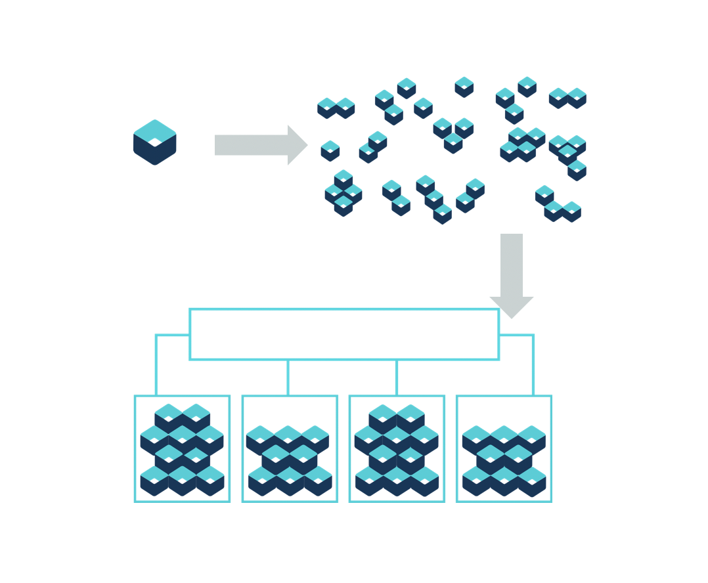
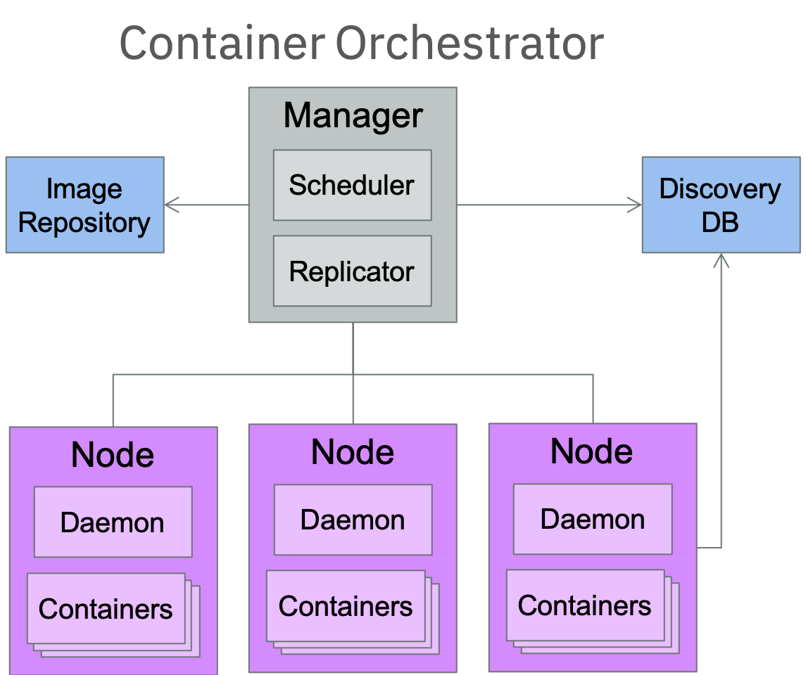

# Container Orchestration

Everyone’s container journey starts with one container. At first the growth is easy to handle, but soon you have many applications, many instances… And that is why we have Container orchestration.

## Container Orchestration Functionality

* Container Orchestration

  * Scheduling
  * Cluster Management
  * Service Discovery

* Related Functionality

  * Provisoning
  * Monitoring
  * Configuration Management
  * Auto-scalling
  * Networking
  * load balancing
  * Policy

  

## Container ecosystem layers

## What is container orchestration?

* Container orchestration
  * Manages the deployment, placement, and lifecycle of workload containers

* Cluster management
  * Federates multiple hosts into one target

* Scheduling
  * Distributes containers across nodes

* Service discovery
  * Knows where the containers are located
  * Distributes client requests across the containers

* Replication
  * Ensures the right number of nodes and containers

* Health management
  * Replaces unhealthy containers and nodes

