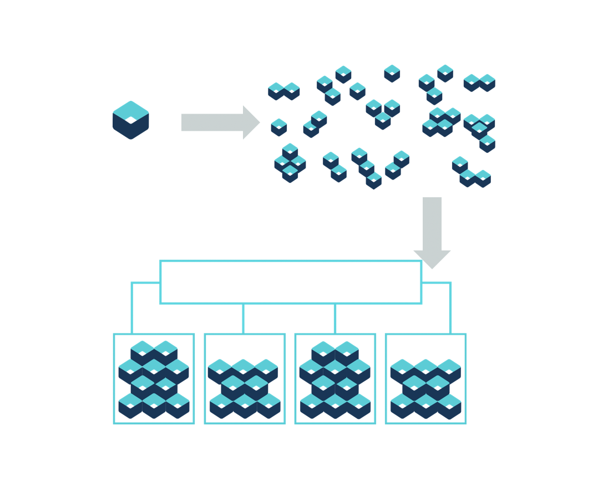
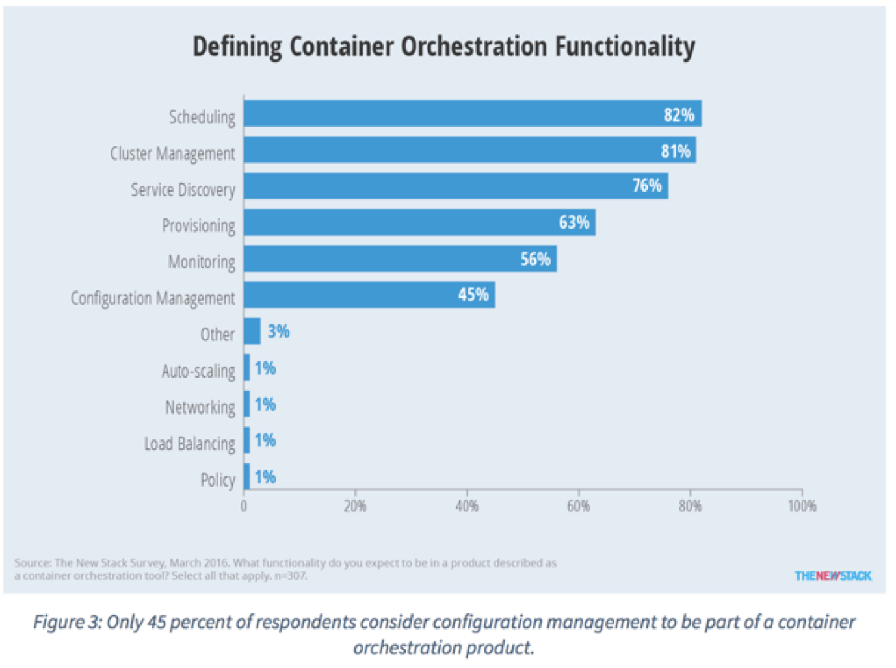

A cluster is a set of resources, worker nodes, networks, and storage devices that keep apps highly available
# Container Orchestration

Everyone’s container journey starts with one container. At first the growth is easy to handle, but soon you have many applications, many instances… And that is why we have Container orchestration.

## Container Orchestration Functionality

* Scheduling

* Cluster Management

* Service Discovery

* Provisoning

* Monitoring

* Configuration Management

  

## Container ecosystem layers

## What is container orchestration?

* Container orchestration
  * Manages the deployment, placement, and lifecycle of workload containers

* Cluster management
  * Federates multiple hosts into one target

* Scheduling
  * Distributes containers across nodes

* Service discovery
  * Knows where the containers are located
  * Distributes client requests across the containers

* Replication
  * Ensures the right number of nodes and containers

* Health management
  * Replaces unhealthy containers and nodes

# Kubernetes

## What is Kubernetes?

Kubernetes（k8s）是自动化容器操作的开源平台，这些操作包括部署，调度和节点集群间扩展。如果你曾经用过Docker容器技术部署容器，那么可以将Docker看成Kubernetes内部使用的低级别组件。Kubernetes不仅仅支持Docker，还支持Rocket，这是另一种容器技术。

使用Kubernetes可以：

* 自动化容器的部署和复制
* 随时扩展或收缩容器规模
* 将容器组织成组，并且提供容器间的负载均衡
* 很容易地升级应用程序容器的新版本
* 提供容器弹性，如果容器失效就替换它，等等...

实际上，使用Kubernetes只需一个[部署文件](https://github.com/kubernetes/kubernetes/blob/master/examples/guestbook/all-in-one/guestbook-all-in-one.yaml)，使用一条命令就可以部署多层容器（前端，后台等）的完整集群：kubectl是和Kubernetes API交互的命令行程序。现在介绍一些核心概念。

* **Container orchestrator**
  * Runs and manages containers
  * Unified API for deploying web applications, batch jobs, and databases
  * Maintains and tracks the global view of the cluster 
  * Supports multiple cloud and bare-metal environments

* **Manage applications, not machines**
  * Rolling updates, canary deploys, and blue-green deployments 

* **Designed for extensibility**
  * Rich ecosystem of plug-ins for scheduling, storage, networking

* **Open source project managed by the Linux Foundation**
  * Inspired and informed by Google's experiences and internal systems
  * 100% open source, written in Go

### Kubernetes Strengths

* **Kubernetes has a clear governance model** managed by the Linux Foundation. Google is actively driving the product features and roadmap, while allowing the rest of the ecosystem to participate. 

* **A growing and vibrant Kubernetes ecosystem** provides confidence to enterprises about its long-term viability.  IBM, Huawei, Intel, and Red Hat are some of the companies making prominent contributions to the project. 

* **The commercial viability of Kubernetes makes it an interesting choice for vendors.**  We expect to see new offerings announced over the next several months. 

* **Despite the expected growth in commercial distributions, Kubernetes avoids dependency and vendor lock-in** through active community participation and ecosystem support. 

* **Kubernetes supports a wide range of deployment options.** Customers can choose between bare metal, virtualization, private, public, and hybrid cloud deployments. It enjoys a wide range of delivery models across on-premises and cloud-based services. 

* **The design of Kubernetes is more operations-centric** than developer-orientated, which makes it the first choice of DevOps teams.

### Kubernetes Certified Service Providers(KCSP)
The KCSP program is a vetted tier of service providers who have deep experience helping enterprises successfully adopt Kubernetes. KCSP partners offer Kubernetes support, consulting, professional services and training for organizations embarking on their Kubernetes journey.

* KCSP is managed by the Cloud Native Computing Foundation

* IBM is a KCSP Partner
  * IBM Container Service is a managed k8s environment with built-in cluster security and isolation while leveraging services including Waston, IoT, Weather, etc.

### Kubernets feature

* Intelligent Scheduling
* Self-healing
* Horizontal scaling: scale up and down dynamically
* Service discovery & load balancing
* Automated rollouts and rollbacks
* Secret and configuration management

## Architecture Overview

Kubernetes Cluster Architecture 

* **Cluster**
  
  * 集群是一组节点，这些节点可以是物理服务器或者虚拟机，之上安装了Kubernetes平台
  
* **Master node**
  
  * Node that manages the cluster
  * Scheduling, replication & control
  
* Multiple nodes for HA
  
* **Worker nodes**
  * Node where pods are run
  * Docker engine
  * kubelet agent accepts & executes commands from the master to manage pods
  * cAdvisor – Container Advisor provides resource usage and performance statistics
  * kube-proxy – routes inbound or ingress traffic

  ### Master Node Components

  **Etcd**

  –A highly-available key value store

  –All cluster data is stored here

  **API Server**

  –Exposes API for managing Kubernetes

  –Used by kubectrl CLI

  **Controller manager**

  –Daemon that runs controllers, which are the background threads that handle routine tasks in the cluster

  –Node Controller – Responsible for noticing and responding when nodes go down

  –Replication Controller – Replaced by ReplicaSet

  –Endpoints Controller – Populates the Endpoints object (that is, joins services and pods)

  –Service Account & Token Controllers – Create default accounts and API access tokens for new namespaces

  **Scheduler**

  –Selects the worker node each pods runs in

### Control Plane Components

* Kube-apiserver
  * Provides a forward facing REST interface into the kubernetescontrol plane and datastore.  
  * All clients and other applications interact with kubernetes **strictly** through the API Server.
  * Acts as the gatekeeper to the cluster by handling authentication and authorization, request validation, mutation, and admission control in addition to being the front-end to the backing datastore.

* Etcd
  * etcd acts as the cluster Distributed backing datastore for kubernetes.
  * Purpose in relation to Kubernetes is to provide a strong, consistent and highly available key-value store for persisting cluster state.
  * Stores objects and config information. 
  * The apiserveris the only thing that talks to it

* Kube-controller-manager
  * The home of the core controllers,
  * Monitors the cluster state via the apiserverand **steers the cluster towards the desired state**. Does NOT handle scheduling, 
  * Node Controller: Responsible for noticing and responding when nodes go down.
  * Replication Controller: Responsible for maintaining the correct number of pods for every replication controller object in the system.
  * Endpoints Controller: Populates the Endpoints object (that is, joins Services & Pods).
  * Service Account & Token Controllers: Create default accounts and API access tokens for new namespaces.

* kube-scheduler: handesplacement
  * Component on the master that watches newly created pods that have no node assigned, and selects a node for them to run on.
  * Factors taken into account for scheduling decisions include individual and collective resource requirements, hardware/software/policy constraints, affinity and anti-affinity specifications, data locality, inter-workload interference and deadlines.

### Node Components

## Kubernetes Concepts

### Pods

A group of co-located containers

* Smallest deployment unit – runs containers
* Each pod has its own IP
* Shares a PID namespace, network, and hostname, volumes

### Services

A service defines a set of pods and a means by which to access them, such as single stable IP address and corresponding DNS name.

* Collection of pods exposed as an endpoint
  
* state and networking info propagated to all worker nodes
  
* Types of service exposure
  * ClusterIP – Exposes cluster-internal IP
  * NodePort – Exposes the service on each Node’s IP at a static port
  * LoadBalancer – Exposes externally using a cloud provider’s load balancer
  * ExternalName – Maps to an external name (such as foo.bar.example.com)

  

### Volumes

A volume is a directory, possibly with some data in it, which is accessible to a Container as part of

its  filesystem.

### Labels

A label is a key/value pair that is attached to a resource, such as a pod, to convey a user-defined

identifying attribute.

### Replication Controller

A replication controller ensures that a specified number of pod replicas are running at any one time.

### Kubernetes StatefulSet

A StatefulSet is a Controller that provides a unique identity to its Pods. It provides guarantees about the ordering of deployment and scaling.

## Security

## Networking
## Core Objects and API

## Storage

# Resources

Kubernetes tutorial –https://kubernetes.io/docs/tutorials/kubernetes-basics/

Introduction to container orchestration –https://www.exoscale.ch/syslog/2016/07/26/container-orch/

 TNS Research: The Present State of Container Orchestration –https://thenewstack.io/tns-research-present-state-container-orchestration/

Large-scale cluster management at Google with Borg –https://research.google.com/pubs/pub43438.html