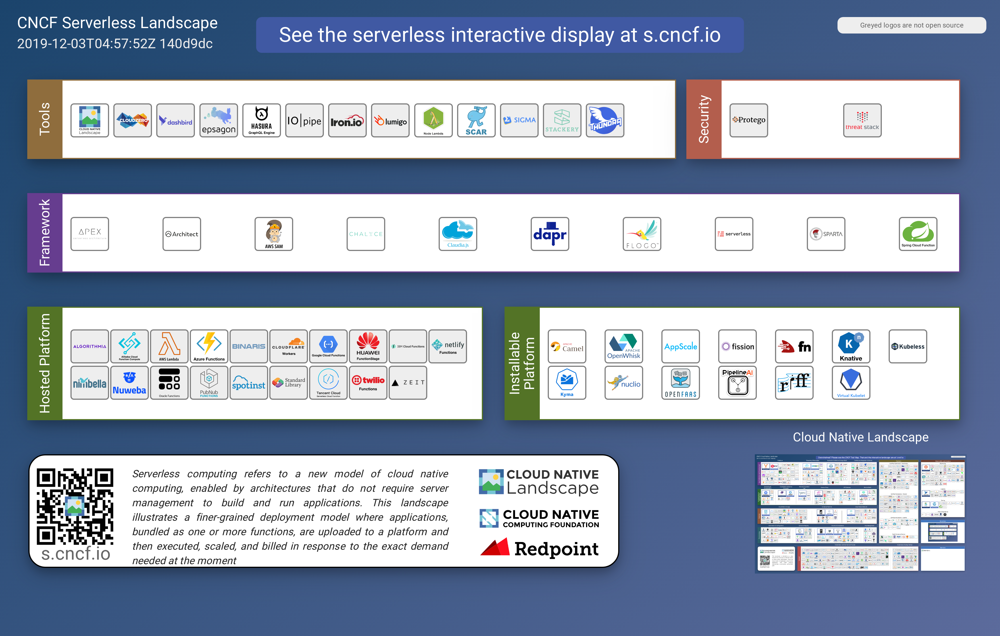

# Cloud Computing

[SUMMARY](SUMMARY.md)

[rootsongjc/awesome-cloud-native](https://github.com/rootsongjc/awesome-cloud-native)

[Technical Skill Development Recommendation - Cloud](https://w3-connections.ibm.com/forums/html/topic?id=6552b0a7-a559-4766-ae63-a9df2b839488&ps=)

虚拟化，openstack、KVM
云计算的虚拟资源层，Iaas云管理层，paas各个平台服务层次

kvm xen dokcer openstack cloudfoundry ceph sdn等云计算关键技术
计算、存储、网络虚拟化的技术发展和应用
nfv，公有云，私有云，混合云的架构、部署、应用场景
sdn，nfv 云存储 云计算的部署和运维

技术

* openstack：IaaS云平台
* Linux 容器
* Docker：容器引擎，https://docs.docker.com/
* Kubernetes：容器云平台，https://kubernetes.io/docs/
* ansible

runc: https://github.com/opencontainers/runc

docker -- 从入门到实践 https://yeasy.gitbooks.io/docker_practice/introduction/why.html

[Cloud Native Landscape](https://github.com/cncf/landscape)

# Book：  
《云计算 从基础架构到最佳实践》 齐伟 刘冰 路士华 冯德林 著  
《云计算网络珠玑》 李俊武 著  
《云计算通俗讲义》 王良明 著  
《云计算-概念、技术与架构》 （美）埃尔 著  
《让云落地：云计算服务模式（SaaS、PaaS和IaaS）设计决策》 Michael J. Kavis 著  
《云计算基础架构及关键应用》 陆平 著
《云计算和大数据时代网络技术揭秘》徐立冰著
《云计算基础架构及关键应用》

# Curriculum

* [阿里云原生技术课程](https://edu.aliyun.com/roadmap/cloudnative)

Microservices
Security Certification

[云计算十年发展](https://www.infoq.cn/article/ykDsBz7LFvFz-BQfs3IP)

云计算目标：对资源对管理（计算资源[CPU,内存]、网络资源[路由器，交换机，IP]、存储资源）

云计算本质：资源到架构到全面弹性(时间灵活性、空间灵活性)

云计算已多特指提供各类云端服务与组件的软硬一体化技术资源平台
大数据则是技术上处理大体量数据的方法论和实现，主要是一种技术体系——所以两者各自独立又可互相依存，比如各云计算厂商都陆续推出了云上大数据分析服务

计算资源分布式协作和统一管理： 网格计算理论(太学术)、云计算

云计算诞生及蓬勃发展的原因？
* 软硬件技术成熟：构建云计算平台的条件具备：
    * 超大规模数据中心建设
    * 高速互联网络
    * 计算资源虚拟化(Hypervisor) [闭源：VMware；开源：Xen, KVM]
    * 软件定义网络(SDN)
* 巨大的社会价值：
    * 使任意组织和个人得以站在巨人的肩膀上开展业务，避免重复造轮，极大提高了软件与服务构建各环节效率，加速了各类应用的架构和落地，而云端按需启用和随意扩展的资源弹性，也能够为企业节省巨大成本
* 伟大的商业模式：
    * 云计算的产品和服务形态非常适合新时代的 B 端需要，订阅制和 Pay-as-you-go 的计费方式大幅降低了客户的进入门槛，而技术基础设施架构方面的稳定性需要又带来了较高的客户粘性，再加上多租户高密度数据中心所能带来的规模效应，这些因素使得云计算能够成为一门好的生意，对应着一个极佳的 B 端商业模式。这三者缺一不可，共同促成了云计算的兴起与繁荣，也吸引了不计其数的业界精英投入其中，是为云计算取之不竭的源动力

A short history of cloud

云原生技术发展简史

2004 年— 2007 年，Google 已在内部大规模地使用像 Cgroups 这样的容器技术；

2008 年，Google 将 Cgroups 合并进入了 Linux 内核主干；

2013 年，Docker 项目正式发布。

2014 年，Kubernetes 项目也正式发布。这样的原因也非常容易理解，因为有了容器和 Docker 之后，就需要有一种方式去帮助大家方便、快速、优雅地管理这些容器，这就是 Kubernetes 项目的初衷。在 Google 和 Redhat 发布了 Kubernetes 之后，这个项目的发展速度非常之快。

2015 年，由Google、Redhat 以及微软等大型云计算厂商以及一些开源公司共同牵头成立了 CNCF 云原生基金会。CNCF 成立之初，就有 22 个创始会员，而且 Kubernetes 也成为了 CNCF 托管的第一个开源项目。在这之后，CNCF 的发展速度非常迅猛；

2017 年，CNCF 达到 170 个成员和 14 个基金项目；

2018 年，CNCF 成立三周年有了 195 个成员，19 个基金会项目和 11 个孵化项目，如此之快的发展速度在整个云计算领域都是非常罕见的。

云原生技术生态

* 云原生基金会：CNCF（Cloud Native Computing Foundation），云计算领域最成功的开源基金会之一

* 云原生技术社区，比如像 CNCF 目前正式托管的 20 多个项目共同构成了现代云计算生态的基石，其中像 Kubernetes 这样的项目已经成为了世界第四活跃的开源项目；
* 除了前面两点之外，现在全球各大公有云厂商都已经支持了 Kubernetes。此外，还有 100 多家技术创业公司也在持续地进行投入。各大公司也在谈全面上云，而且上云就要上云原生，这也是各大技术公司拥抱云原生的一个例子。

预备知识：

Linux基础

计算机程序设计

容器使用基础

## 云原生的定义

 

很多人都会问“到底什么是云原生？”

 

实际上，云原生是一条最佳路径或者最佳实践。更详细的说，**云原生为用户指定了一条低心智负担的、敏捷的、能够以可扩展、可复制的方式最大化地利用云的能力、发挥云的价值的最佳路径。**

 

因此，云原生其实是一套指导进行软件架构设计的思想。按照这样的思想而设计出来的软件：首先，天然就“生在云上，长在云上”；其次，能够最大化地发挥云的能力，使得我们开发的软件和“云”能够天然地集成在一起，发挥出“云”的最大价值。

 

所以，云原生的最大价值和愿景，就是认为未来的软件，会从诞生起就生长在云上，并且遵循一种新的软件开发、发布和运维模式，从而使得软件能够最大化地发挥云的能力。说到了这里，大家可以思考一下为什么容器技术具有革命性？

 

其实，容器技术和集装箱技术的革命性非常类似，即：容器技术使得应用具有了一种“自包含”的定义方式。所以，这样的应用才能以敏捷的、以可扩展可复制的方式发布在云上，发挥出云的能力。这也就是容器技术对云发挥出的革命性影响所在，所以说，容器技术正是云原生技术的核心底盘。

## 云原生的技术范畴

云原生的技术范畴包括了以下几个方面：

- 第一部分是云应用定义与开发流程。这包括
  - 应用定义与镜像制作、
  - 配置 CI/CD、
  - 消息和 Streaming 
  - 数据库
- 第二部分是云应用的编排与管理流程。这也是 Kubernetes 比较关注的一部分，包括了
  - 应用编排与调度、
  - 服务发现治理、
  - 远程调用、
  - API 网关以及 
  - Service Mesh。
- 第三部分是监控与可观测性。这部分所强调的是云上应用如何进行
  - 监控、
  - 日志收集、
  - Tracing 以及
  - 在云上如何实现破坏性测试，也就是混沌工程的概念。
- 第四部分就是云原生的底层技术，比如
  - 容器运行时、
  - 云原生存储技术、
  - 云原生网络技术等。
- 第五部分是云原生工具集，在前面的这些核心技术点之上，还有很多配套的生态或者周边的工具需要使用，比如
  - 流程自动化与配置管理、
  - 容器镜像仓库、
  - 云原生安全技术以及
  - 云端密码管理等。
- 最后则是 Serverless。Serverless 是一种 PaaS 的特殊形态，它定义了一种更为“极端抽象”的应用编写方式，包含了 FaaS 和 BaaS 这样的概念。而无论是 FaaS 还是 BaaS，其最为典型的特点就是按实际使用计费（Pay as you  go），因此 Serverless 计费也是重要的知识和概念。
  - Faas
  - Baas
  - Serverless 计费

## 云原生思想的两个理论

 

在了解完云原生的技术范畴之后你就会发现，其所包含的技术内容还是很多的，但是这些内容的技术本质却是类似的。云原生技术的本质是两个理论基础。

 

- **第一个理论基础是：不可变基础设施**。这一点目前是通过容器镜像来实现的，其含义就是应用的基础设施应该是不可变的，是一个自包含、自描述可以完全在不同环境中迁移的东西；
- **第二个理论基础就是：云应用编排理论**。当前的实现方式就是 Google 所提出来的“容器设计模式”，这也是本系列课程中的 Kubernetes 部分所需主要讲解的内容。

## 云原生关键技术点

 

当我们回过头来看云原生关键技术点或者说它所依赖的技术理论的时候，可以看到主要有这样的四个方向：

 

1. 如何构建自包含、可定制的应用镜像；
2. 能不能实现应用快速部署与隔离能力；
3. 应用基础设施创建和销毁的自动化管理；
4. 可复制的管控系统和支撑组件。

 CNCF Trail map

CNCF  Lanscape

CNCF serverless

