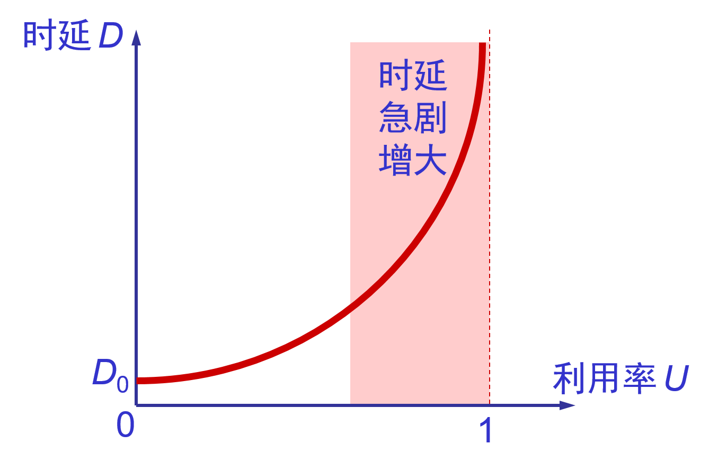

#计算机网络
## 1.1 Overview

[Computer Network](https://www.wikiwand.com/en/Computer_network): A set of [computers](https://www.wikiwand.com/en/Computer) sharing resources located on or provided by [network nodes](https://www.wikiwand.com/en/Node_(networking)). The computers use common [communication protocols](https://www.wikiwand.com/en/Communication_protocol) over [digital](https://www.wikiwand.com/en/Digital_signal) [interconnections](https://www.wikiwand.com/en/Interconnection) to communicate with each other. These interconnections are made up of [telecommunication network](https://www.wikiwand.com/en/Telecommunication_network) technologies, based on physically wired, optical, and wireless radio-frequency methods that may be arranged in a variety of [network topologies](https://www.wikiwand.com/en/Network_topology).

An interconnection of multiple devices, also known as **hosts**, that are connected using multiple paths for the purpose of sending/receiving data or media. Computer networks can also include multiple devices/mediums which help in the communication between two different devices; these are known as **Network devices**  and include things such as **routers**, **switches**, **hubs**, and **bridges**.

**网络是由若干节点和连接这些节点的链路构成，表示诸多对象及其相互联系。**

## 1.3 Network Features

* Communication speed: video conferencing, email messaging
* File sharing
* Back up and Roll back is easy: easy to take the back up from the main server.
* Software and Hardware sharing
* Security
* Scalability
* Reliability

## 1.4 Computer Network Types 

* by 覆盖范围 spatial scope
  * 广域网 WAN \(Wide Area Network\)：使用了广域网技术\(例ADSL, 花的钱多带宽就大: 8M、4M\)，虽然离地近也叫广域网，花钱买服务，花钱买带宽（花的钱多带宽就大: 8M、4M）。
  
  * 城域网 MAN \(Metropolitan Area Network\)
  
  * **局域网** LAN \(Local Area Network\)：网线不超过100m。使用了局域网技术，虽然离得远也叫局域网。企业自己购买设备，自己维护，带宽固定\(100M 1000M，取决于交换机口的带宽\), 距离100米。网络为一个单位拥有、且地理范围和站点数目有限。
    * 局域网类型：
      * 以太网\(Ethernet\)：为实现局域网通信而设计的一种技术，它规定了包括物理层的连线、电子信号和介质访问层协议的内容，以太网是现在主流的局域网标准
      * 光纤分布式数据接口\(FDDI\)
      * 异步传输模式\(ATM\)
      * 令牌环网\(令牌 ring\)
    
    * 局域网特点
      * 使用**广播信道**，具有广播功能，从一个站点可很方便地访问全网。局域网上的主机可共享连接在局域网上的各种硬件和软件资源；
      * 易于系统扩展和逐渐地演变，各设备的位置可灵活调整和改变；
      * 提高了系统的可靠性reliability、可用性availability和生存性survivability；
      * 数据率高、低时延，误码率低；
      * 各站点平等；
    
    * 局域网工作层次：跨物理层和数据链路层，无需网络层；
    
  * 个人区域网 PAN \(Personal Area Network\)
  
  * 现在不单从网络覆盖范围区分局域网和广域网，现在应用了广域网技术的是广域网，应用了局域网技术的是局域网。例：你和你邻居通过无线或网线进行通讯就是局域网，如果是通过ADSL通信就是广域网。
  
* by 拓扑结构
  
  * **星型网**：广泛使用；🌟🌟
  
  * 总线型网：站点直接连在总线上，匹配电阻吸收信号电磁波能量，避免电磁波反射；使用的协议有两种：

    * CSMA/CD（传统以太网使用，已演变成星型网）
    * 令牌（令牌传递总线网使用，物理是总线，逻辑是令牌环网，目前已经退出市场）；
  
  * 环形网：典型的环型网是令牌环网(token ring)；
  
  * 树型网：由总线型网演变而来，使用频分复用技术；
  
  * 网状
  
    
  
* by 不同使用者的网络\(从网络的使用者进行分类\)

  * 公用网 \(public network\)：整个互联网 。公网
  * 专用网 \(private network\)：政府办公网，不允许与互联网连接，内网

* by 信息交换方式

  * 电路交换网
  * 报文交换网
  * 报文分组交换网

* by 通信方式

  * 点对点传输网络
  * 广播式传输网络

* By 网络使用目的

  * 共享资源网
  * 数据处理网
  * 数据传输网

* By 工作方式

  * 资源子网
  * 通信子网
  * 接入网
    * 用来把用户接入到因特网的网络
    * 接入网 AN \(Access Network\)，它又称为本地接入网或居民接入网。即：一个市通信范围内的众多用户接入线构成接入网如 PSTN  ISDN  ADSL  DDN等等；
    * 由 ISP 提供的接入网只是起到让用户能够与因特网连接的“桥梁”作用。

* by 服务方式

  * 客户机/服务器网络
  * 对等网

## 1.5 Network topology

Common network topologies

* Bus network 总线型；串糖葫芦，
* **Star network 最广泛，计算机接到交换机上**
* Ring network
* Mesh network 网状：路由器连的网。优点-&gt;容错
* Fully connected network
* Tree network

Overlay network

Underlay network

## 1.6 Communication protocols

OSI model: Layer architecture

* Layer1: Physical layer
* Layer2: Data link layer
* Layer3: Network layer
* Layer4: Transport layer
* Layer5: Session layer
* Layer6: Presentation layer
* Layer7: Application layer

Internet Protocol Suite(TCP/IP) Model: 

* Link layer
* Internet layer
* Trsnsport layer
* Application layer

## 1.7 Computer Network Architecture

- Peer-To-Peer network
- Client/Server network

## 4.2.1 虚拟互连网络

没有一种单一的网络能够适应所有用户需求，各种网络新技术也层出不穷，各网络之间互相通信需要解决许多问题，比如：

* 不同的寻址方案；  
* 不同的最大分组长度；  
* 不同的网络接入机制；  
* 不同的超时控制；  
* 不同的差错恢复方法；  
* 不同的状态报告方法；  
* 不同的路由选择技术；  
* 不同的用户接入控制；  
* 不同的服务类型（无连接和面向连接）  
* 不同的管理与控制方法；

**网络互连使用的中间设备**（又称为中间系统或中继系统）主要有： 

* 物理层中继系统：转发器\(repeater\)  
* 数据链路层中继系统：网桥（桥接器）、二层交换机  
* 网络层中继系统：路由器（router）  
* 网桥和路由器的混合物：桥路器（brouter）  
* 网络层以上的中继系统：网关（gateway连接两个不兼容的系统）  

注意： 

* ①.中间设备是转发器或网桥时，仅把网络扩大，但我们仍视之为一个网络，并不称为网络互连。只有经路由器互联，才称作网络互连。由于历史原因，常把网络层使用的路由器称网关，而工作在网络层以上的真正的网关目前使用较少。 
* ②.虚拟互联网络：是指逻辑互联网络，使结构、性能各异的网络在网络层看起来好像是一个统一的网络。 
* ③.互联网可以是由多种异构网络互联组成。 
* ④.如果我们只从网络层考虑问题，那么 IP 数据报就可以想象是在网络层中传送。

## 1.8 Netowrk performance

#### 

#### Quality of service 

#### Network congestion

#### Network resilience

### 1.8.1 Rate

* 速率：每秒传多少比特。计算机网络上主机在数字**信道**上传输数据的速率；单位b/s**（bps），1Kb/s=**$$10^3$$** bps ；1Mb/s=**$$10^6$$** bps ；1Gb/s=**$$10^9$$** bps；1Tb/s=**$$10^{12}$$** bps**；
* 速率即**数据率**(data rate)或**比特率**\(bit rate\)是计算机网络中最重要的一个性能指标。

  * **比特**（bit）是计算机中数据量的单位，也是信息论中使用的信息量的单位。

  * Bit 来源于 binary digit，意思是一个**“二进制数字”**，因此一个比特就是二进制数字中的一个 1 或 0。
* 速率往往是指**额定速率**或**标称速率**。
* 上网时，360显示的xxkb/s就是速率，一般家里办的8M的网，这里的8M单位是字节，速率的b是比特。
* 速率是指单个信道的速率，即使同一的计算机其不能将不同信道速率加起来等于总速率。

### 1.8.2 Bandwidth

* **“带宽”\(bandwidth\)本来是指信号具有的频带宽度，单位是赫（或千赫、兆**赫、吉赫等），如电话信号带宽为3.1KHz（从300Hz到3.4KHz）。

* 在计算机网络中带宽表示网络通信线路传送数据的能力，即单位时间内从网络的某一点到另一点所能通过的**“最高数据率”**， 单位是“比特每秒”，或 b/s \(bit/s\,bps\)。1Mb/s=$$2^{20}$$ bps ；1Gb/s=$$2^{30}$$ bps；1Tb/s=$$2^{40}$$ bps；

* 常用的带宽单位

  * 千比每秒，即 kb/s （103 b/s）

  * 兆比每秒，即 Mb/s（106 b/s）

  * 吉比每秒，即 Gb/s（109 b/s）

  * 太比每秒，即 Tb/s（1012 b/s）

  * 请注意：在计算机界，K = 2^10 = 1024 M = 2^20, G = 2^30, T = 240。

* 数字信号流随时间的变化

  * 在时间轴上信号的宽度随带宽的增大而变窄。
    

### throughput吞吐量 

* **吞吐量**\(throughput\)表示在单位时间内通过某个网络（或信道、接口）的实际数据量。  经过网络设备速率总和
* 吞吐量更经常地用于对现实世界中的网络的一种测量，以便知道实际上到底有多少数据量能够通过网络。
* 吞吐量受网络的带宽或网络的额定速率的限制。

应用吞吐量压不上去

### 1.8.4 Network delay/latency

* **传输时延**（发送时延 ） 发送数据时，数据块从结点进入到传输媒体所需要的时间。也就是从发送数据帧的第一个比特算起，到该帧的最后一个比特发送完毕所需的时间。  
  

* **传播时延** 电磁波在信道中需要传播一定的距离而花费的时间。

* 信号**传输速率**（即发送速率）和信号在信道上的**传播速率**是完全不同的概念。  
  

* **处理时延** 交换结点为存储转发而进行一些必要的处理所花费的时间。主机线路由分析首部、提取数据部分、差错检测、路由选择等需花费的时间；

* **排队时延** 结点缓存队列中分组排队所经历的时延。在路由的输入队列中等待时间长度； 排队时延的长短往往取决于网络中**当时的通信量**。

* 数据经历的总时延就是发送时延、传播时延、处理时延和排队时延之和：  
  

* 四种时延所产生的地方

  * 从结点 A 向结点 B 发送数据

* 容易产生的错误概念

  * 对于高速网络链路，我们提高的仅仅是数据的发送速率而不是比特在链路上的传播速率。 
  * 提高链路带宽减小了数据的发送时延。 

1. 时延带宽积

   * 链路的时延带宽积又称为以比特为单位的链路长度。 表示发送的第一个比特到达终点时已发送比特数 
     
   * 时延与网络利用率的关系
     * 根据排队论的理论，当某信道的利用率增大时，该信道引起的时延也就迅速增加。 
     * 若令 D0 表示网络空闲时的时延，D 表示网络当前的时延，则在适当的假定条件下，可以用下面的简单公式表示 D 和 D0之间的关系： 
       U 是网络的利用率，数值在 0 到 1 之间。 
       

### 抖动

即延迟的可变性。

### 往返时间  

从发送方发送数据开始，到发送方收到来自接收方的确认为止，共经历的时间长度；

### 利用率  

主要是指“信道利用率” 和“网络利用率”  
⑴、信道利用率指出某信道有百分之几的时间是被利用的（有数据通过）。完全空闲的信道的利用率是零。信道利用率=有数据通过的时间/\(有+无\)数据通过的时间  
⑵、网络利用率则是全网络的信道利用率的加权平均值  
注:①信道利用率并非越高越好。  
②时延D与网络利用率U之间存在以下关系：  
若令 $$D_0$$ 表示网络空闲时的时延，D 表示网络当前的时延，则在适当的假定条件下，可以用下面的简单公式表示 D 和 $$D_0$$之间的关系：$$D={D_0}/(1-U)$$

**信程**

## 1.9 Non-performance metrics

* 费用

* 质量

* 标准化

* 可靠性

* 可扩展性和可升级性

* 易于管理和维护

## 1.9 Security

## 1.2 Network History

https://www.wikiwand.com/en/Computer_network#/History

三网：电信网络，有线电视网，计算机网络。

核心是计算机网络、发展最为迅速、趋势是三网融合。以因特网为代表的计算机网络得到飞速发展

### 1.2.1 计算机网络的产生背景 

计算机网络的产生背景是20世纪60年代美苏冷战时期的产物。  
60年代初，美国国防部领导的远景研究规划局ARPA(Advanced Research Project Agency) 提出要研制一种生存性(survivability)很强的网络。  传统的电路交换(circuit switching)的电信网有一个缺点：正在通信的电路中有一个交换机或有一条链路被炸毁，则整个通信电路就要中断。  如要改用其他迂回电路，必须重新拨号建立连接。这将要延误一些时间。

新型网络的基本特点：

* 网络用于计算机之间的数据传送，而不是为了打电话。  
* 网络能够连接不同类型的计算机，不局限于单一类型的计算机。  
* 所有的网络结点都同等重要，因而大大提高网络的生存性。  
* 计算机在进行通信时，必须有冗余的路由。  
* 网络的结构应当尽可能地简单，同时还能够非常可靠地传送数据。

ARPANET的成功使计算机网络的概念发生根本变化   
早期的面向终端的计算机网络是以单个主机为中心的星形网，各终端通过通信线路共享昂贵的中心主机的硬件和软件资源。   
分组交换网则是以网络为中心，主机都处在网络的外围。  用户通过分组交换网可共享连接在网络上的许多硬件和各种丰富的软件资源。

从主机为中心到以网络为中心  

### 1.2.2 计算机网络在我国的发展

我国于1989年11月建成第一个公用分组交换网CNPAN网，随后陆续建造的九个全国范围的公用计算机网络： 

* (1) 中国公用计算机互联网 CHINANET
* (2) 中国教育和科研计算机网 CERNET
* (3) 中国科学技术网 CSTNET
* (4) 中国联通互联网 UNINET
* (5) 中国网通公用互联网 CNCNET
* (6) 中国国际经济贸易互联网 CIETNET
* (7) 中国移动互联网 CMNET
* (8) 中国长城互联网 CGWNET（建设中）
* (9) 中国卫星集团互联网 CSNET（建设中） 

## 网络协议知识图谱

