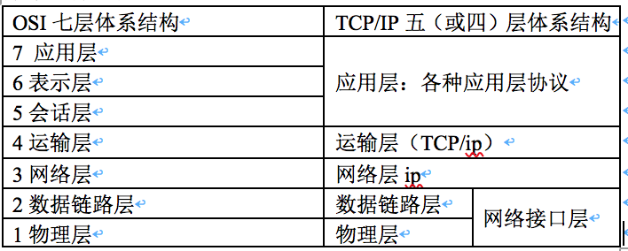
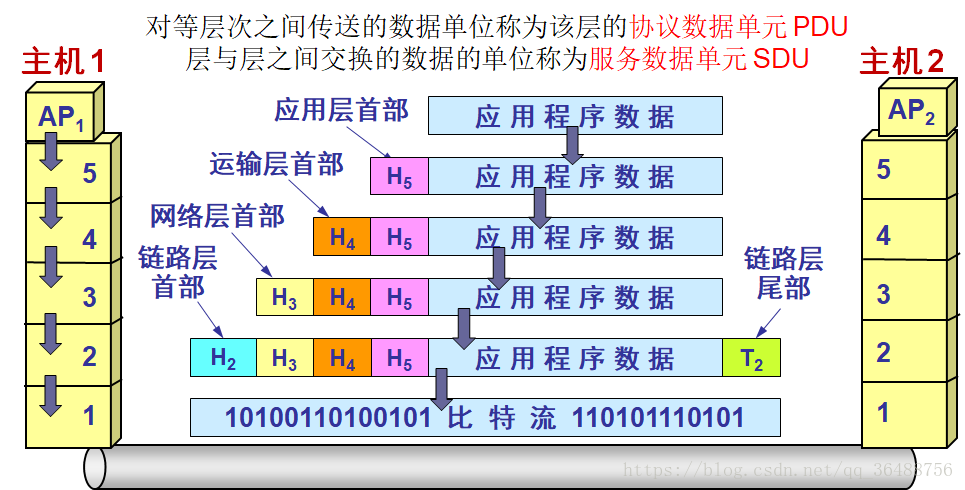
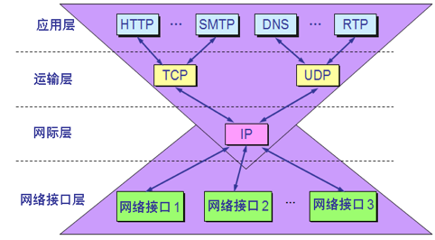

#计算机网络
## 1.7 计算机网络的体系结构
相互通信的两个计算机系统必须高度协调工作才行，而这种“协调”是相当复杂的。“**分层**”可将庞大而复杂的问题，转化为若干较小的局部问题，而这些较小的局部问题就比较易于研究和处理。

几个 基本概念：

* ISO：国际标准化组织
* OSI/RM：互联网法律上的国际标准
* TCP/IP Suite：互联网事实上的国际标准
* Network Protocols ：数据交换遵守的规则、标准或约定。计算机有相同的协议才能通讯，不同语言的人无法交流。 
* 网络体系结构：计算机网络各层及其协议的集合

### 1.7.1 协议

如果你是程序员，一定看得懂上面这一段文字。这是每一个程序员向计算机世界说“你好，世界”的方式。但是，你不一定知道，这段文字也是一种协议，是人类和计算机沟通的协议，**只有通过这种协议，计算机才知道我们想让它做什么。**当然，这种协议还是更接近人类语言，机器不能直接读懂，需要进行翻译，翻译的工作教给编译器，也就是程序员常说的compile。这个过程比较复杂，其中的编译原理非常复杂，我在这里不进行详述。但是可以看得出，计算机语言作为程序员控制一台计算机工作的协议，具备了协议的三要素。

**协议**：为进行网络中数据交换而建立的规则标准或约定；使用不同协议的计算机无法通讯，除非在网关进行协议转换。**只有通过网络协议，才能使一大片机器互相协作、共同完成一件事。**

只要遵循 OSI 标准，一个系统就可以和位于世界上任何地方的、也遵循这同一标准的其他任何系统进行通信

法律上的国际标准 OSI 并没有得到市场的认可，而非国际标准 TCP/IP 获得了最广泛的应用。

**协议三要素**:

* ①**语法**：数据交换的格式与信息结构。例如，括号要成对，结束要使用分号等。
* ②**语义**：需要发出何种控制信息 完成何种动作。就是这一段内容要代表某种意义，例如数字减去数字是有意义的，数字减去文本一般来说就没有意义。
* ③**顺序**：事件实现顺序详细说明。例如，可以先加上某个数值，然后再减去某个数值。

**协议与服务的区别**：

* 实体\(entity\)：任何可发送或接收信息的硬件或软件进程；
* 协议\(protocol\)：控制两个对等实体进行通信的规则的集合；
  * ①协议的实现保证了向上层提供服务，下面的实体是透明的，上层只能看到下层的服务，看不到协议
  * ②协议是水平的，而服务是垂直的；
* 服务\(service\)：下层向上层提供服务，上层需要使用下层提供的服务来实现本层的功能。
  * 服务数据单位：层与层之间交换的数据的单位；
  * 服务点访问\(SAP\)：相邻两层实体间交换信息的地方；

-----

**只有通过这种协议，计算机才知道我们想让它做什么。**当然，这种协议还是更接近人类语言，机器不能直接读懂，需要进行翻译，翻译的工作教给编译器，也就是程序员常说的compile。这个过程比较复杂，其中的编译原理非常复杂，我在这里不进行详述。 

但是可以看得出，计算机语言作为程序员控制一台计算机工作的协议，具备了协议的三要素。会了计算机语言，你就能够教给一台计算机完成你的工作了。但是，要想打造互联网世界的通天塔，只教给一台机器做什么是不够的，你需要学会教给一大片机器做什么。这就需要网络协议。**只有通过网络协议，才能使一大片机器互相协作、共同完成一件事。**

### 1.7.3 分层思想的好处

网络为什么要分层？因为，是个复杂的程序都要分层。**复杂的程序都要分层，这是程序设计的要求。**比如，复杂的电商还会分数据库层、缓存层、Compose层、Controller层和接入层，每一层专注做本层的事情。

①**.**分层之间**相互独立**，无需知道下层如何实现

②**.**灵活性好：对本层修改只要保持接口不变，上下层不受影响

③**.**结构上可分割开：各层都可采用最合适的技术实现

④**.**易于实现和维护：系统被分解成若干独立子系统

⑤**.**能促进**标准化**工作：每一层功能都做出精选说明

### 1.7.4 体系结构

通信协议就像没有天桥的双子楼，要从A座的24层到达B座24层就得先下楼梯再上楼梯，其他协议也是如此，比如4G

很像发快递的过程（http，应用层)，你向顺丰下单(第一次请求),顺丰接单(应答),你向手机小伙联系(回应应答)，你将消息放进盒子里(开始封装请求，会话层)，快递员封装一层盒子贴上快递单带回网店(传输层），到快递点检查是否区域快件（网络层），将快件交给运输车（链路层），各个快递转运中心（物理层），快件到达收件市转运中心（物理层），转运输车（链路层），到达区域分发（网络层），网点派送（传输层），快递员方面签收（会话层），拆开检查（表示层），收到快递（应用层）。

体系结构：计算机网络的各层及其协议的集合；**层层封装**

从本质上讲，TCP/IP只是最上面三层，网络接口层没什么具体内容，学习时往往综合这两种体系结构优点，采用五层结构：从上往下依次是：应用层，运输层，物理层，数据链路层，物理层。

[OSI Model](https://www.wikiwand.com/en/OSI_model)七层：Layer architecture

* 

* 应用层：能够产生网络流量和用户交互的应用程序

* 表示层：加密、压缩，开发人员要考虑的一层 ，乱码是表示层出现问题

* 会话层：服务和客户端建立的会话，查木马 netstat -nb

* 传输层：可靠传输\(建立会话，看电影\)、不可靠传输\(qq聊天，屏幕广播软件\)、流量控制

* 网络层：选择最佳路径\(用动态路由协议实现\)、IP地址编址

* 数据链路层：数据如何封装、添加物理层地址 MAC

* 物理层：规定电压、接口标准

传输层、网络层、数据链路层是网络工程师做的事情。

网络排错：从底层到高层：

1. 网线是否插好 -&gt; 物理层
2. IP地址是否设对 -&gt; 网络层
3. IE浏览器是否中恶意插件 -&gt; 应用层

网络安全 和OSI参考模型

* 物理层安全：某公司在墙上安装很多接口，后来某几个房间空着租给另一个公司，另一个公司的计算机就能通过墙上的接口访问该公司数据出现安全问题
* 数据链路层安全：ADSL 拨号上网密码，无线密码
* 网络层安全：路由器设置哪个网段能连互联网，哪些网段不能连互联网
* 应用层安全：Sql 注入漏洞 、上传漏洞

\1. 物理层：连接
\2. 链路层：定位
\3. 传输层：路由
\4. 会话层：会话连接机制
\5. 应用层：数据封装格式

### 1.7.5 各层主要功能简介：

①.应用层：直接为用户应用进程服务，

②.运输层：为两个主机中进程之间通信提供服务

③.网络层：将运输层报文封装后进行传送，并选择路由

④.数据链路层：在相邻两个主机间点对点传送

⑤.物理层：透明传输比特流

数据在各层之间传递过程示意（假定两点直连）

主机1向主机2发送数据

### 各层常用网络协议

IP协议在Internet网中处于核心地位

### 网络数据包结构

Mac头 Ip头 Tcp头 Http头 数据体

## 程序是如何工作的？/网络协议工作模式

我们可以简单地想象“你”这个程序的工作过程。

当一个网络包从一个网口经过的时候，你看到了，首先先看看要不要请进来，处理一把。有的网口配置了混杂模式，凡是经过的，全部拿进来。

拿进来以后，就要交给一段程序来处理。于是，你调用**process_layer2(buffer)**。当然，这是一个假的函数。但是你明白其中的意思，知道肯定是有这么个函数的。那这个函数是干什么的呢？从Buffer中，摘掉二层的头，看一看，应该根据头里面的内容做什么操作。

假设你发现这个包的MAC地址和你的相符，那说明就是发给你的，于是需要调用**process_layer3(buffer)**。这个时候，Buffer里面往往就没有二层的头了，因为已经在上一个函数的处理过程中拿掉了，或者将开始的偏移量移动了一下。在这个函数里面，摘掉三层的头，看看到底是发送给自己的，还是希望自己转发出去的。

如何判断呢？如果IP地址不是自己的，那就应该转发出去；如果IP地址是自己的，那就是发给自己的。根据IP头里面的标示，拿掉三层的头，进行下一层的处理，到底是调用process_tcp(buffer)呢，还是调用process_udp(buffer)呢？

假设这个地址是TCP的，则会调用**process_tcp(buffer)**。这时候，Buffer里面没有三层的头，就需要查看四层的头，看这是一个发起，还是一个应答，又或者是一个正常的数据包，然后分别由不同的逻辑进行处理。如果是发起或者应答，接下来可能要发送一个回复包；如果是一个正常的数据包，就需要交给上层了。交给谁呢？是不是有process_http(buffer)函数呢？

没有的，如果你是一个网络包处理程序，你不需要有process_http(buffer)，而是应该交给应用去处理。交给哪个应用呢？在四层的头里面有端口号，不同的应用监听不同的端口号。如果发现浏览器应用在监听这个端口，那你发给浏览器就行了。至于浏览器怎么处理，和你没有关系。

浏览器自然是解析HTML，显示出页面来。电脑的主人看到页面很开心，就点了鼠标。点击鼠标的动作被浏览器捕获。浏览器知道，又要发起另一个HTTP请求了，于是使用端口号，将请求发给了你。

你应该调用**send_tcp(buffer)**。不用说，Buffer里面就是HTTP请求的内容。这个函数里面加一个TCP的头，记录下源端口号。浏览器会给你目的端口号，一般为80端口。

然后调用**send_layer3(buffer)**。Buffer里面已经有了HTTP的头和内容，以及TCP的头。在这个函数里面加一个IP的头，记录下源IP的地址和目标IP的地址。

然后调用**send_layer2(buffer)**。Buffer里面已经有了HTTP的头和内容、TCP的头，以及IP的头。这个函数里面要加一下MAC的头，记录下源MAC地址，得到的就是本机器的MAC地址和目标的MAC地址。不过，这个还要看当前知道不知道，知道就直接加上；不知道的话，就要通过一定的协议处理过程，找到MAC地址。反正要填一个，不能空着。

万事俱备，只要Buffer里面的内容完整，就可以从网口发出去了，你作为一个程序的任务就算告一段落了。

那TCP在三次握手的时候，IP层和MAC层在做什么呢？当然是TCP发送每一个消息，都会带着IP层和MAC层了。因为，TCP每发送一个消息，IP层和MAC层的所有机制都要运行一遍。而你只看到TCP三次握手了，其实，IP层和MAC层为此也忙活好久了。

<mark>**只要是在网络上跑的包，都是完整的。可以有下层没上层，绝对不可能有上层没下层。**</mark>

**对TCP协议来说，三次握手也好，重试也好，只要想发出去包，就要有IP层和MAC层，不然是发不出去的。**

经常有人会问这样一个问题，我都知道那台机器的IP地址了，直接发给他消息呗，要MAC地址干啥？这里的关键就是，没有MAC地址消息是发不出去的。

所以如果一个HTTP协议的包跑在网络上，它一定是完整的。无论这个包经过哪些设备，它都是完整的。

所谓的二层设备、三层设备，都是这些设备上跑的程序不同而已。一个HTTP协议的包经过一个二层设备，二层设备收进去的是整个网络包。这里面HTTP、TCP、 IP、 MAC都有。什么叫二层设备呀，就是只把MAC头摘下来，看看到底是丢弃、转发，还是自己留着。那什么叫三层设备呢？就是把MAC头摘下来之后，再把IP头摘下来，看看到底是丢弃、转发，还是自己留着。
