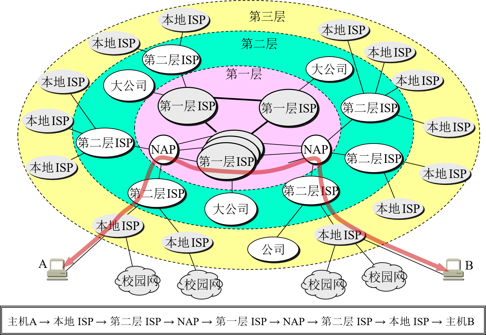
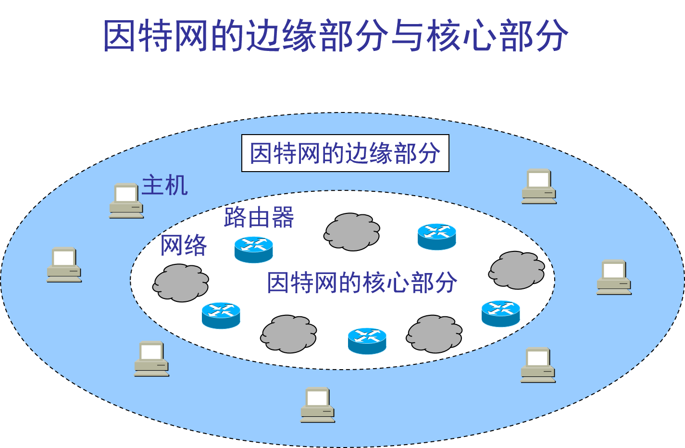
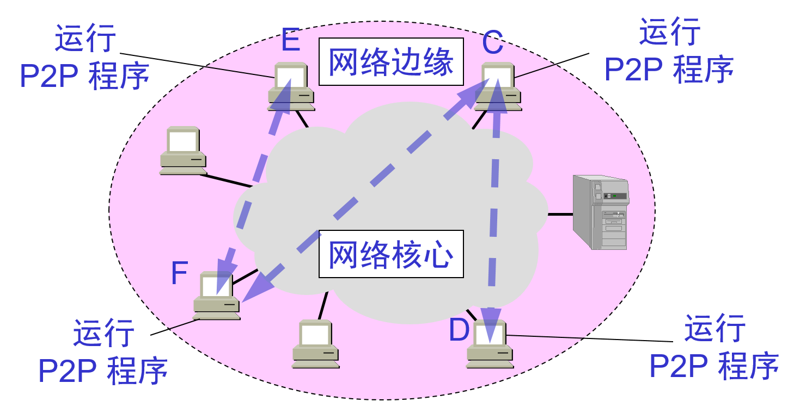

# 1.3.1 因特网概述-&gt;Internet

* **网络(network)：许多计算机连接在一起。**由若干**结点(node)**和连接这些结点的**链路(link)**组成；(网络中的node译为结点，数据结构的树(tree)中的node译为“节点”)。一般不超过100米，例如学校机房。**结点：**可以是计算机、集线器、交换机、路由器等；

* **互联网(internet)：许多网络**使用路由器**连接在一起**形成互联网。网络的网络(network of networks)

* **因特网(Internet)** 因特网\(Internet\)是“网络的网络”。

  * 起源于美国，前身为ARPNRT，第一个
  * 进入 20 世纪 90 年代以后，以因特网为代表的计算机网络得到了飞速的发展。
  * 已从最初的教育科研网络逐步发展成为商业网络。
  * 已成为**世界上最大的国际性互联网**
  *  已成为仅次于全球电话网的世界第二大网络。
  * 连接在因特网上的计算机都称为**主机**(host)

* **网络与因特网之间的关系：**网络将计算机连在一起；互联网将许多网络连在一起

* internet和Internet的区别：

  | internet 互联网 | Internet 因特网 |
  | :--- | :--- |
  | internet是一个通用名词，泛指由多个计算机网络互联而成的网络。 | Internet是专用名词，它指当前全球最大的、开放的、由众多网络互联而成的特点计算机网络，采用**TCP/IP**协议族作为通信的规则，其前身是美国的**ARPANET**。 |

# 1.3.2 因特网发展的三个阶段

* 第一阶段：从单个网络 ARPANET 向互联网发展的过程\(大约1969年开始\)。

  * 计算机技术与通信技术相结合产生了第一个ARPANET网络 --&gt; **里程碑**
  * 1969: 分组交换 ；1975:互联网；1983 TCP/IP
  * 1983 年 TCP/IP 协议成为 ARPANET 上的标准协议， TCP/IP产生时没想过对外开放，所以产生很多安全问题。IPv6考虑了安全问题。人们把 1983 年作为因特网的诞生时间；

* 第二阶段的特点是建成了**三级结构的因特网**。（开始于1985）

  * 三级计算机网络，分为主干网、地区网和校园网（或企业网）。
  * 1985年开始美国国家基金会NSF着手构建三级计算机网络，即美国国家科学基金网NSFNET；

* 第三阶段的特点是逐渐形成了**多层次 ISP 结构的因特网\(大约1993年开始\)**。

  * 1993年美国政府不再自己运营而交给因特网服务提供商运营，出现了因特网服务提供者 ISP \(Internet Service Provider\)。各运营商的IP地址不是自己随便定义的，由因特网管理机构统一安排。所以根据IP可以知道是哪个国家哪个运营商的。

    

  * 根据提供服务的覆盖面积大小以及所拥有的  
    IP 地址数目的不同，ISP 也分成为不同的层次。  
    网站放在哪个地方的服务器看这个网站所服务的群体范围。

### 万维网的问世

* 因特网已经成为世界上规模最大和增长速率最快的计算机网络，没有人能够准确说出因特网究竟有多大。

* 因特网的迅猛发展始于 20 世纪 90 年代。由欧洲原子核研究组织 CERN 开发的**万维网** WWW \(World Wide Web\)被广泛使用在因特网上，大大方便了广大非网络专业人员对网络的使用，成为因特网的这种指数级增长的主要驱动力。

### 因特网的发展情况

|  | 网络数 | 主机数 | 用户数 | 管理机构数 |
| --- | --- | --- | --- | --- |
| 1980 | 10 | 102 | 102 | 100 |
| 1990 | 103 | 105 | 106 | 101 |
| 2000 | 105 | 107 | 108 | 102 |
| 2005 | 106 | 108 | 109 | 103 |

不同运营商之间访问速度会慢，所以网站经营商会将网站部署在不同运营商中，让用户能够选择属于自己的运营商来访问和下载。双线机房：该机房既连网通也连电信，这样两个不同ISP的用户互相访问时会加快访问速度。

# 1.3.3 因特网标准化工作

1. 1992年因特网不再由美国管辖，并形成国际性组织“因特网协会ISOC”：

   所有因特网标准都以RFC文档形成在Internet上发表:  
   因特网研究部：[http://www.isoc.org](http://www.isoc.org)  
   因特网工程部：[http://www.IAB.org](http://www.IAB.org)  
   

2. 制订因特网的正式标准要经过以下的四个阶段 ：

   1. 因特网草案\(Internet Draft\) ——在这个阶段还不是 RFC 文档。

   2. 建议标准\(Proposed Standard\) ——从这个阶段开始就成为 RFC 文档。

   3. 草案标准\(Draft Standard\)

   4. 因特网标准\(Internet Standard\) 

3. 各种RFC之间的关系  
       

# 1.4 因特网的组成

从因特网的工作方式上看，可以划分为以下的两大块：

* **边缘部分\(资源子网\)** 
  * 由所有连接在因特网上的主机组成。
  * 这部分是用户直接使用的，用来进行通信（传送数据、音频或视频）和资源共享。
  * 主机A与主机B通信“实质上是主机A中的某个进程与主机B中的某个进程进行通信”；
* **核心部**分\(通信子网\) 

  * 由大量网络和连接这些网络的路由器组成。这部分是为边缘部分提供服务的（提供连通性和交换）。  
    

# 1.4.1 因特网的边缘部分\(资源子网\)

* 处在因特网边缘的部分就是连接在因特网上的所有的主机。这些主机又称为**端系统**\(end system\)。

* “主机 A 和主机 B 进行通信”，实际上是指：“运行在主机 A 上的某个程序和运行在主机 B 上的另一个程序进行通信”。即“主机 A 的某个进程和主机 B 上的另一个进程进行通信”。或简称为“计算机之间通信”

* 在网络边缘的端系统中运行的程序之间的三种主要**通信方式**：

  * **客户服务器方式**（C/S 方式），即Client/Server方式

  * **对等方式**（P2P 方式），即 Peer-to-Peer方式

  * **B/S模式** （Brower/Server），即浏览器/服务器模式

### 1. 客户服务器方式

* **客户**\(client\)和**服务器**\(server\)都是指通信中所涉及的两个应用进程。

* 客户服务器方式所描述的是进程之间服务和被服务的关系。

* 客户是**服务的请求方**，服务器是**服务的提供方**。

* 服务器通常采用高性能的PC、工作站或小型机，并采用大型数据库系统，如Oracle、Sybase、Informix或 SQL Server，客户端需要安装专用的客户端软件。  
  

  #### ①客户机程序：

  * 被用户调用后运行，在打算通信时主动向远地服务器发起通信请求（请求服务）。因此，客户程序**必须知道服务器程序的地址，无需特殊硬件和复杂OS**。

  * 不需要特殊的硬件和很复杂的操作系统。

  #### ②服务器程序：

  * 一种专门用来提供某种服务的程序，可同时处理多个远地或本地客户的请求。

  * 系统启动后即自动调用并一直不断地运行着，被动地等待并接受来自各地的客户的通信请求。因此，服务器程序不需要知道客户程序的地址。

  * 一般需要强大的硬件和高级的操作系统支持。

  #### ③服务器：

  * 服务器是计算机的一种，它是网络上一种为客户端计算机提供各种服务（主要是共享服务）的高性能的计算机；它在网络操作系统的控制下，将与其相连的硬盘、磁带、打印机、Modem及昂贵的专用通讯设备提供给网络上的客户站点共享，也能为网络用户提供集中计算、信息发表及数据管理等服务；

  * 一般也可将运行着服务器程序的机器称为服务器；

  * 目前，按照体系架构来区分，服务器主要分为两类：

    * **ISC架构服务器**（又称**精简指令集RISC架构服务器**）：使用RISC芯片并且主要采用UNIX操作系统的服务器。

    * **IA架构服务器**，（又称**复杂指令集CISC架构服务器**）：即通常所讲的PC服务器，它是基于PC机体系结构，使用Intel或与其兼容的处理器芯片的服务器，如联想的万全系列服务器，HP公司的Netserver系列服务器等。

  #### ④.客户机：

  * 又称用户工作站，是用户与网络打交道的设备；一般由微机担任，每一个客户机都运行在它自己的、并为服务器所认可的操作系统环境中。客户机主要享受网络上提供的各种资源。

  #### 总结：

  * C/S优点是能充分发挥客户端PＣ的处理能力，很多工作可以在客户端处理后再提交给服务器。对应的优点就是客户端响应速度快。
  * 缺点主要是：
    * ①只适用于局域网
    * ②客户端需要安装专用的客户端软件
    * ③对客户端的操作系统一般也会有限制。

### 2. 对等连接方式

* **对等连接**\(peer-to-peer，简写为 P2P\)是指两个主机在通信时并**不区分**哪一个是服务请求方还是服务提供方。

* 只要两个主机都运行了对等连接软件（P2P 软件），它们就可以进行**平等的、对等连接通信**。

* 双方都可以下载对方已经存储在硬盘中的共享文档。

* 对等连接方式的特点

  * 对等连接方式从本质上看仍然是使用客户服务器方式，只是对等连接中的每一个主机既是客户又同时是服务器。

  * 例如主机 C 请求 D 的服务时，C 是客户，D 是服务器。但如果 C 又同时向 F提供服务，那么 C 又同时起着服务器的作用。

  * 例如D从C下载500M的文件，硬已经下载250M了，则F想下载的时候可以从D下载。  
    

### 3.B/Ｓ模式

* 客户机上只要安装一个浏览器（Browser），如Netscape Navigator或Internet Explorer，服务器安装Oracle、Sybase、Informix或 SQL Server等数据库。浏览器通过Ｗeb Server 同数据库进行数据交互。

* 总结：

  B/S最大的优点就是可以在任何地方进行操作而不用安装任何专门的软件。只要有一台能上网的电脑就能使用，客户端零维护。系统的扩展非常容易，只要能上网，再由系统管理员分配一个用户名和密码，就可以使用了。甚至可以在线申请，通过公司内部的安全认证（如ＣＡ证书）后，不需要人的参与，系统可以自动分配给用户一个账号进入系统。

# 1.4.2 因特网的核心部分\(通信子网)

* 网络核心部分是因特网中最复杂的部分。

* 网络中的核心部分要向网络边缘中的大量主机**提供连通性**，使边缘部分中的任何一个主机都能够向其他主机通信（即传送或接收各种形式的数据）。

* 在网络核心部分起特殊作用的是**路由器**(router)。

* 路由器的重要任务:路由器是实现**分组交换**(packet switching)的关键构件，其任务是转发收到的分组，这是网络核心部分最重要的功能。

* 因特网的核心部分是实现数据通信的，数据交换方式：
  * 电路交换 circuit switching
  * 报文交换 message switching
  * **分组交换** packet switching：在因特网上传送的数据都以分组(即IP数据报)为传送单位

* 因特网的核心部分是由许多网络和把它们互连起来的路由器组成，而主机处在因特网的边缘部分。

* 在因特网核心部分的路由器之间一般都用高速链路相连接，而在网络边缘的主机接入到核心部分则通常以相对较低速率的链路相连接。

* 在路由器中的输入和输出端口之间没有直接连线。

* 路由器处理分组的过程是：

  * 把收到的分组先放入缓存（暂时存储）；
  * 查找转发表，找出到某个目的地址应从哪个端口转发；
  * 把分组送到适当的端口转发出去。 

* 主机与路由器的作用不同

  * 主机是为用户进行信息处理的，并向网络发送分组，从网络接收分组，且可以和其他主机通过网络交换信息。  
  * 路由器对分组进行存储转发即进行分组交换的，最后把分组交付目的主机。

    
  

  

#### 1. 电路交换

(1)  一百多年来，电话交换机虽经多次换代，但仍是电路交换。两部电话机只需要用一对电线就能够互相连接起来。5 部电话机两两相连，需 10 对电线。N 部电话机两两相连，需 N(N – 1)/2 对电线。当电话机的数量很大时，这种连接方法需要的电线对的数量与电话机数的平方成正比。显然太浪费，因此产生了交换机（当电话机的数量增多时，就要使用**交换机**来完成全网的交换任务）。

“交换”的含义:

* 在这里，“交换”(switching)的含义就是转接——把一条电话线转接到另一条电话线，使它们连通起来。

* 从通信资源的分配角度来看，“交换”就是按照某种方式动态地分配传输线路的资源。

    
     
  

(2) 电路交换的特点:

* 电路交换必定是面向连接的
* 电路交换的三个阶段
  * 建立连接
  * 通信
  * 释放连接

* 电路交换举例

  * A 和 B 通话经过四个交换机
  * 通话在 A 到 B 的连接上进行
  * C 和 D 通话只经过一个本地交换机
  * 通话在 C 到 D 的连接上进行
    
    

(3)电路交换的缺点：电路交换传送计算机数据效率低，不适合计算机通信

* 计算机数据具有突发性。    
* 这导致通信线路的利用率很低。

（4）电路交换使用情况：适合数据量很大的实时性传输，核心路由器之间可以使用电路交换。

#### 2.报文交换：采用存储转发技术

整个报文有一个报头，报头中含有目的地址和源地址等信息，通讯前不像电路交换那样先建立连接，通讯时整个报文先传送到相邻结点，全部存储下来后根据报头信息查找转发表，决定下一次转发到哪个结点，通讯结束时也没有释放连接过程；
报文一般比分组长的多
报文交换的时延较长，从几分钟到几小时不等。现在报文交换已经很少有人使用了。

#### 3. 分组交换：采用存储转发技术

存储转发原理并非完全新的概念。在 20 世纪 40 年代，电报通信也采用了基于存储转发原理的报文交换(message switching)。

(1)分组交换过程：

* 在发送端，先把较长的报文**划分成较短的、固定长度的数据段** 
  
* 每一个数据段前面添加上必要控制信息组成的**首部**(首部含有目的地址和源地址等信息)构成分组。**各个分组可独立选路**；为讨论方便，常把单个网络简化为一条链路，不必先建立链路。
  
* **分组**交换网以“分组”作为数据传输单元。
* 依次把各分组发送到接收端（假定接收端在左边）。
  
* **每一个**分组的首部都含有**地址**等控制信息。
* 分组交换网中的结点交换机根据收到的分组的首部中的**地址信息**，把分组转发到下一个结点交换机。
* 用这样的**存储转发**方式，最后分组就能到达**最终目的地**。
* 接收端收到分组后剥去首部还原成报文。
  
* 最后，在接收端把收到的数据恢复成为原来的报文。
  
* 这里我们假定分组在传输过程中没有出现差错，在转发时也没有被丢弃。

分组交换网示意图：

(2)分组交换的优点

* 高效    动态分配传输带宽，对通信链路是逐段占用。 
* 灵活    以分组为传送单位和查找路由。
* 迅速    不必先建立连接就能向其他主机发送分组。
* 可靠    保证可靠性的网络协议；分布式的路由选择协议使网络有很好的生存性。

(3)分组交换缺点

* 时延：分组在各结点存储转发时需要排队，这就会造成一定的时延。 
* 开销：分组必须携带的首部（里面有必不可少的控制信息）也造成了一定的开销。

#### 总结：三种交换的比较

