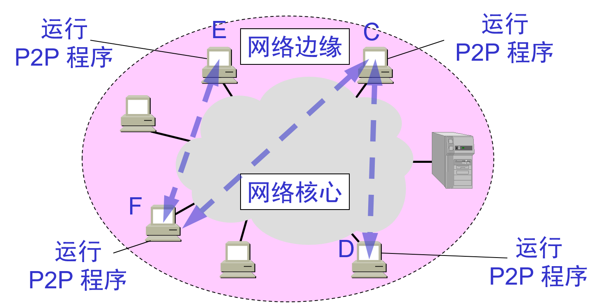

# 1.4.1 因特网的边缘部分\(资源子网\)

* 处在因特网边缘的部分就是连接在因特网上的所有的主机。这些主机又称为**端系统**\(end system\)。

* “主机 A 和主机 B 进行通信”，实际上是指：“运行在主机 A 上的某个程序和运行在主机 B 上的另一个程序进行通信”。即“主机 A 的某个进程和主机 B 上的另一个进程进行通信”。或简称为“计算机之间通信”

* 在网络边缘的端系统中运行的程序之间的三种主要**通信方式**：

  * **客户服务器方式**（C/S 方式），即Client/Server方式

  * **对等方式**（P2P 方式），即 Peer-to-Peer方式

  * **B/S模式** （Brower/Server），即浏览器/服务器模式

### 1. 客户服务器方式

* **客户**\(client\)和**服务器**\(server\)都是指通信中所涉及的两个应用进程。

* 客户服务器方式所描述的是进程之间服务和被服务的关系。

* 客户是**服务的请求方**，服务器是**服务的提供方**。

* 服务器通常采用高性能的PC、工作站或小型机，并采用大型数据库系统，如Oracle、Sybase、Informix或 SQL Server，客户端需要安装专用的客户端软件。  
  

  #### ①客户机程序：

  * 被用户调用后运行，在打算通信时主动向远地服务器发起通信请求（请求服务）。因此，客户程序**必须知道服务器程序的地址，无需特殊硬件和复杂OS**。

  * 不需要特殊的硬件和很复杂的操作系统。

  #### ②服务器程序：

  * 一种专门用来提供某种服务的程序，可同时处理多个远地或本地客户的请求。

  * 系统启动后即自动调用并一直不断地运行着，被动地等待并接受来自各地的客户的通信请求。因此，服务器程序不需要知道客户程序的地址。

  * 一般需要强大的硬件和高级的操作系统支持。

  #### ③服务器：

  * 服务器是计算机的一种，它是网络上一种为客户端计算机提供各种服务（主要是共享服务）的高性能的计算机；它在网络操作系统的控制下，将与其相连的硬盘、磁带、打印机、Modem及昂贵的专用通讯设备提供给网络上的客户站点共享，也能为网络用户提供集中计算、信息发表及数据管理等服务；

  * 一般也可将运行着服务器程序的机器称为服务器；

  * 目前，按照体系架构来区分，服务器主要分为两类：

    * **ISC架构服务器**（又称**精简指令集RISC架构服务器**）：使用RISC芯片并且主要采用UNIX操作系统的服务器。

    * **IA架构服务器**，（又称**复杂指令集CISC架构服务器**）：即通常所讲的PC服务器，它是基于PC机体系结构，使用Intel或与其兼容的处理器芯片的服务器，如联想的万全系列服务器，HP公司的Netserver系列服务器等。

  #### ④.客户机：

  * 又称用户工作站，是用户与网络打交道的设备；一般由微机担任，每一个客户机都运行在它自己的、并为服务器所认可的操作系统环境中。客户机主要享受网络上提供的各种资源。

  #### 总结：

  * C/S优点是能充分发挥客户端PＣ的处理能力，很多工作可以在客户端处理后再提交给服务器。对应的优点就是客户端响应速度快。
  * 缺点主要是：
    * ①只适用于局域网
    * ②客户端需要安装专用的客户端软件
    * ③对客户端的操作系统一般也会有限制。

### 2. 对等连接方式

* **对等连接**\(peer-to-peer，简写为 P2P\)是指两个主机在通信时并**不区分**哪一个是服务请求方还是服务提供方。

* 只要两个主机都运行了对等连接软件（P2P 软件），它们就可以进行**平等的、对等连接通信**。

* 双方都可以下载对方已经存储在硬盘中的共享文档。

* 对等连接方式的特点

  * 对等连接方式从本质上看仍然是使用客户服务器方式，只是对等连接中的每一个主机既是客户又同时是服务器。

  * 例如主机 C 请求 D 的服务时，C 是客户，D 是服务器。但如果 C 又同时向 F提供服务，那么 C 又同时起着服务器的作用。

  * 例如D从C下载500M的文件，硬已经下载250M了，则F想下载的时候可以从D下载。  
    

### 3.B/Ｓ模式

* 客户机上只要安装一个浏览器（Browser），如Netscape Navigator或Internet Explorer，服务器安装Oracle、Sybase、Informix或 SQL Server等数据库。浏览器通过Ｗeb Server 同数据库进行数据交互。

* 总结：

  B/S最大的优点就是可以在任何地方进行操作而不用安装任何专门的软件。只要有一台能上网的电脑就能使用，客户端零维护。系统的扩展非常容易，只要能上网，再由系统管理员分配一个用户名和密码，就可以使用了。甚至可以在线申请，通过公司内部的安全认证（如ＣＡ证书）后，不需要人的参与，系统可以自动分配给用户一个账号进入系统。

