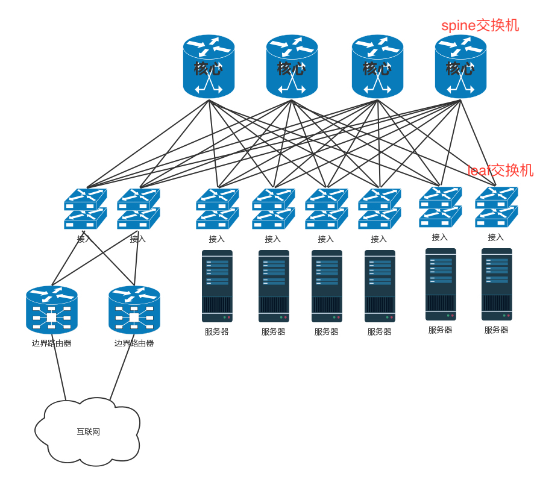

# 数据中心网络结构: 我是开发商，自己拿地盖别墅

在传统的大型数据中心，网络通常是三层结构。服务器连接到接入层，然后是汇聚层，再然后是核心层，最外面是边界路由器和安全设备: 2000年左右流行的数据中心网络结构； Legacy - three-tier switching fabric。Cisco称之为分级的互联网络模型hierarchical inter-networking model

* 三层结构:

  - **Access Layer**（接入层）：接入层位于网络的最底层，负责所有终端设备的接入工作，并确保各终端设备可以通过网络进行数据包的传递。有时称为edge layer，接入层交换机通常位于机架顶部，所以也被称为ToR(Top of Rack)交换机，它们物理连接服务器

  - **Aggregation Layer**（汇聚层）：汇聚层位于接入层和核心层之间。该层可以通过实现ACL等其他过滤器来提供区域的定义。有时也称为Distribution layer，汇聚层交换机连接access交换机，同时提供其他服务，例如防火墙，SSL offload，入侵检测，网络分析等。

  - **Core Layer**（核心层）：又被称为网络的骨干。该层的网络设备为所有的数据包包提供高速转发，通过L3路由网络将各个区域进行连接，保证各区域内部终端设备的路由可达。

* 优缺点

  * 端口密度低，成本低
  * VLANs隔离
  * 带宽和延迟不确定、受限于汇聚交换机和核心交换机，不理想
  * Smaller pods(～5k servers)
  * MLAG
  * North-south workloads
  * Deep and cheap

随着云和大数据的发展，东西流量相对于南北流量越来越重要，因而演化为叶脊网络结构。为了解决东西流量的问题，演进出了**叶脊网络**（**Spine/Leaf**）。特点就是全连接，没有瓶颈点 Leaf Spine Switching; 新的网络拓扑：1950‘s 已经存在；现在交换机厂商、数据中心厂商推荐的结构

* 叶脊网络: 

  - **叶子交换机**（**leaf**），直接连接物理服务器。L2/L3网络的分界点在叶子交换机上，叶子交换机之上是三层网络。
  - **脊交换机**（**spine switch**），相当于核心交换机。叶脊之间通过ECMP动态选择多条路径。脊交换机现在只是为叶子交换机提供一个弹性的L3路由网络。南北流量可以不用直接从脊交换机发出，而是通过与leaf交换机并行的交换机，再接到边界路由器出去。
  
* 优缺点

  * 优点：支持东西向数据流
  * 缺点：端口密度高，成本高
  
* Flattens the network

  - Industry best practice
  - Supports east-west and north-south workloads 提供无阻塞连接 支持横行扩展
  - Supports larger pods with current port-density and bandwidth
  - Simpler to build, provision, support
  - Vendor/product agnostic

* MLAG 一般不用MLAG

  * Layer 2

  * VLAN support

  * Limited to two spine nodes

* ECMP (IP Clos) 使用ECMP选择下一跳，哈希值

  * Layer 3

  * Overlays

  * Horizontal scaling: 4-way and up

    

* ECMP where you can, MLAG where you must

数据中心的所有链路都需要**高可用性**。服务器需要绑定网卡，交换机需要堆叠，三层设备可以通过等价路由，二层设备可以通过TRILL协议。

---

无论你是看新闻、下订单、看视频、下载文件，最终访问的目的地都在数据中心里面。我们前面学了这么多的网络协议和网络相关的知识，你是不是很好奇，数据中心究竟长啥样呢？

数据中心是一个大杂烩，几乎要用到前面学过的所有知识。

## 传统三层网络结构

机房分成一个个机架，每个机架有40几个server用TOR(Top of rack)交换机(也叫access交换机)连起来，access 交换机连到汇聚交换机上（一个rack放两台汇聚交换机），汇聚交换机连核心交换机（一个机房放2台核心交换机），一个交换机叫pod。

前面讲办公室网络的时候，我们知道办公室里面有很多台电脑。如果要访问外网，需要经过一个叫**网关**的东西，而网关往往是一个**路由器**。

数据中心里面也有一大堆的电脑，但是它和咱们办公室里面的笔记本或者台式机不一样。数据中心里面是服务器。服务器被放在一个个叫作**机架**（**Rack**）的架子上面。

数据中心的入口和出口也是路由器，由于在数据中心的边界，就像在一个国家的边境，称为**边界路由器**（**Border Router**）。为了高可用，边界路由器会有多个。

一般家里只会连接一个运营商的网络，而为了高可用， 为了当一个运营商出问题的时候，还可以通过另外一个运营商来提供服务，所以**数据中心的边界路由器会连接多个运营商网络**。

既然是路由器，就需要跑路由协议，数据中心往往就是路由协议中的**自治区域（AS）**。数据中心里面的机器要想访问外面的网站，数据中心里面也是有对外提供服务的机器，都可以通过BGP协议，获取内外互通的路由信息。这就是我们常听到的**多线BGP**的概念。

如果数据中心非常简单，没几台机器，那就像家里或者宿舍一样，所有的服务器都直接连到路由器上就可以了。但是数据中心里面往往有非常多的机器，当塞满一机架的时候，需要有交换机将这些服务器连接起来，可以互相通信。

这些交换机往往是放在机架顶端的，所以经常称为**TOR**（**Top Of** **Rack**）**交换机**。这一层的交换机常常称为**接入层**（**Access Layer**）。注意这个接入层和原来讲过的应用的接入层不是一个概念。

当一个机架放不下的时候，就需要多个机架，还需要有交换机将多个机架连接在一起。这些交换机对性能的要求更高，带宽也更大。这些交换机称为**汇聚层交换机**（**Aggregation Layer**）。

数据中心里面的每一个连接都是需要考虑**高可用**的。这里首先要考虑的是，如果一台机器只有一个网卡，上面连着一个网线，接入到TOR交换机上。如果网卡坏了，或者不小心网线掉了，机器就上不去了。所以，需要至少两个网卡、两个网线插到TOR交换机上，但是两个网卡要工作得像一张网卡一样，这就是常说的**网卡绑定**（**bond**）。

这就需要服务器和交换机都支持一种协议**LACP**（**Link Aggregation Control Protocol**）。它们互相通信，将多个网卡聚合称为一个网卡，多个网线聚合成一个网线，在**网线之间可以进行负载均衡**，也可以为了高可用作准备。

网卡有了高可用保证，但交换机还有问题。如果一个机架只有一个交换机，它挂了，那整个机架都不能上网了。因而TOR交换机也需要高可用，同理接入层和汇聚层的连接也需要高可用性，也不能单线连着。

最传统的方法是，部署两个接入交换机、两个汇聚交换机。服务器和两个接入交换机都连接，接入交换机和两个汇聚都连接，当然这样会形成环，所以需要启用**STP协议**，去除环，但是这样两个汇聚就只能一主一备了。STP协议里我们学过，只有一条路会起作用。

交换机有一种技术叫作**堆叠**，所以另一种方法是，将多个交换机形成一个逻辑的交换机，服务器通过多根线分配连到多个接入层交换机上，而接入层交换机多根线分别连接到多个交换机上，并且通过堆叠的私有协议，形成**双活**的连接方式。

由于对带宽要钱求更大，而且挂了影响也更大，所以两个堆叠可能就不够了，可以就会有更多的，比如四个堆叠为一个逻辑的交换机。

汇聚层将大量的计算节点相互连接在一起，形成一个集群。在这个集群里面，服务器之间通过二层互通，这个区域常称为一个**POD**（**Point Of Delivery**），有时候也称为一个**可用区**（**Available Zon**e）。

当节点数目再多的时候，一个可用区放不下，需要将多个可用区连在一起，连接多个可用区的交换机称为**核心交换机**。

核心交换机吞吐量更大，高可用要求更高，肯定需要堆叠，但是往往仅仅堆叠，不足以满足吞吐量，因而还是需要部署多组核心交换机。核心和汇聚交换机之间为了高可用，也是**全互连模式**的。

这个时候还存在那个问题，出现环路怎么办？

一种方式是，不同的可用区在不同的二层网络，需要分配不同的网段。汇聚和核心之间通过三层网络互通的，二层都不在一个广播域里面，不会存在二层环路的问题。三层有环是没有问题的，只要通过路由协议选择最佳的路径就可以了。那为啥二层不能有环路，而三层可以呢？你可以回忆一下二层环路的情况。

二层不能有环是容易引起广播风暴，三层是通过类似IP层的IP转发。可以通过路由功能隔离广播风暴，大二层模拟三层的功能，就是在局域网中模拟路由转发的功能，这样就可以避免广播风暴了。二层不能有环路，是因为会形成ARP广播

如图，核心层和汇聚层之间通过内部的路由协议OSPF，找到最佳的路径进行访问，而且还可以通过ECMP等价路由，在多个路径之间进行负载均衡和高可用。

但是随着数据中心里面的机器越来越多，尤其是有了云计算、大数据，集群规模非常大，而且都要求在一个二层网络里面。这就需要二层互连从**汇聚层**上升为**核心层**，也即在核心以下，全部是二层互连，全部在一个广播域里面，这就是常说的**大二层**。

如果大二层横向流量不大，核心交换机数目不多，可以做堆叠，但是如果横向流量很大，仅仅堆叠满足不了，就需要部署多组核心交换机，而且要和汇聚层进行全互连。由于堆叠只解决一个核心交换机组内的无环问题，而组之间全互连，还需要其他机制进行解决。

如果是STP，那部署多组核心无法扩大横向流量的能力，因为还是只有一组起作用。

于是大二层就引入了**TRILL**（**Transparent Interconnection of Lots of Link**），即**多链接透明互联协议**。它的基本思想是，二层环有问题，三层环没有问题，那就把三层的路由能力模拟在二层实现。

运行TRILL协议的交换机称为**RBridge**，是**具有路由转发特性的网桥设备**，只不过这个路由是根据MAC地址来的，不是根据IP来的。

Rbridage之间通过**链路状态协议**运作。记得这个路由协议吗？通过它可以学习整个大二层的拓扑，知道访问哪个MAC应该从哪个网桥走；还可以计算最短的路径，也可以通过等价的路由进行负载均衡和高可用性。

TRILL协议在原来的MAC头外面加上自己的头，以及外层的MAC头。TRILL头里面的Ingress RBridge，有点像IP头里面的源IP地址，Egress RBridge是目标IP地址，这两个地址是端到端的，在中间路由的时候，不会发生改变。而外层的MAC，可以有下一跳的Bridge，就像路由的下一跳，也是通过MAC地址来呈现的一样。

如图中所示的过程，有一个包要从主机A发送到主机B，中间要经过RBridge 1、RBridge 2、RBridge X等等，直到RBridge 3。在RBridge 2收到的包里面，分内外两层，内层就是传统的主机A和主机B的MAC地址以及内层的VLAN。

在外层首先加上一个TRILL头，里面描述这个包从RBridge 1进来的，要从RBridge 3出去，并且像三层的IP地址一样有跳数。然后再外面，目的MAC是RBridge 2，源MAC是RBridge 1，以及外层的VLAN。

当RBridge 2收到这个包之后，首先看MAC是否是自己的MAC，如果是，要看自己是不是Egress RBridge，也即是不是最后一跳；如果不是，查看跳数是不是大于0，然后通过类似路由查找的方式找到下一跳RBridge X，然后将包发出去。

RBridge 2发出去的包，内层的信息是不变的，外层的TRILL头里面。同样，描述这个包从RBridge 1进来的，要从RBridge 3出去，但是跳数要减1。外层的目标MAC变成RBridge X，源MAC变成RBridge 2。

如此一直转发，直到RBridge 3，将外层解出来，发送内层的包给主机B。

这个过程是不是和IP路由很像？

对于大二层的广播包，也需要通过分发树的技术来实现。我们知道STP是将一个有环的图，通过去掉边形成一棵树，而分发树是一个有环的图形成多棵树，不同的树有不同的VLAN，有的广播包从VLAN A广播，有的从VLAN B广播，实现负载均衡和高可用。

核心交换机之外，就是边界路由器了。至此从服务器到数据中心边界的层次情况已经清楚了。

在核心交换上面，往往会挂一些安全设备，例如入侵检测、DDoS防护等等。这是整个数据中心的屏障，防止来自外来的攻击。核心交换机上往往还有负载均衡器，原理前面的章节已经说过了。

在有的数据中心里面，对于存储设备，还会有一个存储网络，用来连接SAN和NAS。但是对于新的云计算来讲，往往不使用传统的SAN和NAS，而使用部署在x86机器上的软件定义存储，这样存储也是服务器了，而且可以和计算节点融合在一个机架上，从而更加有效率，也就没有了单独的存储网络了。

于是整个数据中心的网络如下图所示。

这是一个典型的三层网络结构。这里的三层不是指IP层，而是指接入层、汇聚层、核心层三层。这种模式非常有利于外部流量请求到内部应用。这个类型的流量，是从外到内或者从内到外，对应到上面那张图里，就是从上到下，从下到上，上北下南，所以称为**南北流量**。

## 叶脊网络

但是随着云计算和大数据的发展，节点之间的交互越来越多，例如大数据计算经常要在不同的节点将数据拷贝来拷贝去，这样需要经过交换机，使得数据从左到右，从右到左，左西右东，所以称为**东西流量**。

为了解决东西流量的问题，演进出了**叶脊网络**（**Spine/Leaf**）。

- **叶子交换机**（**leaf**），直接连接物理服务器。L2/L3网络的分界点在叶子交换机上，叶子交换机之上是三层网络。
- **脊交换机**（**spine switch**），相当于核心交换机。叶脊之间通过ECMP动态选择多条路径。脊交换机现在只是为叶子交换机提供一个弹性的L3路由网络。南北流量可以不用直接从脊交换机发出，而是通过与leaf交换机并行的交换机，再接到边界路由器出去。

传统的三层网络架构是垂直的结构，而叶脊网络架构是扁平的结构，更易于水平扩展。

## 小结

1. 前面说的浏览新闻、购物、下载、看视频等行为，都是普通用户通过公网访问数据中心里面的资源。那IT管理员应该通过什么样的方式访问数据中心呢？

运维人员通过vpn连入机房网络，再通过堡垒机以内网地址访问服务器或网络设备

当服务器系统不能启动时，远程访问需要用IPKVM（KVM over IP）（不是那个虚拟化KVM，可以查Wikipedia的KVM switch词条）；还有一种方式是利用主板自带的远程管理功能。
有个面向普通用户的产品叫向日葵控控，是花生壳公司开发的，类似IPKVM，可以远程配置BIOS。

---

## 跨机房的高可用

对于数据中心来讲，高可用是非常重要的，每个设备都要考虑高可用，那跨机房的高可用，你知道应该怎么做吗？两地三中心等，同城双活

其实跨机房的高可用分两个级别，分别是**同城双活**和**异地灾备**(比如说数据库的dataguard和goldengate)。

**同城双活**，就是在同一个城市，距离大概30km到100km的两个数据中心之间，通过高速专线互联的方式，让两个数据中心形成一个大二层网络。

同城双活最重要的是，数据如何从一个数据中心同步到另一个数据中心，并且在一个数据中心故障的时候，实现存储设备的切换，保证状态能够快速切换到另一个数据中心。在高速光纤互联情况下，主流的存储厂商都可以做到在一定距离之内的两台存储设备的近实时同步。数据双活是一切双活的基础。

基于双数据中心的数据同步，可以形成一个统一的存储池，从而数据库层在共享存储池的情况下可以近实时的切换，例如Oracle RAC。

虚拟机在统一的存储池的情况下，也可以实现跨机房的HA，在一个机房切换到另一个机房。

SLB负载均衡实现同一机房的各个虚拟机之间的负载均衡。GSLB可以实现跨机房的负载均衡，实现外部访问的切换。

如果在两个数据中心距离很近，并且大二层可通的情况下，也可以使用VRRP协议，通过VIP方式进行外部访问的切换。

下面我们说**异地灾备**。

异地灾备的第一大问题还是数据的问题，也即生产数据中心的数据如何备份到容灾数据中心。由于异地距离比较远，不可能像双活一样采取近同步的方式，只能通过异步的方式进行同步。可以预见的问题是，容灾切换的时候，数据会丢失一部分。

由于容灾数据中心平时是不用的，不是所有的业务都会进行容灾，否则成本太高。

对于数据的问题，我比较建议从业务层面进行容灾。由于数据同步会比较慢，可以根据业务需求高优先级同步重要的数据，因而容灾的层次越高越好。

例如，有的用户完全不想操心，直接使用存储层面的异步复制。对于存储设备来讲，它是无法区分放在存储上的虚拟机，哪台是重要的，哪台是不重要的，只会完全根据块进行复制，很可能就会先复制了不重要的虚拟机。

如果用户想对虚拟机做区分，则可以使用虚拟机层面的异步复制。用户知道哪些虚拟机更重要一些，哪些虚拟机不重要，则可以先同步重要的虚拟机。

对业务来讲，如果用户可以根据业务层情况，在更细的粒度上区分数据是否重要。重要的数据，例如交易数据，需要优先同步；不重要的数据，例如日志数据，就不需要优先同步。

在有异地容灾的情况下，可以平时进行容灾演练，看容灾数据中心是否能够真正起作用，别容灾了半天，最后用的时候掉链子。