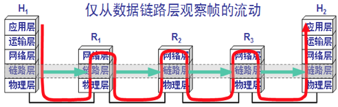

# 2 Data Link Layer

数据链路层需要解决几个问题：由于物理层用的集线器hub是广播模式，发给所有机器；MAC层是用来解决多路访问的堵车问题的；

1. 这个包是发给谁的？谁应该接收？这里用到一个物理地址， 链路层地址，但是因为第二层主要解决媒体接入控制的问题，所以它常被称为**MAC地址 **。解决第一个问题就牵扯到第二层的网络包**格式**。
2. 大家都在发，会不会产生混乱？有没有谁先发、谁后发的规则？**随机接入协议** ； 解决多路访问的堵车问题：通过网桥
3. 如果发送的时候出现了错误，怎么办？**CRC**，循环冗余检测
4. 当源机器知道目标机器的时候，可以将目标地址放入包里面，如果不知道呢(机器数量太多)？**ARP协议**（内核里），也就是已知IP地址，求MAC地址的协议。

Medium Access Control**，即**媒体访问控制。控制什么呢？其实就是控制在往媒体上发数据的时候，谁先发、谁后发的问题。防止发生混乱。这解决的是第二个问题。这个问题中的规则，学名叫**多路访问**。有很多算法可以解决这个问题。就像车管所管束马路上跑的车，能想的办法都想过了。

比如接下来这三种方式：

- 方式一：分多个车道。每个车一个车道，你走你的，我走我的。这在计算机网络里叫作**信道划分；**
- 方式二：今天单号出行，明天双号出行，轮着来。这在计算机网络里叫作**轮流协议；**
- 方式三：不管三七二十一，有事儿先出门，发现特堵，就回去。错过高峰再出。我们叫作**随机接入协议。**著名的以太网，用的就是这个方式。

解决了第二个问题，就是解决了媒体接入控制的问题，MAC的问题也就解决好了。这和MAC地址没什么关系。

有了这个目标MAC地址，数据包在链路上广播，MAC的网卡才能发现，这个包是给它的。MAC的网卡把包收进来，然后打开IP包，发现IP地址也是自己的，再打开TCP包，发现端口是自己，也就是80，而nginx就是监听80。

于是将请求提交给nginx，nginx返回一个网页。然后将网页需要发回请求的机器。然后层层封装，最后到MAC层。因为来的时候有源MAC地址，返回的时候，源MAC就变成了目标MAC，再返给请求的机器。

---

1. 数据链路层是OSI参考模型的第二层，上层是网络层。

2. 数据链路层把网络层交下来的数据构成帧发送到链路上，以及把接收到的帧中的数据取出并交给网络层。

3. 数据链路层主要目的：将原始的、有差错(传输差错)的物理线路变成无差错的数据链路

3. 数据链路层又叫MAC层

4. 数据链路层的简单模型：

   

   

6. 基本概念：链路和数据链路

   1. 链路：是一条无源的点到点的物理路段，中间没有任何其他的交换结点。

      注意：一条链路只是一条通路的一个组成部分

   2. 数据链路：除了物理线路外，还必须有通信协议来控制这些数据的传输。若把实现这些协议的硬件和软件加到链路上，就构成了数据链路。

      即：数据链路 = 链路 + 控制数据传输的通信协议

      1. 现在最常用的方法是使用适配器\(即网卡\)来实现这些协议的硬件和软件

      2. 一般的适配都包括了数据链路层和物理层这两层的功能。

7. 数据链路层协议传输的数据单位：数据帧\(简称“**帧**”\) **framing**

   注意：物理层传输的数据单元是**比特**，网络层传输的数据单元是**IP数据包**\(简称：数据报、分组、包\)**Packet**

8. 实现数据链路层协议的最常用设备：网络适配器（即：网卡或网络接口卡）

## 链路层使用的信道

数据链路层使用的信道主要有以下两种类型：

1. **点对点信道**：使用一对一的**点对点通信方式**
2. **广播信道**：使用一对多的**广播通信方式**，过程较复杂。广播信道上链接的主机很多，必须使用专用的共享信道协议来协调这些主机的数据发送。**局域网**使用此方式

## 数据链路层主要功能

数据链路层主要功能：

1. 链路管理：数据链路的建立、维护、释放
2. 封装成帧
3. 帧同步：接收方应从收到的比特流中正确地判断出一帧的开始与结束位
4. 流量控制：控制发送方的数据发送速度，使得接收方来得及接收，以致网络不发生拥塞
5. 差错控制：发现传输中出现的错误
6. 透明传输：采取适当措施，使接收方不至于将数据误认为是控制信息
7. 寻址：收发双方应知道对方是谁

### 封装成帧

1. 封装成帧：在一段数据的前后分别添加首部和尾部，构成一个**帧**framing  

   1. 帧的首部和尾部一个重要作用是进行帧定界；确定帧的界限。
   2. 帧首和帧尾还包括许多必要的控制信息；
   3. 为提高帧传输效率，应使帧的数据部分尽可能大于首部+尾部的长度；
   4. 每一种链路层协议都规定了**数据部分长度上限** --&gt; **MTU**(Maximum Transfer Unit)最大传输单元；帧长 = 帧首部长 + 数据部分长 + 帧尾部长
   5. **帧定界符**：当数据部分是可打印的ASCI码组成的文本文件时，帧定界可以用特殊的帧定界符：帧开始符SOH(Satrt of Header), 帧结束符EOT(End of Transimission), SOH和EOT是控制字符的名称，并非三个英文字符，他们的十六进制编码分别是01(二进制是00000001)和04(二进制是00000100)

   | SOH  | 装在帧中数据部分 | EOT  |
   | :--- | :--------------: | :--- |

### 透明传输 

当数据部分是非ASCⅡ文件时，若数据某字节恰好是SOH或EOT这种控制字符时，数据链路层就会错误地处理帧，这就是“不透明传输”，显然：如果数据部分某字节是SOH或EOT字符时也能正确传输，我们称之为**透明传输**；实现透明传输的方法插入转义字符**ESC**（**00011011**）：

* 若数据部分出现EOT或SOH时，就在这个EOT和SOH前插入ESC；接收方在送交网络层之前将这个ESC删除。

* 如果ESC也出现在数据中，就在ESC前面插入ESC

上述方法称之为“**字节填充**”或“**字符填充**”

### 差错检测

差错产生的原因和差错类型

1. 当数据从信源出发经过通信信道时，由于通信信道存在着噪声，因此数据信号通过通信信道到达信宿时，接收到的信号必然是数据信号与信号电平的叠加；

2. 接收方对叠加后的信号进行判断，以确定0、1值。如果判断错误，则会产生数据传输错误；

3. 噪声分两类：热噪声、冲击噪声；

   **①**热噪声是由传输介质导体的分子热运动产生的。时刻存在，由它引起的噪声是随机的，引起的差错是随机差错；

   **②**冲击噪声引起突发错；

4. **误码率：**二进制比特在数据传输系统中被传错的概率；

#### **CRC循环冗余**检验

工作原理

1. 将要发送的数据比特序列当作一个多项式f\(x\)的系数，在发送端用收发双方预先约定的生成多项式G\(x\)去除，求出一个余数多项式。将余数多项式加到数据多项式后发送到接收端；

2. 接收端用同样的G\(x\)去除收到的$$f^{1}(x)$$，得到余数多项式。如果得到的余数多项式与接收到的余数多项式相同，表示传输无错。否则有错，发送方重传；

3. **注意：** G\(x\)由协议来规定，其结构及检错效果是经过严格数学分析与实验后确定；

具体做法

1. 发送方将要发送的数据分组，假定每组K个比特，其多项式为M\(x\),生成多项式为r阶多项式G\(x\)，则在原始数据后加N个0形成$$x^{r}*M(x)$$_，用_$$x^{r}*M(x)$$按照模2除法除G\(x\)得到余项，把余项放在原始数据尾部作为真正的发送数据；CRC运算就是在数据**M**后添加**N**位冗余码，供差错检测用N，然后将数据与冗余码一起发送出去，共（K+N）位。

2. 冗余码求法如下：将数据**M**乘以$$2^N$$，相当于在**M**后加**N**个0.用事先商量好的长度为\(N+1\)位的**除数P**除，得到余数**R**，然后把**R**放在数据**M**后面，具体如下：

   【**例题3.2**】**发送数据M**=1101011011（K=10），双方约定生成多项式为**10011**，即：G\(x\)=$$x^4$$+x+1，**N=4**；

   

   故实际发送为**110011011**1110**\(在数据后面添加的冗余码**1110**称为**帧检验序列**FCS**\)；

   接收方将受到的每一帧用同样的**除数**P除，检查余数，若余数为0则无错，否则有错，余数不为0的概率极小，一般而言传输出错而余数为0的概率极小。

特别注意以下问题

1. 循环冗余检验CRC和帧检验序列 FCS并不等同：

   CRC 是一种常用的检错方法，而 FCS 是添加在数据后面的冗余码；

   FCS 可以用 CRC 这种方法得出，但也可以用其它方法得出；

2. **仅用CRC差错检测技术只能做到**无差错接受**\[即：凡是接收端数据链路层接受的帧都没有传输差错（有差错的帧就丢弃而不接受）；要做到“可靠传输”（即发送什么就能收到什么，解决了帧丢失、帧重复、帧失序等传输差错）就必须再加上**确认和重传机制\*\*。

3. 因特网的**数据链路层不使用确认和重传机制**（因为代价高），由运输层TCP协议实现可靠传输。

# 第5讲讲从物理层到MAC层：如何在宿舍里自己组网玩联机游戏？

上一节，我们见证了IP地址的诞生，或者说是整个操作系统的诞生。一旦机器有了IP，就可以在网络的环境里和其他的机器展开沟通了。

## 第一层（物理层）

使用路由器，是在第三层上。我们先从第一层物理层开始说。

物理层能折腾啥？现在的同学可能想不到，我们当时去学校配电脑的地方买网线，卖网线的师傅都会问，你的网线是要电脑连电脑啊，还是电脑连网口啊？

我们要的是电脑连电脑。这种方式就是一根网线，有两个头。一头插在一台电脑的网卡上，另一头插在另一台电脑的网卡上。但是在当时，普通的网线这样是通不了的，所以水晶头要做交叉线，用的就是所谓的**1－3**、**2－6交叉接法**。

水晶头的第1、2和第3、6脚，它们分别起着收、发信号的作用。将一端的1号和3号线、2号和6号线互换一下位置，就能够在物理层实现一端发送的信号，另一端能收到。

当然电脑连电脑，除了网线要交叉，还需要配置这两台电脑的IP地址、子网掩码和默认网关。这三个概念上一节详细描述过了。要想两台电脑能够通信，这三项必须配置成为一个网络，可以一个是192.168.0.1/24，另一个是192.168.0.2/24，否则是不通的。

这里我想问你一个问题，两台电脑之间的网络包，包含MAC层吗？当然包含，要完整。IP层要封装了MAC层才能将包放入物理层。

到此为止，两台电脑已经构成了一个最小的**局域网**，也即**LAN。**可以玩联机局域网游戏啦！

等到第三个哥们也买了一台电脑，怎么把三台电脑连在一起呢？

先别说交换机，当时交换机也贵。有一个叫作**Hub**的东西，也就是**集线器**。这种设备有多个口，可以将宿舍里的多台电脑连接起来。但是，和交换机不同，集线器没有大脑，它完全在物理层工作。它会将自己收到的每一个字节，都复制到其他端口上去。这是第一层物理层联通的方案。

## 第二层（数据链路层）

你可能已经发现问题了。Hub采取的是广播的模式，如果每一台电脑发出的包，宿舍的每个电脑都能收到，那就麻烦了。这就需要解决几个问题：

1. 这个包是发给谁的？谁应该接收？
2. 大家都在发，会不会产生混乱？有没有谁先发、谁后发的规则？
3. 如果发送的时候出现了错误，怎么办？

这几个问题，都是第二层，数据链路层，也即MAC层要解决的问题。**MAC**的全称是**Medium Access Control**，即**媒体访问控制。**控制什么呢？其实就是控制在往媒体上发数据的时候，谁先发、谁后发的问题。防止发生混乱。这解决的是第二个问题。这个问题中的规则，学名叫**多路访问**。有很多算法可以解决这个问题。就像车管所管束马路上跑的车，能想的办法都想过了。

比如接下来这三种方式：

- 方式一：分多个车道。每个车一个车道，你走你的，我走我的。这在计算机网络里叫作**信道划分；**
- 方式二：今天单号出行，明天双号出行，轮着来。这在计算机网络里叫作**轮流协议；**
- 方式三：不管三七二十一，有事儿先出门，发现特堵，就回去。错过高峰再出。我们叫作**随机接入协议。**著名的以太网，用的就是这个方式。

解决了第二个问题，就是解决了媒体接入控制的问题，MAC的问题也就解决好了。这和MAC地址没什么关系。

接下来要解决第一个问题：发给谁，谁接收？这里用到一个物理地址，叫作**链路层地址。**但是因为第二层主要解决媒体接入控制的问题，所以它常被称为**MAC地址**。

解决第一个问题就牵扯到第二层的网络包**格式**。对于以太网，第二层的最开始，就是目标的MAC地址和源的MAC地址。

接下来是**类型**，大部分的类型是IP数据包，然后IP里面包含TCP、UDP，以及HTTP等，这都是里层封装的事情。

有了这个目标MAC地址，数据包在链路上广播，MAC的网卡才能发现，这个包是给它的。MAC的网卡把包收进来，然后打开IP包，发现IP地址也是自己的，再打开TCP包，发现端口是自己，也就是80，而nginx就是监听80。

于是将请求提交给nginx，nginx返回一个网页。然后将网页需要发回请求的机器。然后层层封装，最后到MAC层。因为来的时候有源MAC地址，返回的时候，源MAC就变成了目标MAC，再返给请求的机器。

对于以太网，第二层的最后面是**CRC**，也就是**循环冗余检测**。通过XOR异或的算法，来计算整个包是否在发送的过程中出现了错误，主要解决第三个问题。

这里还有一个没有解决的问题，当源机器知道目标机器的时候，可以将目标地址放入包里面，如果不知道呢？一个广播的网络里面接入了N台机器，我怎么知道每个MAC地址是谁呢？这就是**ARP协议**，也就是已知IP地址，求MAC地址的协议。

在一个局域网里面，当知道了IP地址，不知道MAC怎么办呢？靠“吼”。

广而告之，发送一个广播包，谁是这个IP谁来回答。具体询问和回答的报文就像下面这样：

为了避免每次都用ARP请求，机器本地也会进行ARP缓存。当然机器会不断地上线下线，IP也可能会变，所以ARP的MAC地址缓存过一段时间就会过期。

## 局域网

好了，至此我们宿舍四个电脑就组成了一个局域网。用Hub连接起来，就可以玩局域网版的《魔兽争霸》了。

打开游戏，进入“局域网选项”，选择一张地图，点击“创建游戏”，就可以进入这张地图的房间中。等同一个局域网里的其他小伙伴加入后，游戏就可以开始了。

这种组网的方法，对一个宿舍来说没有问题，但是一旦机器数目增多，问题就出现了。因为Hub是广播的，不管某个接口是否需要，所有的Bit都会被发送出去，然后让主机来判断是不是需要。这种方式路上的车少就没问题，车一多，产生冲突的概率就提高了。而且把不需要的包转发过去，纯属浪费。看来Hub这种不管三七二十一都转发的设备是不行了，需要点儿智能的。因为每个口都只连接一台电脑，这台电脑又不怎么换IP和MAC地址，只要记住这台电脑的MAC地址，如果目标MAC地址不是这台电脑的，这个口就不用转发了。

谁能知道目标MAC地址是否就是连接某个口的电脑的MAC地址呢？这就需要一个能把MAC头拿下来，检查一下目标MAC地址，然后根据策略转发的设备，按第二节课中讲过的，这个设备显然是个二层设备，我们称为**交换机**。

交换机怎么知道每个口的电脑的MAC地址呢？这需要交换机会学习。

一台MAC1电脑将一个包发送给另一台MAC2电脑，当这个包到达交换机的时候，一开始交换机也不知道MAC2的电脑在哪个口，所以没办法，它只能将包转发给除了来的那个口之外的其他所有的口。但是，这个时候，交换机会干一件非常聪明的事情，就是交换机会记住，MAC1是来自一个明确的口。以后有包的目的地址是MAC1的，直接发送到这个口就可以了。

当交换机作为一个关卡一样，过了一段时间之后，就有了整个网络的一个结构了，这个时候，基本上不用广播了，全部可以准确转发。当然，每个机器的IP地址会变，所在的口也会变，因而交换机上的学习的结果，我们称为**转发表**，是有一个过期时间的。

有了交换机，一般来说，你接个几十台、上百台机器打游戏，应该没啥问题。你可以组个战队了。能上网了，就可以玩网游了。

这里，给你推荐一个课程，极客时间新上线了**《从0开始学游戏开发》**，由原网易游戏引擎架构师、资深底层技术专家蔡能老师，手把手带你梳理游戏开发的流程和细节，为你剖析热门游戏的成功之道。帮助普通程序员成为游戏开发工程师，步入游戏开发之路。**你可以点击文末的图片进入课程。**

## 小结

好了，今天的内容差不多了，我们来总结一下，有三个重点需要你记住：

第一，MAC层是用来解决多路访问的堵车问题的；

第二，ARP是通过吼的方式来寻找目标MAC地址的，吼完之后记住一段时间，这个叫作缓存；

第三，交换机是有MAC地址学习能力的，学完了它就知道谁在哪儿了，不用广播了。

最后，给你留两个思考题吧。

1. 在二层中我们讲了ARP协议，即已知IP地址求MAC；还有一种RARP协议，即已知MAC求IP的，你知道它可以用来干什么吗？
2. 如果一个局域网里面有多个交换机，ARP广播的模式会出现什么问题呢？

## 精选留言

- 

  盖

  ARP广播时，交换机会将一个端口收到的包转发到其它所有的端口上。
  比如数据包经过交换机A到达交换机B，交换机B又将包复制为多份广播出去。
  如果整个局域网存在一个环路，使得数据包又重新回到了最开始的交换机A，这个包又会被A再次复制多份广播出去。
  如此循环，数据包会不停得转发，而且越来越多，最终占满带宽，或者使解析协议的硬件过载，行成广播风暴。

  2018-05-29 17:46

  作者回复

  赞

  2018-05-29 18:58

- 

  没心没肺

  Hub：
  1.一个广播域，一个冲突域。
  2.传输数据的过程中易产生冲突，带宽利用率不高
  Switch：
  1.在划分vlan的前提下可以实现多个广播域，每个接口都是一个单独的冲突域
  2.通过自我学习的方法可以构建出CAM表，并基于CAM进行转发数据。
  3.支持生成树算法。可以构建出物理有环，逻辑无环的网络，网络冗余和数据传输效率都甩Hub好几条街。SW是目前组网的基本设备之一。

  2018-05-28 09:56

  作者回复

  赞

  2018-05-28 13:48

- 

  阡陌

  不得不说，看留言也能学到很多东西

  2018-05-30 08:32

  作者回复

  高手还是很多的

  2018-05-30 10:28

- 

  盖

  之前有无盘工作站，即没有硬盘的机器，无法持久化ip地址到本地，但有网卡，所以可以用RARP协议来获取IP地址。RARP可以用于局域网管理员想指定机器IP（与机器绑定，不可变），又不想每台机器去设置静态IP的情况，可以在RARP服务器上配置MAC和IP对应的ARP表，不过获取每台机器的MAC地址，好像也挺麻烦的。这个协议现在应该用得不多了吧，都用BOOTP或者DHCP了。

  2018-05-29 11:11

  作者回复

  对的，赞

  2018-05-29 11:36

- 

  田豪杰

  一直坚持看到第五讲，我理解能力太差了，感觉还是一头雾水唉……

  2018-05-29 20:18

- 

  Z3

  当年玩魔兽经常出现他建房我看不见，我建房他能看见之类的问题。 这些可能是应用层的问题吗？

  

  2018-05-30 15:12

  作者回复

  这个，场景不在了，很难分析

  2018-05-30 17:57

- 

  戴劼 DAI JIE🤪

  当年上课学习记住了交叉线和直连线的区别，工作后有一次两台机器对拷，发现网卡能自适应直连线，懵逼了。

  2018-06-07 01:37

  作者回复

  是的，现在自适应了

  2018-06-07 13:21

- 

  Amorfati

  \1. rarp 除了通过mac地址去向dhcp之类服务要一个IP，其他没有想到有什么用，按照我的理解，如果非直联同一交换机，一个设备去找另一个设备，知道其mac地址而不知其ip，说不通

  \2. 多个交换机，若pc1所连交换机为A，pc2,pc3所连交换机为B，AB直连，pc1找pc2的时候A会把直连B的端口缓存为pc2的mac地址，在过期时间内，pc1都没有办法找到pc3

  这个就是我的理解，如有误还请老师指正

  

  2018-05-28 11:03

- 

  kivensu

  是不是可以理解成交换机是具备学习功能的hub

  2018-08-25 16:43

- 

  楊_宵夜

  连续看了好几篇！真的是大道至简！逻辑无比清晰！细节的深度刚刚好！赞！以太网也是个很有趣的东西，记得在知乎上看到过，最离奇的Bug都有哪些。其中一个关于以太网的是说，某个大学因为建筑施工，挖掘机的声波频率影响了光纤电缆中的信号传输，导致信号最多只能传输520多公里哈哈哈，也就是说520公里以外的服务器都访问不到了。
  这里细节肯定记错了，抛个砖，有兴趣的各位可以在知乎搜搜😂😂

  2018-06-08 13:13

  作者回复

  谢谢啦

  2018-06-08 16:29

- 

  采菇凉的小🍄

  能说一下XOR异或具体操作什么吗？以及如何通过操作进行检验的

  2018-10-26 18:48

- 

  hujunr

  当时用的交换机，把一条网线的2端同时接到交换机了，结果所有电脑都连不上网了，这是为什么？

  2018-07-30 14:46

  作者回复

  arp广播塞满了

  2018-07-31 20:23

- 

  匿名用户

  为了避免每次都用 ARP 请求，机器本地也会进行 ARP 缓存。当然机器会不断地上线下线，IP 也可能会变，所以 ARP 的 MAC 地址缓存过一段时间就会过期。这就是路由表存在的意义？这里应该提一下啊…

  2018-06-03 07:18

- 

  徐良红

  rarp现网似乎很少见，理论上应该是根据mac去查询对应的ip。
  一个局域网如果没有划分vlan，广播报文会传播到整个网内所有主机。

  请老师指正

  2018-05-28 23:47

- 

  MrGuo

  老师 mac缓存这些有个有效时间 如果有效时间还没到 但是局域网有其他设备改变了ip mac，这时缓存的mac不就不对了吗

  2018-11-23 09:24

  作者回复

  是的，这个时候会发送不成功，会刷新

  2018-11-23 12:27

- 

  wrzgeek

  网络小白，终于知道交换机和集线器的区别了，每天进步一点点，很开心

  2018-09-16 14:00

- 

  远心

  用网线直接连接两台计算机的方式，如何知道另一台计算机的 MAC 地址？使用 ARP 协议吗？也就是说其实每一台计算机都安装着 ARP Client/Server 吗？

  2018-09-15 18:46

  作者回复

  是arp，内核里面就有这部分逻辑

  2018-09-15 21:40

- 

  天天向⬆️

  老师，一直没明白你说的mac层是什么？是物理层吗？还是数据链路层？

  2018-07-12 15:27

  作者回复

  链路层，后面也解释了尴尬的叫法，但是约定俗成

  2018-07-12 20:11

- 

  magict4

  两台电脑直连的情况下，谁是网关呢？电脑可以充当网关吗？

  2018-06-18 07:41

  作者回复

  不用配置网关就能通

  2018-06-18 14:57

- 

  hunterlodge

  交换机学习后如果把两个网口的线互换会出现什么情况呢？交换机能识别出错误更新配置吗？

  2018-06-15 18:23

  作者回复

  会有超时时间，也会重新学习

  2018-06-15 19:37

## [《第5讲 | 从物理层到MAC层：如何在宿舍里自己组网玩联机游戏？》](https://time.geekbang.org/column/article/8094)

### 课后思考题

1.在二层中我们讲了 ARP 协议，即已知 IP 地址求 MAC；还有一种 RARP 协议，即已知 MAC 求 IP 的，你知道它可以用来干什么吗？

2.如果一个局域网里面有多个交换机，ARP 广播的模式会出现什么问题呢？

盖还说出了环路的问题。

没心没肺不但说明了问题，而且说明了方案。

所有最新极客时间课程请加QQ群170701297

# 第6讲讲交换机与VLAN：办公室太复杂，我要回学校

上一次，我们在宿舍里组建了一个本地的局域网LAN，可以愉快地玩游戏了。这是一个非常简单的场景，因为只有一台交换机，电脑数目很少。今天，让我们切换到一个稍微复杂一点的场景，办公室。

## 拓扑结构是怎么形成的？

我们常见到的办公室大多是一排排的桌子，每个桌子都有网口，一排十几个座位就有十几个网口，一个楼层就会有几十个甚至上百个网口。如果算上所有楼层，这个场景自然比你宿舍里的复杂多了。具体哪里复杂呢？我来给你具体讲解。

首先，这个时候，一个交换机肯定不够用，需要多台交换机，交换机之间连接起来，就形成一个稍微复杂的**拓扑结构**。

我们先来看**两台交换机**的情形。两台交换机连接着三个局域网，每个局域网上都有多台机器。如果机器1只知道机器4的IP地址，当它想要访问机器4，把包发出去的时候，它必须要知道机器4的MAC地址。

于是机器1发起广播，机器2收到这个广播，但是这不是找它的，所以没它什么事。交换机A一开始是不知道任何拓扑信息的，在它收到这个广播后，采取的策略是，除了广播包来的方向外，它还要转发给其他所有的网口。于是机器3也收到广播信息了，但是这和它也没什么关系。

当然，交换机B也是能够收到广播信息的，但是这时候它也是不知道任何拓扑信息的，因而也是进行广播的策略，将包转发到局域网三。这个时候，机器4和机器5都收到了广播信息。机器4主动响应说，这是找我的，这是我的MAC地址。于是一个ARP请求就成功完成了。

在上面的过程中，交换机A和交换机B都是能够学习到这样的信息：机器1是在左边这个网口的。当了解到这些拓扑信息之后，情况就好转起来。当机器2要访问机器1的时候，机器2并不知道机器1的MAC地址，所以机器2会发起一个ARP请求。这个广播消息会到达机器1，也同时会到达交换机A。这个时候交换机A已经知道机器1是不可能在右边的网口的，所以这个广播信息就不会广播到局域网二和局域网三。

当机器3要访问机器1的时候，也需要发起一个广播的ARP请求。这个时候交换机A和交换机B都能够收到这个广播请求。交换机A当然知道主机A是在左边这个网口的，所以会把广播消息转发到局域网一。同时，交换机B收到这个广播消息之后，由于它知道机器1是不在右边这个网口的，所以不会将消息广播到局域网三。

## 如何解决常见的环路问题？

这样看起来，两台交换机工作得非常好。随着办公室越来越大，交换机数目肯定越来越多。当整个拓扑结构复杂了，这么多网线，绕过来绕过去，不可避免地会出现一些意料不到的情况。其中常见的问题就是**环路问题**。

例如这个图，当两个交换机将两个局域网同时连接起来的时候。你可能会觉得，这样反而有了高可用性。但是却不幸地出现了环路。出现了环路会有什么结果呢？

我们来想象一下机器1访问机器2的过程。一开始，机器1并不知道机器2的MAC地址，所以它需要发起一个ARP的广播。广播到达机器2，机器2会把MAC地址返回来，看起来没有这两个交换机什么事情。

但是问题来了，这两个交换机还是都能够收到广播包的。交换机A一开始是不知道机器2在哪个局域网的，所以它会把广播消息放到局域网二，在局域网二广播的时候，交换机B右边这个网口也是能够收到广播消息的。交换机B会将这个广播息信息发送到局域网一。局域网一的这个广播消息，又会到达交换机A左边的这个接口。交换机A这个时候还是不知道机器2在哪个局域网，于是将广播包又转发到局域网二。左转左转左转，好像是个圈哦。

可能有人会说，当两台交换机都能够逐渐学习到拓扑结构之后，是不是就可以了？

别想了，压根儿学不会的。机器1的广播包到达交换机A和交换机B的时候，本来两个交换机都学会了机器1是在局域网一的，但是当交换机A将包广播到局域网二之后，交换机B右边的网口收到了来自交换机A的广播包。根据学习机制，这彻底损坏了交换机B的三观，刚才机器1还在左边的网口呢，怎么又出现在右边的网口呢？哦，那肯定是机器1换位置了，于是就误会了，交换机B就学会了，机器1是从右边这个网口来的，把刚才学习的那一条清理掉。同理，交换机A右边的网口，也能收到交换机B转发过来的广播包，同样也误会了，于是也学会了，机器1从右边的网口来，不是从左边的网口来。

然而当广播包从左边的局域网一广播的时候，两个交换机再次刷新三观，原来机器1是在左边的，过一会儿，又发现不对，是在右边的，过一会，又发现不对，是在左边的。

这还是一个包转来转去，每台机器都会发广播包，交换机转发也会复制广播包，当广播包越来越多的时候，按照上一节讲过一个共享道路的算法，也就是路会越来越堵，最后谁也别想走。所以，必须有一个方法解决环路的问题，怎么破除环路呢？

## STP协议中那些难以理解的概念

在数据结构中，有一个方法叫作**最小生成树**。有环的我们常称为**图**。将图中的环破了，就生成了**树**。在计算机网络中，生成树的算法叫作**STP**，全称**Spanning Tree Protocol**。

STP协议比较复杂，一开始很难看懂，但是其实这是一场血雨腥风的武林比武或者华山论剑，最终决出五岳盟主的方式。

在STP协议里面有很多概念，译名就非常拗口，但是我一作比喻，你很容易就明白了。

- **Root Bridge**，也就是**根交换机**。这个比较容易理解，可以比喻为“掌门”交换机，是某棵树的老大，是掌门，最大的大哥。
- **Designated Bridges**，有的翻译为**指定交换机**。这个比较难理解，可以想像成一个“小弟”，对于树来说，就是一棵树的树枝。所谓“指定”的意思是，我拜谁做大哥，其他交换机通过这个交换机到达根交换机，也就相当于拜他做了大哥。这里注意是树枝，不是叶子，因为叶子往往是主机。
- **Bridge Protocol Data Units （BPDU）** ，**网桥协议数据单元**。可以比喻为“相互比较实力”的协议。行走江湖，比的就是武功，拼的就是实力。当两个交换机碰见的时候，也就是相连的时候，就需要互相比一比内力了。BPDU只有掌门能发，已经隶属于某个掌门的交换机只能传达掌门的指示。
- **Priority Vector**，**优先级向量**。可以比喻为实力 （值越小越牛）。实力是啥？就是一组ID数目，[Root Bridge ID, Root Path Cost, Bridge ID, and Port ID]。为什么这样设计呢？这是因为要看怎么来比实力。先看Root Bridge ID。拿出老大的ID看看，发现掌门一样，那就是师兄弟；再比Root Path Cost，也即我距离我的老大的距离，也就是拿和掌门关系比，看同一个门派内谁和老大关系铁；最后比Bridge ID，比我自己的ID，拿自己的本事比。

## STP的工作过程是怎样的？

接下来，我们来看STP的工作过程。

一开始，江湖纷争，异常混乱。大家都觉得自己是掌门，谁也不服谁。于是，所有的交换机都认为自己是掌门，每个网桥都被分配了一个ID。这个ID里有管理员分配的优先级，当然网络管理员知道哪些交换机贵，哪些交换机好，就会给它们分配高的优先级。这种交换机生下来武功就很高，起步就是乔峰。

既然都是掌门，互相都连着网线，就互相发送BPDU来比功夫呗。这一比就发现，有人是岳不群，有人是封不平，赢的接着当掌门，输的就只好做小弟了。当掌门的还会继续发BPDU，而输的人就没有机会了。它们只有在收到掌门发的BPDU的时候，转发一下，表示服从命令。

数字表示优先级。就像这个图，5和6碰见了，6的优先级低，所以乖乖做小弟。于是一个小门派形成，5是掌门，6是小弟。其他诸如1-7、2-8、3-4这样的小门派，也诞生了。于是江湖出现了很多小的门派，小的门派，接着合并。

合并的过程会出现以下四种情形，我分别来介绍。

### 情形一：掌门遇到掌门

当5碰到了1，掌门碰见掌门，1觉得自己是掌门，5也刚刚跟别人PK完成为掌门。这俩掌门比较功夫，最终1胜出。于是输掉的掌门5就会率领所有的小弟归顺。结果就是1成为大掌门。

### 情形二：同门相遇

同门相遇可以是掌门与自己的小弟相遇，这说明存在“环”了。这个小弟已经通过其他门路拜在你门下，结果你还不认识，就PK了一把。结果掌门发现这个小弟功夫不错，不应该级别这么低，就把它招到门下亲自带，那这个小弟就相当于升职了。

我们再来看，假如1和6相遇。6原来就拜在1的门下，只不过6的上司是5，5的上司是1。1发现，6距离我才只有2，比从5这里过来的5（=4+1）近多了，那6就直接汇报给我吧。于是，5和6分别汇报给1。

同门相遇还可以是小弟相遇。这个时候就要比较谁和掌门的关系近，当然近的当大哥。刚才5和6同时汇报给1了，后来5和6再比较功夫的时候发现，5你直接汇报给1距离是4，如果5汇报给6再汇报给1，距离只有2+1=3，所以5干脆拜6为上司。

### 情形三：掌门与其他帮派小弟相遇

小弟拿本帮掌门和这个掌门比较，赢了，这个掌门拜入门来。输了，会拜入新掌门，并且逐渐拉拢和自己连接的兄弟，一起弃暗投明。

例如，2和7相遇，虽然7是小弟，2是掌门。就个人武功而言，2比7强，但是7的掌门是1，比2牛，所以没办法，2要拜入7的门派，并且连同自己的小弟都一起拜入。

### 情形四：不同门小弟相遇

各自拿掌门比较，输了的拜入赢的门派，并且逐渐将与自己连接的兄弟弃暗投明。

例如，5和4相遇。虽然4的武功好于5，但是5的掌门是1，比4牛，于是4拜入5的门派。后来当3和4相遇的时候，3发现4已经叛变了，4说我现在老大是1，比你牛，要不你也来吧，于是3也拜入1。

最终，生成一棵树，武林一统，天下太平。但是天下大势，分久必合，合久必分，天下统一久了，也会有相应的问题。

### 如何解决广播问题和安全问题？

毕竟机器多了，交换机也多了，就算交换机比Hub智能一些，但是还是难免有广播的问题，一大波机器，相关的部门、不相关的部门，广播一大堆，性能就下来了。就像一家公司，创业的时候，一二十个人，坐在一个会议室，有事情大家讨论一下，非常方便。但是如果变成了50个人，全在一个会议室里面吵吵，就会乱的不得了。

你们公司有不同的部门，有的部门需要保密的，比如人事部门，肯定要讨论升职加薪的事儿。由于在同一个广播域里面，很多包都会在一个局域网里面飘啊飘，碰到了一个会抓包的程序员，就能抓到这些包，如果没有加密，就能看到这些敏感信息了。还是上面的例子，50个人在一个会议室里面七嘴八舌的讨论，其中有两个HR，那他们讨论的问题，肯定被其他人偷偷听走了。

那咋办，分部门，分会议室呗。那我们就来看看怎么分。

有两种分的方法，一个是**物理隔离**。每个部门设一个单独的会议室，对应到网络方面，就是每个部门有单独的交换机，配置单独的子网，这样部门之间的沟通就需要路由器了。路由器咱们还没讲到，以后再说。这样的问题在于，有的部门人多，有的部门人少。人少的部门慢慢人会变多，人多的部门也可能人越变越少。如果每个部门有单独的交换机，口多了浪费，少了又不够用。

另外一种方式是**虚拟隔离**，就是用我们常说的**VLAN**，或者叫**虚拟局域网**。使用VLAN，一个交换机上会连属于多个局域网的机器，那交换机怎么区分哪个机器属于哪个局域网呢？

我们只需要在原来的二层的头上加一个TAG，里面有一个VLAN ID，一共12位。为什么是12位呢？因为12位可以划分4096个VLAN。这样是不是还不够啊。现在的情况证明，目前云计算厂商里面绝对不止4096个用户。当然每个用户需要一个VLAN了啊，怎么办呢，这个我们在后面的章节再说。

如果我们买的交换机是支持VLAN的，当这个交换机把二层的头取下来的时候，就能够识别这个VLAN ID。这样只有相同VLAN的包，才会互相转发，不同VLAN的包，是看不到的。这样广播问题和安全问题就都能够解决了。

我们可以设置交换机每个口所属的VLAN。如果某个口坐的是程序员，他们属于VLAN 10；如果某个口坐的是人事，他们属于VLAN 20；如果某个口坐的是财务，他们属于VLAN 30。这样，财务发的包，交换机只会转发到VLAN 30的口上。程序员啊，你就监听VLAN 10吧，里面除了代码，啥都没有。

而且对于交换机来讲，每个VLAN的口都是可以重新设置的。一个财务走了，把他所在的作为的口从VLAN 30移除掉，来了一个程序员，坐在财务的位置上，就把这个口设置为VLAN 10，十分灵活。

有人会问交换机之间怎么连接呢？将两个交换机连接起来的口应该设置成什么VLAN呢？对于支持VLAN的交换机，有一种口叫作**Trunk口**。它可以转发属于任何VLAN的口。交换机之间可以通过这种口相互连接。

好了，解决这么多交换机连接在一起的问题，办公室的问题似乎搞定了。然而这只是一般复杂的场景，因为你能接触到的网络，到目前为止，不管是你的台式机，还是笔记本所连接的网络，对于带宽、高可用等都要求不高。就算出了问题，一会儿上不了网，也不会有什么大事。

我们在宿舍、学校或者办公室，经常会访问一些网站，这些网站似乎永远不会“挂掉”。那是因为这些网站都生活在一个叫做数据中心的地方，那里的网络世界更加复杂。在后面的章节，我会为你详细讲解。

## 小结

好了，这节就到这里，我们这里来总结一下：

- 当交换机的数目越来越多的时候，会遭遇环路问题，让网络包迷路，这就需要使用STP协议，通过华山论剑比武的方式，将有环路的图变成没有环路的树，从而解决环路问题。
- 交换机数目多会面临隔离问题，可以通过VLAN形成虚拟局域网，从而解决广播问题和安全问题。

最后，给你留两个思考题。

1. STP协议能够很好的解决环路问题，但是也有它的缺点，你能举几个例子吗？
2. 在一个比较大的网络中，如果两台机器不通，你知道应该用什么方式调试吗？

欢迎你留言和我讨论。趣谈网络协议，我们下期见！

## 精选留言

- 

  thomas

  第一张图中，机器三是如何同时链接两台交换机？

  2018-05-30 08:41

  作者回复

  赞，我以为不会有人问这个问题的，哈哈，老的局域网都是连到线上的，所以延续了这个图，为了准确，这里面中间的局域网可以认为是一个非直连的，例如中间隐藏了交换机等细节的，为了说明这个理论而简化

  2018-05-30 10:21

- 

  narry

  stp中如果有掌门死掉了，又得全部重选一次，用的时间比较长，期间网络就会中断的

  2018-05-30 07:59

- 

  杨武刚@纷享销客

  老师的这个比喻让我这个门外汉听得很爽，化繁为简，赞一个，希望老师以后多用比喻

  2018-05-30 12:40

  作者回复

  谢谢

  2018-05-30 20:34

- 

  颇忒妥

  图一和图二有点看不懂，图里的交换机和PC 是物理设备，这个LAN 是什么？不是应该交换机和PC 直接用一根线相连么？

  2018-05-30 08:18

  作者回复

  这是个虚指的局域网，不一定直连，里面可以隐藏一些设备，例如hub，交换机

  2018-05-30 10:29

- 

  奔跑的蜗牛

  从公众号追过来的，头一次听到这么好听的STP，终于明白原理了，再看STP就不那么头大了

  2018-05-31 10:58

  作者回复

  谢谢

  2018-05-31 13:04

- 

  iLeGeND

  第一:怎么感觉像培训网管呢
  第二:有些东西 不适合做比喻 掌门那块不是到在讲什么 太乱了

  2018-05-30 07:35

  作者回复

  如果是开发，一般可能接触到的是传输层，但是一旦往底层学，这些知识是必须的。对于比喻的事情呢？当前学一门科学，最本质的是去看最原始的文档，表达严谨，论文一样，但是上来门槛比较高，所以做个比喻让人容易理解，建议对着图看一下，这个比喻我其实想了好久，内部培训同事的时候是讲的明白的

  2018-05-30 09:56

- 

  李晓东

  请教个问题，讲STP的时候，两个交换机之间连线的数字代表什么？怎么得来的？

  2018-06-13 10:35

- 

  magict4

  老师你好，我跟zixuan@有着相同的疑问。

  文中提到：

  当机器 2 要访问机器 1 的时候，机器 2 并不知道机器 1 的 MAC 地址，所以机器 2 会发起一个 ARP 请求。这个广播消息会到达机器 1，也同时会到达交换机 A。这个时候交换机 A 已经知道机器 1 是不可能在右边的网口的，所以这个广播信息就不会广播到局域网二和局域网三。

  根据前一小节的内容，我有以下理解：
  \1. 交换机是二层设备，不会读取 IP 层的内容。
  \2. 交换机会缓存 MAC 地址跟转发端口的关系。
  \3. ARP 协议是广播的，目的地 MAC 地址是广播地址。

  如果我的理解是正确的，那机器 2 发起的 ARP 请求中，是不含机器 1 的 MAC 地址的，只有广播地址。交换机 A 中缓存的信息是没法被利用起来的。那么交换机 A 是如何知道不需要把请求转发到其它局域网的呢？

  

  2018-06-19 05:33

  作者回复

  好像这个说法的确有问题，不是arp过程的，是发包过程的，由全部转发变成有脑子的

  2018-06-19 19:10

- 

  戴劼 DAI JIE🤪

  有一次办公室断网，排查时候发现路由器某一个部门的端口的灯在狂闪，拔掉后恢复正常。然后去那个部门排查才发现他们插错了口，形成了环路导致广播风暴。

  2018-06-07 01:44

  作者回复

  是的，赞

  2018-06-07 13:21

- 

  化雨

  文中的拓扑图确实令我疑惑，好在thomas已经帮我发问了哈哈。能否考虑调整下拓扑图的画法：线条真实反应各个节点(主机，交换机等)的物理连接，同一个局域网的节点用虚线框出来

  2018-06-02 11:19

  作者回复

  看来这个图应该重新画了，谢谢

  2018-06-02 18:15

- 

  鲸息

  \1. STP 对于跨地域甚至跨国组织的网络支持，就很难做了，计算量摆着呢。

  \2. ping 加抓包工具，如 wireshark

  2018-05-31 10:01

  作者回复

  赞

  2018-05-31 13:07

- 

  埃罗芒阿老师

  1.stp缺点的话，一个是某个交换机状态发生变化的时候，整个树需要重新构建，另一个是被破开的环的链路被浪费了
  2.先ping，不通的话traceroute，参数逐渐加一

  2018-05-30 23:17

- 

  武坤

  第一张图中，机器3、交换机A、交换机B三者是怎么连接的？

  2018-05-30 09:44

- 

  一叶孤航

  没看懂图一，机器和交换机不是直接网线连接的么？那么LAN1,LAN2是什么?LAN2又是怎么同时连接两台路由器的?求解惑

  2018-05-30 09:37

- 

  天空白云

  第二个问题？ping ，traceroute？

  2018-05-30 08:44

  作者回复

  是哒

  2018-05-30 10:06

- 

  张玮(大圣)

  无网络基础，看起来有点费力啊

  2018-07-08 11:26

- 

  灰飞灰猪不会灰飞.烟灭

  老师，那假如既要保证vlan之间通讯，又要和其它部门通讯怎么呢？通过设置trunk吗？

  2018-05-30 08:11

  作者回复

  应该用路由器

  2018-05-30 10:24

- 

  Lsoul

  请问，图一机器三如果是双网卡又是如何通信的呢

  2018-06-07 14:05

  作者回复

  这个比较复杂，看这两个网卡在机器里面是怎么配置的了

  2018-06-07 18:59

- 

  渔夫

  所有交换机都支持STP协议吗？除了STP还有别的什么机制能防止或预防网络环路风暴？谢谢

  2018-06-04 08:18

  作者回复

  有的，现在很少用stp了，后面讲数据中心的时候会提到

  2018-06-04 09:29

- 

  Tom

  你好，环路那个图，lan1的机器1和机器2怎么同时连两个交换机的，中间是有个集线器吗？

  2018-09-11 11:13

  作者回复

  对的，后面答疑环节纠正了这个问题

  2018-09-11 13:56

## [《第6讲 | 交换机与VLAN：办公室太复杂，我要回学校》](https://time.geekbang.org/column/article/8386)

### 课后思考题

STP 协议能够很好地解决环路问题，但是也有它的缺点，你能举几个例子吗？

STP的主要问题在于，当拓扑发生变化，新的配置消息要经过一定的时延才能传播到整个网络。

由于整个交换网络只有一棵生成树，在网络规模比较大的时候会导致较长的收敛时间，拓扑改变的影响面也较大，当链路被阻塞后将不承载任何流量，造成了极大带宽浪费。

## 留言问题

1.每台交换机的武力值是什么样的？

当一台交换机加入或者离开网络的时候，都会造成网络拓扑变化，这个时候检测到拓扑变化的网桥会通知根网桥，根网桥会通知所有的网桥拓扑发生变化。

网桥的ID是由网桥优先级和网桥MAC地址组成的，网桥ID最小的将成为网络中的根桥。默认配置下，网桥优先级都一样，默认优先级是32768。这个时候MAC地址最小的网桥成为根网桥。但是如果你想设置某台为根网桥，就配置更小的优先级即可。

在优先级向量里面，Root Bridge ID就是根网桥的ID，Bridge ID是网桥的ID，Port ID就是一个网桥上有多个端口，端口的ID。

按照RFC的定义，ROOT PATH COST是和出口带宽相关的，具体的数据如下：

2.图中的LAN指的是什么？

在这一节中，这两张图引起了困惑。

本来是为了讲二层的原理，做了个抽象的图，结果引起了大家的疑问，所以这里需要重新阐述一下。

首先，这里的LAN1、LAN2、LAN 3的说法的确不准确，因为通过网桥或者交换机连接，它们还是属于一个LAN，其实这是三个物理网络，通过网桥或者交换机连接起来，形成一个二层的LAN。

对于一层，也即物理层的设备，主要使用集线器（Hub），这里我们就用Hub将物理层连接起来。

于是我新画了两个图。

在这里，我用Hub将不同的机器连接在一起，形成一个物理段，而非LAN。

3.在MAC地址已经学习的情况下，ARP会广播到没有IP的物理段吗？

首先谢谢这两位同学指出错误，这里ARP的目标地址是广播的，所以无论是否进行地址学习，都会广播，而对于某个MAC的访问，在没有地址学习的时候，是转发到所有的端口的，学习之后，只会转发到有这个MAC的端口。

4.802.1Q VLAN 和Port-based VLAN有什么区别？

所谓Port-based VLAN，一般只在一台交换机上起作用，比如一台交换机，10个口，1、3、5、7、9属于VLAN 10。1发出的包，只有3、5、7、9能够收到，但是从这些口转发出去的包头中，并不带VLAN ID。

而802.1Q的VLAN，出了交换机也起作用，也就是说，一旦打上某个VLAN，则出去的包都带这个VLAN，也需要链路上的交换机能够识别这个VLAN，进行转发。

- 老师好~
  在讲解STP的缺点的时候提到【当链路被阻塞后将不承载任何流量，造成了极大带宽浪费】，请问这里链路被阻塞怎么理解？

  2018-12-13 11:22

- 

  勤劳的小胖子-libo

  “而 802.1Q 的 VLAN，出了交换机也起作用，也就是说，一旦打上某个 VLAN，则出去的包都带这个 VLAN，也需要链路上的交换机能够识别这个 VLAN，进行转发。”，这个应该只是truck口吧？需要转发才会保持这个vlan，一般口再出去的时候会自动去掉vlan给接入的主机处理

  2018-09-16 09:19

  作者回复

  是的

  2018-09-16 11:13

- 

  Air9

  问一下，交换机无法根据ip识别用哪个端口转发的问题，如果是三层交换机是不是就可以了？二层交换机和三层交换机的区别是不是就是这个？

  2018-09-02 14:47

  作者回复

  三层交换机是可以的，其实起的是路由器的功能

  2018-09-02 18:52

- 

  浪人

  一般DHCP服务端会发送免费ARP来防止IP冲突
