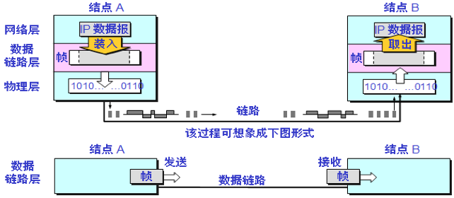

### 2.2 使用点对点信道的数据链路层

### 2.2.1 点对点信道数据链路层通信主要步骤：

1. 发送方A数据链路层将网络层交下来的IP数据报添加首部和尾部**封装成帧** **frameing**
2. 发送方A将封装好的帧发送给结点B的数据链路层
3. 接收方B收到的帧无措，则从帧中提取出IP数据报转给网络层；若有错，则丢弃该帧（如下图所示）

**说明：**在通讯线路质量差的早期年代数据链路层使用可靠传输协议HDLC（高级链路控制协议），现在普遍使用简单的点对点协议PPP

### 2.2.2 点对点协议PPP

### 2.2.2.1 PPP 协议的特点

不是可靠传输协议

1. PPP协议应满足的需求：
   **⑴、**简单：只进行CRC检测，如帧正确，则接收，否则丢弃；
   **⑵、**封装成帧：规定帧定界符等帧封装方法；
   **⑶、**透明性：定义转义字符**ESC**利用字节填充技术实现透明传输；
   **⑷、**支持多种网络层协议：如支持IP和IPX等；
   **⑸、**支持多种类型链路：串行的、并行的、同步的、异步的、低速的、高速的等等；
   **⑹、**差错检测：能发现错误帧并立即丢弃；
   **⑺、**连接状态检测：自动检测链路是否处于正常状态；
   **⑻、**最大传输单元：数据部分最大长度MTU；
   **⑼、**网络层地址协商：通过协商知道或配置彼此网络层地址；
   **⑽、**数据压缩协商：协商使用何种数据压缩算法；
2. PPP协议不需要的功能：
   ⑴、纠错：只检错、不纠错；
   ⑵、流量控制：流量控制交给运输层TCP协议实现；
   ⑶、序号：不使用帧序号；
   ⑷、多点线路：不支持一个主站轮流和链路上多个从站通信；
   ⑸、半双工或单工链路：只支持全双工；
3. PPP协议组成：
   ⑴、一个将IP数据报封装到串行链路的方法；
   ⑵、一个链路控制协议LCP（Link Control Protocol）：用来建立、配置和测试数据链路连接；定义了11种类型的LCP分组；
   ⑶、一套网络控制协议NCP（Network Control Protocol）：一个NCP协议支持一种网络层协议；

### 2.2.2.2 PPP 协议的帧格式

  

1. **各字段含义**：

⑴、第一个字节和最后一个字节是标志字段**F**，规定为7EH；

⑵、第二个字节是地址字段**A**，规定为FFH；

⑶、第三个字节是控制字段**C**，规定为03H（地址字段实际上并不起作用）；

⑷、协议字段2字节：当值为0021H时表示信息字段是IP数据报；值为0C021H时，信息字段是PPP链路控制协议LCP的数据，若为8021H时为NCP控制数据；⑸、信息字段最大长度不超过1500字节；

⑹、FCS字段使用CRC帧检验序列，2字节；

注意：PPP 是面向字节的，所有的 PPP 帧的长度都是整数字节；

2. **透明传输问题（字节填充）--&gt; **引入转义字符7DH;

⑴、若信息字段出现7EH，则将其转化成7DH 5EH

⑵、若信息字段出现7DH，则将其转化成7DH 5DH

⑶、若出现ASCII 码的控制字符（即值小于20H的字符），则在该字符前加入7DH，同时将该字符与20H异或。

【例题**3.4**】03H转化成7DH 23H;

⑷、若PPP 协议用在同步光纤网SONET和同步数字系列SDH 的链路时，使用同步传输（一连串的比特连续传送），这时 PPP 协议采用零比特填充方法来实现透明传输；

零比特填充 --&gt; 只要发现5个连续的1，立即在后面插入一个0；

【例题**3.5**】若数据部分是7D 5E FE 27 7D 5D 7D 5D 65 7D 5E,问真正的数据是什么？答：7E FE 27 7D 7D 65 7E

【例题**3.6**】同步传输技术传送0110111111111100，试问用零比特填充后，变成怎样的比特串？若接收端收到PPP帧数据部分是0001110 111110111110110，问真正数据是什么？

### 2.2.2.3 PPP 协议的工作状态

⑴、当用户拨号接入 ISP 时，路由器的调制解调器对拨号做出确认，并建立一条物理连接。

⑵、PC 机向路由器发送一系列的 LCP 分组（封装成多个 PPP 帧）。

⑶、这些分组及其响应选择一些 PPP 参数，和进行网络层配置，NCP 给新接入的 PC机分配一个临时的 IP 地址，使 PC 机成为因特网上的一个主机。

⑷、通信完毕时，NCP 释放网络层连接，收回原来分配出去的 IP 地址。接着，LCP 释放数据链路层连接。最后释放的是物理层的连接。

