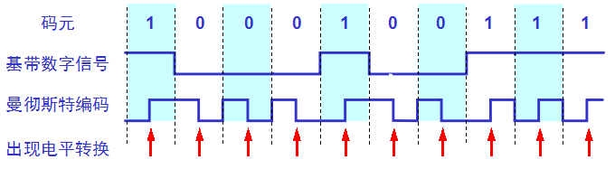

# 广播信道

使用广播信道的数据链路层

广播信道可以进行一对多通信，**局域网**使用的就是广播信道。

共享信道的媒体共享技术：

* 静态划分信道：信道划分。如以前说的频分、时分、波分和码分等多路复用技术；

  * 优点：用户分配到信道就不会发生冲突；

  * 缺点：代价高，不适合局域网LAN；

* 动态媒体接入控制：（又称：多路访问multiple access）信道并非固定给某用户。它又分两类：

  * **随机接入**：所有用户可以随机发送信息，可能出现冲突（以太网采用此方式）。 🌟

  * 受控接入：所有用户不能随机发送信息，服从统一控制（目前局域网少用）。

# 以太网

**以太网是一种计算机局域网技术**，应用最普遍的局域网技术，取代了其他局域网技术如令牌环、FDDI和ARCNET。

传统以太网指10Mbps以太网，现在已发展到百兆、千兆、万兆。

以太网的两个标准：

* DIX Ethwrnet V2\(1982\) 标准：由DEC、Intel、Xerox三家公司联合推出，世界上第一个局域网产品规约。980年发布第一版。

* 802.3以太网标准：由IEEE 802 委员会于1983年提出，与DIX Ethwrnet V2差别不大，因此可以将 802.3 局域网简称为“以太网”，但严格说来，“以太网”应当是指符合 DIX Ethernet V2 标准的局域网。

* IEE802委员会把局域网的数据链路层分为LLC和MAC两个子层：

  * 逻辑链路控制 LLC \(Logical Link Control\)子层：与传输媒体无关。建立和释放逻辑连接，给帧编号。

  * **媒体访问控制 MAC** \(Medium Access Control\)子层：与传输媒体有关。组装成帧、解析帧、地址识别、差错控制、管理和控制对局域网传输介质的访问。


* 注意：由于TCP/IP 体系经常使用的局域网标准是DIX Ethwrnet V2标准，IEE802.3标准的以太网很少使用，IEE802委员会制定的LLC子层的作用已经消失，大多数厂家生产的网卡只用MAC子层。

#### 适配器

* 计算机与外界局域网的连接是通过**通信适配器**(adapter)，适配器本来是在主机箱内插入的一块网络接口板(笔记本中是PCMCIA卡)，这种接口板又称为网络接口卡NIC(Network Interface Card)或简称**网卡**

* 适配器里装有处理器和存储器，包括RAM和ROM

* 适配器和局域网通信通过电缆或双绞线以串行传输方式进行，适配器和计算机之间的通信通过计算机主板上的I/O总线以并行传输方式进行。

* 适配器的功能：（ 适配器又称为“网络接口卡”或“网卡” ）

  * 并/串行转换；            

  * 对数据缓存：因为网络上的数据率与计算机总线上的数据率不同

  * 实现以太网协议；

* 注意： 
  * ①.在计算机的操作系统必须安装网卡驱动程序，由它告知网卡如何取数等
  * ②.网卡把帧发送到局域网或从局域网接收并处理帧都不使用CPU，当需要把处理后的正确帧交给协议栈中的网络层时使用中断方式通知CPU（参见P79图3-15）；

#### 以太网信道利用率

一个帧从开始发送，经可能发生的数次碰撞后再重传，到发送成功且信道转为空闲（即再经过时间 t  使得信道上无信号在传播 ？）时为止，是发送一帧所需的平均时间。


设：帧长为 L \(bit\)，数据发送速率为 C \(bps\)， ∴帧发送时间为
$$
T_0=\frac{L}{C}
$$
令
$$
a=\frac{τ}{Τ_0}
$$
_--> 以太网参数，a越大， τ所占得比例越大，信道利用率越低a→0,利用率增大。 

$$
信道极限利用率S_{max}=\frac{T_0}{T_0+τ}=\frac{1}{1+a}
$$
，即：没有冲突，但这是不可能的。
$$
S_{max}=\frac{T_0}{T_0+τ}=\frac{1}{1+a}
$$

## 以太网的MAC层

### MAC地址

- IP是地址，有定位功能；MAC是身份证，无定位功能；

1、MAC层的硬件地址：局域网中硬件地址又称物理地址或MAC地址。  
现在局域网适配器都是用6B（48bit）的全球地址，固化在适配器的ROM中，这种 48 位地址称为 MAC-48，它的通用名称是EUI-48。因此：  
⑴、更换新的适配器，尽管计算机地理位置没有变，这台计算机在局域网中的硬件地址也就变了。  
⑵、若计算机地理位置变了，只要适配器没变，则硬件地址不变。  
IEEE的注册管理机构RA是局域网全球地址法定管理机构。它负责分配48位中的高24位，称为组织唯一标识符OUI，代表组织唯一标识，低24位由厂家指派，称为扩展唯一标识符EUI。如：3COM公司的高24位为02-06-8C。  
一个公司可能有几个组织标识符。几个公司也可以共用以一个组织标识符。  
注意：MAC地址的两种记法  
一种是字节的高位在先（左），一种是字节的低位在先（左）。  
【例题3.7】AC-DE-48-00-00---80  
802.5中  10101100-11011110-01001000-00000000-00000000-10000000高位在先  
802.3中  00110101-01111011-00010010-00000000-00000000-00000001低位在先  
此外：IEEE考虑可能有人不愿意向IEEE的RA购买OUI，规定MAC地址的第一个字节的最低位为I/G位（0表示单播地址，1表示组播地址），次低位为G/L位（0表示本地管理地址，1表示全球管理地址）；  
全球管理地址向IEEE的RA购买OUI；  
本地管理地址不向IEEE的RA购买OUI，用户可任意分配网络上的地址；  
IEEE802.3中MAC地址格式（低位在先）


所以：全球管理地址共有246个地址，超过70万亿个。  

适配器检查 MAC 地址：  

* 适配器从网络上每收到一个 MAC 帧就首先用硬件检查 MAC 帧中的 MAC 地址.  
  * ①.如果是发往本站的帧则收下，然后再进行其他的处理。  
  * ②.否则就将此帧丢弃，不再进行其他的处理。  
* “发往本站的帧”包括以下三种帧：  所有适配器都应至少识别单播帧和广播帧。  
  * ①.单播\(unicast\)帧（一对一）---&gt;I/G位=0；  
  * ②.多播\(multicast\)帧（一对多）---&gt; I/G位=1；  
  * ③.广播\(broadcast\)帧（一对全体）---&gt; 48位MAC地址全1；  


```
root@test:~# ip addr
1: lo: <LOOPBACK,UP,LOWER_UP> mtu 65536 qdisc noqueue state UNKNOWN group default 
    link/loopback 00:00:00:00:00:00 brd 00:00:00:00:00:00
    inet 127.0.0.1/8 scope host lo
       valid_lft forever preferred_lft forever
    inet6 ::1/128 scope host 
       valid_lft forever preferred_lft forever
2: eth0: <BROADCAST,MULTICAST,UP,LOWER_UP> mtu 1500 qdisc pfifo_fast state UP group default qlen 1000
    link/ether fa:16:3e:c7:79:75 brd ff:ff:ff:ff:ff:ff
    inet 10.100.122.2/24 brd 10.100.122.255 scope global eth0
       valid_lft forever preferred_lft forever
    inet6 fe80::f816:3eff:fec7:7975/64 scope link 
       valid_lft forever preferred_lft forever
```

在IP地址的上一行是link/ether fa:16:3e:c7:79:75 brd ff:ff:ff:ff:ff:ff，这个被称为**MAC地址**，是一个网卡的物理地址，用十六进制，6个byte表示。

MAC地址是一个很容易让人“误解”的地址。因为MAC地址号称全局唯一，不会有两个网卡有相同的MAC地址，而且网卡自生产出来，就带着这个地址。很多人看到这里就会想，既然这样，整个互联网的通信，全部用MAC地址好了，只要知道了对方的MAC地址，就可以把信息传过去。

这样当然是不行的。 **一个网络包要从一个地方传到另一个地方，除了要有确定的地址，还需要有定位功能。** 而有门牌号码属性的IP地址，才是有远程定位功能的。

例如，你去杭州市网商路599号B楼6层找刘超，你在路上问路，可能被问的人不知道B楼是哪个，但是可以给你指网商路怎么去。但是如果你问一个人，你知道这个身份证号的人在哪里吗？可想而知，没有人知道。

**MAC地址更像是身份证，是一个唯一的标识。**它的唯一性设计是为了组网的时候，不同的网卡放在一个网络里面的时候，可以不用担心冲突。从硬件角度，保证不同的网卡有不同的标识。

MAC地址是有一定定位功能的，只不过范围非常有限。你可以根据IP地址，找到杭州市网商路599号B楼6层，但是依然找不到我，你就可以靠吼了，大声喊身份证XXXX的是哪位？我听到了，我就会站起来说，是我啊。但是如果你在上海，到处喊身份证XXXX的是哪位，我不在现场，当然不会回答，因为我在杭州不在上海。

所以，MAC地址的通信范围比较小，局限在一个子网里面。例如，从192.168.0.2/24访问192.168.0.3/24是可以用MAC地址的。一旦跨子网，即从192.168.0.2/24到192.168.1.2/24，MAC地址就不行了，需要IP地址起作用了。

## 网络设备的状态标识

解析完了MAC地址，我们再来看 <BROADCAST,MULTICAST,UP,LOWER_UP>是干什么的？这个叫作**net_device flags**，**网络设备的状态标识**。

UP表示网卡处于启动的状态；BROADCAST表示这个网卡有广播地址，可以发送广播包；MULTICAST表示网卡可以发送多播包；LOWER_UP表示L1是启动的，也即网线插着呢。MTU1500是指什么意思呢？是哪一层的概念呢？最大传输单元MTU为1500，这是以太网的默认值。

上一节，我们讲过网络包是层层封装的。MTU是二层MAC层的概念。MAC层有MAC的头，以太网规定连MAC头带正文合起来，不允许超过1500个字节。正文里面有IP的头、TCP的头、HTTP的头。如果放不下，就需要分片来传输。

qdisc pfifo_fast是什么意思呢？qdisc全称是**queueing discipline**，中文叫**排队规则**。内核如果需要通过某个网络接口发送数据包，它都需要按照为这个接口配置的qdisc（排队规则）把数据包加入队列。

最简单的qdisc是pfifo，它不对进入的数据包做任何的处理，数据包采用先入先出的方式通过队列。pfifo_fast稍微复杂一些，它的队列包括三个波段（band）。在每个波段里面，使用先进先出规则。

三个波段（band）的优先级也不相同。band 0的优先级最高，band 2的最低。如果band 0里面有数据包，系统就不会处理band 1里面的数据包，band 1和band 2之间也是一样。

数据包是按照服务类型（**Type of Service，TOS**）被分配到三个波段（band）里面的。TOS是IP头里面的一个字段，代表了当前的包是高优先级的，还是低优先级的。

队列是个好东西，后面我们讲云计算中的网络的时候，会有很多用户共享一个网络出口的情况，这个时候如何排队，每个队列有多粗，队列处理速度应该怎么提升，我都会详细为你讲解。


### **以太网的MAC帧格式**：

常用的以太网MAC帧格式有两种标准：  

* ⑴ IEEE 的 802.3 标准；  
* ⑵ **DIX Ethernet V2标准**（Ethernet II）：最常用；🌟🌟
* 两种帧格式的字段都非常相似，区别在于Ethernet II的长度值在0～1500范围内，而1536～65535（从0x0600到0xFFFF）的范围保留给IEEE802.3的帧格式的类型使用。

以太网MAC帧格式：

  

* ①. 前同步码-：用于位同步，使接收端适配器与比特流达成同步，前7个字节为10交替码；帧开始定界符用于帧同步，第8个字节为1010101011； 
* ②. 目的MAC地址：6 byte
* ③. 源MAC地址：6 byte
* ④. 类型：2 byte; 指明高层使用何种协议；
  * 0800H：表示IP数据报； 大部分的类型是IP数据包。然后IP里面包含TCP、UDP，以及HTTP等，这都是里层封装的事情。 
  * 8137H：表示novell ipx数据
  * 0806H：ARP请求，应答
* ⑤. 客户数据字段：46~1500字节，不足46B需填充，填充操作由IP层完成。  客户数据字 段的最小长度 = 最小帧长度 64 字节 - 18 字节的首部和尾部 
* ⑥. FCS：4 byte；对于以太网，第二层的最后面是**CRC**，也就是**循环冗余检测**；通过XOR异或的算法，来计算整个包是否在发送的过程中出现了错误。


7. 以太网的每个数据帧除了自身数据外还有前后两部分数据，帧前的8B数据包括前同步码和帧开始定界符，帧后有用于帧间隙（Inter Frame Gap）传输的12B数据，原因是帧和帧之间需要有一段时间来让接收服务器做准备接收下一帧。数据帧的长度最小是64B，如果发送的数据不到这个长度需要不零凑齐。


注意同步光纤网SONET和同步数字系列SDH不需前同步码；  
IEEE 802.3的MAC帧格式与以太网V2 帧格式差别仅仅是：类型字段并不表示高层使用何种协议，而是表示客户数据字段的长度；  
4、无效帧以下帧为无效帧：  
①.    数据字段的长度与长度字段的值不一致；  
②.    帧的长度不是整数个字节；  
③.    用收到的帧检验序列 FCS 查出有差错；  
④.    数据字段的长度不在 46 ~ 1500 字节之间。  
⑤.    MAC 帧长度长度不在64 ~ 1518 字节之间。  
⑥.    对于检查出的无效 MAC 帧就简单地丢弃。以太网不负责重传丢弃的帧。  
5、帧间最小间隔：  
①.    帧间最小间隔为 9.6 μs，相当于 96 bit 的发送时间。  
②.    一个站在检测到总线开始空闲后，还要等待 9.6 ms 才能再次发送数据。  
这样做是为了使刚刚收到数据帧的站的接收缓存来得及清理，做好接收下一帧的准备。


### 3.3.2 CSMA/CD 协议

（带有冲突检测的载波侦听多路访问方法）

最早的以太网是将许多的计算机都连接到一根总线上。

**1\***\*、总线的特点：当一台计算机向总线发送数据时，总线上所有计算机都能检测到这个数据；

**2\***\*、总线以太网如何实现一对一通信？\*\*

每个计算机的适配器都拥有一个与其它计算机适配器不同的地址。只有帧首部的目的地址与该地址一致时，适配器才接受数据帧，否则丢弃该帧


**3\***\*、以太网通信的两种措施：

**⑴、**采用无连接的广播工作方式：不必先建立连接就直接发送数据，尽最大努力交付，发现数据帧就丢弃。对发送的数据帧不编号，也不要求对方发回确认（理由是局域网信道的质量很好），差错的纠正即重传操作由网络层处理；

**⑵、**数据采用曼彻斯特编码。



规则：每比特的周期T分为前T/2和后T/2，前T/2传送该比特反码，后T/2周期该比特原码；即：位中间正跳变表示0，位中间负跳变表示1

**问题**è如何协调总线各计算机的工作？保证同一时间只允许一台计算机发送信息。

**方法**è采用CSMA/CD协议。

**4\***\*、CSMA/CD简介：\*\*

**⑴、\***\*CSMA/CD协议的三个要点\*\*：

**①.**多点接入：许多计算机以多点接入的方式连接在一根总线上；

**②.**载波监听è先听后发：用电子技术检测总线上有无其它计算机发送的信号；

**③.**碰撞检测è边发边听：若发送数据期间检测到信道是上信号电压变化幅度增大，则表明出现冲突。若出现冲突，立即停发，等待一个随即时间后重发。

**注意**è当某站点监听到总线空闲时，总线并非一定空闲。这是因为数据传播有延迟。

**问题**è发送站要经过多长时间才能知道自己有没有与别的站发生冲突呢？举例画图说明。

显然CSMA/CD协议的以太网只能进行半双工通信。最先发送数据帧的站，在发送数据帧后至多经过时间 2_t_（两倍的端到端往返时延）就可知道发送的数据帧是否遭受了碰撞，以太网的端到端往返时延**2**τ 称为**争用期**，或**碰撞窗口；**若经过争用期后还没检测到冲突，则可肯定不会有冲突。

**⑵、二进制指数退避算法**èCSMA/CD发现冲突到再次发送之间的时间确定方法：

**①\***\_.**确定基本退避时间，它就是2τ。**以太网取2t=51.2us\*\*（以太网实际端到端时延小于25.6us，取2τ =51.2 us是考虑其它因素，如转发器增加的时延）。对于10MBb/S以太网在51.2us内可发送64字节，也可以说争用期是512比特的发送时间。

**②\***\*.\*\*第k次重传时，从离散整数集合中{0,1,……，（$$2^k-1$$）}中随机取一个数r，重传等待时间即为2rτ。其中k=Min{重传次数，10}，即当重传次数大于10时k取10。

**③\***\*.\*\*当重传达16次人不能成功时，丢弃该帧并报告上层。适配器每发一次新帧，执行一次CSMA/CD算法，无记忆功能。

因为发送64字节后没发现冲突才能肯定不会发生冲突，故10MBb/S以太网规定了最短帧长为64字节，凡小于64字节帧均视为无效帧。

**⑶、强化碰撞**è发送数据的站点发现冲突后，立即停止发送数据，还要再发送32bit或48bit的**人为干扰信号**，以便所有用户知道信道发生了冲突。

以太网还规定帧间间隔最少为**9.6us**，即96bit时间。为了让接收站来得及处理刚收到的帧，并做好接收下一帧准备。

**5\***\*、CSMA/CD要点归纳如下\*\*：

⑴、适配器从网络层接收到一个分组，加上以太网手部和尾部，组成以太网帧。放入适配器缓存，准备发送。

⑵、若检测到信道空闲（即96比特时间内没有检测到信道上有信号）就发送这个帧。若信道忙，继续检测并等待信道转为空闲后再发。

⑶、数据发送过程中继续侦听，若发送过程中一直未检测到碰撞，则顺利发送，若检测到碰撞，则终止发送，并发送人为干扰信号。

⑷、在中止发送后，执行二进制指数退避算法，等待r倍争用期，返回步骤⑵；

总结：**先听后说、边听边说、冲突停说、等待时机再说**；

例题分析：某以太网的数据速率为100Mbps，信号速率为200000km/s，求最大网络跨距？

解：因为 发送最小帧64B需要的时间为$$T_1=\frac{64B*8bit/B}{100Mbps}=5.12μs$$  
信号来回时间$$T_2=\frac{2S}{V}=\frac{2*S}{200000km/s}$$,要求$$Τ_1≧T_2$$  
所以$$\frac{2*S}{200000km/s}≦5.12μs$$，即S≦512m

### 3.4.1、使用集线器的星型拓扑以太网：

以太网发展历程

1 发展历程：粗同轴电缆以太网-->细同轴电缆以太网-->双绞线以太网；  
2 使用两对无屏蔽双绞线分别用于接收和发送，使用RJ-45插头。这种以太网采用星形拓扑，在星形的中心则增加了一种可靠性非常高的设备，叫做**集线器**\(**hub**\)


3 星形网10BASE-T双绞线以太网：10: 代表10Mbps，BASE: 表示基带信号，T: 代表双绞线。  

* 不使用电缆而使用无屏蔽双绞线。双绞线能够传送高速数据的主要措施是把双绞线的绞合度做得非常精密。不仅可使特性阻抗均匀以减少失真，而且大大减少了电磁波辐射合无线电频率的干扰。每个站需要用两对双绞线，分别用于发送和接收。
* 集线器使用了大规模集成电路芯片，因此硬件设备的可靠性已大大提高了。  
* 10BASE-T 的通信距离稍短，每个站到集线器的距离不超过 100 m。  
* 10BASE-T 双绞线以太网的出现，是局域网发展史上的一个非常重要的里程碑，它为以太网在局域网中的统治地位奠定了牢固的基础。  

4 集线器的特点 
⑴、使用集线器的以太网在逻辑上仍是一个总线网，各站点适配器采用CSMA/CD协议。在物理上是一个星型网。 
⑵、集线器有多个接口，8~16个。 
⑶、工作在物理层，仅简单转发比特，不进行冲突检测。 
⑷、采用专门芯片，可进行自适应串音回波抵消，这样使得接口转发出去的强信号不干扰接口接收到的弱信号（这种干扰称“近端串音”干扰）转发比特前要进行再生整形并重新定时；  

集线器本身比较可靠，现在堆叠式集线器口由4~8个集成口堆叠起来使用，具有少量容错功能和网络管理功能，各模块可热拔插。指示灯可显示网络上的故障，给网管带来方便，可自动检测到故障适配器，并断开其连接。


## 有了IP为什么还需要MAC

当网络包到达一个城关的时候，可以通过路由表得到下一个城关的IP地址，直接通过IP地址找就可以了，为什么还要通过本地的MAC地址呢？

对于服务器来说，源地址一般是路由器的外网地址，内网机器没有外网地址，目标地址会把报文发给路由器，路由器根据mac地址，在arp缓存找到内网地址。

关于老师最后的问题，我觉得是这样：ip报文端到端的传输过程中，目的地址和源地址是不变的，但是每通过一个网关，源mac和目的mac一直在变。两个王国之间的网关要通过mac互相传递报文。

个人发表一下对这个问题的看法，抛砖引玉，希望老师指正：1.局域网内IP地址是动态分配的，假如我是192.168.2.100，如果我下线了，可能IP就分配给了另一台电脑。IP和设备并不总是对应的，这对通信就产生了问题，但是MAC地址不同，MAC地址和设备是一一对应且全球唯一的。所以局域网使用MAC地址通信没有问题。2.历史遗留问题：早期的以太网只有交换机，没有路由器，以太网内通过MAC地址通信。后来才有了互联网，为了兼容原本的模式，采用了IP+MAC地址通信的方式。为啥不推到了重来呢？看看IPv6的处境你就知道了。所以是先有MAC地址后有的IP，IP的提出主要还是因为MAC地址本身的缺陷，这个问题换成有了MAC为何还要IP地址也很有意思。3.我这里简单说一下第一：MAC地址本身的缺陷：因为MAC地址是硬件提供商写在网卡中的，MAC地址虽然唯一但是不能表明用户在整个互联网中的位置，除非维护一个超级大MAC地址对应表，那寻址效率肯定爆炸。但是IP地址解决了这个问题，因为IP地址是网络提供商给你的，所以你在哪里整个网络都是知道的。第二：安全问题：获取MAC地址是通过ARP协议来完成的，如果只用MAC地址通信，那么广播风暴是个难题。4.那么我觉得如果哪天每人一个固定的IPv6地址，那么我觉得MAC地址+IPv4的模式是不是可以被替换了？

\1. mac地址是唯一的，为什么可以修改?想想身份证，身份证号是唯一的，不能改变的，但是可以造价。mac地址全球唯一，它是固化在网卡里的。网卡毕竟是个硬件，需要软件支持，既操作系统识别。重点来了，操作系统识别出来的mac地址是可以更改的，它只不过是一个字符串。我们常说的修改mac指的是修改电脑中记录的既注册表中的记录。
\2. 有了mac地址为什么还要有ip地址。举个例子，身份证号是你的唯一标识，不会重复，一落户就有（网卡一出厂就有mac）。现在我要和你通信（写信给你），地址用你的姓名+身份证，信能送到你手上吗?明显不能！身份证号前六位能定位你出生的县。mac地址前几位也可以定位生产厂家。但是你出生后会离开这个县（哪怕在这个县，也不能具体找到你）。所以一般写个人信息就要有出生地和现居地址了。因为mac地址是全世界唯一的，不会找错人！而ip地址会是发生改变的！有可能现在ip地址A是这里的地址！在下一刻就是B的地址了！
综上所述：所以要有mac地址！

mac好比人的身份id，ip好比他的住址，住址可以变，人的身份🆔不会变。

2018-05-23 20:46


很多人都说mac地址是唯一的，不变的，网络老师也这么说，
\1. 但记得大学时为了能上网，在windows XP下自己改了mac地铁就可以了， 可能只是操作系统级别的修改，但理解起来好矛盾
\2. 如果是全球唯一的，那么意思是这些网卡厂商都要维护自己的mac列表？以保证和其它厂商绝对不重复，有这样的机构吗

真是困惑，自己猜想mac唯一应该也只是保证局域网内保证唯一吧


网卡MAC码是由全球惟一的一个固定组织来分配的，未经认证和授权的厂家无权生产网卡。每块网卡都有一个固定的卡号，并且任何正规厂家生产的网卡上都直接标明了卡号，一般为一组12位的16进制数。其中前6位代表网卡的生产厂商。后面的位数是设备号。当然在操作系统级别改Mac地址又是一种说法。


假如有MAC地址没有ip地址可以吗？答案是不行，因为全世界存在各种网络，它们使用不同硬件地址。要使这些网络能互相通信就必须进行非常复杂的硬件地址转换工作。但可以用抽象的ip地址把这个问题解决。
那么假如没有MAC地址而只有ip呢？同样不行，ip地址只是一种抽象的逻辑地址用于标记唯一性，而传输的数据是要从网络层到数据链路层或由数据链路层到网络层的，ip数据报并不能和下层硬件“沟通”，所以还要被封装MAC帧。即将IP地址解析为链路层所需硬件地址。
目前是这么理解的，欢迎交流指正。


没有MAC地址，靠IP也是可以做MAC地址的事情，但是由于分层，IP负责网络层传输，MAC负责链路层传输，IP和MAC通过ARP协议映射，比如任何人沟通，可以通过电话，短信，微信，或者邮件，但是不同场合用的工具不一样


有既不走UDP又不走TCP的应用层协议吗？

2018-05-18 09:21

作者回复

有的，传输层大部分情况下是tcp和udp，但是也有其他的协议比如sctp

- 对于服务器来说，源地址一般是路由器的外网地址，内网机器没有外网地址，目标地址会把报文发给路由器，路由器根据mac地址，在arp缓存找到内网地址。

  2018-05-18 08:15

- 

  lujg

  在公网中通信只能用公网ip，而对于公网ip是按照区域分配的，路由器是可以知道目标ip的大范围的区域，然后从大区域慢慢向小区域传送的。可以类比我们去某地的一个过程，比如你从北京到深圳某公司，你需要先去飞机场，然后坐飞机去深圳，再通过市内交通到达目的地。
  而对于Mac地址，这是标识机器的一个地址，在出厂时就确定的，但是单mac所在的区域不是固定的，而是会移动的。即你从北京到深圳后，你的IP是会变的，但mac是不会变的。所以是无法通过mac地址寻找到你所在位置的。
  理论上是可以通过一个大查找表知道每一个mac所在的位置，然后通过查表知道你所在的位置然后根据mac做一个转发，但是查找的代价是很高的。
  其实手机通过数据上网就是一个通过类似mac寻址的一个网络。在移动网络中是允许你移动的，这是由于基站会记录你的位置信息。并且核心网与公网的通信是通过ip来实现的，而在手机和基站间的通信是通过类似mac的一个唯一码实现的。并且移动网络整体建设成本比互联网的成本高很多，消费也高很多。

- 关于老师最后的问题，我觉得是这样：ip报文端到端的传输过程中，目的地址和源地址是不变的，但是每通过一个网关，源mac和目的mac一直在变。两个王国之间的网关要通过mac互相传递报文。

  2018-05-19 21:01

- 

  蔡波

  IP是负责三层通信通过查找路由表，层层传递，最终到达目的设备，Mac负责二层通信，设备上的ARP表是IP和Mac的对应关系，通过ARP表找到目的IP的Mac地址。

### 留言问题

1.MAC地址可以修改吗？


我查了一下，MAC（Media Access Control，介质访问控制）地址，也叫硬件地址，长度是48比特（6字节），由16进制的数字组成，分为前24位和后24位。

前24位叫作**组织唯一标志符**（Organizationally Unique Identifier，OUI），是由IEEE的注册管理机构给不同厂家分配的代码，用于区分不同的厂家。后24位是厂家自己分配的，称为**扩展标识符**。同一个厂家生产的网卡中MAC地址后24位是不同的。

也就是说，MAC本来设计为唯一性的，但是后来设备越来越多，而且还有虚拟化的设备和网卡，有很多工具可以修改，就很难保证不冲突了。但是至少应该保持一个局域网内是唯一的。

MAC的设计，使得即便不能保证绝对唯一，但是能保证一个局域网内出现冲突的概率很小。这样，一台机器启动的时候，就能够在没有IP地址的情况下，先用MAC地址进行通信，获得IP地址。

好在MAC地址是工作在一个局域网中的，因而即便出现了冲突，网络工程师也能够在自己的范围内很快定位并解决这个问题。这就像我们生成UUID或者哈希值，大部分情况下是不会冲突的，但是如果碰巧出现冲突了，采取一定的机制解决冲突就好。
