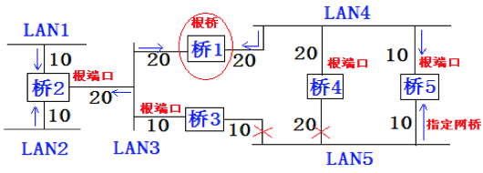
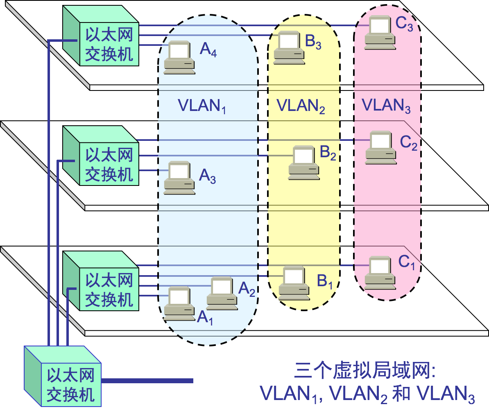

# 扩展的以太网

## 3.5.1 物理层扩展:集线器

在物理层扩展以太网：使用**集线器**扩展。

因为信号在传输过程中会衰减，导致CSMA/CD协议无法正常工作。802.3标准规定单个网段不超过500米长，两个网段之间可用转发器连接起来，但任意两个站点最多可经过3个电缆网段。可以采用以下两种途径扩展： 

* ⑴、用光纤取代双绞线：可扩展以太网覆盖范围：由于光纤带来的时延小，带宽高，需要光纤调制解调器，进行光/电信号转换。

  

* ⑵、使用多级集线器，就可以连接成覆盖范围更大的多级星型以太网。

使用多级集线器可带来以下好处  

* ①.原先不同以太网之间不能通信，现在却可以。  
* ②.扩大了以太网范围。主机与集线器之间距离最大100米，集线器与集线器之间距离也可是100米（10BASE-T）。  

使用多级集线器可带来以下缺点  

* ①.多个碰撞域成为一个碰撞域，碰撞域增大了，但总的吞吐量并未提高  ：集线器是广播方式，不管某个接口是否需要，所有的Bit都会被发送出去，然后让主机来判断是不是需要。这种方式路上的车少就没问题，车一多，产生冲突的概率就提高了。而且把不需要的包转发过去，纯属浪费。

* ②.不同技术以太网（如数据率不同的以太网）不能用集线器互连

  

## 3.5.2 数据链路层扩展:网桥

集线器是广播方式，不管某个接口是否需要，所有的Bit都会被发送出去，然后让主机来判断是不是需要。这种方式对一个宿舍来说没有问题，但是一旦机器数目增多，产生冲突的概率就提高了。而且把不需要的包转发过去，纯属浪费。看来Hub这种不管三七二十一都转发的设备是不行了，需要点儿智能的。因为每个口都只连接一台电脑，这台电脑又不怎么换IP和MAC地址，只要记住这台电脑的MAC地址，如果目标MAC地址不是这台电脑的，这个口就不用转发了。

谁能知道目标MAC地址是否就是连接某个口的电脑的MAC地址呢？这就需要一个能把MAC头拿下来，检查一下目标MAC地址，然后根据策略转发的设备，按第二节课中讲过的，这个设备显然是个二层设备，我们称为**交换机**。

交换机怎么知道每个口的电脑的MAC地址呢？这需要交换机会学习。

一台MAC1电脑将一个包发送给另一台MAC2电脑，当这个包到达交换机的时候，一开始交换机也不知道MAC2的电脑在哪个口，所以没办法，它只能将包转发给除了来的那个口之外的其他所有的口。但是，这个时候，交换机会干一件非常聪明的事情，就是交换机会记住，MAC1是来自一个明确的口。以后有包的目的地址是MAC1的，直接发送到这个口就可以了。

当交换机作为一个关卡一样，过了一段时间之后，就有了整个网络的一个结构了，这个时候，基本上不用广播了，全部可以准确转发。当然，每个机器的IP地址会变，所在的口也会变，因而交换机上的学习的结果，我们称为**转发表**，是有一个过期时间的。

有了交换机，一般来说，你接个几十台、上百台机器打游戏，应该没啥问题。你可以组个战队了。能上网了，就可以玩网游了。

交换机是有MAC地址学习能力的，学完了它就知道谁在哪儿了，不用广播了。

在数据链路层扩展以太网 ：使用**网桥**扩展

两个以太网通过网桥连接起来后，就成为一个覆盖范围很大的以太网，原先的每个以太网称一个**网段**（每个网段处在各自独立的冲突域中）。 

* ①.网桥工作在数据链路层，它根据 MAC 帧的目的地址对收到的帧进行转发； 
* ②.网桥具有**过滤帧**的功能。当网桥收到一个帧时，并不是立即转发帧，而是先检查帧的目的MAC 地址，然后确定是丢弃还是将该帧转发到哪一个接口；  

### 网桥

#### 网桥的内部结构

网桥依靠**转发表**来转发帧；若网桥从接口1收到A发给E 的帧，查转发从2转发出去，若网桥从接口2收到F给E的帧，查表后丢弃该帧。  

#### 网桥优缺点

使用网桥的好处：  

* ①.过滤通信量，增大吞吐量不同网段上间部通信时互不干扰。  
  但不同网段间通信时，这两个网段上其它站点不能通信，但不影响这两个网段外的其它网段。每个端口一个碰撞域。  
* ②.扩大的了物理范围增加以太网上工作站的最大数目。  
* ③.提高了可靠性当网络出现故障时，只影响个别网段。  
* ④.可互连不同以太网不同物理层、不同MAC子层，不同速率。  

网桥的缺点  

* ①.先存储、后转发，转发时执行CSMA/CD算法，增加了时延。具有不同 MAC 子层的网段桥接在一起时时延更大。  
* ②.MAC子层没有流量控制，可能因缓存不够丢失帧。  
* ③.可能产生广播风暴，扩展的以太网共一个广播域，若网桥之间通过点对点转发帧时若采用PPP协议，则在帧的头部和尾部再加上PPP-H和PPP-T。  
    注意 网桥转发帧时不改变源地址。  

#### 网桥与集线器

网桥和集线器（或转发器）的区别 ：

* 集线器在转发帧时，不对传输媒体进行检测。  
* 网桥在转发帧之前必须执行 CSMA/CD 算法。

### **透明网桥**   

目前使用得最多 
⑴、透明网桥：是指以太网网站点并不知道所发送的帧将经过哪几个网桥，即网桥对站点是透明的。  
透明网桥是一种即插即用设备，无需人工配置，其标准是 IEEE 802.1D。当网桥刚连接到以太网时，其转发表是空的。网桥使用自学习法逐步建立起转发表的。 
转发表每项记录的信息结构MAC地址 + 接口 + 帧进入该网桥的时间； 
⑵、透明网桥的自学习原理：若从站点A发出的帧从接口X进入了某网桥，那么从这个接口出发，沿相反方向一定可以把一个帧传送到A。所以网桥每收到一个帧时检查是否有相应的表项，若有修改时间信息，若无则建立新的表项。建立转发表时把帧的源地址写在地址一栏，转发帧时，则是根据帧的目的地址转发。 
【例题3.9】A向B发送帧，分析F向C发送帧和B向A发送帧的过程。

网桥的转发表要反应网络最新拓扑状态：若某表项建立时间过长，则删除（因为该表项可能无用）。 
⑶、网桥的自学习和转发帧的步骤：  

* 自学习： 网桥收到一帧后，查找转发表中有无与源地址匹配的项目，若有，则更新（接口时间），若无，增加一个新表项：地址、接口、时间。  
* 转发帧： 若帧的目的地址与转发表中所有表项不匹配，则向除进入接口以外的其它所有接口转发，若与转发表中给出接口相同，则丢弃该帧，若进入的接口与转发表给出接口不同，则按转发表给出的接口进行转发。 
* 网桥工作原理简述：学习源地址、过滤本网段帧、转发异网段帧、广播未知帧；  

⑷、透明网桥的**生成树算法** 目的：避免帧在网络中不停地兜圈子，白白耗费资源。 
  互连在一起的网桥在进行彼此通信后，就能找出原来的网络拓扑的一个子集。在这个子集里，整个连通的网络中不存在回路，即在任何两个站之间只有一条路径

互连在一起的网桥在进行彼此通信后，就能通过生成树算法找出原来的网络拓扑的一个子集。在这个子集里，整个连通的网络中不存在回路，即在任何两个站之间只有一条路径。 
生成树算法：每个网桥都有一个唯一的标示符，通常取网桥MAC加一个优先级，网桥每个端口有一个路径代价（端口将数据发送到相连局域网的代价，可人工配置）：  
第一步：“决定根网桥”，取优先级最高者，同优先级取MAC最小者；  
    选根期间各网桥广播自己的BPDU（网桥协议数据单元）表明自己的标示符，当收到比自己优先级高的BPDU时就不再广播自己的BPDU而转发高优先级的BPDU，最终只产生一个根端口；  
第二步：“决定非根网桥的根端口”，从它出发到根网桥路径代价最小的端口；  
方法是根网桥广播一个BPDU，非根网桥在各端口收到此BPDU后检测出代价，从而决定根端口；  
第三部：“决定指定网桥和各网络的指定端口”，指定网桥就是本网络A到达另一网络B路径代价最小的网桥，由它负责本网络A与B之间的数据交换（一个网络可能有多个通向数个网络的多个指定网桥）；指定端口就是网络与指定网桥的相连端口，其它非指定端口被阻塞；

注意：①.生成树是动态生成的；  
②.透明网桥容易安装，但网络资源的利用不充分；  

### 源路由网桥

3、源路由网桥：由发送帧的源站负责路由选择的网桥。  
源站发送帧时将详细的路由信息放在帧的首部中；  
为发现合适了路由，源站以广播方式向目的站发送一个发现帧，作探测之用。发现帧在整个扩展的以太网上沿所有可能的路径传送。在传送过程中，每个发现帧都记录所经过的路由。当这些发现帧到达目的站时，就沿着各自路由返回源站。源站从各种路由中选择一个最佳路由。以后，凡从这个源站向该目的站发送的帧，其首部都必须携带源站所确定的路由信息。  
结果：每个站都有一个描述通向其它所有网络的最短路径树（最小生成树）；  

注意发现帧的另一个作用：确定网络可通过的最大帧长。  

### 多接口网桥

多接口网桥：“**以太网交换机**” ，又称“**二层交换机**”或“**交换式集线器**” 
以太网交换机工作在数据链路层，实际上是一个多接口网桥。 
⑴、以太网交换机的特点   

* ①.以太网交换机的每个接口都直接与主机相连，一般都工作在全双工方式。  
* ②.交换机能同时连通许多对的接口，使每一对相互通信的主机都能像独占通信媒体那样，进行无碰撞地传输数据，从而增加总容量。   
* ③.以太网交换机由于使用了专用的交换结构芯片，所以交换速率高。  

⑵、二层交换机与网桥的区别   
  ①.接口数量和类型多。  
  ②.转发速度更快：存储转发方式、直通式（不进行差错控制）。  
  ③.每个接口可直接接主机或另一集线器。网桥接口只接以太网网段。  
  ④.可支持网络管理。  
  ⑤.可支持VLAN技术。  

⑶、交换机与集线器的不同点   
  ①.工作层次不同：交换机工作在数据链路层，集线器工作在物理层。  
  ②.传输数据方式不同：交换机转发，集线器广播。  
  ③.带宽占用方式不同：交换机用户独占带宽，集线器用户共享带宽。  
  ④.传输模式不同：交换机全双工，集线器半双工。  
  ⑤.碰撞域不同：集线器所有接口是一个碰撞域，交换机每个接口是一个独立的碰撞域。  

⑷、利用以太网交换机可以很方便地实现虚拟局域网  VLAN（虚拟局域网）  
      虚拟局域网 VLAN 是由一些局域网网段构成的与物理位置无关的逻辑组。  
      这些网段具有某些共同的需求。  
      每一个 VLAN 的帧都有一个明确的标识符，指明发送这个帧的工作站是属于哪一个 VLAN。  
      虚拟局域网其实只是局域网给用户提供的一种服务，而并不是一种新型局域网。

VLAN的优点  
①.可控制广播风暴，广播只在同一个VLAN中。  
②.提高网络整体安全性，例财务部门不希望别的部门看到其数据。  
③.网络管理简单、直观。同一VLAN种主机无需放在同一物理空间。  

实现虚拟局域网主要的三种途径  
①.基于端口的虚拟局域网：ACCESS模式和TRUNK模式；  
②.基于MAC地址之的VLAN；  
③.基于IP 地址的VLAN；  
虚拟局域网使用的以太网帧格式（802.3ac协议）  
在以太网帧格式中插入一个4字节标识符，称VLAN标记，用来知名发送该帧的工作属于哪一个虚拟局域网。

VLAN标记的前两个字节总是8100H.后两个字节中前三位是用户优先级字段，第4位是规范格式指示符，最后12位是VLAN 标识符VID。  
插入4字节标识符后，以太网最大长度变为1522B。  

-------

拓扑结构是怎么形成的？我们常见到的办公室大多是一排排的桌子，每个桌子都有网口，一排十几个座位就有十几个网口，一个楼层就会有几十个甚至上百个网口。如果算上所有楼层，这个场景自然比你宿舍里的复杂多了。具体哪里复杂呢？我来给你具体讲解。

首先，这个时候，一个交换机肯定不够用，需要多台交换机，交换机之间连接起来，就形成一个稍微复杂的**拓扑结构**。

我们先来看**两台交换机**的情形。两台交换机连接着三个局域网，每个局域网上都有多台机器。如果机器1只知道机器4的IP地址，当它想要访问机器4，把包发出去的时候，它必须要知道机器4的MAC地址。

于是机器1发起广播，机器2收到这个广播，但是这不是找它的，所以没它什么事。交换机A一开始是不知道任何拓扑信息的，在它收到这个广播后，采取的策略是，除了广播包来的方向外，它还要转发给其他所有的网口。于是机器3也收到广播信息了，但是这和它也没什么关系。

当然，交换机B也是能够收到广播信息的，但是这时候它也是不知道任何拓扑信息的，因而也是进行广播的策略，将包转发到局域网三。这个时候，机器4和机器5都收到了广播信息。机器4主动响应说，这是找我的，这是我的MAC地址。于是一个ARP请求就成功完成了。

在上面的过程中，交换机A和交换机B都是能够学习到这样的信息：机器1是在左边这个网口的。当了解到这些拓扑信息之后，情况就好转起来。当机器2要访问机器1的时候，机器2并不知道机器1的MAC地址，所以机器2会发起一个ARP请求。这个广播消息会到达机器1，也同时会到达交换机A。这个时候交换机A已经知道机器1是不可能在右边的网口的，所以这个广播信息就不会广播到局域网二和局域网三。

当机器3要访问机器1的时候，也需要发起一个广播的ARP请求。这个时候交换机A和交换机B都能够收到这个广播请求。交换机A当然知道主机A是在左边这个网口的，所以会把广播消息转发到局域网一。同时，交换机B收到这个广播消息之后，由于它知道机器1是不在右边这个网口的，所以不会将消息广播到局域网三。

### 如何解决常见的环路问题？

这样看起来，两台交换机工作得非常好。随着办公室越来越大，交换机数目肯定越来越多。当整个拓扑结构复杂了，这么多网线，绕过来绕过去，不可避免地会出现一些意料不到的情况。其中常见的问题就是**环路问题**。

例如这个图，当两个交换机将两个局域网同时连接起来的时候。你可能会觉得，这样反而有了高可用性。但是却不幸地出现了环路。出现了环路会有什么结果呢？

我们来想象一下机器1访问机器2的过程。一开始，机器1并不知道机器2的MAC地址，所以它需要发起一个ARP的广播。广播到达机器2，机器2会把MAC地址返回来，看起来没有这两个交换机什么事情。

但是问题来了，这两个交换机还是都能够收到广播包的。交换机A一开始是不知道机器2在哪个局域网的，所以它会把广播消息放到局域网二，在局域网二广播的时候，交换机B右边这个网口也是能够收到广播消息的。交换机B会将这个广播息信息发送到局域网一。局域网一的这个广播消息，又会到达交换机A左边的这个接口。交换机A这个时候还是不知道机器2在哪个局域网，于是将广播包又转发到局域网二。左转左转左转，好像是个圈哦。

可能有人会说，当两台交换机都能够逐渐学习到拓扑结构之后，是不是就可以了？

别想了，压根儿学不会的。机器1的广播包到达交换机A和交换机B的时候，本来两个交换机都学会了机器1是在局域网一的，但是当交换机A将包广播到局域网二之后，交换机B右边的网口收到了来自交换机A的广播包。根据学习机制，这彻底损坏了交换机B的三观，刚才机器1还在左边的网口呢，怎么又出现在右边的网口呢？哦，那肯定是机器1换位置了，于是就误会了，交换机B就学会了，机器1是从右边这个网口来的，把刚才学习的那一条清理掉。同理，交换机A右边的网口，也能收到交换机B转发过来的广播包，同样也误会了，于是也学会了，机器1从右边的网口来，不是从左边的网口来。

然而当广播包从左边的局域网一广播的时候，两个交换机再次刷新三观，原来机器1是在左边的，过一会儿，又发现不对，是在右边的，过一会，又发现不对，是在左边的。

这还是一个包转来转去，每台机器都会发广播包，交换机转发也会复制广播包，当广播包越来越多的时候，按照上一节讲过一个共享道路的算法，也就是路会越来越堵，最后谁也别想走。所以，必须有一个方法解决环路的问题，怎么破除环路呢？

### STP协议中那些难以理解的概念

在数据结构中，有一个方法叫作**最小生成树**。有环的我们常称为**图**。将图中的环破了，就生成了**树**。在计算机网络中，生成树的算法叫作**STP**，全称**Spanning Tree Protocol**。

STP协议比较复杂，一开始很难看懂，但是其实这是一场血雨腥风的武林比武或者华山论剑，最终决出五岳盟主的方式。

在STP协议里面有很多概念，译名就非常拗口，但是我一作比喻，你很容易就明白了。

- **Root Bridge**，也就是**根交换机**。这个比较容易理解，可以比喻为“掌门”交换机，是某棵树的老大，是掌门，最大的大哥。
- **Designated Bridges**，有的翻译为**指定交换机**。这个比较难理解，可以想像成一个“小弟”，对于树来说，就是一棵树的树枝。所谓“指定”的意思是，我拜谁做大哥，其他交换机通过这个交换机到达根交换机，也就相当于拜他做了大哥。这里注意是树枝，不是叶子，因为叶子往往是主机。
- **Bridge Protocol Data Units （BPDU）** ，**网桥协议数据单元**。可以比喻为“相互比较实力”的协议。行走江湖，比的就是武功，拼的就是实力。当两个交换机碰见的时候，也就是相连的时候，就需要互相比一比内力了。BPDU只有掌门能发，已经隶属于某个掌门的交换机只能传达掌门的指示。
- **Priority Vector**，**优先级向量**。可以比喻为实力 （值越小越牛）。实力是啥？就是一组ID数目，[Root Bridge ID, Root Path Cost, Bridge ID, and Port ID]。为什么这样设计呢？这是因为要看怎么来比实力。先看Root Bridge ID。拿出老大的ID看看，发现掌门一样，那就是师兄弟；再比Root Path Cost，也即我距离我的老大的距离，也就是拿和掌门关系比，看同一个门派内谁和老大关系铁；最后比Bridge ID，比我自己的ID，拿自己的本事比。

### STP的工作过程是怎样的？

接下来，我们来看STP的工作过程。

一开始，江湖纷争，异常混乱。大家都觉得自己是掌门，谁也不服谁。于是，所有的交换机都认为自己是掌门，每个网桥都被分配了一个ID。这个ID里有管理员分配的优先级，当然网络管理员知道哪些交换机贵，哪些交换机好，就会给它们分配高的优先级。这种交换机生下来武功就很高，起步就是乔峰。

既然都是掌门，互相都连着网线，就互相发送BPDU来比功夫呗。这一比就发现，有人是岳不群，有人是封不平，赢的接着当掌门，输的就只好做小弟了。当掌门的还会继续发BPDU，而输的人就没有机会了。它们只有在收到掌门发的BPDU的时候，转发一下，表示服从命令。

数字表示优先级。就像这个图，5和6碰见了，6的优先级低，所以乖乖做小弟。于是一个小门派形成，5是掌门，6是小弟。其他诸如1-7、2-8、3-4这样的小门派，也诞生了。于是江湖出现了很多小的门派，小的门派，接着合并。

合并的过程会出现以下四种情形，我分别来介绍。

#### 情形一：掌门遇到掌门

当5碰到了1，掌门碰见掌门，1觉得自己是掌门，5也刚刚跟别人PK完成为掌门。这俩掌门比较功夫，最终1胜出。于是输掉的掌门5就会率领所有的小弟归顺。结果就是1成为大掌门。

#### 情形二：同门相遇

同门相遇可以是掌门与自己的小弟相遇，这说明存在“环”了。这个小弟已经通过其他门路拜在你门下，结果你还不认识，就PK了一把。结果掌门发现这个小弟功夫不错，不应该级别这么低，就把它招到门下亲自带，那这个小弟就相当于升职了。

我们再来看，假如1和6相遇。6原来就拜在1的门下，只不过6的上司是5，5的上司是1。1发现，6距离我才只有2，比从5这里过来的5（=4+1）近多了，那6就直接汇报给我吧。于是，5和6分别汇报给1。

同门相遇还可以是小弟相遇。这个时候就要比较谁和掌门的关系近，当然近的当大哥。刚才5和6同时汇报给1了，后来5和6再比较功夫的时候发现，5你直接汇报给1距离是4，如果5汇报给6再汇报给1，距离只有2+1=3，所以5干脆拜6为上司。

#### 情形三：掌门与其他帮派小弟相遇

小弟拿本帮掌门和这个掌门比较，赢了，这个掌门拜入门来。输了，会拜入新掌门，并且逐渐拉拢和自己连接的兄弟，一起弃暗投明。

例如，2和7相遇，虽然7是小弟，2是掌门。就个人武功而言，2比7强，但是7的掌门是1，比2牛，所以没办法，2要拜入7的门派，并且连同自己的小弟都一起拜入。

#### 情形四：不同门小弟相遇

各自拿掌门比较，输了的拜入赢的门派，并且逐渐将与自己连接的兄弟弃暗投明。

例如，5和4相遇。虽然4的武功好于5，但是5的掌门是1，比4牛，于是4拜入5的门派。后来当3和4相遇的时候，3发现4已经叛变了，4说我现在老大是1，比你牛，要不你也来吧，于是3也拜入1。

最终，生成一棵树，武林一统，天下太平。但是天下大势，分久必合，合久必分，天下统一久了，也会有相应的问题。

#### 如何解决广播问题和安全问题？

毕竟机器多了，交换机也多了，就算交换机比Hub智能一些，但是还是难免有广播的问题，一大波机器，相关的部门、不相关的部门，广播一大堆，性能就下来了。就像一家公司，创业的时候，一二十个人，坐在一个会议室，有事情大家讨论一下，非常方便。但是如果变成了50个人，全在一个会议室里面吵吵，就会乱的不得了。

你们公司有不同的部门，有的部门需要保密的，比如人事部门，肯定要讨论升职加薪的事儿。由于在同一个广播域里面，很多包都会在一个局域网里面飘啊飘，碰到了一个会抓包的程序员，就能抓到这些包，如果没有加密，就能看到这些敏感信息了。还是上面的例子，50个人在一个会议室里面七嘴八舌的讨论，其中有两个HR，那他们讨论的问题，肯定被其他人偷偷听走了。

那咋办，分部门，分会议室呗。那我们就来看看怎么分。

有两种分的方法，一个是**物理隔离**。每个部门设一个单独的会议室，对应到网络方面，就是每个部门有单独的交换机，配置单独的子网，这样部门之间的沟通就需要路由器了。路由器咱们还没讲到，以后再说。这样的问题在于，有的部门人多，有的部门人少。人少的部门慢慢人会变多，人多的部门也可能人越变越少。如果每个部门有单独的交换机，口多了浪费，少了又不够用。

另外一种方式是**虚拟隔离**，就是用我们常说的**VLAN**，或者叫**虚拟局域网**。使用VLAN，一个交换机上会连属于多个局域网的机器，那交换机怎么区分哪个机器属于哪个局域网呢？

我们只需要在原来的二层的头上加一个TAG，里面有一个VLAN ID，一共12位。为什么是12位呢？因为12位可以划分4096个VLAN。这样是不是还不够啊。现在的情况证明，目前云计算厂商里面绝对不止4096个用户。当然每个用户需要一个VLAN了啊，怎么办呢，这个我们在后面的章节再说。

如果我们买的交换机是支持VLAN的，当这个交换机把二层的头取下来的时候，就能够识别这个VLAN ID。这样只有相同VLAN的包，才会互相转发，不同VLAN的包，是看不到的。这样广播问题和安全问题就都能够解决了。

我们可以设置交换机每个口所属的VLAN。如果某个口坐的是程序员，他们属于VLAN 10；如果某个口坐的是人事，他们属于VLAN 20；如果某个口坐的是财务，他们属于VLAN 30。这样，财务发的包，交换机只会转发到VLAN 30的口上。程序员啊，你就监听VLAN 10吧，里面除了代码，啥都没有。

而且对于交换机来讲，每个VLAN的口都是可以重新设置的。一个财务走了，把他所在的作为的口从VLAN 30移除掉，来了一个程序员，坐在财务的位置上，就把这个口设置为VLAN 10，十分灵活。

有人会问交换机之间怎么连接呢？将两个交换机连接起来的口应该设置成什么VLAN呢？对于支持VLAN的交换机，有一种口叫作**Trunk口**。它可以转发属于任何VLAN的口。交换机之间可以通过这种口相互连接。

好了，解决这么多交换机连接在一起的问题，办公室的问题似乎搞定了。然而这只是一般复杂的场景，因为你能接触到的网络，到目前为止，不管是你的台式机，还是笔记本所连接的网络，对于带宽、高可用等都要求不高。就算出了问题，一会儿上不了网，也不会有什么大事。

我们在宿舍、学校或者办公室，经常会访问一些网站，这些网站似乎永远不会“挂掉”。那是因为这些网站都生活在一个叫做数据中心的地方，那里的网络世界更加复杂。在后面的章节，我会为你详细讲解。

## 3.5.3 网络层扩展以太网：使用路由器扩展（局域网扩展成广域网）

在网络层扩展以太网：使用路由器扩展（局域网扩展成广域网）
