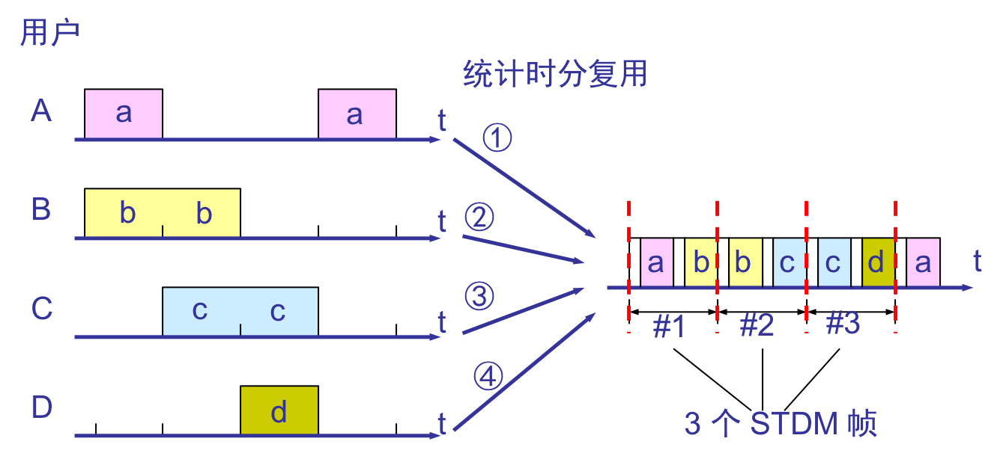
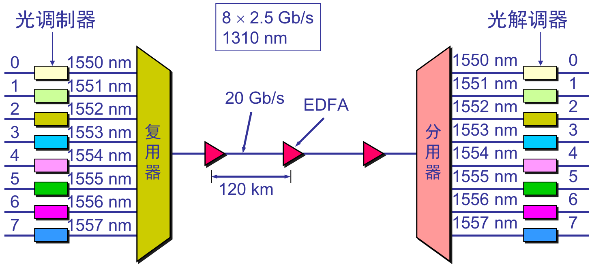

### **2.4.1 **为什么要使用信道复用技术？

1. 通信工程中通信线路架设的费用较高，需要充分利用线路的现有容量。

2. 传输介质的通信容量都会**超过**单一信道的传输通信量。

### 2.4.2 多路复用技术实质：

发送方使用_复用器_将多个用户数据合起来**共享**一条物理线路传输到接收端，接收端再使用分用器将数据分离成各个单独数据，分发给接收方多个用户。

### 2.4.3 多路复用的常用四种基本形式：

频分多路复用（FDM）、             波分多路复用（WDM）、

时分多路复用（TDM）；             码分多路复用（CDMA）

1、频分多路复用==》基本原理：在一条通信线路上设置多个信道，每路信道的信号以不用载波频率进行调制；即：多个用户在同一时间内占用不同的频率带宽（这里的带宽是频率带宽而不是数据的发送速率）；

【例题\*\*2.4\*\*】一通信线路可用带宽96KHZ，每个信道4KHZ，则该线路可以复用24个信号。每个信道分配给一个用户，可同时为24对用户提供服务；

再如：一电话通信标准话路带宽为4KHZ，若1000个用户进行频分复用，复用后总带宽为4MHZ；

2\*\*、时分多路复用\*\*è基本原理：所有用户在不同时间占用相同的频带宽度；

⑴、同步时分多路复用→将时间片预先分配给各个信道，并且时间片固定不变

同步时分多路复用示意图

显然由于计算机数据突发性，同步时分多路复用可能造成线路资源的浪费。它不考虑这些信道是否有数据发送。

使用时分复用系统传送计算机数据时，由于计算机数据的突发性质，用户对分配到的子信道的利用率一般是不高的

⑵、统计时分多路复用→允许动态地分配时间片；其原理如下图所示。假定各用户发送数据情况如上图左边

统计时分多路复用示意图

3\*\*、波分多路复用：波分复用就是光的频分多路复用，用于光纤通讯；

4\*\*、码分多路复用（CDM）\*\*è又称码分多址复用（CDMA）

⑴、码分多路的特征：

n 各用户使用经过特殊挑选的不同码型，因此彼此不会造成干扰。

n 这种系统发送的信号的抗干扰能力很强，其频谱类似于白噪声，不易被发现。

n 每一个比特时间划分为 m 个短的间隔，每个间隔称为一个码片，m个码片构成一个码元。

Ø 每个站被指派一个唯一的 m bit 码片序列。

l 如发送比特 1，则发送自己的 m bit 码片序列。

l 如发送比特 0，则发送该码片序列的二进制反码。

Ø 例如，S 站分配的 8 bit 码片序列是 00011011（一个码元）。

l 发送比特 1 时，就发送序列 00011011。

l 发送比特 0 时，就发送序列 11100100。

Ø S 站的码片序列：\(–1–1–1+1 +1–1 +1 +1\)

⑵、码分多路的工作原理：

每个站分配的码片序列不仅必须各不相同，并且还必须互相正交（在实用的系统中是使用伪随机码序列）。这种正交满足下列特征：

①\*\*.令向量表示站的码片向量，令 T 表示其他任何站T的码片向量，令表示其他任何站T的码片反码的向量，两个不同站的码片序列正交，就是向量和的规格化内积是0,同时向量和的规格化内积也是0\*\*,：

$$S•T≡\frac{1}{m}\sum_{i=1}^mS_iT_i=0$$ 且$$S•T^1≡\frac{1}{m}\sum_{i=1}^mS_iT_i^1=0$$

例如：令向量S为\(–1 –1 –1 +1 +1 –1 +1 +1\)，向量T为\(–1 –1 +1 –1 +1 +1 +1 –1\)

②\*\*.任何一个码片向量和该码片向量自己的规格化内积都是1\*\* 。  
$$S•S=\frac{1}{m}\sum_{i=1}^mS_i^2=\frac{1}{m}\sum_{i=1}^m(±1)^2=1$$  
③\*\*.一个码片向量和自身反码的向量的规格化内积值是–1\*\*  
$$S•S^=\frac{1}{m}\sum_{i=1}^mS_iS_i^1=\frac{1}{m}\sum_{i=1}^mS_i*(-S_i)=\frac{1}{m}\sum_{i=1}^m-1=1$$

CDMA的工作原理

当接收站打算接收S站发送的信号时，就用S站的码片序列\*\*与收到的复用信号求规格化内积，即$$S•S_X$$和$$S•T_X$$,显然$$S•T_X=0$$，$$S•S_X$$就是S站发的数据比特；

