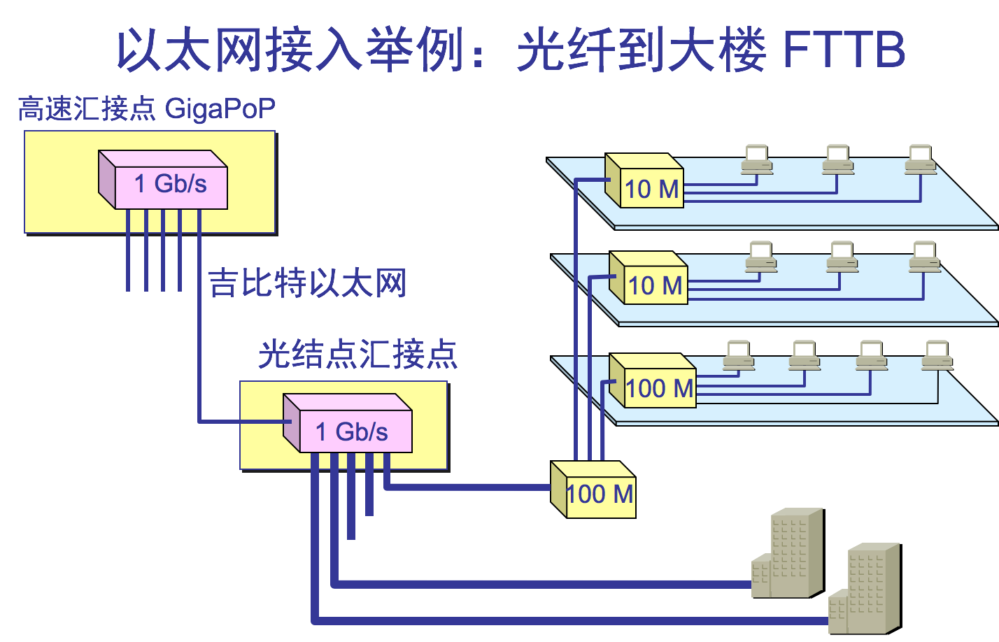

# 高速以太网

速率达到或超过100Mbps的以太网称为“高速以太网”； 高速以太网的发展主要得益于以下技术： 
①.高速传输介质技术； 
②.交换技术； 
③.全双工技术：不再受冲突域限制，带宽可提高一倍。 
④.编码技术； 
在双绞线上传送 100 Mb/s 基带信号的星型拓扑以太网，仍使用 IEEE 802.3 的CSMA/CD 协议。

## 3.6.1 100BASE-T 以太网

又称为快速以太网\(Fast Ethernet)

1、支持半双工和全双工方式，双工方式下CSMA/CD不起作用，此时称其为以太网主要是因为其帧格式不变。 
2、最短帧长仍为64B，最大帧长为1518B，但将网段的最大电缆长度减小到 100 m。 
3、争用期仍为512比特时间，帧间隙为0.96us（96比特时间）。 
4、覆盖范围减小到原来的十分之一。 
5、可直接利用原有线缆设施，只要更换一张适配器 和一个100MBPS的集线器即可升级到100Mbps. 
6、三种不同的物理层标准 
①.100BASE-TX使用 2 对 UTP 5 类线或屏蔽双绞线 STP。 
②.100BASE-FX使用 2 对光纤。 
③.100BASE-T4使用 4 对 UTP 3 类线或 5 类线。

## 3.6.2 吉比特以太网

1、帧格式不变。 
2、支持全双工和半双工（此时使用 CSMA/CD 协议）工作方式。 
3、使用载波延长（载波扩展技术）和分租突发技术。 
4、最短帧长仍然为64B，争用期增加为512B时间，当帧长处于64B～512B时需要填充到512B。 
载波扩展技术 若帧长小于512B,物理层在发完帧后紧接着再发送一个特殊的“载波扩展”符号序列，将整个发送长度扩展到512B；  
分租突发技术 一个站获得介质访问权后连续发送多个短帧时，第一个短帧采用载波扩展技术扩展为512B，以后的短帧就不必扩展而连续发送，但在所有的帧之间用载波扩展为填充帧与帧之间的间隔IPG（一个IPG共96b），以便使得其它站始终能够检测到载波，防止他们打断当前站的帧突发操作；（注意：一次帧突发的总长度上限是8192B）  
【例题3.10】半双工千兆位以太网中，要发送一个100B的帧，需要多长时间才发完？若要发送10个100B的帧，又需要多长时间才发完？  
解：    ①.采用“载波扩展技术” =》$$\frac{512B\*8bit/B}{100\*10^6bps}=4.096μs

$$
②.采用“帧突发技术技术”=>
∵512B*8bit/B+96bit*9+100B*8bit/B*9≦65536bit
∴$$\frac{512B*8bit/B+96bit*9+100B*8bit/B*9}{100*10^6bps}=12.16 μs
$$

5、吉比特以太网的物理层 
⑴、1000BASE-X：基于光纤通道的物理层： 
①.1000BASE-SX：SX表示短波长； 
②.1000BASE-LX：LX表示长波长； 
③.1000BASE-CX：CX表示铜线； 
⑵、1000BASE-T：使用 4对 5 类线 UTP； 
注意：当吉比特以太网工作在全双工方式时（即通信双方可同时进行发送和接收数据），不使用载波延伸和分组突发。 
6、吉比特以太网的配置举例

## 3.6.3 10 吉比特以太网

1、帧格式不变。  
2、只支持全双工，不使用 CSMA/CD 协议  
3、最小最大帧长不变。  
4、只使用光纤作传输媒体。

## 3.6.4 使用高速以太网进行宽带接入

## 2.8-其他类型的高速局域网接口
