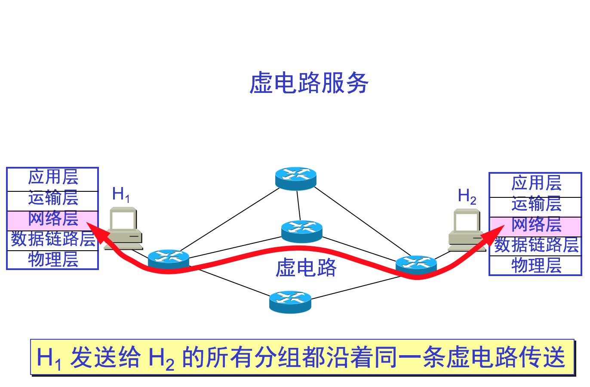
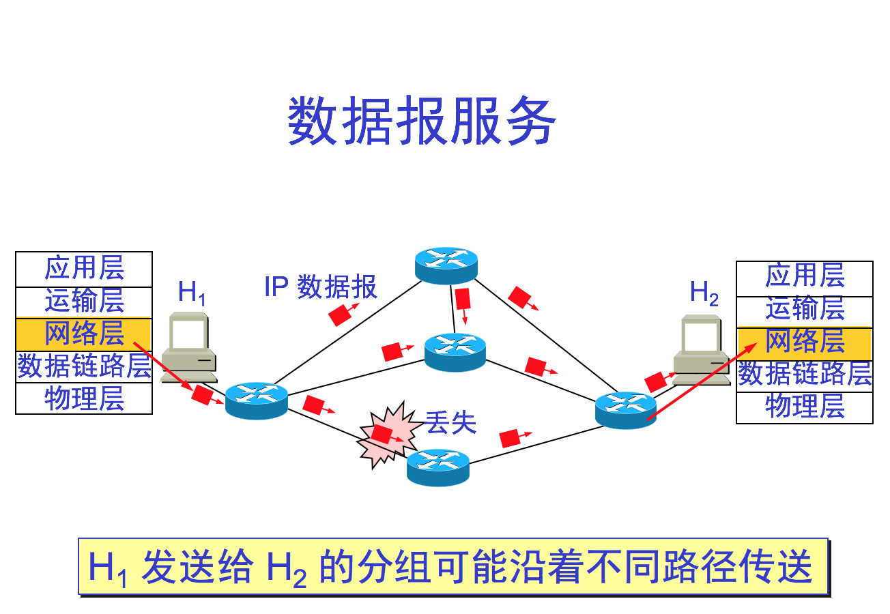

# Internet Layer

配置这两台电脑的IP地址、子网掩码和默认网关。

Internet Layer Protocols

* IP (Internet Protocol)
* ICMP (Internet Control Message Protocol)

Security 

* IPsec (Internet Protocol Security)

1、网络层的任务 以分组为单位将数据信息从源点传输到目的点。通过路由选择算法，为分组选择合适的路径。  
2、问题提出：网络层应向传输层提供怎样的服务？面向连接还是无连接？  
问题实质：是网络还是终端应当负责计算机通信的可靠性？  
电信网的成功经验显示该让网络负责可靠交付，即面向连接的通信方式；通讯前先建立虚电路，以保证双方通信所需的一切网络资源，再使用可靠传输的网络协议，使所发送的分组无差错地按序到达终点，也就是面向连接的虚电路服务。图示如下：

虚电路交换：建立连接、通信、拆除连接；与电路交换有相似，不同在于一个“虚“字，即虚电路仅仅表示一条逻辑上的连接，分组都沿着这条逻辑连接按照存储转发方式传送，并不是真正向电话一样建立了一条物理连接；  
    网络采用这种虚电路交换成本太大，终端设备具有很好的智能，所以没必要；  
因特网实际的设计思路：网络层向上层只提供简单灵活的、无连接的、尽最大努力交付的数据报服务。网络层不提供服务质量的承诺。图示如下：

表4-1：虚电路服务和数据报服务的对比

| 对比方面 | 虚电路服务 |数据报服务|
| :--- | :--- |:--- |
|思路  |  可靠通信由网络保证   | 可靠通信由用户主机保证  |
|连接建立  |  必须有   | 不需要  |
|终点地址  |  建立时使用，以后用虚电路号  |  每个分组必带  |
|分组转发  |  路由同一  |  独立选路  |
|结点故障  |  只要有一个结点故障就不能工作  |  路由可能变化  |
|分组顺序  |  按序到达  |  可能无序  |
|差错处理与流量控制 |   网络负责，用户也可负责  |  用户负责|

