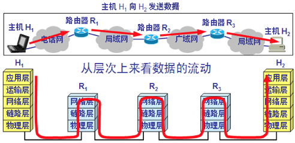
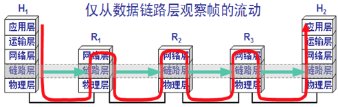

## 3.1 数据链路层基础知识

1. 数据链路层是OSI参考模型的第二层，上层是网络层。
2. 数据链路层主要目的：将原始的、有差错的物理线路变成无差错的数据链路
3. 数据链路层主要功能：
   1. 链路管理：数据链路的建立、维护、释放
   2. 帧同步：接收方应从收到的比特流中正确地判断出一帧的开始与结束位
   3. 流量控制：控制发送方的数据发送速度，使得接收方来得及接收，以致网络不发生拥塞
   4. 差错控制：发现传输中出现的错误
   5. 透明传输：采取适当措施，使接收方不至于将数据误认为是控制信息
   6. 寻址：收发双方应知道对方是谁
4. 数据链路层的简单模型：

   

   

5. 数据链路层使用的信道主要有以下两种类型：

   1. 点对点信道 -&gt; 这种信道使用一对一的【点对点通信方式】

   2. 广播信道 -&gt; 这种信道使用一对多的【广播通信方式】，过程较复杂。广播信道上链接的主机很多，必须使用专用的共享信道协议来协调这些主机的数据发送。

6. 基本概念：链路和数据链路

   1. 链路：是一条无源的点到点的物理路段，中间没有任何其他的交换结点。

      注意：一条链路只是一条通路的一个组成部分

   2. 数据链路：除了物理线路外，还必须有通信协议来控制这些数据的传输。若把实现这些协议的硬件和软件加到链路上，就构成了数据链路。

      即：数据链路 = 链路 + 控制数据传输的通信协议

      1. 现在最常用的方法是使用适配器\(即网卡\)来实现这些协议的硬件和软件

      2. 一般的适配都包括了数据链路层和物理层这两层的功能。

7. 数据链路层协议传输的数据单位：数据帧\(简称“帧”\)

   注意：物理层传输的数据单元是【比特】，网络层传输的数据单元是【IP数据包】\(简称：数据报、分组、包\)

8. 实现数据链路层协议的最常用设备：网络适配器（即：网卡或网络接口卡）

