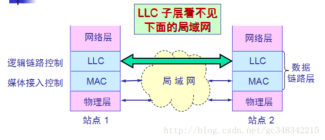

### 3.3 使用广播信道的数据链路层

### 3.3.1 局域网的数据链路层

1、局域网的特点\*\*

⑴、网络为一个单位拥有、且地理范围和站点数目有限è最主要的特点；

⑵、使用广播信道è具有广播功能，从一个站点可很方便地访问全网。局域网上的主机可共享连接在局域网上的各种硬件和软件资源；

⑶、易于系统扩展和逐渐地演变，各设备的位置可灵活调整和改变；

⑷、提高了系统的可靠性、可用性和生存性；

⑸、速率高、误码率低；

⑹、各站点平等；

2**、局域网按拓扑结构分类**

⑴、星型网è广泛使用；

⑵、环型网è典型的环型网是令牌环网；

⑶、总线型网è站点直接连在总线上，匹配电阻吸收信号电磁波能量，避免电磁波反射；使用的协议有两种：CSMA/CD（已演变成星型网）和令牌（逻辑是令牌环网，目前已经退出市场）；

⑷、树型网：有总线型网演变而来，使用频分复用技术；

### 

3\*\*、局域网工作层次è跨物理层和数据链路层，无需网络层\*\*；

4\*\*、共享信道的媒体共享技术\*\*：

⑴、静态划分信道è如以前说的频分、时分、波分和码分等多路复用技术；

优点：用户分配到信道就不会发生冲突；

缺点：代价高，不适合LAN；

⑵、动态媒体接入控制è（又称：多点接入）信道并非固定给某用户。它又分两类：

①\*\*.\*\*随机接入：所有用户可以随机发送信息，可能出现冲突（我们讨论的重点）。

②\*\*.\*\*受控接入：所有用户不能随机发送信息，服从统一控制（目前局域网少用）。

传统以太网指10Mbps以太网，现在已发展到百兆、千兆、万兆。

5\*\*、以太网的两个标准\*\*

①\*\*.\*\*DIX Ethwrnet V2\(1982\) 标准 è由DEC、Intel、xerox三家公司联合推出。1980年发布第一版。

②\*\*.\*\*802.3以太网标准è由IEEE 802 委员会于1983年提出，与DIX Ethwrnet V2差别不大，因此可以将 802.3 局域网简称为“以太网”，但严格说来，“以太网”应当是指符合 DIX Ethernet V2 标准的局域网。

IEE802委员会把局域网的数据链路层分为LLC和MAC两个子层：

逻辑链路控制 LLC \(Logical Link Control\)\*\*子层\*\*è与传输媒体无关。建立和释放逻辑连接，给帧编号。

媒体接入控制 MAC \(Medium Access Control\)\*\*子层\*\*è与传输媒体有关。组装成帧、解析帧、地址识别、差错控制、管理和控制对局域网传输介质的访问。

注意：由于TCP/IP 体系经常使用的局域网标准是DIX Ethwrnet V2标准，IEE802.3标准的以太网很少使用，IEE802委员会制定的LLC子层的作用已经消失，大多数厂家生产的网卡只用MAC子层。

6\*\*、适配器的作用\*\*：（ 适配器又称为“网络接口卡”或“网卡” ）

⑴、并/串行转换；               ⑵、对数据缓存；         ⑶、实现以太网协议；

注意： ①.在计算机的操作系统必须安装网卡驱动程序，由它告知网卡如何取数等

②.网卡把帧发送到局域网或从局域网接收并处理帧都不适用CPU，当需要把处理后的正确帧交给协议栈中的网络层时使用中断方式通知CPU（参见P79图3-15）；

### 3.3.2 CSMA/CD 协议（带有冲突检测的载波侦听多路访问方法）

最早的以太网是将许多的计算机都连接到一根总线上。

**1\***\*、总线的特点\*\*è当一台计算机向总线发送数据时，总线上所有计算机都能检测到这个数据；

**2\***\*、总线以太网如何实现一对一通信？\*\*

每个计算机的适配器都拥有一个与其它计算机适配器不同的地址。只有帧首部的目的地址与该地址一致时，适配器才接受数据帧，否则丢弃该帧

**3\***\*、以太网通信的两种措施：

**⑴、**采用无连接的广播工作方式è不必先建立连接就直接发送数据，尽最大努力交付，发现数据帧就丢弃。对发送的数据帧不编号，也不要求对方发回确认（理由是局域网信道的质量很好），差错的纠正即重传操作由网络层处理；

**⑵、**数据采用曼彻斯特编码。

规则：每比特的周期T分为前T/2和后T/2，前T/2传送该比特反码，后T/2周期该比特原码；即：位中间正跳变表示0，位中间负跳变表示1

**问题**è如何协调总线各计算机的工作？保证同一时间只允许一台计算机发送信息。

**方法**è采用CSMA/CD协议。

**4\***\*、CSMA/CD简介：\*\*

**⑴、\***\*CSMA/CD协议的三个要点\*\*：

**①.**多点接入è许多计算机以多点接入的方式连接在一根总线上；

**②.**载波监听è先听后发：用电子技术检测总线上有无其它计算机发送的信号；

**③.**碰撞检测è边发边听：若发送数据期间检测到信道是上信号电压变化幅度增大，则表明出现冲突。若出现冲突，立即停发，等待一个随即时间后重发。

**注意**è当某站点监听到总线空闲时，总线并非一定空闲。这是因为数据传播有延迟。

**问题**è发送站要经过多长时间才能知道自己有没有与别的站发生冲突呢？举例画图说明。

显然CSMA/CD协议的以太网只能进行半双工通信。最先发送数据帧的站，在发送数据帧后至多经过时间 2_t_（两倍的端到端往返时延）就可知道发送的数据帧是否遭受了碰撞，以太网的端到端往返时延**2**τ 称为**争用期**，或**碰撞窗口；**若经过争用期后还没检测到冲突，则可肯定不会有冲突。

**⑵、二进制指数退避算法**èCSMA/CD发现冲突到再次发送之间的时间确定方法：

**①\***\_.**确定基本退避时间，它就是2τ。**以太网取2t=51.2us\*\*（以太网实际端到端时延小于25.6us，取2τ =51.2 us是考虑其它因素，如转发器增加的时延）。对于10MBb/S以太网在51.2us内可发送64字节，也可以说争用期是512比特的发送时间。

**②\***\*.\*\*第k次重传时，从离散整数集合中{0,1,……，（$$2^k-1$$）}中随机取一个数r，重传等待时间即为2rτ。其中k=Min{重传次数，10}，即当重传次数大于10时k取10。

**③\***\*.\*\*当重传达16次人不能成功时，丢弃该帧并报告上层。适配器每发一次新帧，执行一次CSMA/CD算法，无记忆功能。

因为发送64字节后没发现冲突才能肯定不会发生冲突，故10MBb/S以太网规定了最短帧长为64字节，凡小于64字节帧均视为无效帧。

**⑶、强化碰撞**è发送数据的站点发现冲突后，立即停止发送数据，还要再发送32bit或48bit的**人为干扰信号**，以便所有用户知道信道发生了冲突。

以太网还规定帧间间隔最少为**9.6us**，即96bit时间。为了让接收站来得及处理刚收到的帧，并做好接收下一帧准备。

**5\***\*、CSMA/CD要点归纳如下\*\*：

⑴、适配器从网络层接收到一个分组，加上以太网手部和尾部，组成以太网帧。放入适配器缓存，准备发送。

⑵、若检测到信道空闲（即96比特时间内没有检测到信道上有信号）就发送这个帧。若信道忙，继续检测并等待信道转为空闲后再发。

⑶、数据发送过程中继续侦听，若发送过程中一直未检测到碰撞，则顺利发送，若检测到碰撞，则终止发送，并发送人为干扰信号。

⑷、在中止发送后，执行二进制指数退避算法，等待r倍争用期，返回步骤⑵；

总结：**先听后说、边听边说、冲突停说、等待时机再说**；

例题分析：某以太网的数据速率为100Mbps，信号速率为200000km/s，求最大网络跨距？

解：因为 发送最小帧64B需要的时间为$$T_1=\frac{64B*8bit/B}{100Mbps}=5.12μs$$  
信号来回时间$$T_2=\frac{2S}{V}=\frac{2*S}{200000km/s}$$,要求$$Τ_1≧T_2$$  
所以$$\frac{2*S}{200000km/s}≦5.12μs$$，即S≦512m

