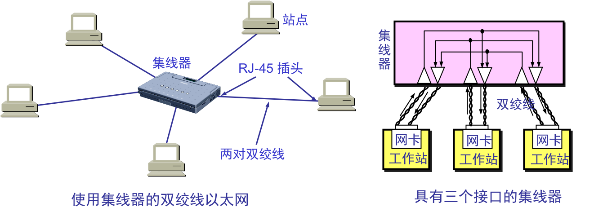
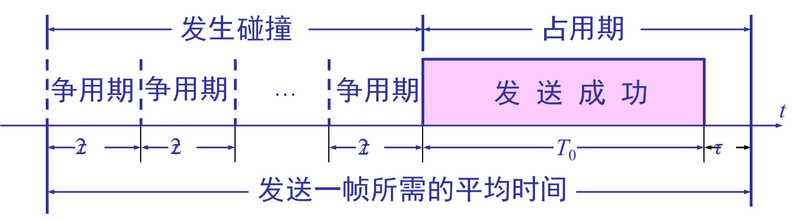
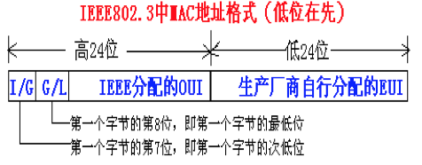
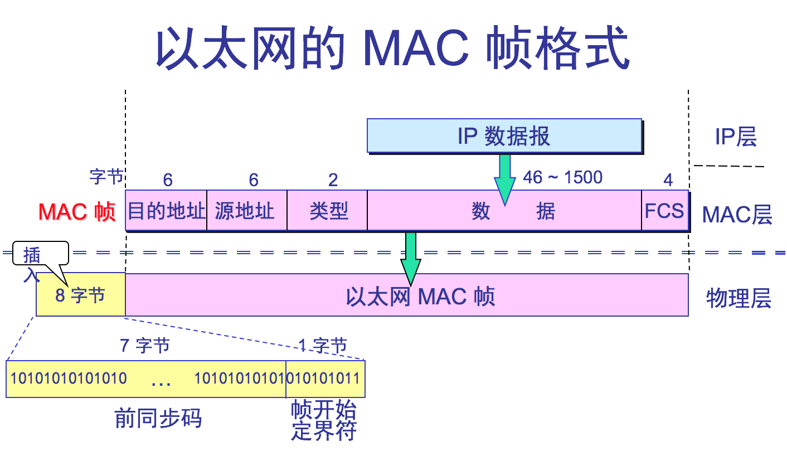

### 3.4.1、使用集线器的星型拓扑以太网简介：

1、发展历程：粗同轴电缆以太网--》细同轴电缆以太网--〉双绞线以太网；  
2、使用两对无屏蔽双绞线分别用于接收和发送，使用RJ-45插头。这种以太网采用星形拓扑，在星形的中心则增加了一种可靠性非常高的设备，叫做集线器\(hub\)

3、星形网10BASE-T双绞线以太网：  
10---》代表10Mbps，BASE ---〉表示基带信号，T---》代表双绞线。  
不使用电缆而使用无屏蔽双绞线。双绞线能够传送高速数据的主要措施是把双绞线的绞合度做得非常精密。不仅可使特性阻抗均匀以减少失真，而且大大减少了电磁波辐射合无线电频率的干扰。每个站需要用两对双绞线，分别用于发送和接收。  
集线器使用了大规模集成电路芯片，因此硬件设备的可靠性已大大提高了。  
10BASE-T 的通信距离稍短，每个站到集线器的距离不超过 100 m。  
10BASE-T 双绞线以太网的出现，是局域网发展史上的一个非常重要的里程碑，它为以太网在局域网中的统治地位奠定了牢固的基础。  
4、集线器的特点  
⑴、使用集线器的以太网在逻辑上仍是一个总线网，各站点适配器采用CSMA/CD协议。在物理上是一个星型网。  
⑵、集线器有多个接口，8~16个。  
⑶、工作在物理层，仅简单转发比特，不进行冲突检测。  
⑷、采用专门芯片，可进行自适应串音回波抵消，这样使得接口转发出去的强信号不干扰接口接收到的弱信号（这种干扰称“近端串音”干扰）转发比特前要进行再生整形并重新定时；  
集线器本身比较可靠，现在堆叠式集线器口由4~8个集成口堆叠起来使用，具有少量容错功能和网络管理功能，各模块可热拔插。指示灯可显示网络上的故障，给网管带来方便，可自动检测到故障适配器，并断开其连接。

### 3.4.2、以太网信道利用率

一个帧从开始发送，经可能发生的数次碰撞后再重传，到发送成功且信道转为空闲（即再经过时间 t  使得信道上无信号在传播 ？）时为止，是发送一帧所需的平均时间。

设：帧长为 L \(bit\)，数据发送速率为 C \(bps\)， ∴帧发送时间为$$T_0=\frac{L}{C}$$  
令$$a=\frac{τ}{Τ_0}$$  --&gt;以太网参数，a越大， τ所占得比例越大，信道利用率越低a→0,利用率增大。  
信道极限利用率 $$S_{max}=\frac{T_0}{T_0+τ}=\frac{1}{1+a}$$ ，即：没有冲突，但这是不可能的。

### 3.4.3、以太网的MAC层

1、MAC层的硬件地址---&gt;局域网中硬件地址又称物理地址或MAC地址。  
现在局域网适配器都是用6B（48bit）的全球地址，固化在适配器的ROM中，这种 48 位地址称为 MAC-48，它的通用名称是EUI-48。因此：  
⑴、更换新的适配器，尽管计算机地理位置没有变，这台计算机在局域网中的硬件地址也就变了。  
⑵、若计算机地理位置变了，只要适配器没变，则硬件地址不变。  
IEEE的注册管理机构RA是局域网全球地址法定管理机构。它负责分配48位中的高24位，称为组织唯一标识符OUI，代表组织唯一标识，低24位由厂家指派，称为扩展唯一标识符EUI。如：3COM公司的高24位为02-06-8C。  
一个公司可能有几个组织标识符。几个公司也可以共用以一个组织标识符。  
注意：MAC地址的两种记法  
一种是字节的高位在先（左），一种是字节的低位在先（左）。  
【例题3.7】AC-DE-48-00-00---80  
802.5中  10101100-11011110-01001000-00000000-00000000-10000000高位在先  
802.3中  00110101-01111011-00010010-00000000-00000000-00000001低位在先  
此外：IEEE考虑可能有人不愿意向IEEE的RA购买OUI，规定MAC地址的第一个字节的最低位为I/G位（0表示单播地址，1表示组播地址），次低位为G/L位（0表示本地管理地址，1表示全球管理地址）；  
全球管理地址向IEEE的RA购买OUI；  
本地管理地址不向IEEE的RA购买OUI，用户可任意分配网络上的地址；  
IEEE802.3中MAC地址格式（低位在先）

所以：全球管理地址共有246个地址，超过70万亿个。  
2、适配器检查 MAC 地址：  
⑴、适配器从网络上每收到一个 MAC 帧就首先用硬件检查 MAC 帧中的 MAC 地址.  
①.如果是发往本站的帧则收下，然后再进行其他的处理。  
②.否则就将此帧丢弃，不再进行其他的处理。  
⑵、“发往本站的帧”包括以下三种帧：  
①.单播\(unicast\)帧（一对一）---&gt;I/G位=0；  
②.多播\(multicast\)帧（一对多）---&gt; I/G位=1；  
③.广播\(broadcast\)帧（一对全体）---&gt; 48位MAC地址全1；  
所有适配器都应至少识别单播帧和广播帧。  
3、以太网的MAC帧格式  
常用的以太网MAC帧格式有两种标准：  
⑴、IEEE 的 802.3 标准；  
⑵、DIX Ethernet $$V_2$$ 标准（Ethernet II）---&gt;最常用；

> 两种帧格式的字段都非常相似，区别在于Ethernet II的长度值在0～1500范围内，而1536～65535（从0x0600到0xFFFF）的范围保留给IEEE802.3的帧格式的类型使用。

  
 ①.    前同步码---&gt;用于位同步，使接收端适配器与比特流达成同步，前7个字节为10交替码；帧开始定界符用于帧同步，第8个字节为1010101011；  
②.    目的MAC地址；  
③.    源MAC地址；  
④.    类型高层使用何种协议，8137H表示novell ipx数据、0800H表示IP数据；  
⑤. 客户数据字段46~1500字节，不足46B需填充，填充操作由IP层完成。  
客户数据字段的最小长度 = 最小帧长度 64 字节 - 18 字节的首部和尾部  
⑥.    FCSCRC检验；

7. 以太网的每个数据帧除了自身数据外还有前后两部分数据，帧前的8B数据包括前同步码和帧开始定界符，帧后有用于帧间隙（Inter Frame Gap）传输的12B数据，原因是帧和帧之间需要有一段时间来让接收服务器做准备接收下一帧。数据帧的长度最小是64B，如果发送的数据不到这个长度需要不零凑齐。

注意同步光纤网SONET和同步数字系列SDH不需前同步码；  
IEEE 802.3的MAC帧格式与以太网V2 帧格式差别仅仅是：类型字段并不表示高层使用何种协议，而是表示客户数据字段的长度；  
4、无效帧以下帧为无效帧：  
①.    数据字段的长度与长度字段的值不一致；  
②.    帧的长度不是整数个字节；  
③.    用收到的帧检验序列 FCS 查出有差错；  
④.    数据字段的长度不在 46 ~ 1500 字节之间。  
⑤.    MAC 帧长度长度不在64 ~ 1518 字节之间。  
⑥.    对于检查出的无效 MAC 帧就简单地丢弃。以太网不负责重传丢弃的帧。  
5、帧间最小间隔：  
①.    帧间最小间隔为 9.6 μs，相当于 96 bit 的发送时间。  
②.    一个站在检测到总线开始空闲后，还要等待 9.6 ms 才能再次发送数据。  
这样做是为了使刚刚收到数据帧的站的接收缓存来得及清理，做好接收下一帧的准备。

### 

3.5.1****、在物理层扩展以太网**è 使用**集线器**扩展

因为信号在传输过程中会衰减，导致CSMA/CD协议无法正常工作。**802****，****3****标准**规定单个网段不超过500米长，两个网段之间可用转发器连接起来，但任意两个站点最多可经过**3****个电缆网段**。可以采用以下两种途径扩展：

**⑴、**用光纤取代双绞线è可扩展以太网覆盖范围：由于光纤带来的时延小，带宽高，需要光纤调制解调器，进行光/电信号转换。

**⑵、**使用多级集线器，就可以连接成覆盖范围更大的多级星型以太网。

使用多级集线器可带来以下**好处******

**①****.**原先不同以太网之间不能通信，现在却可以。 

**②****.**扩大了以太网范围。主机与集线器之间距离最大100米，集线器与集线器之间距离也可是100米（10BASE-T）。

使用多级集线器可带来以下**缺点******

**①****.**多个碰撞域成为一个碰撞域，碰撞域增大了，但总的吞吐量并未提高

②.

不同技术以太网（如数据率不同的以太网）不

**①****.**确定基本退避时间，它就是2。**以太网取****2****t****=51.2us**（以太网实际端到端时延小于25.6us，取2*t* =51.2 us是考虑其它因素，如转发器增加的时延）。对于10MBb/S以太网在51.2us内可发送64字节，也可以说争用期是512比特的发送时间。 

**②****.**第k次重传时，从离散整数集合中{0,1,……，（2k-1）}中随机取一个数r，重传等待时间即为2r，其中振幅有2种，相位有4种，每个振幅和相位对应的构成一个码元，则有8种码元，每种码元代表3个二进制比特；

​       显然：若每一个码元可表示的比特数越多，则在接收端进行解调时要正确识别每一种状态就越困难。 

