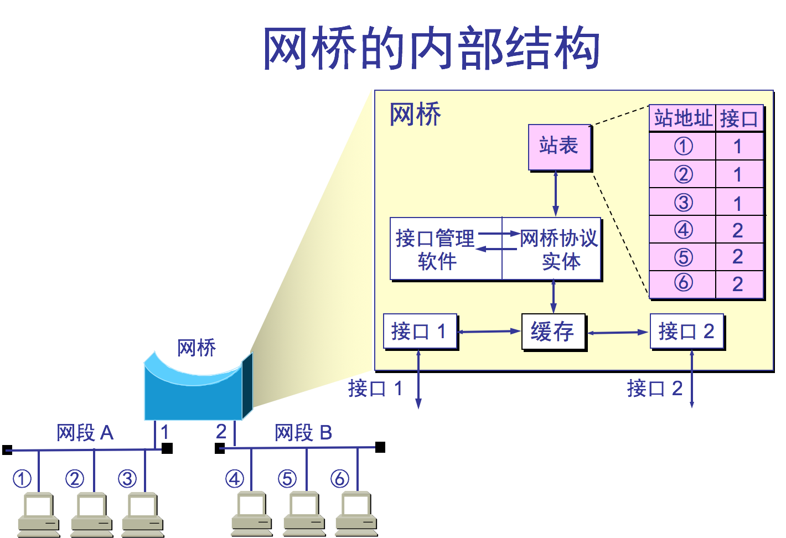
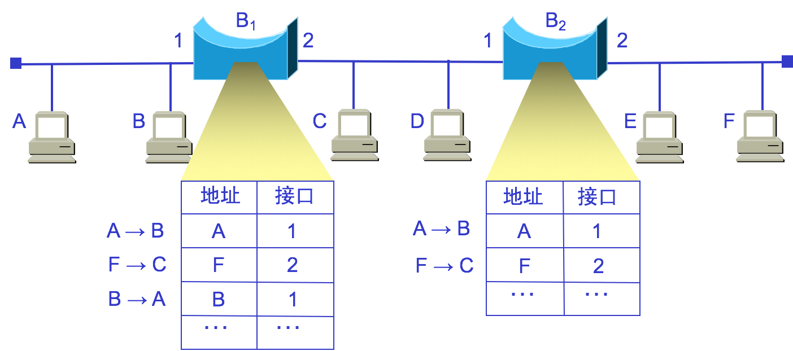

### 3.5.1 在物理层扩展以太网--&gt; 使用集线器扩展

因为信号在传输过程中会衰减，导致CSMA/CD协议无法正常工作。802，3标准规定单个网段不超过500米长，两个网段之间可用转发器连接起来，但任意两个站点最多可经过3个电缆网段。可以采用以下两种途径扩展：  
⑴、用光纤取代双绞线可扩展以太网覆盖范围：由于光纤带来的时延小，带宽高，需要光纤调制解调器，进行光/电信号转换。

⑵、使用多级集线器，就可以连接成覆盖范围更大的多级星型以太网。

使用多级集线器可带来以下好处  
①.原先不同以太网之间不能通信，现在却可以。  
②.扩大了以太网范围。主机与集线器之间距离最大100米，集线器与集线器之间距离也可是100米（10BASE-T）。  
使用多级集线器可带来以下缺点  
①.多个碰撞域成为一个碰撞域，碰撞域增大了，但总的吞吐量并未提高  
②.不同技术以太网（如数据率不同的以太网）不能用集线器互连

### 3.5.2 在数据链路层扩展以太网  使用网桥扩展

两个以太网通过网桥连接起来后，就成为一个覆盖范围很大的以太网，原先的每个以太网称一个网段（每个网段处在各自独立的冲突域中）。  
①.网桥工作在数据链路层，它根据 MAC 帧的目的地址对收到的帧进行转发；  
②.网桥具有过滤帧的功能。当网桥收到一个帧时，并不是立即转发帧，而是先检查帧的目的MAC 地址，然后确定是丢弃还是将该帧转发到哪一个接口；  
1、网桥的内部结构：  
网桥依靠转发表来转发帧；  
【例题3.8】

若网桥从接口1受到A发给E 的帧，查转发从2转发出去，若网桥从接口2收到F给E的帧，查表后丢弃该帧。  
⑴、使用网桥的好处  
①.过滤通信量，增大吞吐量不同网段上间部通信时互不干扰。  
但不同网段间通信时，这两个网段上其它站点不能通信，但不影响这两个网段外的其它网段。每个端口一个碰撞域。  
②.扩大的了物理范围增加以太网上工作站的最大数目。  
③.提高了可靠性当网络出现故障时，只影响个别网段。  
④.可互连不同以太网不同物理层、不同MAC子层，不同速率。  
⑵、网桥的缺点  
①.先存储、后转发，转发时执行CSMA/CD算法，增加了时延。具有不同 MAC 子层的网段桥接在一起时时延更大。  
②.MAC子层没有流量控制，可能因缓存不够丢失帧。  
③.可能产生广播风暴，扩展的以太网共一个广播域，若网桥之间通过点对点转发帧时若采用PPP协议，则在帧的头部和尾部再加上PPP-H和PPP-T。  
注意 网桥转发帧时不改变源地址。  
⑶、网桥和集线器（或转发器）的区别  
    集线器在转发帧时，不对传输媒体进行检测。  
    网桥在转发帧之前必须执行 CSMA/CD 算法。

2、透明网桥   目前使用得最多  
⑴、透明网桥是指以太网网站点并不知道所发送的帧将经过哪几个网桥，即网桥对站点是透明的。   
透明网桥是一种即插即用设备，无需人工配置，其标准是 IEEE 802.1D。当网桥刚连接到以太网时，其转发表是空的。网桥使用自学习法逐步建立起转发表的。  
转发表每项记录的信息结构MAC地址 + 接口 + 帧进入该网桥的时间；  
⑵、透明网桥的自学习原理 若从站点A发出的帧从接口X进入了某网桥，那么从这个接口出发，沿相反方向一定可以把一个帧传送到A。所以网桥每收到一个帧时检查是否有相应的表项，若有修改时间信息，若无则建立新的表项。建立转发表时把帧的源地址写在地址一栏，转发帧时，则是根据帧的目的地址转发。  
【例题3.9】A向B发送帧，分析F向C发送帧和B向A发送帧的过程。

网桥的转发表要反应网络最新拓扑状态若某表项建立时间过长，则删除（因为该表项可能无用）。  
⑶、网桥的自学习和转发帧的步骤：  
自学习 网桥收到一帧后，查找转发表中有无与源地址匹配的项目，若有，则更新（接口时间），若无，增加一个新表项：地址、接口、时间。  
转发帧 若帧的目的地址与转发表中所有表项不匹配，则向除进入接口以外的其它所有接口转发，若与转发表中给出接口相同，则丢弃该帧，若进入的接口与转发表给出接口不同，则按转发表给出的接口进行转发。   
网桥工作原理简述：学习源地址、过滤本网段帧、转发异网段帧、广播未知帧；  
⑷、透明网桥的生成树算法 目的：避免帧在网络中不停地兜圈子，白白耗费资源。  
互连在一起的网桥在进行彼此通信后，就能找出原来的网络拓扑的一个子集。在这个子集里，整个连通的网络中不存在回路，即在任何两个站之间只有一条路径

互连在一起的网桥在进行彼此通信后，就能通过生成树算法找出原来的网络拓扑的一个子集。在这个子集里，整个连通的网络中不存在回路，即在任何两个站之间只有一条路径。   
生成树算法每个网桥都有一个唯一的标示符，通常取网桥MAC加一个优先级，网桥每个端口有一个路径代价（端口将数据发送到相连局域网的代价，可人工配置）：  
第一步：“决定根网桥”，取优先级最高者，同优先级取MAC最小者；  
    选根期间各网桥广播自己的BPDU（网桥协议数据单元）表明自己的标示符，当收到比自己优先级高的BPDU时就不再广播自己的BPDU而转发高优先级的BPDU，最终只产生一个根端口；  
第二步：“决定非根网桥的根端口”，从它出发到根网桥路径代价最小的端口；  
方法是根网桥广播一个BPDU，非根网桥在各端口收到此BPDU后检测出代价，从而决定根端口；  
第三部：“决定指定网桥和各网络的指定端口”，指定网桥就是本网络A到达另一网络B路径代价最小的网桥，由它负责本网络A与B之间的数据交换（一个网络可能有多个通向数个网络的多个指定网桥）；指定端口就是网络与指定网桥的相连端口，其它非指定端口被阻塞；

注意：①.生成树是动态生成的；  
②.透明网桥容易安装，但网络资源的利用不充分；  
3、源路由网桥由发送帧的源站负责路由选择的网桥。  
源站发送帧时将详细的路由信息放在帧的首部中；  
为发现合适了路由，源站以广播方式向目的站发送一个发现帧，作探测之用。发现帧在整个扩展的以太网上沿所有可能的路径传送。在传送过程中，每个发现帧都记录所经过的路由。当这些发现帧到达目的站时，就沿着各自路由返回源站。源站从各种路由中选择一个最佳路由。以后，凡从这个源站向该目的站发送的帧，其首部都必须携带源站所确定的路由信息。  
结果：每个站都有一个描述通向其它所有网络的最短路径树（最小生成树）；  
注意发现帧的另一个作用：确定网络可通过的最大帧长。  
4、多接口网桥“以太网交换机” ，又称“二层交换机”或“交换式集线器”  
以太网交换机工作在数据链路层，实际上是一个多接口网桥。  
⑴、以太网交换机的特点   
①.以太网交换机的每个接口都直接与主机相连，一般都工作在全双工方式。  
②.交换机能同时连通许多对的接口，使每一对相互通信的主机都能像独占通信媒体那样，进行无碰撞地传输数据，从而增加总容量。   
③.以太网交换机由于使用了专用的交换结构芯片，所以交换速率高。  
⑵、二层交换机与网桥的区别   
①.接口数量和类型多。  
②.转发速度更快：存储转发方式、直通式（不进行差错控制）。  
③.每个接口可直接接主机或另一集线器。网桥接口只接以太网网段。  
④.可支持网络管理。  
⑤.可支持VLAN技术。  
⑶、交换机与集线器的不同点   
①.工作层次不同：交换机工作在数据链路层，集线器工作在物理层。  
②.传输数据方式不同：交换机转发，集线器广播。  
③.带宽占用方式不同：交换机用户独占带宽，集线器用户共享带宽。  
④.传输模式不同：交换机全双工，集线器半双工。  
⑤.碰撞域不同：集线器所有接口是一个碰撞域，交换机每个接口是一个独立的碰撞域。  
⑷、利用以太网交换机可以很方便地实现虚拟局域网  VLAN（虚拟局域网）  
    虚拟局域网 VLAN 是由一些局域网网段构成的与物理位置无关的逻辑组。  
    这些网段具有某些共同的需求。  
    每一个 VLAN 的帧都有一个明确的标识符，指明发送这个帧的工作站是属于  
哪一个 VLAN。  
    虚拟局域网其实只是局域网给用户提供的一种服务，而并不是一种新型局域网。

VLAN的优点  
①.可控制广播风暴，广播只在同一个VLAN中。  
②.提高网络整体安全性，例财务部门不希望别的部门看到其数据。  
③.网络管理简单、直观。同一VLAN种主机无需放在同一物理空间。  
实现虚拟局域网主要的三种途径  
①.基于端口的虚拟局域网：ACCESS模式和TRUNK模式；  
②.基于MAC地址之的VLAN；  
③.基于IP 地址的VLAN；  
虚拟局域网使用的以太网帧格式（802.3ac协议）  
在以太网帧格式中插入一个4字节标识符，称VLAN标记，用来知名发送该帧的工作属于哪一个虚拟局域网。

VLAN标记的前两个字节总是8100H.后两个字节中前三位是用户优先级字段，第4位是规范格式指示符，最后12位是VLAN 标识符VID。  
插入4字节标识符后，以太网最大长度变为1522B。  
3.5.3、在网络层扩展以太网 使用路由器扩展（局域网扩展成广域网）

