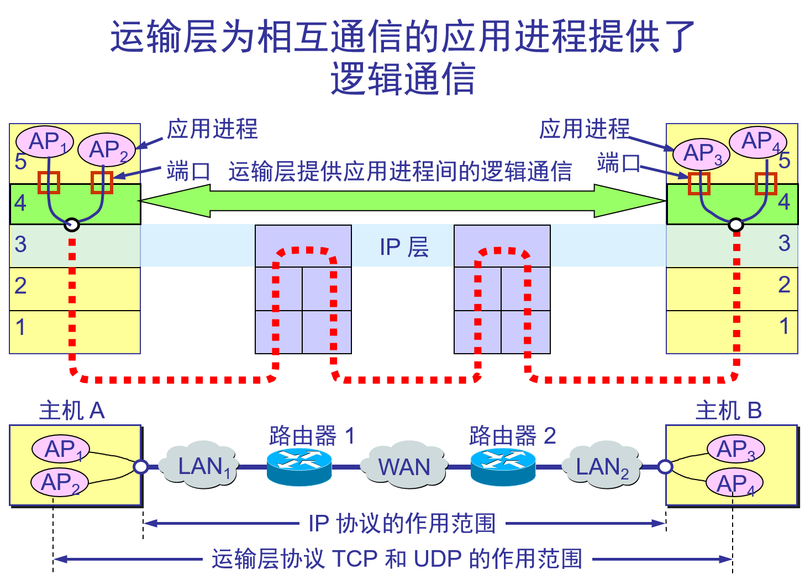

# 传输层

传输层：Transport Layer 

https://www.wikiwand.com/en/Transport_layer

Transport Layer Services：

* Connection-oriented communication
* Same order delivery
* Reliability
* Flow control
* Congestion avoidance
* Multiplexing

## 运输层协议

运输协议数据单元TPDU (Transport Protocol Data Unit) 是指两个对等运输实体在通信时传送的数据单位。
* TCP 传送的数据单元：**TCP报文段**；
* UDP 传送的数据单元：**UDP 报文**或 **用户数据报**；

TCP/IP 体系中的运输层协议（参见P182表5-1）:TCP/IP 的运输层有两个不同的协议； Transport Layer Protocols

* **传输控制协议 TCP**（Transmission Control Protocol）：TCP提供可靠的、面向连接的服务，开销较大。TCP在传送数据之前必须先建立连接，数据传送结束后要释放连接。TCP不提供广播或者多播服务。 

* **用户数据报协议 UDP**（User Datagram Protocol）：UDP提供不可靠的、无连接的服务，开销较小。UDP 在传送数据之前不需要先建立连接。对方的运输层在收到 UDP 报文后，不需要给出任何确认。虽然 UDP 不提供可靠交付，但在某些情况下 UDP 是一种最有效的工作方式。

强调解释:

* ①.当运输层采用面向连接的 TCP 协议时，TCP 报文段是在运输层抽象的端到端逻辑信道中传送，尽管下面的网络是不可靠的（只提供尽最大努力服务），这种逻辑信道就相当于一条全双工的可靠信道，逻辑信道不知道究竟经过了哪些路由器，而这些路由器也根本不知道上面的运输层是否建立了 TCP 连接。

* ②.当运输层采用无连接的UDP协议时，这种逻辑通信信道是一条不可靠信道。运输层的 UDP 用户数据报与网际层的IP数据报有很大区别。IP 数据报要经过互连网中许多路由器的存储转发，但 UDP 用户数据报是在运输层的端到端抽象的逻辑信道中传送的。 

运输层协议和网络层协议的主要区别： 

* **运输层的TCP 和 UDP 协议为进程之间提供逻辑通信**；
* **网络层的IP 协议为主机之间提供逻辑通信**；

## TCP和UDP的区别

一般面试的时候我问这两个协议的区别，大部分人会回答，TCP是面向连接的，UDP是面向无连接的。

什么叫面向连接，什么叫无连接呢？在互通之前，面向连接的协议会先建立连接。例如，TCP会三次握手，而UDP不会。为什么要建立连接呢？你TCP三次握手，我UDP也可以发三个包玩玩，有什么区别吗？

**所谓的建立连接，是为了在客户端和服务端维护连接，而建立一定的数据结构来维护双方交互的状态，用这样的数据结构来保证所谓的面向连接的特性。**

例如，**TCP提供可靠交付**。通过TCP连接传输的数据，无差错、不丢失、不重复、并且按序到达。我们都知道IP包是没有任何可靠性保证的，一旦发出去，就像西天取经，走丢了、被妖怪吃了，都只能随它去。但是TCP号称能做到那个连接维护的程序做的事情，这个下两节我会详细描述。而**UDP继承了IP包的特性，不保证不丢失，不保证按顺序到达。**

再如，**TCP是面向字节流的**。发送的时候发的是一个流，没头没尾。IP包可不是一个流，而是一个个的IP包。之所以变成了流，这也是TCP自己的状态维护做的事情。而**UDP继承了IP的特性，基于数据报的，一个一个地发，一个一个地收。**

还有**TCP是可以有拥塞控制的**。它意识到包丢弃了或者网络的环境不好了，就会根据情况调整自己的行为，看看是不是发快了，要不要发慢点。**UDP就不会，应用让我发，我就发，管它洪水滔天。**

因而**TCP其实是一个有状态服务**，通俗地讲就是有脑子的，里面精确地记着发送了没有，接收到没有，发送到哪个了，应该接收哪个了，错一点儿都不行。而**UDP则是无状态服务。**通俗地说是没脑子的，天真无邪的，发出去就发出去了。

我们可以这样比喻，如果**MAC层定义了本地局域网的传输行为**，**IP层定义了整个网络端到端的传输行为**，这两层基本定义了这样的基因：网络传输是以包为单位的，二层叫帧，网络层叫包，传输层叫段。我们笼统地称为包。包单独传输，自行选路，在不同的设备封装解封装，不保证到达。基于这个基因，生下来的孩子UDP完全继承了这些特性，几乎没有自己的思想。

## 进程之间的通信

- 从通信和信息处理的角度看，**运输层向它上面的应用层提供通信服务**，它属于面向通信部分的最高层，同时也是用户功能中的最低层。

- 当网络的边缘部分中的两个主机使用网络的核心部分的功能进行端到端的通信时，只有位于网络边缘部分的主机的协议栈才有运输层，而网络核心部分中的路由器在转发分组时都只用到下三层的功能。

- 从IP层角度看，通信两端是两个主机（因为：IP数据报首部写的是主机IP地址），而两个主机进行通信实际上就是两个主机中的**应用进程互相通信**。

- 从运输层角度看，通信的真正端点是主机的应用进程，所以这种应用进程之间的通信称之为“**端到端的通信**”。

- 运输层的两个重要功能：

  - ⑴ 运输层第一个重要功能 通过**复用**和**分用**技术为应用进程之间提供端到端的逻辑通信。 

    应用层不同进程的报文通过不同的端口向下交到运输层，再往下就共用网络层提供的服务。

    “逻辑通信”的意思是：运输层之间的通信好像是沿水平方向传送数据；即：应用进程看见的是用户数据好像在两个运输层实体之间的端到端逻辑通信信道中传输。但事实上这两个运输层之间并没有一条水平方向的物理连接，这样运输层向高层用户屏蔽了下面网络核心部分的通讯细节（如网络拓扑、所采用的路由选择协议等）。
    复用指的是发送方不同的应用进程都可以使用同一个运输层协议传送数据。
    分用指接收方的运输层剥去报文首部后能够把这些数据正确地交付到目的应用进程。 
    这是因为：一个主机可能有多个应用进程同时和另一台主机的多个应用进程通讯。比如，用户浏览网页的同时用电子邮件给同一网站发送信息，此时用户运行的浏览器客户进程AP1和电子邮件客户进程AP2分别与网站运行的浏览器服务进程AP3和电子邮件服务进程AP4之间同时进行通讯（如下图5-1所示）；

  - ⑵ 运输层有第二个重要功能 对报文进行差错检测，
    网络层只对IP数据报首部进行检查，而不检查数据部分。
    运输层对报文（包含本层添加的首部和应用层用户的数据部分）进行差错检验。

  

1. 

## 运输层的端口

端口的概念：

* 运行在计算机中的进程是用进程标识符来标志的。运行在应用层的各种应用进程却不应当让计算机操作系统指派它的进程标识符。这是因为在因特网上使用的计算机的操作系统种类很多，而不同的操作系统又使用不同格式的进程标识符。为了使运行不同操作系统的计算机的应用进程能够互相通信，就必须用统一的方法对 TCP/IP 体系的应用进程进行标志。解决这个问题的方法就是在运输层使用协议端口号(protocol port number)，或通常简称为端口(port)。

* 特别注意
  * ①.在协议栈各层之间抽象出的协议端口是软件端口。而路由器或交换机上的端口是硬件端口。硬件端口是不同硬件设备进行交互的接口，而软件端口是应用层的各种协议进程与运输层的运输实体之间进行层间信息交互的地址，它是一个16位标识符。
  * ②.两个计算机中的进程要相互通信，不仅要知道对方的IP地址，而且要知道对方的端口号。 

端口号的分类：运输层端口号分两类三种

* ⑴. 服务器端口使用的端口号
  * ①.熟知端口号（系统端口号）：0－1023； 
  * ②.登记端口号：1024－49151 
* ⑵. 客户端端口使用的端口号
  * ③.49152－65535 说明：

①.熟知端口号由IANA固定地指派给TCP/IP的应用程序，查询网址：www.iana.org；（IANA互联网编号分配机构）
②.登记端口号是给没有熟知端口号的应用程序使用的，使用时必须在 IANA 登记，以防重复；Internet Assigned Numbers Authority；

常用的熟知端口号：

| 应用       | FTP          | TELNET   | SMTP             | DNS      | TFTP             | HTTP           | SNMP             | SNMP(trap)           |
| ---------- | ------------ | -------- | ---------------- | -------- | ---------------- | -------------- | ---------------- | -------------------- |
| 程序       | 文件传输协议 | 远程登录 | 简单邮件传输协议 | 域名系统 | 普通文件传送协议 | 超文本传输协议 | 简易网络管理协议 | 自陷简易网络管理协议 |
| 熟知端口号 | 21           | 23       | 25               | 53       | 69               | 80             | 161              | 162                  |
