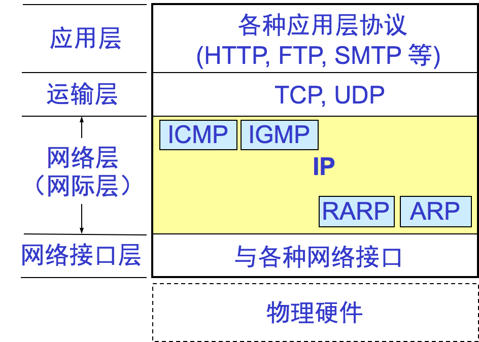
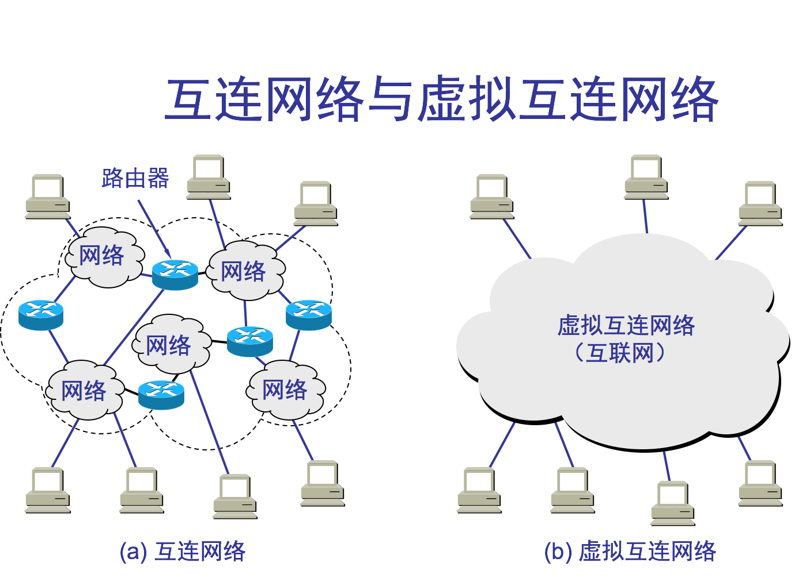

### 4.2.1 网际协议IP的简介

1、网际协议 IP 是 TCP/IP 体系中两个最主要的协议之一。与 IP 协议配套使用的还有四个协议  
①.地址解析协议ARP \(Address Resolution Protocol\)  
②.逆地址解析协议RARP \(Reverse Address Resolution Protocol\)  
③.网际控制报文协议ICMP \(Internet Control Message Protocol\)  
④.网际组管理协议IGMP \(Internet Group Management Protocol\)  
2、网际层的 IP 协议及配套协议

### 4.2.1 虚拟互连网络

1、没有一种单一的网络能够适应所有用户需求，各种网络新技术也层出不穷，各网络之间互相通信需要解决许多问题，比如：

    不同的寻址方案；  
    不同的最大分组长度；  
    不同的网络接入机制；  
    不同的超时控制；  
    不同的差错恢复方法；  
    不同的状态报告方法；  
    不同的路由选择技术；  
    不同的用户接入控制；  
    不同的服务类型（无连接和面向连接）  
    不同的管理与控制方法；

2、网络互连使用的中间设备（又称为中间系统或中继系统）主要有：  
⑴、物理层中继系统转发器\(repeater\)  
⑵、数据链路层中继系统网桥（桥接器）、二层交换机  
⑶、网络层中继系统路由器（router）  
⑷、网桥和路由器的混合物桥路器（brouter）  
⑸、网络层以上的中继系统网关（gateway连接两个不兼容的系统）  
注意：  
①.中间设备是转发器或网桥时，仅把网络扩大，但我们仍视之为一个网络，并不称为网络互连。只有经路由器互联，才称作网络互连。由于历史原因，常把网络层使用的路由器称网关，而工作在网络层以上的正真的网关目前使用较少。  
②.虚拟互联网络是指逻辑互联网络，使结构、性能各异的网络在网络层看起来好像是一个统一的网络。   
③.互联网可以是由多种异构网络互联组成。  
④.如果我们只从网络层考虑问题，那么 IP 数据报就可以想象是在网络层中传送。

直接交付指原站或路由器将IP数据报直接交给目的站，否则称间接交付。  
以下介绍的IPV4协议定义的IP地址是一个4个字节（32位）的标识符，标示连接在Internet上的每台主机或路由接口。  
IP 地址的编址方法   
①.分类的 IP 地址这是最基本的编址方法；1981 年通过相应的标准协议。  
②.子网的划分这是对最基本的编址方法的改进；1985 年通过相应的协议。  
③.构成超网这是新的无分类编址方法；1993 年提出后很快被推广应用  
注意    ①.一个IP地址在英特网上必须唯一，标识了一台主机或路由接口。  
②.IPV6协议的IP地址是一个16个字节（128位）的标识符；

### 4.2.2 分类的 IP 地址
1、IP地址的分类
分类的IP地址将IP地址分为若干固定的类，每类地址都有两个固定长度字段组成   。 
主机号全0的ip地址表示本网络地址，主机号全1的ip地址表示本网络的广播地址，这两个ip地址都不分配给任何主机或路由接口；
⑴、A类地址第一位必须是0，前8位是网络号，后24位是主机号。
网络号是从0～127，可指派（28－2=126）个网络，因为0.0.0.0和127.0.0.0不指派，127的网络号用作本地软件环回测试，这种地址的数据报不会在网络上出现。每个网络上最大主机数为（224－2=16777214），占整个地址空间的50%，共231个；
【例题3.11】若IP地址5.6.7.8，则网络地址是5.0.0.0，网络号为5，主机号为6.7.8； 
⑵、B类地址前二位必须是10，前16位是网络号，后16位是主机号。
网络号是从128～191，可指派（214－1=16383）个网络，因为128.0.0.0不指派。每个网络上最大主机数为（216－2=65534），占整个地址空间的25%，共230个；
⑶、C类地址前三位必须是110，前24位是网络号，后8位是主机号。
	网络号是从192～223，可指派（221－1=2097151）个网络，因为192.0.0.0不指派。每个网络上最大主机数为（28－2=254），占整个地址空间的12.5%，共219个；
⑷、D类地址前四位是1110开头，用于多播。
⑸、E类地址前4位是1111开头，保留地址。

2、三类专用IP地址 只用于机构内部通信，又称“本地地址”或“私有地址”；不能作“全球地址”（又称“公有地址”；），目的地址为专用地址的数据报路由器一律不转发。
⑴、10.0.0.0～10.255.255.2551段连续的A类地址（共256*256*256个）
⑵、172.16.0.0～172.31.255.25516段连续的B类网络地址（共16*256*256个）
⑶、192.168.0.0～192.168.255.255256段连续的C类网络地址（共256*256个）
3、IP地址重要特点：
⑴、网络号由地址管理机构分配，主机号由单位自行分配。
⑵、IP地址标识一个主机和路由接口，若主机连接在两个网络上，则必须有两个IP地址，其网络号不同。路由器用于连接网络，所以至少有两个IP地址。
⑶、具有不同网络号的局域网必须使用路由器相连。
⑷、所有网络是平等的。
⑸、当两个路由器直接相连时，互连接口可以分配IP地址，也可以不分配IP地址。
⑹、一根线相连的两个路由接口需要分配IP地址时，它们的网络号必须相同。
4、IPV6协议的IP地址是一个16个字节（128位）的标识符
在IPv6的分层地址分配方式中，高级网络管理部门可为下级网络管理部门划分地址分配区域，下级网络管理部门则可为更下层的管理部门进一步划分地址分配区域。
⑴、IPv6将用户划分成3种类型。
①.使用企业内部网络和Internet；
②.目前使用企业内部网络，将来可能会用到Internet：
③.通过家庭、飞机场、旅馆以及其他地方的电话线和Internet网络互联。
⑵、IPv6协议为这些用户提供了不同地址分配方式。 
①.4种类型的点到点通信/单播地址用于标识单一网络设备接口，单播通信传播的分组可传送到地址标识的接口。
②.改进的多播地址格式用于标识归属于不同节点的设备接口集合，多播通信传送的分组可发送到地址标识的所有接口，这种地址方式是非常有用的。例如，可将网络中发送的新消息传送给所有登记的用户。特殊的多播地址可限制在特定网络链路或特定的系统组中进行通信。IPv6协议没有定义广播地址，但可使用多播地址替代。
③.新的任意播(Anycast)地址格式IPV6协议中引入了任意播地址，用于标识属于不同节点的设备接口集合，任意播传送的分组可发送到地址标识的某一接口，接收到信息的接口通常是最近距离的网络节点，这种方式可提高路由选择的效率，网络节点可通过地址表示通信过程传输路由可经过的中间跳数，即信息传输路由可不必由路由器决定。

### 4.2.3 IP 地址与硬件地址
1、IP地址与MAC地址的区别MAC地址是数据链路层和物理层使用的地址，是物理地址（硬件实现），而IP地址是网络层和以上各层使用的地址，是逻辑地址（软件实现）。

 

数据流向	IP首部	MAC帧首部
	源地址	目的地址	源地址	目的地址
从H1到R1	IP1	IP2	HA1	HA3
从R1到R2	IP1	IP2	HA4	HA5
从R2到H2	IP1	IP2	HA6	HA2
2、特别注意事项
⑴、在IP层抽象的互联网上只能看到IP数据报；
⑵、路由器只根据目的IP地址的网络号进行路由选择；
⑶、在局域网的链路层，只能看见MAC帧；
⑷、虽然互连网络的硬件地址体系不同，但IP层抽象的互联网屏蔽了这些下层细节；
3、没解决的二个问题
⑴、主机和路由器怎么知道应当在MAC帧的首部填入什么样的硬件地址？
⑵、路由器的路由表如何形成的？

### 4.2.4 地址解析协议 ARP 与逆地址解析协议RARP
⑴、不管网络层使用的是什么协议，在实际网络的链路上传送数据帧时，最终还是必须使用MAC地址。路由器如何知道在MAC帧中填入什么样的MAC地址？  

RARP现已不用，包含在DHCP（DynamicHostConfigurationProtocol，动态主机配置协议应用层协议）协议中。 
⑵、ARP的工作原理即：主机如何知道IP地址和MAC地址对应关系呢？ 
ARP在主机ARP高速缓存中存放一个IP地址到硬件地址的映射表，里面有本局域网上各种主机和路由器的IP地址到硬件地址的MAC地址映射表，这个表要动态更新。 
当主机A要向本局域网上的某个主机B发送IP数据报时，先查找自己的MAC地址映射表中是否有主机B对应表项。若有，查出相应的硬件地址，填入MAC帧，然后发送，若没有，A运行ARP协议找出B的MAC地址；具体步骤如下：
①.A向本局域网广播一个ARP请求分组（广播帧）。注明A的IP地址和MAC地址，以及B的IP地址。
②.主机B及所有本局域网主机都收到该分组。
③.只有B向A发送ARP响应分组（单播帧），并注明自己的MAC地址，同时B将A的一对地址记入ARP缓存的MAC地址映射表中。
④.A收到响应后在其MAC地址映射表中添加记录，并使用该地址。
注意 	①.每个映射地址项目都有生存时间，设想B更换网卡情况。
②.ARP是解决同一局域网上的主机或路由器的IP地址和硬件地址的映射问题的。目的主机和源主机不在同一局域网时解决的方法是源主机通过 ARP 找到一个位于本局域网上的某个路由器的MAC地址，然后把分组发送给这个路由器，让这个路由器把分组转发给下一个网络。剩下的工作就由下一个网络来做。 

图： ARP的工作过程。
⑶、归纳总结 使用ARP的四种情况：
发送方	接收方	利用ARP获得的MAC地址
主机A	同一网内的主机B	主机B的MAC地址
主机A	其它网内的主机C	本网路由器R的MAC地址，其余工作由路由器A完成
路由器R	同一网内的主机B	主机B的MAC地址
路由器R1	其它网内的主机C	本网路由器R2的MAC地址，其余工作由路由器R2完成
⑷、为什么我们不直接使用硬件地址进行通信？ 不同网络的硬件地址不同，直接利用硬件地址通信，硬件地址转换非常复杂
连接到因特网的主机都拥有统一的 IP 地址，它们之间的通信就像连接在同一个网络上那样简单方便，因为调用ARP来寻找某个路由器或主机的硬件地址都是由计算机软件自动进行的，对用户来说是看不见这种调用过程的，使用方便。  

### 4.2.5 IP 数据报的格式

首部总长20B～60B；其中：固定部分长20B；可变部分长0～40B；
⑴、版本4b，标示ipv4或ipv6
⑵、首部长度4b，最大长度15，以4字节为单位，故首部最长60B，若不使用任何选项，则首部长为20B。
⑶、区分服务8b，实际上一直未被使用。
⑷、总长度16b，以字节为单位，最大长度65535B，包括首部。
⑸、标识16b，用来产生数据包标示，若数据报被分为若干片，每片的表示都一样。相同标识的分片将被重装成原来的数据报。
⑹、标志3b，只有后2b有意义，最低位MF=1表示还有分片，若MF=0，表示本片是最后一片，DF=0时才允许分片。
⑺、片位移占13b,标示该片在原数据中相对位置。以8字节为片移单位。
【例题4.1】一个数据报总长度为3820B，其数据部分为3800B，需要分成片长不超过1420B的数据报片，则如何分片？
解：∵每个分片首部都要占20字节，故每片数据部分长度不超过1400B。于是，原始数据报被分成3片，数据部分长度分别为1400B、1400B、1000B。
原始数据报：	总长度3820B,标识12345，MF=0  DF=0 片位移 0。
分片1：		总长度1420B,标识12345，MF=1  DF=0 片位移 0。
分片2：		总长度1420B,标识12345，MF=1  DF=0 片位移 175。
分片3：		总长度1020B,标识12345，MF=0  DF=0 片位移 350。
若分片2又被分成两片，分别携带800B和600B，则这俩片的上述数据分别为：
820，12345，1，0，175；            620，12345，1，0，275 
⑻、生存时间8位（TTL：Time To Live） 表明数据在网络上的寿命，防止数据报在网络中丢兜圈子。以跳数为单位（最大值为255），而不是秒。指最多可经过多少个路由器，每经过一个路由器递减1。若数据报转发前TTL为0，则被丢弃。
⑼、协议8b，指明上层协议，即指明携带的数据是使用何种协议。
协议名	ICMP	IGMP	TCP	EGP	IGP	UDP	IPV6	OSPF
协议字段值	1	2	6	8	9	17	41	89
⑽、首部检验和16b，只检验数据报首部，不包括数据部分。发送方将IP首部划分为许多16位字序列，并把检验和字段置零，用反码算术运算把所有16位字相加后，将所得和的反码写入检验和字段，接收方用同样的方法计算，若结果为0，则认为正确，否则错误。
⑾、源地址32b
⑿、目的地址32b
⒀、首部的可变部分即：可选字段及填充，可变部分若有则长度是4B的整数倍。
可变部分就是一个选项字段，用来支持排错、测量以及安全等措施，内容很丰富。选项字段的长度可变，从 1B～40B不等，取决于所选择的项目。
增加首部的可变部分是为了增加 IP 数据报的功能，但使IP 数据报的首部长度可变。这样就增加了每一个路由器处理数据报的开销。实际上这些选项很少使用。  
⒁、数据部分不作介绍。

### 4.2.6 IP 层转发分组的流程

1、路由表结构
路由器按网络地址来制作的，每条路由最主要的是以下两个信息 

有时也允许对特定主机指明一个路由，称为“特定主机路由”，即路由表中的目的网络号为目的主机IP。还可以采用“默认路由”（路由表的目的网络为：0.0.0.0）以减少路由表所占用的空间和搜索路由表所用的时间。
若目的网络是路由器直接相连的网络，路由表的下一跳直接交付，即把目的主机IP地址转换为目的MAC地址，把数据报封装为MAC帧后交付给目的主机；
2、分组转发算法： 
⑴、从数据报首部提取目的主机IP地址D，得目的网络地址N；
⑵、若N就是与路由器直接相连的网络，则进行直接交付，否则间接交付执行⑶；
⑶、若路由表中有目的地址为D的特定主机路由，则把数据报传给路由表指定的下一条路由器，否则转⑷；
⑷、若路由表中有到达网络N的路由，则把数据报传送给路由表中所指定的下一跳路由器，否则转⑸；
⑸、若路由器中有一默认路由，则将其转发给默认路由器，否则执行⑹；
⑹、报告转发分组出错；

