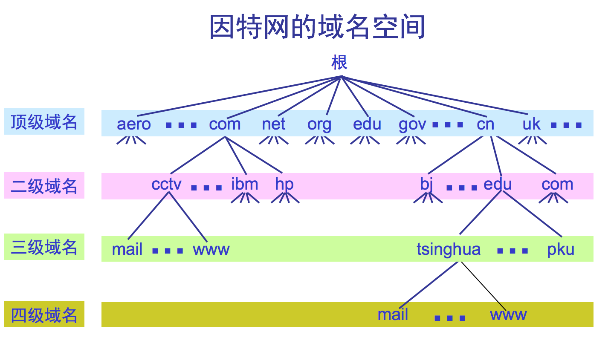
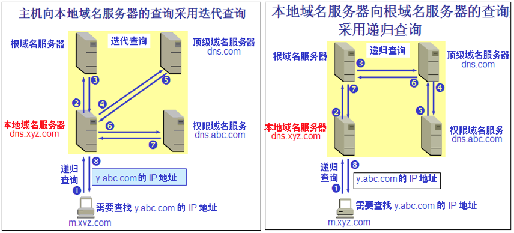

### 6.1.1 域名系统概述

1. DNS（Domain Name System）---&gt; 是因特网使用的命名系统，用来把机器名转换成IP地址。

   用户与因特网上某个主机通信时，显然不愿意使用难于记忆的长达32位二进制的IP地址。但由于域名长度不是固定的，机器处理起来比较困难。再者，若使用IP地址，意味着若邮件服务器迁移到另一台不同IP地址的机器上，其邮件地址必须改变。

   > 例如：若发送电子邮件到[cm\_grass@126.com](mailto:cm_grass@126.com)
   >
   > ∵[www.126.com](www.126.com)←→ 220.181.12.218
   >
   > ∴[cm\_grass@126.com](mailto:cm_grass@126.com)等价于cm\_grass@220.181.12.218

   1. 许多应用层软件经常直接使用域名系统 DNS \(Domain Name System\)，但计算机的用户只是间接而不是直接使用**域名系统**。

   2. 因特网采用层次结构的命名树作为主机的名字，并使用**分布式**的域名系统 DNS。

   3. 名字到 IP 地址的解析是由若干个域名服务器程序完成的。域名服务器程序在专设的结点上运行，运行该程序的机器称为**域名服务器**。

2. 域名到IP地址解析过程要点如下：

   当某一应用程序需要把主机名解析为IP地址时，该应用程程就调用**解析程序**，把待解析的域名放在域名放在**DNS请求报文**中，以**UDP**方式发给本地域名服务器，本地域名服务器在查找域名后，把对应的IP地址放在应答报文中返回。应用进程获得IP地址即可进行通话。

   若本地域名服务器不能回答该请求，则域名服务器再向其他域名服务器发出查询请求，直到查到为止。

### 6.1.2 因特网的域名结构

1. 因特网采用了层次树状结构的命名方法。任何一个连接在因特网上的主机或路由器，都有一个唯一的层次结构的名字，即域名。域可以划分为若干个子域，子域可再分。

   > 例如：mail.cctv.com  每一域名都由标号序列组成，各标号间用点号隔开

   1. 域名的结构由标号序列组成，各标号之间用点隔开：… . 三级域名 . 二级域名 . 顶级域名

   2. 各标号分别代表不同级别的域名。

   3. 域名只是个逻辑概念，并不代表计算机所在的物理地点。

   4. 变长的域名和使用有助记忆的字符串，是为了便于人来使用。而 IP 地址是定长的 32 位二进制数字则非常便于机器进行处理。

   5. 域名中的“点”和点分十进制 IP 地址中的“点”并无一一对应的关系。点分十进制 IP 地址中一定是包含三个“点”，但每一个域名中“点”的数目则不一定正好是三个。

2. DNS规定---&gt; 域名标号都由字母或数字组成，不超过63个字符，域名总长不超过255个字符，域名级数不限，从左到右，级别升高。

   各级域名由其上一级域管理机构管理，可保证每一域保在因特网范围内唯一。

3. 顶级域名 TLD \(Top Level Domain\)可分为三大类：

   1. 国家顶级域名 nTLD：如: .cn 表示中国，.us 表示美国，.uk 表示英国，等等。

   2. 通用顶级域名 gTLD：  
      \(1\)最早的顶级域名是：

      ```
        .com  （公司和企业）
        .net  （网络服务机构）
        .org  （非赢利性组织）
        .edu  （美国专用的教育机构）
        .gov  （美国专用的政府部门）
        .mil  （美国专用的军事部门）
        .int  （国际组织）
      ```

      \(2\)新增加了下列的通用顶级域名

      ```
        .aero （航空运输企业）
        .biz  （公司和企业）
        .cat  （加泰隆人的语言和文化团体）
        .coop  （合作团体）
        .info  （各种情况）
        .jobs  （人力资源管理者）
        .mobi  （移动产品与服务的用户和提供者）
        .museum  （博物馆）
        .name  （个人）
        .pro  （有证书的专业人员）
        .travel  （旅游业）
      ```

   3. 基础结构域名\(infrastructure domain\)：这种顶级域名只有一个，即 arpa，用于反向域名解析，因此又称为反向域名。

   

4. 我国把二级域名划分为**类别域**和**行政区域**名两类

   1. 类别域名：ac、com、edu、gov、net、org、mil7个

   2. 行政区域名34个：bj，js（江苏），ah等；

5. 我国允许在cn顶级域下注册二级域名，各国管理方法可以不同，

   **例如**： cs.yale.eduè美国耶鲁大学计算机系；  
   cs.vu.nlè荷兰阿姆斯丹大学计算机系；  
   cs.chu.edu.cnè中国巢湖学院计算机系；

**※注意**：域名空间按机构的组织来划分的，与物理网络无关

### 6.1.3 域名服务器

* DNS 服务器的管辖范围不是以“域”为单位，而是以“区\(zone\)”为单位。每一个区设置相应的权限域名服务器，用来保存该区中的所有主机的域名到IP地址的映射。各单位根据具体情况来划分自己管辖范围的区。但在一个区中的所有节点必须是能够连通的。区小于等于城。


1. 域名服务器有以下四种类型 ---&gt; 因特网上DNS服务器也是按层次安排

   1. 根域名服务器——最高层次、最重要的的域名服务器

      所有的根域名服务器都知道所有的顶级域名服务器的域名和 IP 地址。  
      不管是哪一个本地域名服务器，若要对因特网上任何一个域名进行解析，只要自己无法解析，就首先求助于根域名服务器。  
      在因特网上共有13 个不同 IP 地址的根域名服务器，它们的名字是用一个英文字母命名，从a 一直到 m（前13 个字母）。根域名服务器数目并不是13个机器，而是13套装置。   
      这些根域名服务器相应的域名分别是

      ```
         a.rootservers.net
         b.rootservers.net
         … 
         m.rootservers.net
      ```

      注意：许多情况下，根域名服务器并不直接把待查询的域名直接转换成IP 地址，而是告诉本地域名服务器，下一步应该找哪个顶级域名服务器进行查询。

      到 2006 年底全世界已经安装了一百多个根域名服务器机器，分布在世界各地。这样做的目的是为了方便用户，使世界上大部分 DNS 域名服务器都能就近找到一个根域名服务器。

      举例：根域名服务器 f 的地点分布图

   2. 顶级域名服务器（即 TLD 服务器）

      这些域名服务器负责管理在该顶级域名服务器注册的所有二级域名。当收到 DNS 查询请求时，就给出相应的回答（可能是最后的结果，也可能是下一步应当找的域名服务器的 IP 地址）。

   3. 权限域名服务器

      这就是前面已经讲过的负责一个区的域名服务器。当一个权限域名服务器还不能给出最后的查询回答时，就会告诉发出查询请求的 DNS 客户，下一步应当找哪一个权限域名服务器。

   4. 本地域名服务器

      本地域名服务器对域名系统非常重要。当一个主机发出 DNS 查询请求时，这个查询请求报文就发送给本地域名服务器。每一个因特网服务提供者 ISP，或一个大学，甚至一个大学里的系，都可以拥有一个本地域名服务器，这种域名服务器有时也称为默认域名服务器。

   为了提高域名服务器的可靠性：  
      DNS 域名服务器都把数据复制到几个域名服务器来保存，其中的一个是主域名服务器，其他的是辅助域名服务器。当主域名服务器出故障时，辅助域名服务器可以保证 DNS 的查询工作不会中断。主域名服务器定期把数据复制到辅助域名服务器中，而更改数据只能在主域名服务器中进行。这样就保证了数据的一致性。

2. 域名的解析过程

   * \(1\).主机向本地域名服务器的查询一般都是采用递归查询 =&gt; 如果主机所询问的本地域名服务器不知道被查询域名的 IP 地址，那么本地域名服务器就以 DNS 客户的身份，向其他根域名服务器继续发出查询请求报文。

   * \(2\).本地域名服务器向根域名服务器的查询通常是采用迭代查询。当根域名服务器收到本地域名服务器的迭代查询请求报文时，要么给出所要查询的 IP 地址，要么告诉本地域名服务器：“你下一步应当向哪一个域名服务器进行查询”。然后让本地域名服务器进行后续的查询。



本地域名服务器采用迭代查询

本地域名服务器采用递归查询（比较少用）

名字的高速缓存

每个域名服务器都维护一个高速缓存，存放最近用过的名字以及从何处获得名字映射信息的记录。可大大减轻根域名服务器的负荷，使因特网上的 DNS 查询请求和回答报文的数量大为减少。为保持高速缓存中的内容正确，域名服务器应为每项内容设置计时器，并处理超过合理时间的项（例如，每个项目只存放两天）。当权限域名服务器回答一个查询请求时，在响应中都指明绑定有效存在的时间值。增加此时间值可减少网络开销，而减少此时间值可提高域名转换的准确性。

为了提高DNS效率，在域名服务中广泛使用了高速缓存，存放最近查询过的域名以及从何处获取域名映射信息的记录。由于域名改动并不频繁，大多数网点不需要花太多经历就能维护数据库的一致性。

