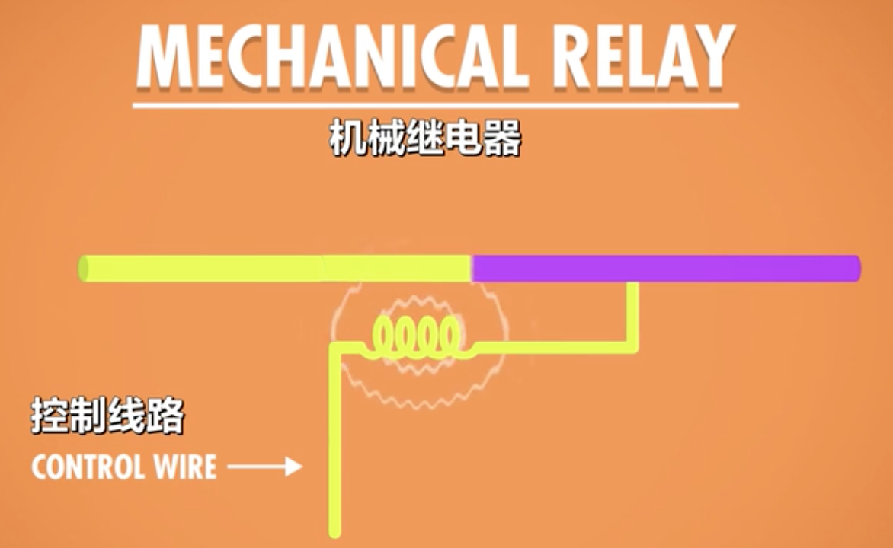

# 2. 电子计算机 Electric Computing

>  提到的设备：继电器 -&gt; 真空管 -&gt; 晶体管

>  计算机从 机电设备 -&gt; 电子设备

>  从继电器到真空管到晶体管，可以让电路开闭得非常非常快。

---

### 2.1 更强的计算能力

* 更强的计算能力：直到20世纪初，早期计算设备都针对特定用途，如制表机。大大推进了政府和企业。它们帮助, 甚至代替了人工。然而20世纪的高速发展\(世界人口翻倍，全球贸易运输，工程和科学复杂度提高\)导致数据量暴增，从而要求更强的计算能力。**柜子大小**的计算机发展到**房间大小**，维护费高、易出错，正是这些机器为未来的创新打下基础

### 2.2 继电器

* **哈佛 Mark 1号**，最大的**机电计算机**之一，**IBM**于1944年完成建造，给为二战同盟国的。

  * 其有76万5千个组件，300万个连接点和500英里\(804.65公里\)长的导线，为保持内部机械装置同步，它有一个50英尺的传动轴，由一个5马力的电机驱动。

  * 该机器最早用途之一是给“曼哈顿计划”跑模拟。

  * 该机器的大脑是**继电器**，大约3500个继电器。

  * 一秒做3次加减运算，一次乘法6秒，除法15秒，三角函数1分钟以上

* **继电器\(relay\)**：用电控制的机械开关

  * 继电器里有根“控制线路”控制电路是开还是关。控制线路连着一个线圈。当电流流过线圈，线圈产生电磁场，吸引金属壁。从而闭合电路。

  * > 把继电器想成水龙头，把控制线路想成水龙头。打开水龙头，水会流出来，关闭水龙头，水就没了。继电器与之一样，只是控制的是电子，不是水。控制电路可以连到其他电路，如马达，马达让计数齿轮+1，像Herman Hollerith的打孔卡片制表机一样。
  
* 缺点：继电器内的机械臂有质量，无法快速开关，且齿轮会随时间磨损
  
  > 1940年代好的继电器一秒最多50次开关，还是不够快，不足以解决复杂大问题。
  
* 继电器出**bug**：齿轮磨损，随继电器数量增加故障概率增加。
  
    > 哈佛Mark1号大约有3500个继电器，设继电器寿命10年，意味着平均每天换一个故障继电器。但有些运算要运行好几天，这个问题很严重。
    >
    > 巨大、黑色、温暖的机器会吸引昆虫。1947年9月，操作员从哈佛Mark2号的故障继电器中拔出一只死虫。最早的Bug
    >
  > Grace  Hopper曾说：“从那时起，每当电脑出了问题，我们就说它出了bug”
  
* 我们需要更快更可靠的东西替代继电器

### 2.3 真空管

* 1904年，英国物理学家 John Ambrose Fleming 发明新的电子组件**热电子管**，世界上**第一个真空管\(vacuum tube\)**。改进后变成和继电器的功能一样

  * 真空管：把两个电极装在一个气密的玻璃灯泡里，其中一个电极可以加热，从而发射电子，这叫“热电子发射”，另一个电极吸引电子，形成“电龙头”的电流，但只有带正电才行，如果带负电或中性电荷，电子就没办法被吸引，越过真空区域。因此没有电流。

  * 电子只能单向流动的电子部件叫**二极管**

  * 但我们需要的是能开关电流的东西
* 1906年美国发明家Lee de Forest发明**三极真空管**

  * 他在Fleming设计的两个电极之间加入第三个“控制”电极，向控制电极施加正电荷，它会允许电子流动，但如果施加负电荷，它会阻止电子流动。因此通过控制线路，可以断开火闭合电路，和继电器功能一样。

  * 优点：真空管里没有会动的组件，意味着更少的磨损；每秒可以开闭数千次。

  * 三极真空管成了无线电、长途电话及其他电子设备的基础，持续近半个世纪

  * 缺点：其并不完美，它有点脆弱，易烧坏，但比机械继电器是一次巨大进步

  * 起初，真空管非常昂贵，收音机一般只用一个。但是计算机一般要上百、上千个电气开关，到1940年代，成本和可靠性得到改进，可以用在计算机里，有钱人负担得起，如政府，标志着计算机从机电转向电子

* **“巨人\(巨像\)1号“计算机**：第一个大规模使用真空管\(1600个\)的计算机；第一台**可编程的电子计算机**
* 工程师Tommy Flowers设计，其团队于1943年12月完成。
  * 在英国 布莱切利园 用于破解纳粹通信，共造了10台来破解密码\(破解德国“洛伦兹”加密机\)
* Alan Turing\(阿兰·图灵，计算机科学之父\)在两年前\(1941年\)在布莱切利园也做了台机电装置，叫“Bombe”。设计目的：破解纳粹“英格码”通讯加密设备。Bombe严格来说不是一台计算机，是电子机械密码破解机。
  * 编程方法是把 几百根电路插入插板，有点像老电话交换机，这是为了让计算机执行正确操作。
* 虽然可编程，但编程麻烦，还要配置它
* **ENIAC**\(Electronic Numerical Integrator and Calculator,**电子数值积分计算机**\)：第一个**通用可编程电子计算机**（通用：general purpose）
* 1946年，宾夕法尼亚大学 John Mauchy和J. Presper Eckert
  
* 每秒5000次十位数加减法，运作了10年
  
* 由于真空管很多，每运行半天就出一次故障
* 到1950年代，真空管计算机达到极限，美国空军**AN/FSQ-7**计算机于1955年完成，是**“SAGE”防空计算机系统**的一部分。
* 为降低成本和大小，提高可靠性和速度，我们需要新的电子开关

### 2.4 晶体管

* 1947年，贝尔实验室科学家 \N John Bardeen，Walter Brattain，William Shockley 发明了**晶体管\(transistor\)**，全新的计算机时代诞生了。

  * 晶体管的物理学相当复杂，牵扯到量子力学。这里只提基础：晶体管像之前的继电器和真空管，它是一个开关，可以用控制线路来控制开或关。晶体管有两个电极，电极间有一种材料隔开它们，这种材料有时导电，有时不导电，这叫“**半导体\(Semiconductor\)**”，控制电路连到一个“门”电极，通过改变“门”的电荷，我们可以控制半导体材料的导电性，来允许或不允许电流流动，像之前的水龙头。

  * 晶体管每秒开关10000次

  * 优点：比起玻璃制品，小心易碎的真空管，晶体管是固态的。 晶体管可远小于继电器和真空管，导致更小更便宜的计算机。今天计算机里最小的晶体管小于50纳米，一张纸厚度是10万纳米。晶体管体积小、速度快，每秒切换上百万次，可工作几十年

* 晶体管有诸多好处，IBM很快全面转向晶体管。把晶体管计算机带入办公室，最终引入家庭。

  > 如1957年发布的IBM 608，第一个完全用晶体管且消费者可买到的计算机。它有3000个晶体管，每秒执行4500次加法、80次乘除法

### 2.5 硅谷

* 硅谷的典故：很多晶体管和半导体的开发都是这里做的，而生产半导体最常见的材料是硅。硅谷位于旧金山和圣荷西之间。
* William Shockley搬到硅谷创立了“**肖克利半导体公司**“-&gt;其员工成立了 “**仙童半导体公司**“ -&gt; 其员工创立了“**英特尔**“（当今世界上最大的计算机芯片制造商）

### 2.6 总结

* 从**继电器**到**真空管**到**晶体管**，可以让电路开闭得非常非常快，但我们是如何用晶体管做计算的？我们没有马达和齿轮啊！

