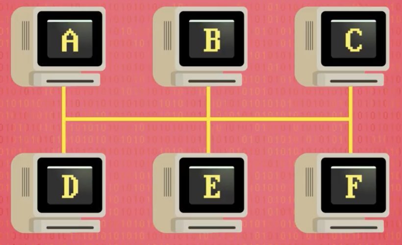
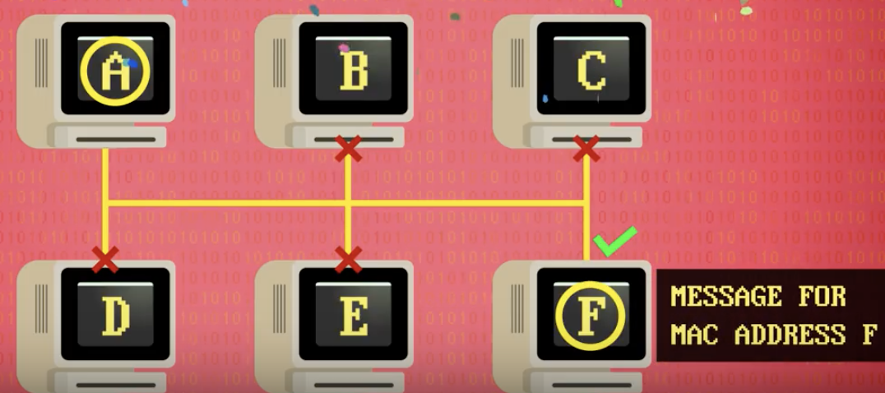

# 28. 计算机网络
1970年以前，大多数计算机是独立运行的，随着计算机越来越多，分享数据和资源渐渐变得有用起来。

第一个计算机网络出现在1950-1960年代。通常在公司或研究室内部使用，为了方便信息交换，比把纸卡或磁带送到另一栋楼里更快速可靠，这叫“球鞋网络(sneaknet)”。第二个好处是能共享物理资源。

* 局域网 Local Area Networks - LAN

    * 计算机近距离构成的小型网络叫局域网，简称LAN。局域网能小到是同一个房间里的两台机器，或大到校园里的上千台机器。尽管开发和部署了很多不同的LAN技术，其中最著名和成功的是“**以太网**”，开发于1970年代。在施乐的“帕洛阿尔托研究中心”诞生，今日仍被广泛使用。

* 媒体访问控制地址 Media Access Control address - MAC
    
    * 以太网的最简单形式是：一条以太网电线连接数台计算机。当一台计算机要传数据给另一台计算机时，它以电信号形式，将数据传入电缆，因为电缆时共享的，连在同一个网络里的其他计算机也看得到数据，但不知道数据是给它们的，还是给其他计算机的，为解决这个问题，以太网需要每台计算机有唯一的媒体访问控制地址，简称MAC地址。
    
    * 这个唯一的地址放在头部，作为数据的前缀发送到网络中。计算机只需监听以太网电缆，只有看到自己的MAC地址，才处理数据。现在制造的每台计算机都自带唯一的MAC地址，用于以太网和无线网络。
    
* 载波侦听多路访问 Carrier Sense Multiple Access - CSMA
  
    * 多台电脑共享一个传输媒介，这种方法叫“载波侦听多路访问”，简称CSMA。载体(carrier)指运输数据的共享媒介，以太网的载体是铜线，wifi的载体是传播无线电波的空气。很多计算机同时侦听载体，所以叫“侦听”和“多路访问”。载体传输数据的速度叫“带宽”。
    
* 指数退避 Exponential Backoff

    * 但是，使用共享载体有个很大的弊端，当网络流量较小时，计算机可以等待载体清空，然后传送数据。但随着网络流量上升，两台计算机想同时写入数据的概率也会上升，这叫冲突，数据全乱套了，就像两个人在同时讲电话。幸运的是，计算机能通过监听电线中的信号检测这些冲突，最明显的办法是停止传输，等待网络空闲，然后再试一遍。但其他计算机也打算这么做，其他等着的计算机可能在任何停顿间隙闯入，导致越来越多冲突。以太网有个超简单有效的解决方法，当计算机检测到冲突，就会在重传前等待一小段时间。假设是1秒，如果所有计算机用同样的等待时间是不行的，它们会在1秒后再冲突，所以加入一个随机时间，一台计算机可能等1.3秒，另一台等1.5秒，要是运气好，等1.3秒的计算机醒来，发现载体是空闲的，然后开始传输。当1.5秒的计算机醒来后，发现载体被占用，会等待其他计算机完成。这有用，但不能完全解决问题，所以要有另一个小技巧。如果一台计算机在传输数据期间检测到冲突，会等1秒+随机时间，如果再发生冲突，表明有网络拥塞，这次不是等1秒，而是2秒，如果再次发生冲突，等4秒，8秒，16秒等，直到成功传输。因为计算机等退避，冲突次数降低。数据再次开始流动起来，网络变得顺畅。这种指数级增长等待时间到方法叫：指数退避。以太网和wifi都用这种方法，很多其他传输协议也用。

* 冲突域 Collision Domain

    * 即便有了指数退避，想用一根网线连接整个大学的计算机还是不可能的。为减少冲突+提升效率，我们需要减少同一载体中设备的数量，载体和其中的设备总称“冲突域” 。上面图片的例子，一根线缆连6台计算机是一个冲突域。为减少冲突，我们可以用交换机把它拆成两个冲突域，交换机位于两个更小的网络之间，必要时才在两个网络间传数据。交换机会记录一个列表，写着哪个MAC地址在哪边网络。如果A想传数据给C，交换机不会把数据转发给另一边的网络

电路交换 Circuit Switching
报文交换 Message Switching
分组交换 Packet switching

