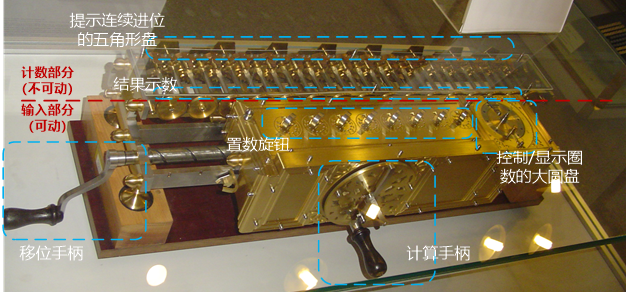
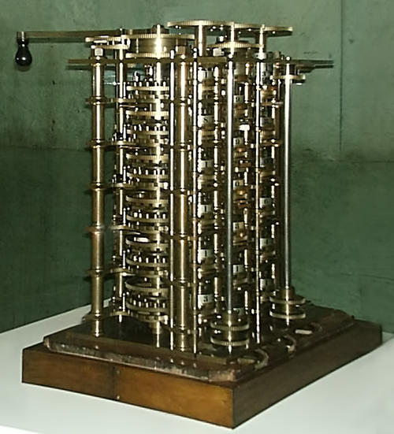
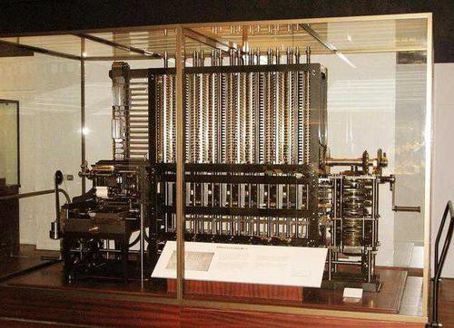
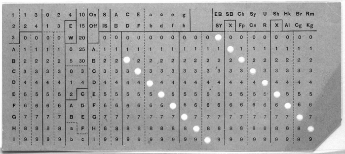
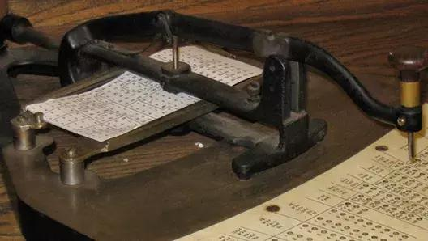

# 1. 计算机早期历史 Early Computing

> 提到的设备：**算盘**\(2500年前美索不达米亚，加减\)-&gt; **步进计算器**\(1694,德国,莱布尼茨，加减乘除，很贵\) -&gt; **差分机**\(1822提出,1923开始建造,后失败，1991某历史学家建成\) -&gt; **分析机** -&gt; **打孔卡片制表机**

> 提到的人名： Charles Babbage\(**计算机先驱**\)， Ada Lovelace，Herman Hollerit

---

### 1.1 计算设备

* 最早的计算设备是**算盘**：存储当前计算状态类似于硬盘。发明于大约公元前2500年的美索不达米亚，它是手动计算器，用来帮助加减数字。

  * 在接下来的4000年，人类发明了各种巧妙的**计算设备**（更简单、准确）：算盘 -&gt; 星盘（在海上计算纬度）、计算尺（计算乘除）、上百种时钟（算日出、潮汐、天体位置、计时）。然而这些设备都不叫“计算机”。

### 1.2 Computer由来

* **Computer** 最早指代职业\(1613年作者Richard Braithwait，可以算大型运算的人\)，这个职业直到1800年还存在。之后Computer逐渐变成指代机器。

  > "我听说过的计算者里最厉害的，能把好几天的工作量大大缩减" ——Richard Braithwait

### 1.3 步进计算器

* 机器里最有名的是：**步进计算器**，由德国博学家 戈特弗里德·莱布尼茨 建造于 1694 年。第一个可以做加减乘除的机器，一直沿用到3世纪，但是很贵，做大型计算要花几天的时间。

  > "让优秀的人浪费时间算数简直侮辱尊严农民用机器能算得一样准"。 ——莱布尼兹

  [莱布尼茨步进计算器——不想当发明家的数学家不是好的哲学家](https://www.jianshu.com/p/79e6eacaabc0)

  

### 1.4 计算表

* **计算表**：即使有机械计算器，许多现实问题 依然需要很多步，算一个结果可能要几小时甚至几天而且这些手工制作的机器非常昂贵，大部分人买不起。所以在 20 世纪以前，大部分人会用预先算好的计算表。例如算8271909的平方根可以通过查表法得到。
* 战场上速度和准确性尤为重要，因此军队很早就开始用计算来解决复杂问题。
  * 19世纪的二战时期，炮弹的射程可以达到 1 公里以上（比半英里多一点），因为风力，温度，大气压力会不断变化，想打中船一样大的物体也非常困难，炮弹为了精准，要计算弹道\(受风力、温度、大气压力影响\)。于是出现了射程表，炮手可以根据环境条件和射击距离查表，射程表会告诉炮手角度应设成多少，这些射程表很管用，二战中被广泛应用。但每次改了大炮或炮弹设计就需要做一张新表。这样很耗时且易出错。

### 1.5 差分机&分析机

* 1822年**Charles Babbage** 提出了新的机械装置：“**差分机**”（论文《机械在天文与计算表中的应用》），在构造差分机\(1823\)期间，Charles构想了一个更复杂的机器：**分析机**，不像差分机、步进计算器 和以前的其他计算设备，分析机是**通用计算机**\(不只是特定运算\)。

  > "随着知识的增长和新工具的诞生，人工劳力会越来越少"。 ——**Charles Babbage**

  * **差分机**，一个更复杂的机器，能近似多项式，多项式描述了几个变量之间的关系，如射程和大气压力，多项式也可用于近似对数和三角函数。差分机于1822年提出，1823开始构造，并在接下来二十年，试图制造和组装 25,000 个零件，总重接近 15 吨。不幸的是，该项目最终放弃了。直到1991年某历史学家根据Charles Babbage的草稿做了一个差分机。

  * **分析机**是**通用计算机**，它可以做很多事情，不只是特定运算。甚至可以给它数据，然后按顺序执行一系列操作。它有内存，甚至一个很原始的打印机。这台机器太超前，没有建成。这种“自动计算机”的概念，计算机可以自动完成一系列操作，是个跨时代的概念，预示计算机程序的诞生。

    

    

### 1.6 自动计算机

* 然而，这种 "**自动计算机**" 的概念，计算机可以自动完成一系列操作，是个跨时代的概念，预示着计算机程序的诞生。1843年英国数学家**Ada Lovelace** 给分析机写了**假想程序**，因此被称为世上**第一位程序员**。她说：“未来会诞生一门全新的、强大的、专为分析所用的语言”。Lovelace写的分析机笔记是第一个算法。

  > "未来会诞生一门全新的，强大的，专为分析所用的语言"——Ada Lovelace

* 分析机激励了第一代计算机科学家，这些科学家将很多Charles Babbage的点子融入他们的机器，所以Charles Babbage常被认为是“**计算之父**”。Charles“计算机之父”设计了第一个可编程计算机。

### 1.7 打孔卡片制表机

* 到19世纪末，科学和工程领域的特定任务，会用上计算设备，但公司、政府、家庭却少见计算设备。然而美国在1890年人口普查\(宪法要求10年一次\)时，人口剧增，面临巨大困难\(一般人口普查要7年来手工编制，做完就过时，1890年的普查预计要13年才能完成\)，只有计算机能提供所需的效率。**Herman Hollerith**为此发明了**打孔卡片制表机**，大大提升了效率。

  * 该机器时电动机械的，用传统机械来计数，结构类似莱布尼兹的乘法器，但用电动结构连接其他组件。该机器使用打孔卡，一种纸卡，上有网格，用打孔表示数据。例如有一连串孔表示婚姻状况，如果你结婚了，就在结婚的位置打孔，当卡插入打孔卡制表机后，小金属针会到卡片上，如果有孔，针会穿过孔泡入一小瓶汞中，从而连通电路。电路会驱动电机，然后给“已婚”的齿轮+1。该机器时手工的10倍左右。

  * 打孔卡片制表机提升劳动力及数据密集型任务，提升利润，如会计、保险评估、库存管理

  * 为满足市场需求，Herman Hollerith成立制表机器公司，该公司在1924年与其他机械制造商合并，成为**IBM**。

    

    

### 1.8 未来

* 1900年代中叶，世界人口的爆炸和全球贸易兴起，要求更快、更灵活的工具来处理数据，**为电子计算机的发展奠定了基础**。

