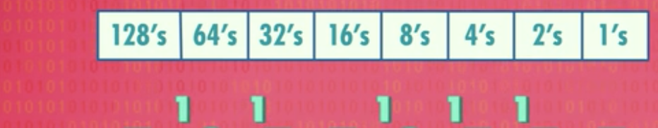
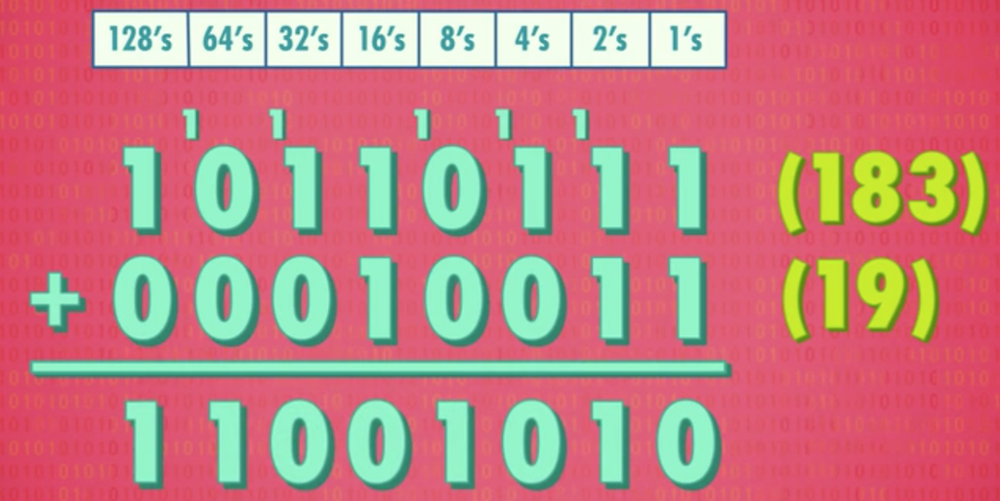
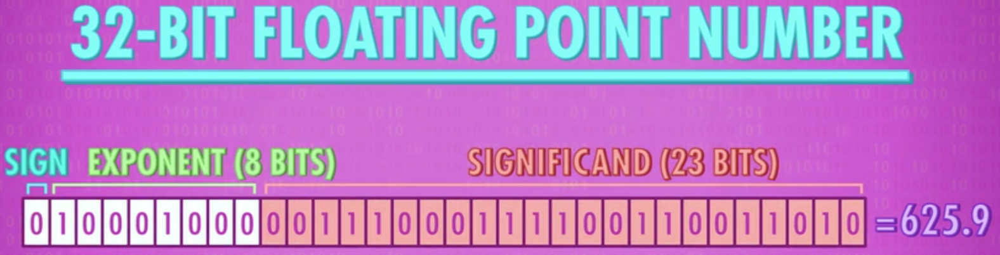

# 4. 二进制 Representing Numbers and Letters with Binary

> 主题：计算机如何存储和表示数字  
> 表示和存储数据是计算机的重要功能

> 上一节讲如何用晶体管做逻辑门，用逻辑门可判断布尔语句，但布尔代数只有两个值：true和false。如何用两个值表达更多东西？这就需要数学。——想表达更多东西，加“位数”就可以了。

---

### 4.1 二进制原理

用十进制(基于十的表示法)举例二进制(基于二的表示法)原理：

* 10进制的263表示2个100，6个10，3个1，每列有不同的乘数：100，10，1，每个乘数比右边大10倍，每列有10个可能的数字(0到9)，如果超过9要到下一列进1。因此叫基于十的表示法或十进制。
  
* 二进制是基于二的表示法，因为它只有两个值true和false，用数字表示即为0和1。二进制每个乘数是右侧乘数的2倍。每列有不同到乘数：4，2，1。拿二进制的101举例：表示有1个4，0个2，1个1，加在一起表示十进制的5。
  

* 为表示更大数，二进制需要更多**位数**

* 二进制加法：逢二进一，记零。

  
  
### 4.2 数据表示

 * 存储单位 MB GB TB

* 位 bit：

  * 8位的二进制数最小为0，最大为255=$$2^8$$，8位二进制能表示256个不同的值。你可能听过**8位机**，8位图像，8位音乐，意思是计算机里大部分操作都是**8位(8 bits)**8位这样处理的。但256个值不算多，意味着8位游戏只有256种颜色。

* 字节 byte

  * 8位(8 bits)太常见，以至于有专门的名字：**字节(bytes)** 1 bytes = 8 bits。，

  * 如果有10个字节则有80位，甚至有KB(kilobytes)，MB(megabytes=million bytes)，GB(gigabytes=billion bytes)，TB(terabyte=trillon bytes)等。——存储单位 MB GB TB等

  * 1 KB = $$2^{10}$$ bytes = 1024 bytes

* **32位或64位计算机**：意思是一块块处理数据，每块是32位或64位。32位能表示等最大数是43亿左右。因此instagram照片很清晰，它有上百万种颜色，如今都用32位颜色。

* 正数、负数，整数、浮点数表示

  * 以上还只能表示正数，但现实生活中常会用到负数。所以我们需要有方法表示正数和负数 ，大部分计算机用第一位表示正负，1是负，0是正，剩下31位表示数字能表示的数字范围是正20亿到负20亿。虽然是很大的数，但有时还是不够，全球有70亿人口。所以64位数很有用，64位能表达最大数是$$9.2*10^{18}$$。计算机必须给内存中每一个位置，做一个标记叫“位址（addresses）”，目的是为方便存取数据。如今硬盘已增长到GB和TB，上万亿字节，内存地址也该有64位

  * 除正负数，计算机还需处理非整数，即浮点数(float point numbers)，因为小数点可以在数字间移动。有好几种方法表示浮点数。最常见是IEEE 754标准(科学计数法：有效位数，指数)

    * 科学计数法：$$625.9=0.6259*10^{3}$$。.6259是有效位数(significand)，3是指数(exponent)
      

* 文字表示: ASCII，UNICODE

  * 以上计算机可以表示数字了，但我们还需表示文字。文字由字母组成。所以可以使用计算机的数字来表示字母，最直接的方法是给字母编号。

  * 英国作家弗朗西斯·培根 曾用5位序列来编码英文的26个字母在16世纪传递机密信件，5位可存32个可能值，对26个字母已够，但不能表示标点符号，数字和大小写字母

  * 美国信息交换标准代码ASCII(American Standard Code for Information Interchange)，用来表示字符

    * 发明于1963年，ASCII是7位代码，足够存128个不同值，可表示大小写，数字，符号如@，标点符号，特殊命令符号(换行符)

    * 很早的标准，被广泛使用，让不同公司制作的计算机能互相交换数据，这种能力成为互用性(interoperability)

    * ASCII专为英语设计的，fortunatelly，一个字节有8位，而不是7位，可以用128到255的字符为各个国家自己定制，美国用它表示编码附加符号(数学符号，图形符号，重音字符)。英文是拉丁字母，很多国家不用拉丁字母，俄罗斯用额外字符表示西里尔字符，希腊用希腊字母。128-255对大部分国家都够用。在土耳其电脑上打开拉脱维亚语写的邮件，会显示乱码。

  * 后来亚洲的文字，中文无法用8位来表示所以字符，为解决此问题，每个国家都发明了多字节编码方案，但互不兼容，所以Unicode诞生了。UNICODE(Universal encoding) 1992年诞生，是字符编码标准，解决ASCII不够表达所有语言的问题。

    * 常见的unicode是16位，有超过一百万个位置。（目前的unicode字符分为17组编排，每组称为平面plane，每个平面有65536(即16位)个代码点） 

* 其他数据表示

  * 就像ASCII用二进制表示字母一样，其他格式如mp3、gif、用二进制编码声音/颜色、表示照片、电影、音乐，这些标准归根到底是一长串位，短信，视频，互联网上的网页，甚至操作系统都是一长串1和0 

