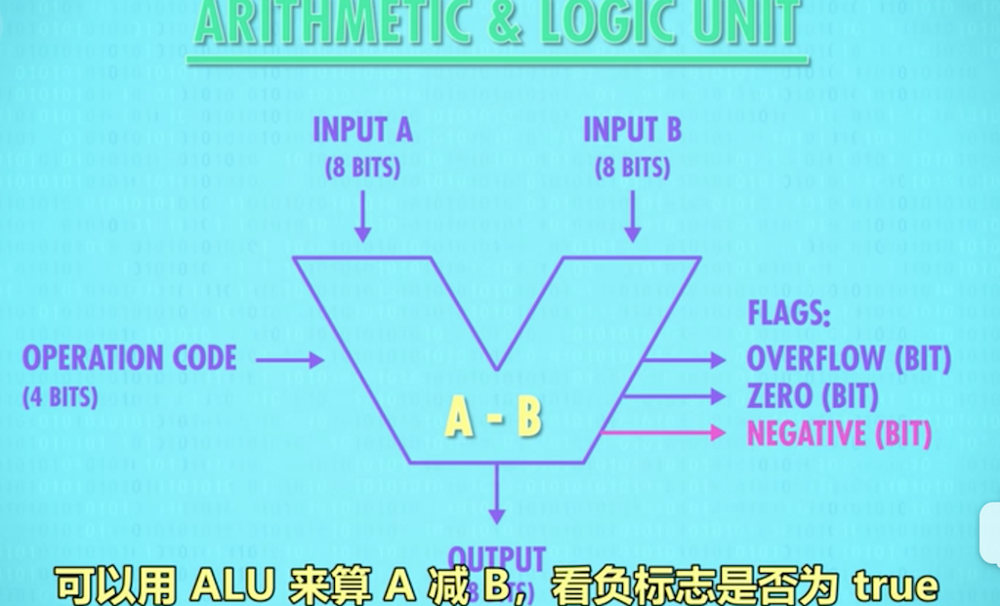
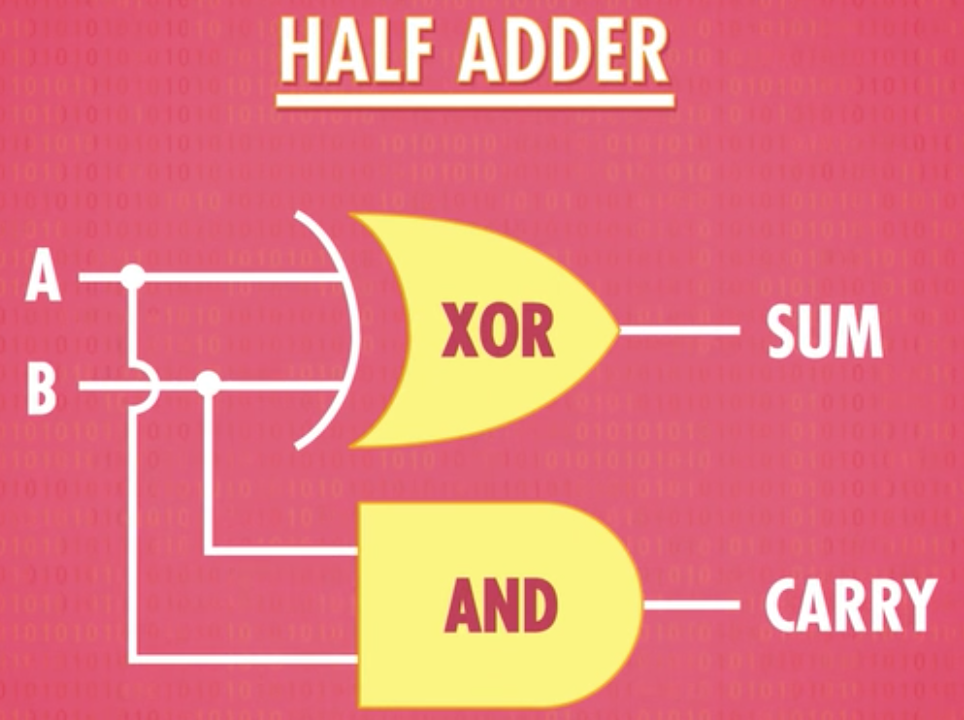
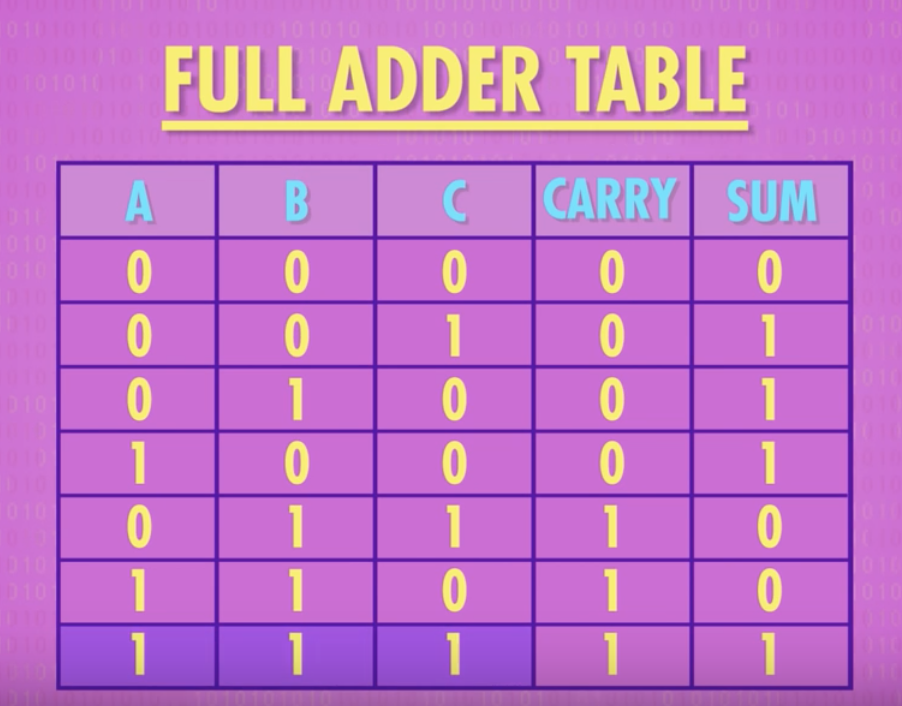
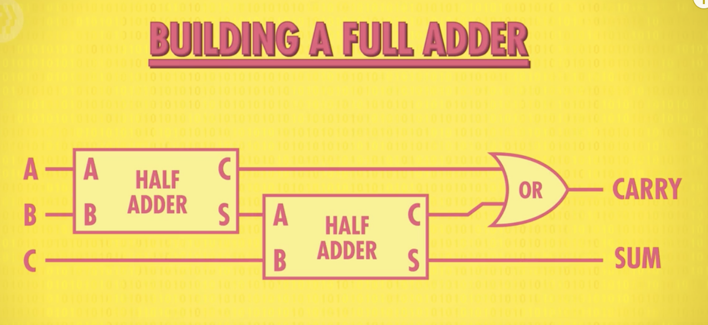
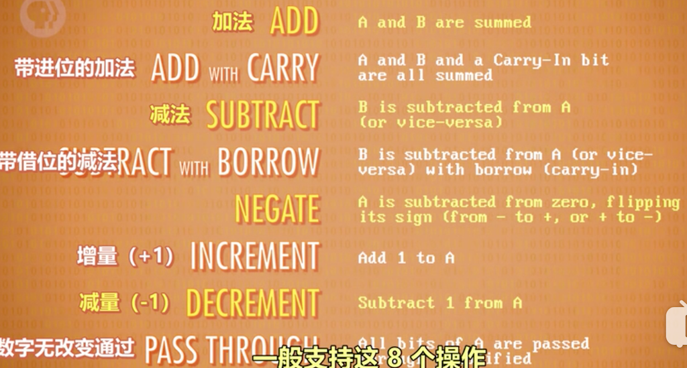
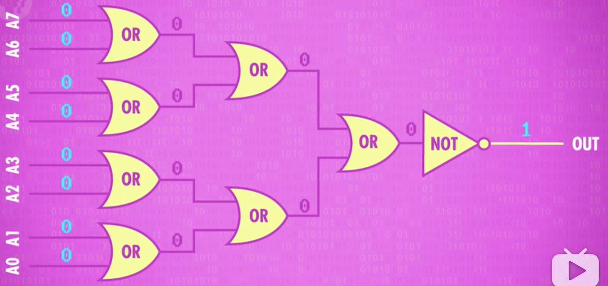

# 5.算术逻辑单元ALU：How Computer Calculate -- the ALU

主题：计算机如何操作二进制  
本节讲的所有组件都只是一大堆逻辑门连在一起而已  
由此我们知道计算机是怎样在没有齿轮或杠杆的情况下进行运算

---

* **ALU**，Intel 74181

  * 表示和存储数据是计算机的重要功能，但其真正目标是计算，有意义地处理数字，这些操作由“**算术逻辑单元ALU(arithmetic logic unit)**”处理

  * ALU：计算机的数学大脑，计算机里负责运算的组件，基本其他所以部件都用到了它。

  * ALU：现代计算机的基石

  * Intel 74181，1970年发布，4位ALU，用了大约70个逻辑门但不能执行乘除，但它向小型化迈出一大步，让计算机更强大更便宜

  * 8位ALU需要数百个逻辑门，把ALU抽象成一个单独组件：用”V“表示ALU

    

  * 8位ALU有2个输入A和B，都是8bits，我们还需告诉ALU执行什么操作，如加法或减法，我们用4位的操作代码。操作代码告诉ALU执行什么操作，输出结果是1个8位数字

  * ALU还会有一堆标志flag，flag是1位的表示特定状态，如两数相减，结果为0，我们的零测试电路会将零标志设为true；如果想知道两数是否相等或谁大谁小，可以用A减去B，看负标志是否为true；最后还有一条线连到加法器等进位，如果有溢出，溢出标志为true。高级ALu有更多flag。这三个是ALU普遍有的

    * 

* 用布尔逻辑门做简单ALU电路：功能与intel 74181一样

  * ALU有2个单元，1个**算术单元(arithmetic unit)**和1个**逻辑单元(logic unit) **

  * 算术单元(arithmetic unit)：负责计算机里所有数字操作（加减，其他事情：如给某个数字+1，这叫增量运算）。根本：把两个数字加起来

    * **半加器 **half adder(处理1个bit，2个输入)

      * 最简单的加法电路是拿2个bit加一起(bit是1或0) ，有2个输入：A和B，1个输出：两数的和。输入有四种可能：0+0=0；1+0=1；0+1=1；1+1=(0,1进到下一位) 。前三种与XOR门的逻辑完全一样,第四种XOR门只对了一部分，1+1输出0，还需一根额外的线代表“进位”，只有输入1和1时，进位才是true，可以用AND门来表示(只有两个都为true，输出才为true)，所以把它加到电路中，叫做半加器
      * 把半加器**抽象**成一个单独组件：2个输入A和B都是1位，2个输出“总和”与”进位“
        

    * **全加器** full adder(处理1个bit，3个输入)

      * 如果想处理超过1+1的运算，需要全加器。半加器输出了进位，意味着算下一列时 需要将3个位加在一起，而不是2个。全加器有3个输入A,B,C,最大可能是1+1+1，即总和1，进位1，所以需要两条输出线“总和”与“进位”。

        

      * 可以用半加器做全加器。先用半加器将A和B相加，然后把C输入到第二个半加器，最后用一个OR门检查进位是不是true，就做成了全加器

        

      * 把半加器**抽象**成一个单独组件：3个输入，2个输出

      * 全加器表示：

        

    * 8bit加法(1个半加器，7个全加器)

      * 有了新组件半加器和全加器，可以相加2个8位数字。

      * 两个数叫A和B，A的第一位叫A0，B的第一位叫B0，A0和B0相加使用一个半加器，因为不需要处理进位，输出sum0；A1和B1相加，由于A0和B0的结果有可能产生进位，所以用一个全加器，输出sum1；把这个全加器的进位连到下一个全加器的输入，处理A2和B2；以此类推，完成8bit相加，该装置叫**8位行波进位加法器**(8-bit ripple carry adder)。最后有2个输出，如果第9位有进位，代表2个数太大，超过8位，这叫溢处\(overflow\).

        

      * 溢出：两个数太大，超出用来表示的位数，会导致错误和不可预期的结果。例吃豆人游戏用8位存当前关卡数，当玩到第256关，ALU溢出，造成一连串错误和乱码，该关卡无法进行。避免溢出：加更多全加器，可操作16或32位数字，让溢出更难发生，代价是更多逻辑门。

      * 另一个缺点：每次进位需要一点时间，虽不会太久，但如今量级是每秒几十亿次计算，所以会造成影响。所以现代计算机用的加法电路有点不同，叫**超前进位加法器(carry-look-ahead adder)**,它更快。

    * ALU的算术单元还能做其他数学运算，一般支持以下8个操作：这些操作也是由逻辑门构成。ALU没有专门乘除法电路，很多简单ALU的乘法使用多次加法实现，如恒温器，电视遥控器，微波炉，但是速度慢，笔记本和手机有更好的处理器，有专门的乘法算术单元。乘法比加法复杂，其实只是更多的逻辑门，所以没有便宜的处理器

      

  * 逻辑单元(logic unit)：执行逻辑操作：如AND OR NOT操作等，也能做简单的数值测试，如一个数是否是负数

    * 检查ALU输出是否为0的电路，用一堆OR门电路检测其中一位是否为1，只要有1个bit是1，哪个数字肯定不是0，然后用一个NOT门取反，所以只有输入的数是0，输出才为1
      

Flag标志(是否相等，是否小于，是否益处等)

