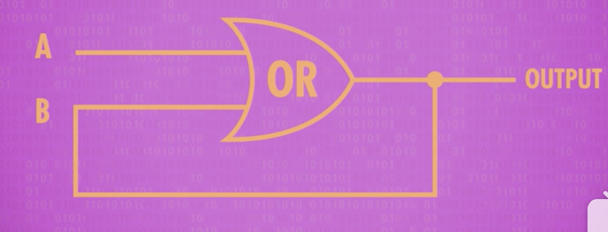
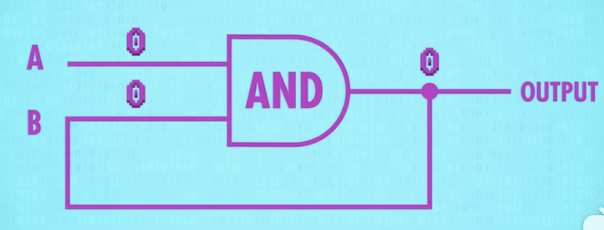
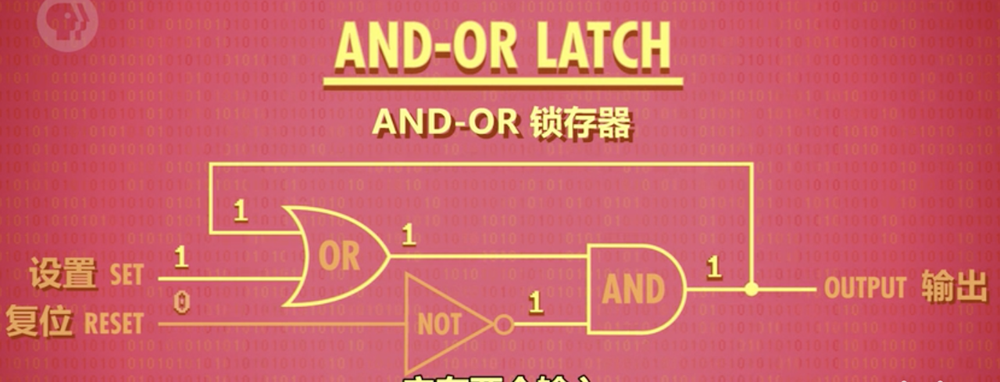
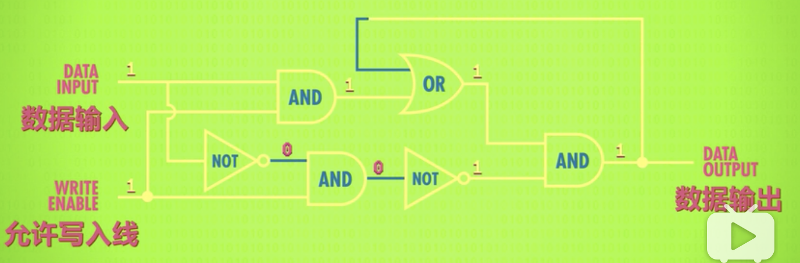
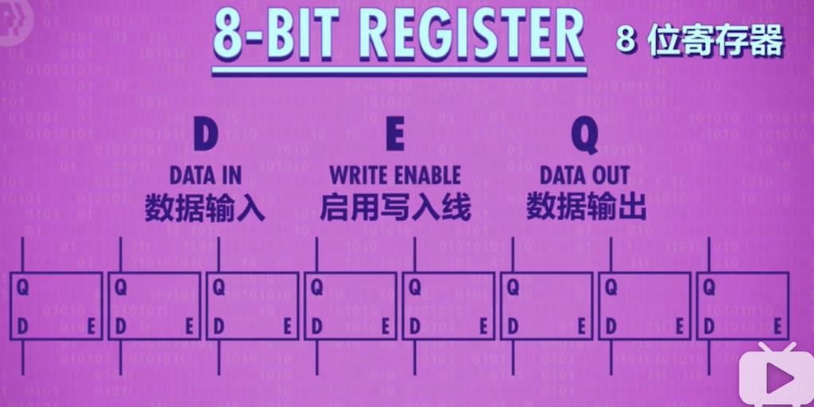

# 6.寄存器&内存 Registers and RAM

> 主题：用ALU做CPU，在此之前计算机需要一些记忆  
> 重点：Memory (存储/内存两种含义)

---

ALU算的结果得找个地方存起来，因为我们还要进行多个连续操作，就用到计算机内存。

当你在玩游戏，停电了，游戏进度没有得到保存，损失数据的原因是电脑用的是“随机存取存储器RAM(Random Access Memory)”,它只能在有电时存储东西，如游戏状态。  
另一种存储memory叫持久存储(persistent memory)，电源关闭，数据不会丢失，用来存其他数据，以后会讨论memory的持久性问题。本节只讲简单的存储。做出只存1位的存储，之后再扩大，做出内存模块，再次和ALU结合起来，做出CPU。

* 存1位的电路(Gated Latch -- 锁存器)

  * 至今说过的电路都是单向的，总是向前流动（如上集的8位“脉动进位加法器”），但也可做回向电路，把输出连回输入。

  * OR门电路 —— 回连：该电路能存储1

    
    使用一个OR门，把输出连回输入，首先设A B都为0，则电路输出为0，如果将A变为1，则电路输出也为1，现在如果将A变回0，电路输出依然是1。所以该电路能记录(存储)1。然而有个问题：这是永久的。无论怎样试，都无法从1变回0.

  * AND门电路 —— 回连：该电路能存储0

    
    使用AND门，开始时A，B都设为1，则电路输出结果为1，如果之后A设为0，输出会变为0，以后无论A设什么值，电路始终输出0.所以该电路能记录(存储)0。

  * 为了做出有用的存储(memory)，我们把两个电路结合起来: **AND-OR锁存器**  
        
      它有两个输入：“设置”输入，把输出变成1；“复位”输入，把输出变成0。如果“设置”和“复位”都是0，电路会输出最后放入的内容，存储就诞生了。这叫**锁存**，因为它锁定了一个值。放入数据的动作叫“写入”，拿出数据的动作叫“读取”。现在我们有办法存一个位了。

      
      但是，用两条线“设置”和“复位”来输入，有点难理解。为了更容易用，我们希望只有一条输入线，将它设为0或1来存储值，还需要一根线来启动内存，启动时允许写入，没有启动时就“锁定”，这条线叫“允许写入线”，加一些逻辑门，可做出此电路。这叫“**门锁(gate latch)**”,因为门可以打开和关上。  
        
      我们不想关心单独的逻辑门，所以我们提升一层抽象：把“门锁”放到盒子里，这个盒子能存一个bit,如上图所示。数据输入从0换到1，从1换到0，什么也不会发生，输出依然是0，因为“允许写入线”是关闭的，所以内容不会变化。所以要给“允许写入线”输入1，打开门，现在往数据线放1，1就能存起来了，现在输出就是1了。现在关掉允许写入线，输出会保持1，现在不管给“数据线”什么值，输出都不会变，值存起来了。现在又打开“允许写入线”，“数据线”设为0，完成。允许写入线关闭，输出0。成功了。

* 存8位(Register -- 寄存器)

    
  只存1位bit是没有用的，所以我们并排放8个锁存器，可以存8位信息，比如一个8 bit 数字，一组这样的锁存器叫“寄存器(register)”。寄存器能存一个数字，这个数字有多少位，叫“位宽”。早期电脑用8位寄存器，然后是16位，32位，如今许多计算机都用64位宽的寄存器。写入寄存器前，要先启用里面所有的锁存器。我们可以用一根线连接所有“允许输入线”，把它设为1。然后用8条数据线发数据，然后将“允许写入线”设回0，现在8位的值就存起来了。

* 16*16的矩阵存256位 
如果只有很小的位(bits)，把锁存器并排放置，也勉强够用了。54位寄存器要64根数据线，64根连到输出端，幸运的是我们只需1根线启动所以锁存器，但加起来也有129根线了，如果存256位要513条线，解决方法是矩阵。在矩阵中，我们不并列排放锁存器，而是做出网状。有256位，我们用16*16网格的锁存器，有16行16列。要启动某个寄存器，就打开相应的行线和列线。放大看看怎么做的，
 
* 数据选择器/多路复用器(Multiplexer)解码8位地址，定位到单个锁存器

* 4位代表行，4位代表列  

* 组合256位内存+多路复用器  

* 可寻址的256字节内存  
* 一条1980年代的内存，1M大小

* 8个模块，每个模块有32个小方块  
* 每个小方块有4个小块，每个小块是128位*64位

