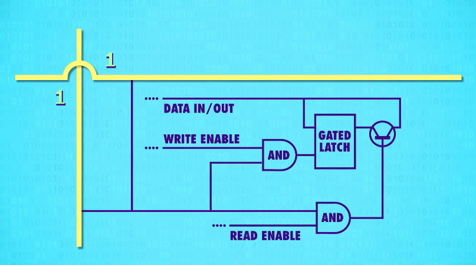

# 6.寄存器&内存 Registers and RAM

> 主题：用ALU做CPU，在此之前计算机需要一些记忆，用锁存器做一块SRAM(静态随机存取存储器)，还有其他类型的RAM,如DRAM, flash memory, NVRAM, 从功能上与SRAM相似，但用不同的电路存单个位，如用不同的逻辑门，电容器，电荷捕获(charge traps)或忆阻器,从根本上这些技术都是矩阵层层嵌套来存储大量信息 
> 重点：Memory (存储/内存两种含义)
>
> 精髓：计算机中的很多事情底层其实都很简单，让人难以理解的是一层层精妙的抽象

---

ALU算的结果得找个地方存起来，因为我们还要进行多个连续操作，就用到计算机内存。

当你在玩游戏，停电了，游戏进度没有得到保存，损失数据的原因是电脑用的是“随机存取存储器RAM(Random Access Memory)”,它只能在有电时存储东西，如游戏状态。  
另一种存储memory叫持久存储(persistent memory)，电源关闭，数据不会丢失，用来存其他数据，以后会讨论memory的持久性问题。本节只讲简单的存储。做出只存1位的存储，之后再扩大，做出内存模块，再次和ALU结合起来，做出CPU。

* 存1位的电路(Gated Latch -- 锁存器)

  * 至今说过的电路都是单向的，总是向前流动（如上集的8位“脉动进位加法器”），但也可做回向电路，把输出连回输入。

  * OR门电路 —— 回连：该电路能存储1

    
    使用一个OR门，把输出连回输入，首先设A B都为0，则电路输出为0，如果将A变为1，则电路输出也为1，现在如果将A变回0，电路输出依然是1。所以该电路能记录(存储)1。然而有个问题：这是永久的。无论怎样试，都无法从1变回0.

  * AND门电路 —— 回连：该电路能存储0

    
    使用AND门，开始时A，B都设为1，则电路输出结果为1，如果之后A设为0，输出会变为0，以后无论A设什么值，电路始终输出0.所以该电路能记录(存储)0。

  * 为了做出有用的存储(memory)，我们把两个电路结合起来: **AND-OR锁存器**  
        
      它有两个输入：“设置”输入，把输出变成1；“复位”输入，把输出变成0。如果“设置”和“复位”都是0，电路会输出最后放入的内容，存储就诞生了。这叫**锁存**，因为它锁定了一个值。放入数据的动作叫“写入”，拿出数据的动作叫“读取”。现在我们有办法存一个位了。

      
      但是，用两条线“设置”和“复位”来输入，有点难理解。为了更容易用，我们希望只有一条输入线，将它设为0或1来存储值，还需要一根线来启动内存，启动时允许写入，没有启动时就“锁定”，这条线叫“允许写入线”，加一些逻辑门，可做出此电路。这叫“**门锁(gate latch)**”,因为门可以打开和关上。  
        
      我们不想关心单独的逻辑门，所以我们提升一层抽象：把“门锁”放到盒子里，这个盒子能存一个bit,如上图所示。数据输入从0换到1，从1换到0，什么也不会发生，输出依然是0，因为“允许写入线”是关闭的，所以内容不会变化。所以要给“允许写入线”输入1，打开门，现在往数据线放1，1就能存起来了，现在输出就是1了。现在关掉允许写入线，输出会保持1，现在不管给“数据线”什么值，输出都不会变，值存起来了。现在又打开“允许写入线”，“数据线”设为0，完成。允许写入线关闭，输出0。成功了。

* 存8位(Register -- 寄存器)

    
  只存1位bit是没有用的，所以我们并排放8个锁存器，可以存8位信息，比如一个8 bit 数字，一组这样的锁存器叫“寄存器(register)”。寄存器能存一个数字，这个数字有多少位，叫“位宽”。早期电脑用8位寄存器，然后是16位，32位，如今许多计算机都用64位宽的寄存器。写入寄存器前，要先启用里面所有的锁存器。我们可以用一根线连接所有“允许输入线”，把它设为1。然后用8条数据线发数据，然后将“允许写入线”设回0，现在8位的值就存起来了。

* 16\*16的矩阵存256位 
  如果只有很小的位(bits)，把锁存器并排放置，也勉强够用了。54位寄存器要64根数据线，64根连到输出端，幸运的是我们只需1根线启动所以锁存器，但加起来也有129根线了，如果存256位要513条线，解决方法是矩阵。在矩阵中，我们不并列排放锁存器，而是做出网状。有256位，我们用16*16网格的锁存器，有16行16列。

  

  要启动某个寄存器，就打开相应的行线和列线。

  

  放大看看怎么做的，我们只想打开交叉处锁存器的“允许写入线”，所有其他锁存器保持关闭，

  

  我们可以用AND门，只有行线和列线均为1，AND门才输出1，所以可以用选择单个锁存器，这种行/列排列法，用一根“允许写入线”连所有锁存器,

  

  为了让锁存器变成“允许写入”，行线和列线和“允许写入线”都必须是1,

  

  每次只有1个锁存器会这样，代表我们可以只用一根“数据线”连所有锁存器来传数据,因为只有一个锁存器会启用，只有那个会存数据，其他锁存器会忽略数据线上的值，因为没有“允许写入”，

  

  我们可以用类似技巧，做“允许读取线”来读数据，从一个指定的锁存器读取数据，

  

  所以对于256位存储。只要35条线，1条“数据线”，1条“允许写入线”，1条“允许读取线”，还有16行16列的线用于选择锁存器(16+16=31,32+3=35)。

* 数据选择器/多路复用器(Multiplexer)解码8位地址，定位到单个锁存器，4位代表行，4位代表列  

  但我们需要某种方法来唯一指定交叉路口，我们刚刚存了一位地址是“12行8列”，由于最多16行，用4位就够了，12用二进制表示为1100，列地址也可以这样，8用二进制表示为1000，所以12行8列可以写成11001000，为了将地址专程行和列，我们需要“多路复用器”，多路复用器有不同大小，因为有16行，我们需要1到16多路复用器。工作方式是，输入一个4位数字，它会把那根线连到相应的输出线，如果输入0000，它会选择第一列；如果我们输入0001，会选择下一列，以此类推。一个多路复用器处理行，另一个多路复用器处理列。那么把256位内存当成一个整体，又提升了一层抽象(a new level of abstraction)。

  

* 组合256位内存+多路复用器  

  输入一个8位地址，4位代表行，4位代表列，我们还需要“允许写入线”和“允许读取线”，最后还需要一条数据线用于读/写数据，不幸的是，256位的内存也没法做什么事，所以还需扩大规模.

  

  我们把256位内存并排放置，就像寄存器一样，一行8个，可以存一个8位数字，8位也叫一个字节(byte),为了存一个8位数字，我们同时给8个256位内存一样的地址，每个地址存1位，意味着这里总共能存256个字节(byte)。为了简单，我们不管内部，不看做是一堆独立的存储模块和电路，而是看成一个整体的可寻址内存，我们有256个地址，每个地址能读或写一个8位值，下集做CPU时会用到这个内存。

* 可寻址的256字节内存  

  现代计算机的内存扩展到上兆字节(MB)和千兆字节(GB)的方式和这里时一样的。不断把内存打包到更大规模。随着内存位置(memory location)增多，内存地址(address)也必须增长。8位最多代表256个内存地址，要给千兆或十亿字节的内存寻址，需要32位的地址。内存的一个重要特性是：可以随时访问任何位置，因此叫“随机存取存存储器(Random-Access Memory)”，简称RAM。RAM就像人类的短期记忆，记录当前在做什么事

  

  

  

  

* 一条1980年代的内存，1M大小，8个模块，每个模块有32个小方块  

  一条真的内存，焊了8个内存模块，如果打开一个放大，会看到32个内存方块，放大其中一个方块，可以看到4个小块，如果再放大，可以看到存一个“位”的矩阵，这个矩阵是128位*64位，总共8192位。每个方格4个矩阵，所以每个方格有32768个位，而一共32个方格，总而言之，一个芯片大约存100万位。RAM有8个芯片，所以总共800万位，也就是1兆字节(1MB)。1M并不算大，如今你可以买到GB的内存

  

