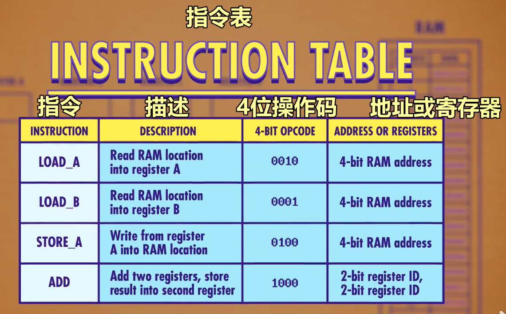
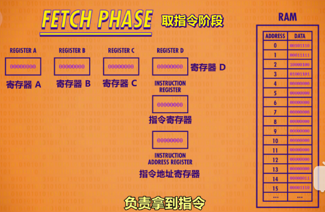
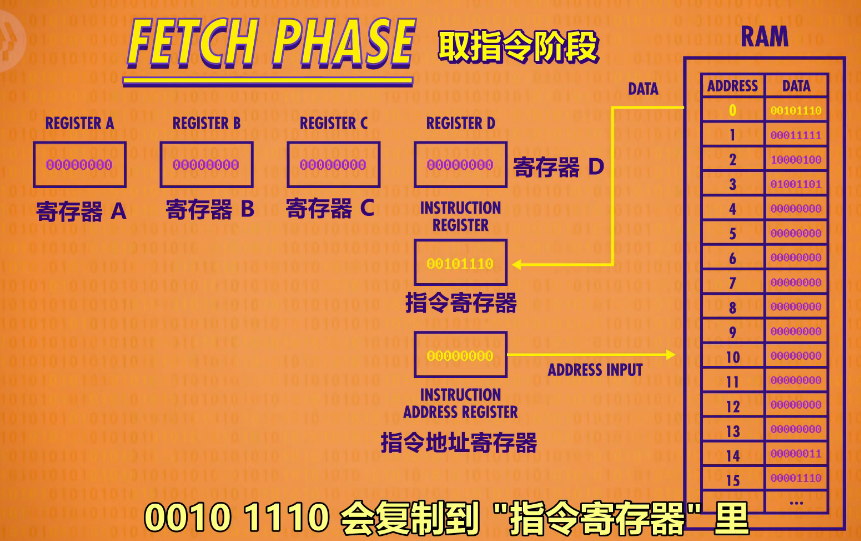
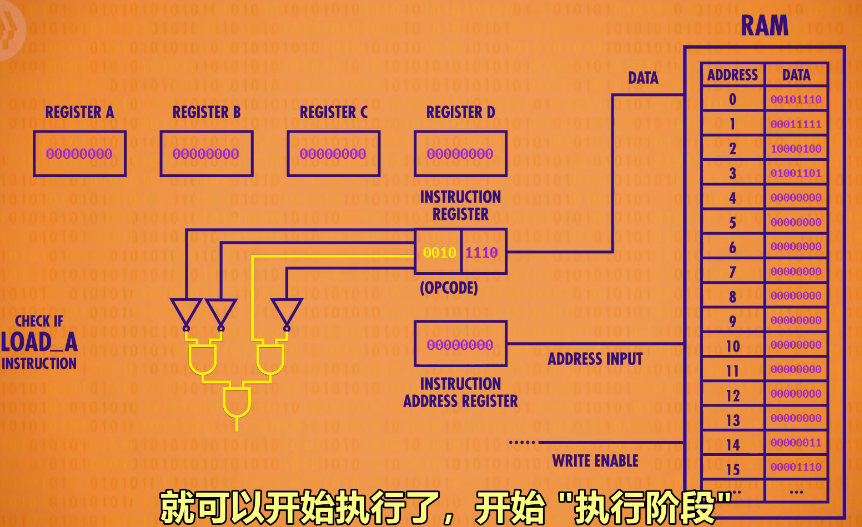
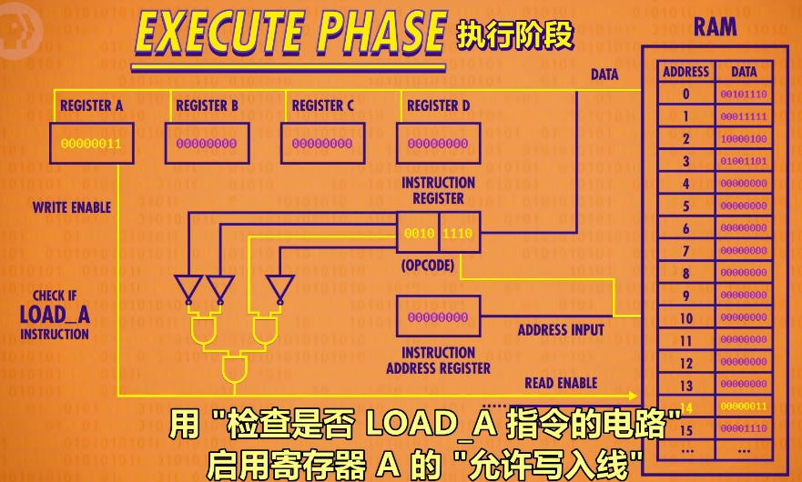
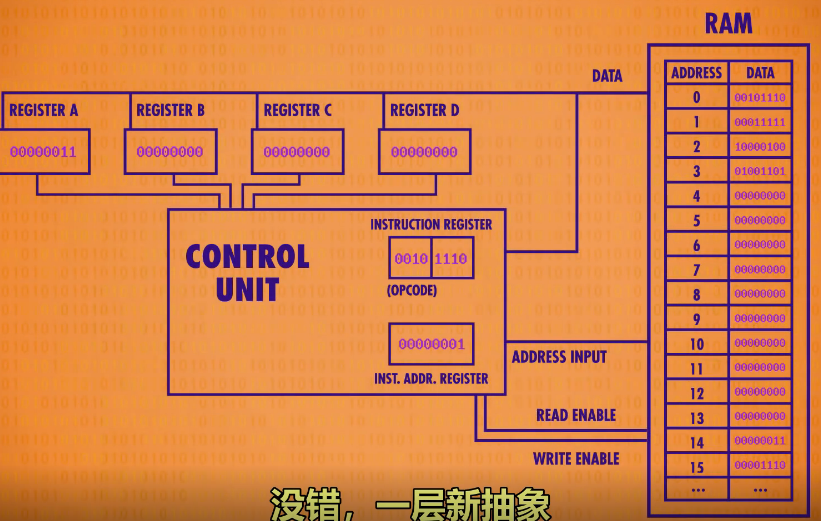

# 7. The Central Process Unit-CPU中央处理器

> 用ALU和寄存器拼出个CPU
>
> CPU怎么执行命令

## 7.1 拼个CPU出来： RAM+寄存器+ALU

我们已经做了一个算计逻辑单元ALU，输入二进制它会执行计算，还做了两种内存：寄存器(很小的一块内存，能存一个值)；RAM(一大块内存，能在不同地址存大量数字)，现在把这些放在一起，组建计算机的“心脏”——CPU。

CPU负责执行程序，程序由一个个指令(Instruction)组成,它们指示计算机要做什么，CPU会让ALU进行数学运算，也可能是内存指令，CPU会和内存通信，然后读/写值，CPU里有很多组件。我们把重点放在功能，而不是一根线具体怎么连，当我们用一条线连接两个组件时，这条线只是所有必须线路的一个抽象，这种高层次视角叫“微体系架构(microarchitecture)”

取1个RAM(为了简单，它只有16个位置，每个位置存8位)，4个8位寄存器A,B,C,D(寄存器用来临时存数据和操作数据)， 数据和程序都可以存在内存里。给CPU支持的所有指令分配一个ID。在这个假设的例子中，我们用前四位存“操作代码”(operation code),简称操作码opcode，后四位代表数据来自哪里，可以是寄存器或内存地址。

我们还需要两个寄存器来完成cpu，1.一个寄存器追踪程序运行到哪里了，我们叫它“**指令地址寄存器**”(instruction address register),存当前指令的内存地址；2.另一个寄存器存当前指令，叫“**指令寄存器**”。

## 7.2 CPU处理程序的三个阶段

### 7.1.1 取指令阶段

当启动计算机时，所有寄存器从0开始。举例：我们在RAM里放一个程序，过一遍CPU的第一个阶段“取指令阶段”(fetch phase)——负责拿到指令。

首先，将“指令地址寄存器”连到ＲAＭ,寄存器的值为０，因此RAM返回地址0的值，00101110会复制到"指令寄存器“里，现在就拿到指令了。

### 7.1.2 解码阶段

要弄清是什么指令，才能执行(execute)，这是解码过程(Decode Phase)。根据指令表前4位0010是LOAD A指令，意思是把RAM的值放入寄存器A，后4位11110是RAM的地址，转成十进制是14。接下来指令由“控制单元”进行解码，就像之前的所有东西“控制单元”也是逻辑门组成的。比如为了识别LOAD指令，需要一个电路，检查操作码是不是0010，可以用很少的门电路实现。

### 7.1.3 执行阶段

现在知道是什么指令，就可以开始执行了，开始“执行阶段”(Execuye Phase)。用“检查是否LOAD_A指令的电路”可以打开RAM的“允许读取线”，把地址14传过去，RAM拿到值00000011，十进制是3.因为是LOAD_A指令，我们想把这个值只放到寄存器A，其他寄存器不受影响，所以需要一根线连到4额寄存器，用“检查是否LOAD_A指令的电路”启用寄存器A的“允许写入线”，就成功了，把RAM地址14的值放到了寄存器Ａ。指令完成后我们可以关掉所有线路去拿下一条指令。”指令地址寄存器“＋１，执行阶段就此结束。

LOAD_A只是ＣPU可以执行的各种指令之一，不同指令由不同逻辑电路解码，这些逻辑电路会配置CPU内的组件来执行对应操作。具体分析这些解码电路很繁琐，干脆把”控制单元“包成一个整体，简洁一些，就是一层新的抽象。控制单元像管弦乐指挥，指挥CPU的所有组件。

## 7.3 CPU怎么去执行程序？

取指令-->解码-->执行 完成后，可以再来一次，从取指令开始，RAM返回地址1里的值：00011111，到解码阶段，0001是LOAD_B指令，从RAM里把一个值复制到寄存器B，这次内存地址是1111，十进制是15.现在到执行阶段，控制单元叫RAM读地址15，并配置寄存器B接收数据，成功，我们把值 0000 1110 \N 也就是十进制的 14 存到了寄存器 B，最后一件事是 "指令地址寄存器" +1，我们又完成了一个循环。

下一条指令有点不同，来取它吧 1000 0100，1000 是 ADD 指令 ，这次后面的 4 位不是 RAM 地址，而是 2 位 2 位分别代表 2 个寄存器，2 位可以表示 4 个值，所以足够表示 4 个寄存器。第一个地址是 01, 代表寄存器B ，第二个地址是 00, 代表寄存器A。因此，1000 0100，代表把寄存器 B 的值，加到寄存器 A 里 ，为了执行这个指令，我们要整合第 5 周的"控制单元" 负责选择正确的寄存器作为输入，并配置 ALU 执行正确的操作  B对于 "ADD" 指令， "控制单元" 会 启用寄存器 B，作为 ALU 的第一个输入，还启用寄存器 A，作为 ALU 的第二个输入 。之前说过，ALU 可以执行不同操作，所以控制单元必须传递 ADD 操作码告诉它要做什么 。最后，结果应该存到寄存器 A，但不能直接写入寄存器 A，这样新值会进入 ALU ，不断和自己相加，因此，控制单元用一个自己的寄存器暂时保存结果，关闭 ALU，然后把值写入正确的寄存器，这里 3+14=17，二进制是 0001 0001，现在存到了寄存器 A。和之前一样，最后一件事是把指令地址 + 1 这个循环就完成了

好，来看最后一个指令：0100 1101，解码得知是 STORE A 指令（把寄存器 A 的值放入内存）， RAM 地址 13，接下来，把地址传给，同时，打开寄存器 A 的 "允许读取" 这样就可以把寄存器 A 里的值，传给 RAM。恭喜，我们刚运行了第一个电脑程序！它从内存中加载两个值，相加，然后把结果放回内存，刚刚是我一步步来讲的,我们人工切换 CPU 的状态 "取指令→解码→执行"。

## 7.4 时钟速度和赫兹

但不是每台电脑里都有一个迷你，其实是 "时钟" 来负责管理 CPU 的节奏，时钟以精确的间隔触发电信号，控制单元会用这个信号，推进 CPU 的内部操作，确保一切按步骤进行。就像罗马帆船的船头，有一个人负责按节奏的击鼓, 让所有划船的人同步... 就像节拍器一样，节奏不能太快，因为就算是电也要一定时间来传输。 "取指令→解码→执行" 的速度叫 "时钟速度"，单位是赫兹 - 赫兹是用来表示频率的单位。赫兹代表一秒 1 个周期 因为我花了大概 6 分钟，给你讲了 4 条指令：读取→读取→相加→存储，所以我的时钟速度大概是 0.03 赫兹。我承认我算数不快，但哪怕有人算数很快，最多也就是一秒一次，或 1 赫兹。第一个单芯片 CPU 是 "英特尔 4004" ，1971 年发布的 4 位CPU，它的微架构很像我们之前说的CPU。虽然是第一个单芯片的处理器，但它的时钟速度达到了 740 千赫兹 - 每秒 74 万次 。你可能觉得很快，但和如今的处理器相比不值一提，一兆赫兹是 1 秒 1 百万个时钟周期，你现在看视频的电脑或手机，肯定有几千兆赫兹 ， 1 秒 10 亿次时钟周期 。

## 7.5 动态调整频率

超频提升性能，降频省电

你可能听过有人会把计算机超频，意思是修改时钟速度，加快 CPU 的速度 。就像罗马帆船要撞另一艘船时，鼓手会加快敲鼓速度。芯片制造商经常给 CPU 留一点余地，可以接受一点超频。但超频太多会让 CPU 过热或产生乱码，因为信号跟不上时钟。你可能很少听说降频，但降频其实很有用，有时没必要让处理器全速运行，可能用户走开了，或者在跑一个性能要求较低的程序，把 CPU 的速度降下来，可以省很多电，省电对用电池的设备很重要，比如笔记本和手机。为了尽可能省电，很多现代处理器可以按需求加快或减慢时钟速度这叫 "动态调整频率" 。

## 7.6 总结

> 加上时钟后，CPU 才是完整的。现在可以放到盒子里，变成一个独立组件。!一层新的抽象！ RAM，上面说过，是在 CPU 外面的独立组件，CPU 和 RAM 之间用 "地址线"  "数据线" 和 "允许读/写线" 进行通信。虽然今天我们设计的 CPU 是简化版的, 但我们提到的很多机制，依然存在于现代处理器里 。

