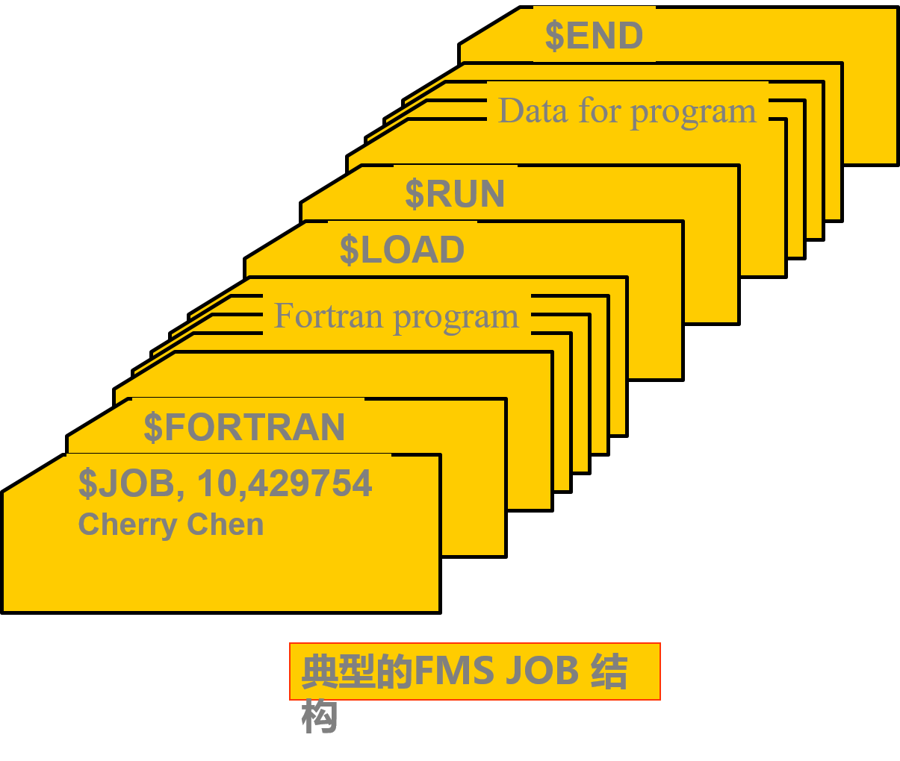

## 一、无操作系统的计算机系统

### 1. 人工操作方式

电子管时代，计算机的运算速度较慢，没有操作系统， 人们采用人工操作方式使用计算机。 

###### 特点:

(1)用户独占全机
(2)CPU等待人工操作
(3)独占性 
(4)串行性

###### 缺点:

(1)计算机的有效机时严重浪费 (2)效率低

### 2. 脱机输入/输出方式

为了解决人机矛盾及CPU和I/O设备之间速度不匹配的矛盾，20世纪50年代末出现了脱机输入/输出(Off-Line I/O)技术。 
 在采用脱机输入输出方式时，程序和数据的输入输出都是在外围计算机的控制下完成的，即它们是脱离主机进行的，故称之为脱机输入输出操作。

脱机I/O方式的主要优点如下：

1） 减少了CPU的空闲时间 2 ）提高I/O速度 

## 二、单道批处理系统

### 1.单道批处理系统的处理过程

晶体管时代，随着中央处理机速度的大幅度提高，人工操作的慢速度和中央处理机运算的高速度之间出现了矛盾，即所谓人机矛盾。为解决这一矛盾，只有设法去掉人工操作，实现作业的自动过渡，这样就出现了成批处理。

批处理：指计算机系统对一批作业自动进行处理的一种技术。单道批处理在内存中仅有一道作业。

监控程序：是一个常驻内存的小的核心代码，用于实现各作业之间的自动转接，提高了系统效率。

### 2.单道批处理系统的特征

单道批处理系统是最早出现的一种OS。严格地说，它只能算作是OS的前身而并非是现在人们所理解的OS。尽管如此，该系统比起人工操作方式的系统已有很大进步。

主要特征：

自动性: 自动地逐个依次运行，无需人工干预。

顺序性: 作业是顺序地进入内存，顺序完成。

单道性: 内存中仅有一道程序运行。

## 三、多道批处理系统

### 1.多道程序设计的基础概念
 在单道批处理系统中，内存中仅有一道作业，它无法充分利用系统中的所有资源，致使系统性能较差。

 在20世纪60年代中期又引入了多道程序设计技术。

 多道程序设计技术是指在计算机内存中同时存放多个作业，它们在管理程序控制之下交替执行，共享系统中的各种资源。

 在该系统中， 用户所提交的作业都先存放在外存上并排成一个队列，称为“后备队列”；然后，由作业调度程序按一定的算法从后备队列中选择若干个作业调入内存，使它们共享CPU和系统中的各种资源。

### 2.多道批处理系统的特征
 多道：在内存中可同时驻留多道程序，并容许它们并发执行，有效提高资源的利用率和系统吞吐率。宏观上并行,微观上串行。

 成批处理：用户自己不能干预自己作业的运行，一旦发现作业错误不能及时改正，并延长开发软件时间，所以适用于成熟的程序。

 无序性 : 进入的顺序与完成的顺序可能不一致。

 调度性 : 作业提交给系统直到完成需要两次调度。

 一次作业调度：从外存后备作业队列，选择若个作业调入内存。

 二次进程调度: 从内存的作业中选择一个作业，将处理机分配给它，使之执行。

### 3.多道批处理系统的优缺点
- 资源利用率高；

- 系统吞吐量大；系统吞吐量是指系统在单位时间内所完成的总工作量。

- 可提高内存和I/O设备利用率；

- 平均周转时间长；作业的周转时间是指从作业进入系统开始，直至其完成并退出系统为止所经历的时间。

- 无交互能力；

- 适合大型科学计算、数据处理。

### 4.多道批处理系统需要解决的问题
 多道批处理系统是一种有效、但十分复杂的系统。为使系统中的多道程序间能协调地运行，必须解决下述一系列问题：

 (1) 处理机管理问题。

 (2) 内存管理问题。

 (3) I/O设备管理问题。

 (4) 文件管理问题。

 (5) 作业管理问题。

 操作系统是计算机系统中的一个大型的系统软件，它管理和控制计算机系统中的全部软、硬件资源，合理地组织计算机的工作流程，为用户应用程序的运行提供一个友好的界面和良好的工作环境。

## 四、分时系统

### 1.分时系统的产生
 分时系统是为了满足用户需求所形成的一种新型OS。它与多道批处理系统之间，有着截然不同的性能差别。用户的需求具体表现在以下几个方面：

 (1) 人－机交互

 (2) 共享主机

 (3) 便于用户上机

 多用户交互式系统: 多个用户通过交互方式分享使用同一台计算机。

### 2.分时系统的思想

- 采用时间片轮的方法，同时为许多终端用户服务，对每个用户能保证足够快的响应时间，并提供交互会话的功能。

- 时间片：将CPU的时间划分成若干个片段,称为时间片，操作系统以时间片为单位,轮流为每个终端用户服务。

 假设用户数目为100，为保证系统响应时间不超过2s，时间片最大应为20ms。

- 设计目标：对用户的请求及时响应，并在可能条件下尽量提高系统资源的利用率。

 分时系统的响应（及时性）主要是根据用户的所能接受的等待时间。

 适合办公自动化、教学及事务处理等要求人机会话的场合。

 

### 3.分时操作系统工作方式

- 一台主机连接了若干个终端

- 每个终端有一个用户在使用

- 交互式的向系统提出命令请求

- 系统接受每个用户的命令

- 采用时间片轮转方式处理服务请求

- 并通过交互方式在终端上向用户显示结果

- 用户根据上步结果发出下道命令

### 4.分时系统实现中的关键问题
 为实现分时系统，其中，最关键的问题是如何使用户能与自己的作业进行交互，即当用户在自己的终端上键入命令时， 系统应能及时接收并及时处理该命令，再将结果返回给用户。

 (1) 及时接收。

 实现：配置一个多路卡

 (2) 及时处理。

 人机交互的关键；

 用户及时控制自己作业的运行。

 用户的作业都必须驻留在内存中。

### 5.分时系统的特征
(1) 多路性：指一台计算机与若干台终端相连，各终端用户可以同时操作，共同使用同一系统的资源。

(2) 独占性：由于分时操作系统采用时间片轮转的办法使一台计算机同时为多个终端用户服务，因而每个终端用户彼此之间都感觉不到别人也在使用这台计算机，好像自己独占整个计算机系统。

(3) 及时性：用户的请求能在较短的时间内得到及时响应。

(4) 交互性：分时操作系统支持联机操作方式。用户可以通过终端，采用人机会话的方式直接控制程序运行，同程序进行会话。

## 五、实时系统

实时是指计算机系统要能够及时响应外部事件的请求，并以足够快的速度完成对事件的处理。

实时操作系统按其用途的不同可分为两种类型：实时控制系统和实时信息处理系统。

1. 实时控制系统。通常是指以计算机为中心的生产过程控制系统。

  实时控制系统的应用：对导弹发射、飞机飞行、钢铁生产、电力生产、石油化工生产过程的自动控制等。

2. 实时信息处理系统。在这类系统中，用户通过终端提出服务请求，计算机系统根据用户提出的问题对信息进行检索和处理，并在很短的时间内通过终端对用户作出回答。

  实时信息处理系统的应用：情报检索系统、航空订票系统、银行系统和图书管理系统等。

3. 实时任务

1) 按任务执行时是否呈现周期性来划分

(1) 周期性实时任务。外部设备周期性地发出激励信号给计算机，要求它按指定周期循环执行，以便周期性地控制某外部设备。

(2) 非周期性实时任务。外部设备所发出的激励信号并无明显的周期性，但都必须联系着一个截止时间(Deadline)。它又可分为开始截止时间(某任务在某时间以前必须开始执行)和完成截止时间(某任务在某时间以前必须完成)两部分。

2) 根据对截止时间的要求来划分

(1) 硬实时任务(Hard real-time Task)。系统必须满足任务对截止时间的要求，否则可能出现难以预测的结果。

(2) 软实时任务(Soft real-time Task)。它也联系着一个截止时间，但并不严格，若偶尔错过了任务的截止时间，对系统产生的影响也不会太大。

4. 实时操作系统的主要特点

(1) 即时响应：系统必须保证对实时信息的分析和处理的速度比其进入系统的速度要快。

(2) 高可靠性：与其它类型系统相比，实时操作系统更注重其稳定性和可靠性。

(3) 专业性

[双工系统]：一台做为主机，另一台作为后备机与主机并行运行。一旦主机发生故障，后备机便立即代替主机继续工作，以保证系统不间断运行。

## 六、微机操作系统的发展

### 1.单用户单任务操作系统

只允许一个用户上机，且只允许用户程序作为一个任务运行。这是最简单的微机操作系统，主要配置在8位和16位微机上。最有代表性的单用户单任务微机操作系统是CP\/M和MS-DOS。

1) CP/M

1974年第一代通用8位微处理机芯片Intel 8080出现后的第二年，Digital Research公司就开发出带有软盘系统的8位微机操作系统。

2) MS-DOS

1981年IBM公司首次推出了IBM-PC个人计算机(16位微机)，在微机中采用了微软公司开发的MS-DOS(Disk Operating System)操作系统，该操作系统在CP\/M的基础上进行了较大的扩充，使其在功能上有很大的增强。

### 2.单用户多任务操作系统

只允许一个用户上机，但允许用户把程序分为若干个任务，使它们并发执行，从而有效地改善了系统的性能。

最有代表性的是由微软公司推出的Windows。

Windows 1.0和Windows 2.0版本操作系统， 1985年和1987年。

Windows 3.0版本，1990年，386，486等32位微机开发的。

1995年微软公司推出了Windows 95

Windows 98, 1998年

32位版本的Windows XP，2001年

### 3.多用户多任务操作系统

允许多个用户通过各自的终端使用同一台机器，共享主机系统中的各种资源，而每个用户程序又可进一步分为几个任务，使它们能并发执行，从而可进一步提高资源利用率和系统吞吐量。

在大、中和小型机中所配置的大多是多用户多任务操作系统，而在32位微机上也有不少是配置的多用户多任务操作系统，其中最有代表性的是UNIX OS。

UNIX OS是美国电报电话公司的Bell实验室在1969～1970年期间开发的，1979年推出来的UNIX V.7已被广泛应用于多种中、小型机上，人们又将UNIX移植到微机上。

Solaris OS：SUN公司于1982 年推出的SUN OS 1.0是一个运行在Motorola 680x0平台上的UNIX OS。

Linux OS：Linux 是UNIX的一个重要变种，最初是由芬兰学生Linus Torvalds针对Intel 80386开发的。1991年在Internet网上发布第一个Linux版本，由于源代码公开，因此有很多人通过Internet与之合作，使Linux的性能迅速提高，其应用范围也日益扩大。

# 七、网络操作系统

* **计算机网络**是通过通信设备和通信线路将地理上分散的多个计算机系统相互连接起来，实现信息交换、资源共享、可互操作和协作处理的系统。

* **网络环境下的操作系统**是网络用户和网络之间的接口，它除了具有通常操作系统的资源管理功能外，还具有网络管理、网络通信、网络资源共享、系统安全和多种网络应用服务的功能。

* 网络操作系统既要为**本机用户**提供使用网络资源的手段，又要为**网络用户**使用本机资源提供服务。

# 八、分布式操作系统

* 分布式计算机系统是由多台计算机组成的一种特殊的计算机网络。该网络中的各台计算机没有主次之分；网络中任意两台计算机之间可以通过通信交换信息；网络中的资源供各用户共享。分布式计算机系统是一个一体化的系统（统一的界面，标准的接口），在整个系统中有一个全局的操作系统，称为分布式操作系统。
* 分布式操作系统能使系统中若干台计算机相互协作完成一个共同的任务。它负责全系统的资源分配和调度、任务的划分、信息的传输控制协调等工作，为用户提供一个统一的界面和标准的接口。
  #### 基本特征：

（1）统一性：逻辑上的统一系统，使用户感觉不到系统是由多台计算机构成的，系统能够自动的实施任务分配和协调。

（2）坚强性：当系统中的部分计算机或通路发生故障时，其余部分可自动重构成为一个新的系统。

#### 网络和分布式的区别

(1)分布具有各个计算机间相互通讯，无主从关系； 网络有主从关系

(2) 分布式系统资源为所有用户共享；而网络有限制地共享。

(3) 分布式系统中若干个计算机可相互协作共同完成一项任务。强项：分布式计算。

# 九、嵌入式操作系统

### 1.什么是嵌入式系统？

* 在各种设备、装置或系统中，完成特定功能的软硬件系统

* 它们是一个大设备、装置或系统中的一部分，这个大设备、装置或系统可以不是“计算机”。

* 通常工作在反应式或对处理时间有较严格要求环境中。

* 由于它们被嵌入在各种设备、装置或系统中，因此称为嵌入式系统。

* 在嵌入式系统中的OS，称为嵌入式操作系统。

* 嵌入式操作系统，是运行在嵌入式智能芯片环境中，对整个智能芯片以及它所操作、控制的各种部件装置等等资源进行统一协调、调度、指挥和控制的系统软件。
  

# 十、操作系统领域中新的操作系统

* 有线电视机顶盒领域，PowerTV

* 移动通信领域，EPOC、移动PDA

* 掌上计算机领域，Palm OS

* 数字影像领域， Digita

# 十一、操作系统演变过程中的计算机系统

