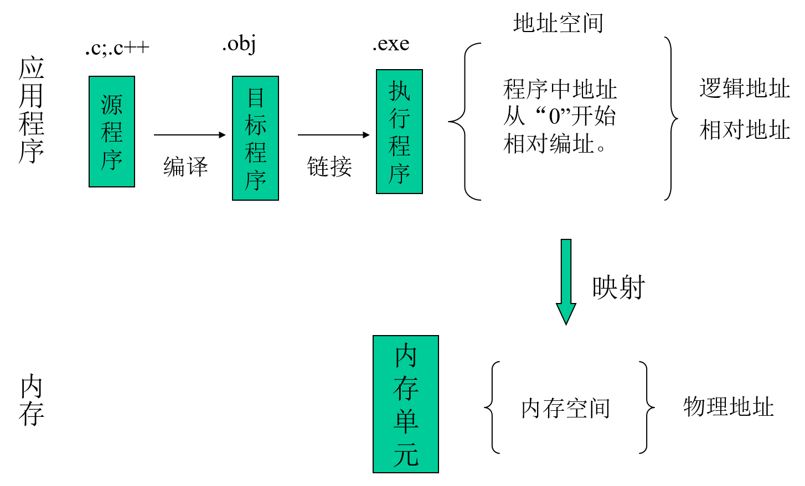

**功能：硬件抽象和协调管理**

## 一、处理器管理功能
 处理机管理的主要任务是对中央处理机的分配和运行实施有效的管理。

 在传统的多道程序系统中，处理机的分配和运行都是以进程为基本单位，因而对处理机的管理可归结为对进程的管理；

 在引入了线程的OS中，也包含对线程的管理。

### 1.进程控制
 为作业创建进程，撤消已结束的进程以及控制进程在运行过程中的状态转换。

 在现代OS中，进程控制还应具有为一个进程创建若干个线程的功能和撤消(终止)已完成任务的线程的功能。

### 2.进程同步

 进程是以异步方式运行的,为使多个进程能有条不紊地运行，系统中必须设置进程同步机制。

 进程同步的主要任务是为多个并发进程(含线程)的运行进行协调。有两种协调方式：

 (1) 进程互斥方式: 对临界资源访问时

 (2) 进程同步方式: 相互合作去完成共同任务的诸进程(线程)间，同步机构对它们的执行次序加以协调。

### 3.进程通信
 对于相互合作的进程，在它们运行期间，彼此之间往往要交换一定量的信息，进程通信将负责完成进程间的信息交换。

 例如，有三个相互合作的进程，它们是输入进程、计算进程和打印进程。

### 4.调度
 在后备队列上等待的每个作业都需经过调度才能执行。在传统的操作系统中，包括作业调度和进程调度两步。

(1) 作业调度。 

 (2) 进程调度。

## 二、存储器管理功能
 存储器的存储调度应和处理机的调度结合起来，只有程序在主存时才有可能被处理机执行，而且仅当它可以到处理机上执行时才把它调入主存。

### 1．内存分配

 存储管理的基本功能是为每道程序分配内存空间，在作业结束时收回作业所占空间,提高存储器的利用率。

 (1) 内存分配数据结构。该结构用于记录内存空间的使用情况，作为内存分配的依据；

 (2) 内存分配功能。系统按照一定的内存分配算法为用户程序分配内存空间；

 (3) 内存回收功能。系统对于用户不再需要的内存，通过用户的释放请求去完成系统的回收功能。

### 2．内存保护

 保证各程序在自己的存储区域内运行而不相互干扰。

 绝不允许用户程序访问操作系统的程序和数据；也不允许用户程序转移到非共享的其它用户程序中去执行。

 设置内存保护机制，一种比较简单的内存保护机制是设置上界和下界限寄存器。

### 3．内存扩充

 由于物理内存的大小可能限制了大型作业或多个作业的并发执行，因此，存储管理借助于虚拟存储技术来获得增加内存的效果，使系统能运行内存需求量远比物理内存大得多的作业，或让更多的作业并发执行。

 功能：

 (1) 请求调入功能。 (2) 置换功能。

### 4．地址映射

## 三、设备管理功能
### 1．缓冲管理

 解决CPU运行的高速性和I/O低速性间的矛盾。

 在I/O设备和CPU之间引入缓冲，则可有效地缓和CPU与I/O设备速度不匹配的矛盾，提高CPU的利用率，进而提高系统吞吐量。

### 2．设备分配

 当用户程序提出输入输出请求后，设备管理根据一定的设备分配原则和系统中设备情况对设备进行分配。

 为了实现设备分配，系统中应设置设备控制表、控制器控制表等数据结构，用于记录设备及控制器的标识符和状态。

### 3．设备处理

 设备处理程序又称为设备驱动程序。其基本任务是用于实现CPU和设备控制器之间的通信，即由CPU向设备控制器发出I/O命令，要求它完成指定的I/O操作；反之，由CPU接收从控制器发来的中断请求，并给予迅速的响应和相应的处理

 启动指定的输入输出设备，完成用户规定的输入输出操作，并对由设备发来的中断请求进行响应，根据中断类型进行相应的处理。

### 4、设备无关性。

 即用户向系统申请的设备与实际使用的设备无关。（即使用设备的逻辑名）

## 四、文件管理功能
### 1．文件存储空间的管理

 负责为新建文件分配存储空间，回收已撤消文件所占用的空间，以提高文件存储空间的利用率和文件系统的工作速度。

 系统应设置相应的数据结构，用于记录文件存储空间的使用情况，以供分配存储空间时参考。

### 2. 目录管理 
主要负责为每一个文件建立其目录项，并通过对目录项的有效组织和管理，实现为用户按名存取的功能。

目录项包括文件名、文件属性、文件在磁盘上的物理位置等。

### 3. 文件保护 
为了防止文件被窃取和破坏，文件系统必须提供有效的保护机制，以保证文件系统的安全性。

### 4. 文件操作管理。
用于实现文件的操作，负责完成数据的读写。

## 五、提供(操作系统与用户之间的)接口
 操作系统提供两种形式的接口供用户使用。操作提供的服务：

 (1) 用户接口 提供给用户使用的接口，通过该接口取得操作系统的服务；

 联机用户接口: 它由一组键盘操作命令及命令解释程序所组成。用户直接控制自己的作业.

 脱机用户接口(批处理用户接口): 接口由一组作业控制语言(JCL)组成。用户不能直接与自己的作业交互作用，只能委托系统代替用户对作业进行控制和干预。

 图形用户接口: 采用了图形化的操作界面。

 (2) 程序接口 提供一组系统调用供用户应用程序和其他系统程序调用操作系统的功能。它是提供给程序员在编程时使用的接口，是用户程序取得操作系统服务的惟一途径。
