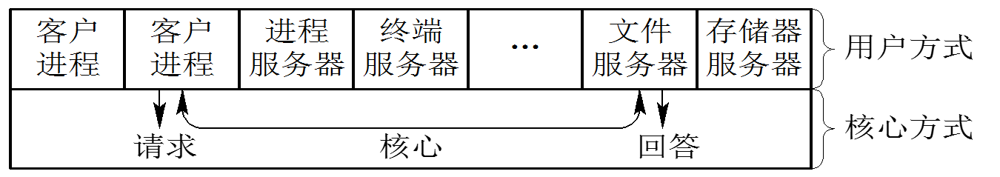

# 1.5 操作系统结构设计

## 1.5.1 传统的操作系统结构

### 1.无结构操作系统
 在早期开发操作系统时，设计者只是把他的注意力放在功能的实现和获得高的效率上，缺乏首尾一致的设计思想。这种OS是无结构的。

 主要是编制紧凑程序，便于利用内存，对go to无限制，缺乏清晰的程序结构，难以维护和理解，增加了维护人员的负担。

### 2.模块化结构OS
 模块化程序设计技术，是基于“分解”和“模块化”原则来控制大型软件的复杂度的。将OS按其功能划分为若干个具有一定独立性和大小的模块。并规定好各模块间的接口， 各模块之间能通过该接口实现交互。

模块接口法的优缺点:

 - 优点：

     - 提高设计的正确性；

     - 增强可适应性；

     - 加速开发过程；

 - 缺点：

     - 难保证模块完全正确；

     - 模块设计的无序性；

     - 未区分独占与共享资源；

### 3.分层式结构(有序)OS
 分层法的设计任务是，在目标系统An和裸机系统(又称宿主系统)A0之间，铺设若干个层次的软件A1、A2、A3、…、An－1，使An通过An－1、An－2、…、A2、A1层，最终能在A0上运行。

 采用自底向上法来铺设这些中间层。

 调用原则：

     - 高层只能调用低层功能和服务。

 层次的设置:

     - 关键：几层；各层顺序；
    
     - 考虑因素：
    
        - a.程序嵌套 b.运行频率 c.公用模块 d.用户接口

分层结构的优缺点

 - 优点：

    -  (1) 易保证系统的正确性。（有序）

    -  (2) 易扩充和易维护性。增、修或替的一个模块或整个层次，只要    不改变相应层次间的接口，就不会影响其它层次。

- 缺点：

    - (1) 系统效率降低。

    - (2)分层单向依赖，多个层次间建立通信机制。

## 1.5.2 客户/服务器模式

 客户/服务器(Client/Server)模式可简称为C/S模式。

### 1．客户/服务器模式的组成

 由客户机、服务器和网络系统三个部分组成。

 (1) 客户机：一个LAN网络上连接有多台网络工作站(简 称客户机)。自主计算机，一定的处理能力，完成本地业务，发送一个消息给服务器，请求服务。

 (2) 服务器：一台规模较大的机器，驻留有网络文件系统或数据库系统等，它应能为网上所有的用户提供一种或多种服务。

 (3) 网络系统：连接所有客户机和服务器，实现它们之间通信和网络资源共享的系统。
### 2．客户/服务器之间的交互

 在采用客户/服务器的系统中，通常是客户机和服务器共同完成对应用(程序)的处理。一次完整的交互过程可分成以下四步：

 (1) 客户发送请求消息。 (2) 服务器接收消息。

 (3) 服务器回送消息。 (4) 客户机接收消息。

### 3．客户/服务器模式的优点

 C/S模式成为分布式系统和网络环境下软件的主要工作模式。优点：

 (1) 数据的分布处理和存储。由于客户机具有相当强的处理和存储能力，可进行本地处理和数据的分布存储，从而摆脱了由于把一切数据都存放在主机中而造成的既不可靠又容易产生瓶颈现象的困难局面。

 (2) 便于集中管理。尽管C/S模式具有分布处理功能，但公司(单位)中的有关全局的重要信息、机密资料、重要设备以及网络管理等，仍可采取集中管理方式。这样可较好地保障系统的“可靠”与“安全”。

 (3) 灵活性和可扩充性。C/S模式非常灵活，极易扩充。理论上，客户机和服务器的数量不受限制。其灵活性还表现在可以配置多种类型的客户机和服务器。

 (4) 易于改编应用软件。在客户/服务器模式中，对于客户机程序的修改和增删，比传统集中模式要容易得多，必要时也允许由客户进行修改。

## 1.5.3 面向对象的程序设计
### 1．面向对象技术的基本概念

 面向对象技术是20世纪80年代初提出并很快流行起来的。该技术是基于“抽象”和“隐蔽”原则来控制大型软件的复杂度的。OS中的各类实体如进程、线程、消息、存储器等，都使用了对象这一概念，相应地，便有进程对象、线程对象、 存储器对象等。

### 2．面向对象技术的优点

 (1) 通过“重用”提高产品质量和生产率。

 通过“重用”以前项目中经过精心测试的对象，或由其他人编写、测试和维护的对象类，来构建新的系统，大大降低开发成本，获得更好的系统质量。

 (2) 使系统具有更好的易修改性和易扩展性。

 通过封装，隐蔽对象中的变量和方法，当改变对象中的变量和方法时，不会影响到其它部分，从而可方便地修改老的对象类。

 (3) 更易于保证系统的“正确性”和“可靠性”。

 对象是构成操作系统的基本单元，由于可以独立地对它进行测试。

## 1.5.4 微内核OS结构
### 1．微内核操作系统的基本概念

 为了OS的“正确性”、“灵活性”、“易维护性”和”可扩充性”，现代OS结构设计时,大多采用基于客户/服务器模式的微内核结构，将OS划分为两大部分：微内核和多个服务器。

 主要思想：

 在OS内核中只留下一些最基本的功能，而将其他服务尽可能地从内核中分离出去，用若干个在用户态下的进程（即服务器进程）来实现，形成“客户、服务器C/S”模式。

### 2. 微内核结构的OS特征 

 1) 足够小的内核

 内核精心设计,实现现代OS最基本的核心功能的部分。用于：① 实现与硬件紧密相关的处理；② 实现一些较基本的功能；③ 负责客户和服务器之间的通信。

 2) 基于客户/服务器模式

 3) 应用“机制与策略分离”原理构造OS

 机制: 是指实现某一功能的具体执行机构。

 策略: 在机制的基础上，借助于某些参数和算法来实现该功能的优化，或达到不同的功能目标。通常，机制处于一个系统的基层，而策略则处于系统的高层。微内核OS中，将机制放在OS的微内核中。

 4) 采用面向对象技术

3．微内核的基本功能

 1)进程(线程)管理

 2) 低级存储器管理

 3) 中断和陷入处理

 4) 进程通信管理。

 5) I/O设备管理。

### 4．微内核操作系统的优点 

1) 提高了系统的可扩展性

 微内核OS的许多功能是由相对独立的服务器软件来实现的，当开发了新的硬件和软件时，微内核OS只须在相应的服务器中增加新的功能，或再增加一个专门的服务器。

2) 增强了系统的可靠性

 微内核是出于精心设计和严格测试的；提供了规范而精简的应用程序接口(API)；服务器都是运行在用户态，出错不会影响内核。

3) 可移植性

 所有与特定CPU和I/O设备硬件有关的代码，均放在内核和内核下面的硬件隐藏层中，而操作系统其它绝大部分(即各种服务器)均与硬件平台无关，移植修改代价小。

4) 提供了对分布式系统的支持 。采用消息传递通信机制

