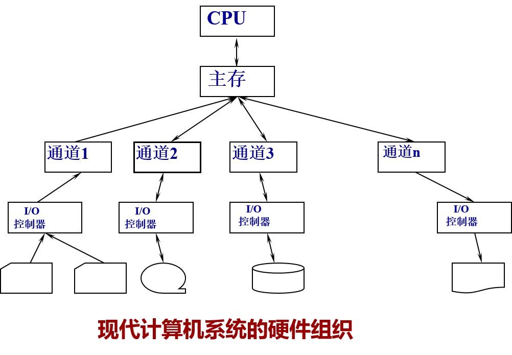

## 一、CPU与外设并行工作

## 二、I/O中断的作用

 在I/O控制系统控制下，外部设备独立工作，不需要中央处理机的干预。但由于外部设备是由中央处理机根据程序的要求而启动的，因此，当外部设备工作结束后，应把工作情况反馈给中央处理机。这种反馈通过I/O中断完成的。

## 三、管态与目态

处理机的工作状态。根据对资源和机器指令的使用权限，把处理机执行时的工作状态分为管态和目态。

管态：操作系统程序执行时中央处理机所处的状态。

当中央处理机处于管态时可执行包括特权指令在内的一切机器指令，实现对资源的分配和管理并为用户使用外部设备进行服务。

目态：用户程序执行时中央处理机所处的状态。

当中央处理机处于目态时不允许执行特权指令。

 在系统运行的过程中，中央处理机的状态处于动态变化之中。当系统启动时，硬件置ＣＰＵ初始状态为管态，然后装入操作系统程序。如果操作系统选择了用户程序占用处理机，则把管态转换成目态。如果中断装置发现了一个事件，则又将其置为管态，让操作系统去处理出现的事件。

## 四、存储结构
多级存储体系，包括主存储器、辅助存储器和高速缓冲存储器。

