## 一、程序的顺序执行及其特征
### 1.基本概念

 程序：一个在时间上按严格次序、顺序执行的操作序列。

 程序的顺序执行：一个具有独立功能的程序独占处理机，直至得到最终结果的过程 。

 操作：数据处理的一种规则，一经启动就需要在有限时间内完成 。

 计算：若干操作严格顺序执行的集合 。

### 2.程序的顺序执行

 在计算机系统中只有一个程序在运行，这个程序独占系统中所有资源，其执行不受外界影响。通常一个程序可分成若干个程序段，它们必须按照某种先后次序执行，仅当前一操作执行后，才能执行后继操作。

 例如：进行计算。I:输入操作 C:计算操作 P:打印操作。在进行计算时，总是先输入用户的程序和数据，然后进行计算，最后将结果打印出来。

### 3.语句的顺序执行
 S1：a:=x+y

 S2：b:=a-5

 S3：c:=b+1

 如下图，语句S2必须在a被赋值后才能执行；S3也只能在b被赋值后才能执行。

### 4.程序的顺序执行的特征
 顺序性：一个程序的各个部分的执行，严格地按照某种先后次序执行；

 封闭性：程序在封闭的环境下运行，即程序运行时独占全部系统资源；程序执行的结果，仅与初始条件有关，不受外界因素的影响。如：结果与执行速度的快慢无关。

 可再现性：只要程序执行时的环境和初始条件相同，当程序重复执行时，不论它是从头到尾不停顿地执行，还是“停停走走”地执行，都将获得相同的结果。

 程序顺序执行的特性，为程序员检测和校正程序的错误带来很大方便。

# 二、前趋图

 为了描述一个程序的各部分(程序段或语句)间的依赖关系，或者是一个大的计算的各个子任务间的因果关系，我们常常采用前趋图方式。

 前趋图(Precedence Graph)是一个有向无循环图，记为DAG(Directed Acyclic Graph)，用于描述进程之间执行的前后关系。
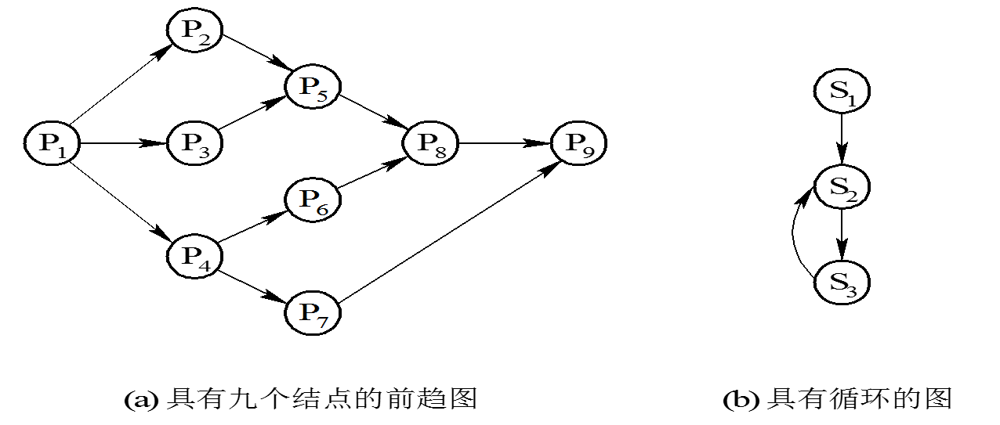
P1为初始结点，P9为终止结点，每个结点还具有一个重量。对于图(a)所示的前趋图，存在下述前趋关系：

 P1→P2，P1→P3，P1→P4，P2→P5，P3→P5，P4→P6，P4→P7，P5→P8，P6→P8，P7→P9，P8→P9

或表示为：

 P={P1，P2，P3，P4，P5，P6，P7，P8，P9}
→={(P1，P2)，(P1，P3)，(P1，P4)，(P2，P5)，(P3，P5)，(P4，P6)，(P4，P7)，(P5，P8)，(P6，P8)，(P7，P9)，(P8，P9)}

注意：前趋图中必须不存在循环，图(b)中却有着下述的前趋关系： 
S2→S3，S3→S2

# 三、程序的并发执行及其特征

### 1.并发环境

 在一定时间内物理机器上有两个或两个以上的程序同处于开始运行但尚未结束的状态，并且次序不是事先确定的。

### 2.程序的并发执行

 在对一批作业进行处理时，可以并发执行。

 例如，输入、计算、打印三个程序对一批作业进行处理时，存在以下的前趋关系：

Ii→Ci，Ii→Ii+1，Ci→Pi，Ci→Ci+1，Pi→Pi+1 

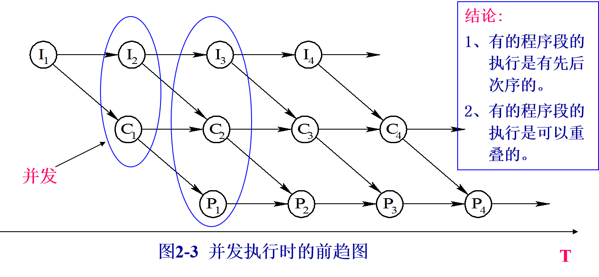
对于具有下述四条语句的程序段：

 S1: a∶=x+2

 S2: b∶=y+4

 S3: c∶=a+b

 S4: d∶=c+b
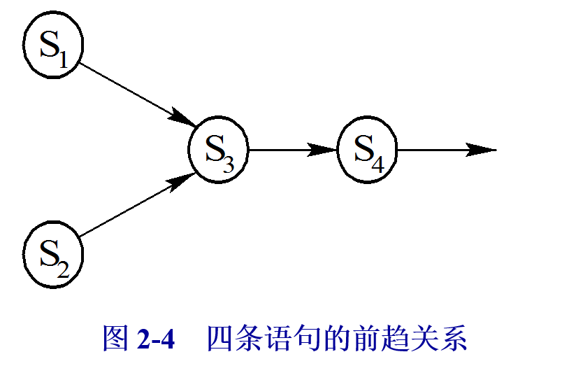

### 3.程序并发执行时的特征
 1) 间断性

 程序在并发执行时，由于它们共享系统资源，以及为完成同一项任务而相互合作，致使在这些并发执行的程序之间，形成了相互制约的关系。相互制约将导致并发程序具有“执行-暂停-执行”这种间断性活动规律。

 2) 失去封闭性

 程序在并发执行时，是多个程序共享系统中的各种资源，因而这些资源的状态将由多个程序来改变，致使程序的运行失去了封闭性。程序在执行时，必然会受到其它程序的影响。

 ３）通信性：

 对于相互合作的程序，为了更有效地协调运行，相互之间进行通信。

４) 结果不可再现性

 由于程序的并发执行，打破了由一程序独占系统资源的封闭性，因而破坏了可再现性。即程序经过多次运行，虽然其各次的环境和初始条件相同，但得到的结果却各不相同。

例如：两个程序A、B并发，都要对变量N施行操作，其中 A：N=N+1； B： print(N)；N=0； 

有三种情况：
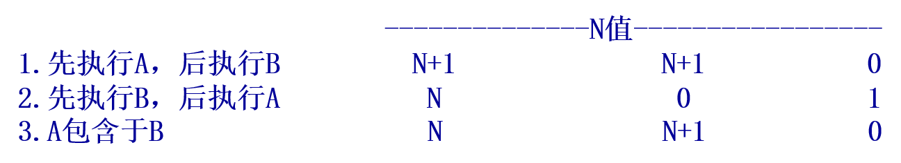

由于A、B执行的次序与时间有关，出现了不同的结果。

### 4.为何要引入进程

习惯中程序的执行为顺序执行，它指的是：一个具有独立功能的程序段，独占全机资源，直至最终结束的过程。这个过程有如下特点：

1、顺序性。
2、封闭性。程序执行的结果，仅与初始条件有关，不受外界因素的影响。如：结果与执行速度的快慢无关。
3、再现性。若重复执行程序，会得到相同的结果，与时间无关。

 设计操作系统的目的，是为了提高系统资源利用，故引入多道程序技术。这样带来许多新的问题，主要是打破程序顺序执行时的顺序性、封闭性、再现性。

由于程序在并发执行时，可能会造成执行结果的不可再现，结果既与时间有关，又与速度有关。所以，用“程序”的概念已无法描述程序的并发执行，必须引入新的概念，来说明新的情况，故引入进程（process）的概念。

# 四、进程的特征与状态

### 1.进程的概念

 进程是操作系统中的一个最基本、最重要的概念，但是迄今为止，对这一概念还没有形成一个非常确切的、统一的定义，通常是从不同的角度描述它的各个基本特征。

可并发执行的程序在一个数据集合上的运行过程

 进程是具有独立功能的程序，针对某个数据集合上的一次运行活动，是系统进行资源分配和调度的独立单位。

 传统OS中CPU是以进程为单位进行调度的。

 一个具有独立功能的程序段，针对某个数据集合在处理机上的执行过程。

 进程是可与其他程序并发执行的程序，在一个数据集合上的运行过程。它是系统进行资源分配和调度的一个独立单位。

### 2.进程的特征

- 动态性：进程的实质是实体的一次执行过程， 进程是动态产生，动态消亡的，进程因创建而产生，因调度而执行，因撤消而消亡。进程在其生命周期内，在三种基本状态之间转换。

- 并发性：任何进程都可以同其他进程一起向前推进,多个进程可以并发执行，即一个进程还未结束之前，允许其他进程执行。

- 独立性：进程是一个能独立运行的基本单位，同时也是系统分配资源和调度的独立单位；

- 异步性：由于进程间的相互制约，使进程具有执行的间断性，即进程按各自独立的、不可预知的速度向前推进，进程之间有时合作完成任务，有时竞争使用资源。

- 结构特征：一个进程由三部分组成，即程序、数据和进程控制块。其中进程控制块是进程的一个运行情况的登记表。

### 3.进程与程序的区别

- 进程一次运行的过程是动态的，而程序是指令的集合，是一个静态的概念。

- 进程更能真实地描述并发,而程序不能;

- 进程有生命周期，有诞生有消亡，短暂的；而程序是相对长久的,可作为软件资源长期保存。

- 进程是系统分配调度的独立单位，能与其他进程并发执行，而程序不能。

- 进程具有创建其他进程的功能，而程序没有。

- 一个进程可以包含几个程序 ；一个程序也可以对应多个进程。当同一程序同时运行于若干个不同的数据集合上时，它将属于若干个不同的进程。
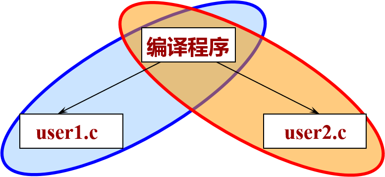

### 4.进程的描述：三种基本状态
 进程执行时的间断性决定了进程可能具有多种状态。进程具有三种基本状态：

 1、就绪状态。某些进程“万事俱备”(必要资源)，只差CPU。（就绪队列）

 2、执行状态。某进程占有CPU并在CPU上执行其程序。

 3、阻塞状态。某些进程由于某种原因不能继续运行下去，等待处
理问题。也称为等待状态或封锁状态。如：请求I/O。（多个等待队列）

 三种状态随着执行和条件的变化而发生转换:
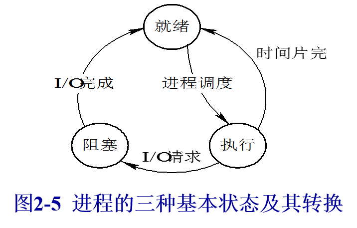

进程状态的转换及其转换的原因：

1）就绪-→执行：对就绪状态的进程，当进程调度程序按一种选定的策略从中选中一个就绪进程，为之分配了处理机后，该进程便由就绪状态变为执行状态；
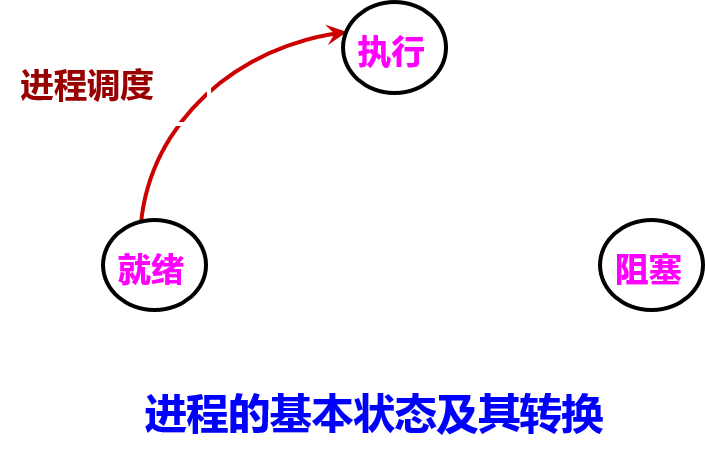

2）执行-→阻塞：正在执行的进程因发生某等待事件而无法执行，则进程由执行状态变为阻塞状态。如：进程提出输入/输出请求而变成等待外部设备传输信息的状态，进程申请资源（主存空间或外部设备）得不到满足时变成等待资源状态，进程运行中出现了故障（程序出错或主存储器读写错等）变成等待干预状态等等；
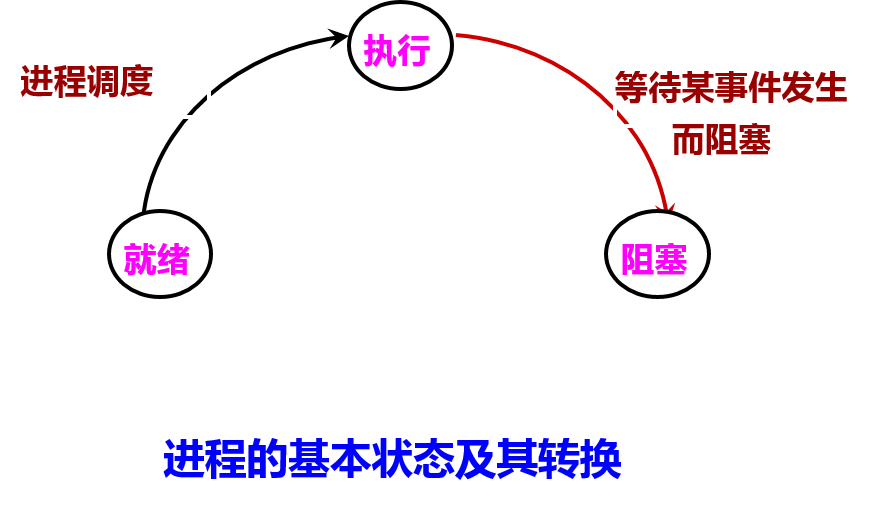
 
3）阻塞-→就绪：处于阻塞状态的进程，在其等待的事件已经完成，如输入/输出完成，资源得到满足或错误处理完毕时，处于等待状态的进程并不马上转入执行状态，而是先转入就绪状态，然后再由系统进程调度程序在适当的时候将该进程转为执行状态；
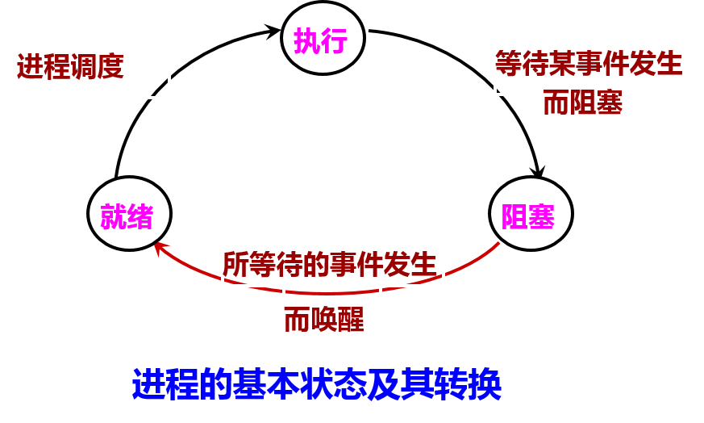

4）执行-→就绪：正在执行的进程，因时间片用完而被暂停执行，或在采用抢先式优先级调度算法的系统中,当有更高优先级的进程要运行而被迫让出处理机时，该进程便由执行状态转变为就绪状态。
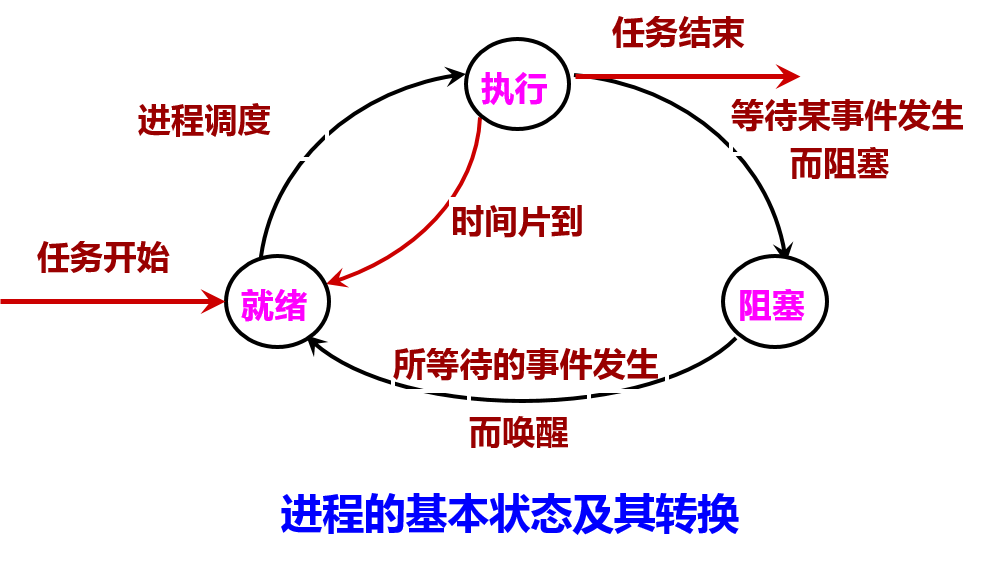

挂起状态：

 1) 引入挂起状态的原因

 有些系统中进程除了上述三种状态外，又增加了一新状态（挂起状态）。引入挂起状态的原因有：

 (1) 终端用户的请求。当终端用户在自己的程序运行期间发现有可疑问题时，使正在执行的进程暂停执行；

 (2) 父进程请求。父进程挂起自己的某个子进程，考查和修改该子进程。

 (3) 负荷调节的需要。系统把一些不重要的进程挂起。内存紧张

 (4) 操作系统的需要。OS挂起某些进程，检查运行中的资源使用情况或进行记账。

2) 进程状态的转换

 引入挂起状态后，将增加从挂起状态(又称为静止状态)到非挂起状态(又称为活动状态)的转换；或者相反。
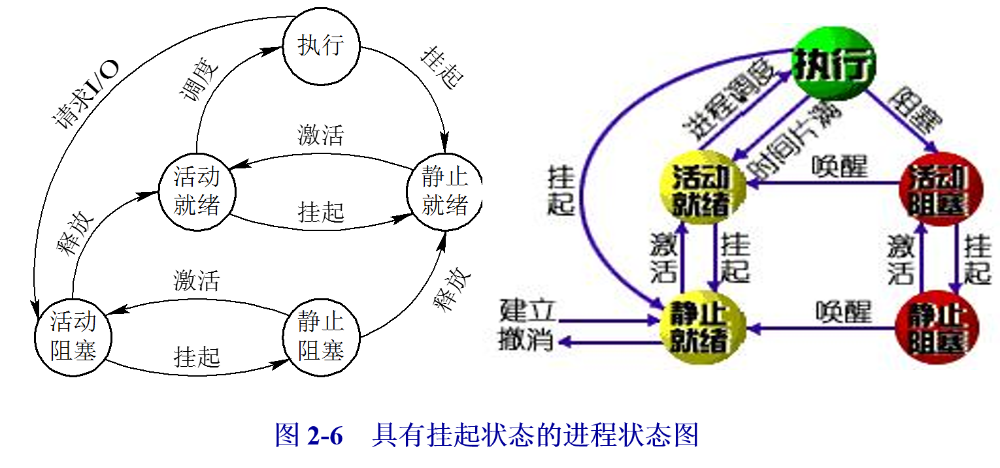

创建状态和终止状态：

 1) 创建(New)状态

 创建一个进程步骤：1、创建PCB，填写管理信息；2、转入就绪状态并插入就绪队列之中。

 OS 已完成为创建一进程所必要的工作：

 1、已构造了进程标识符

 2、已创建了管理进程所需的表格

 3、还没有允许执行该进程 (尚未同意)， 因为资源有限（主存）。

2）终止（退出exit)状态

 进程的终止步骤：1、等待操作系统进行善后处理，2、PCB清零，并将PCB空间返还系统。

 OS 已完成终止一进程所必要的工作：

 1、中止后进程移入该状态。

 2、它不再有执行资格。

 3、表格和其它信息暂时由辅助程序保留（供其他进程收集）。

 4、当数据不再需要后，进程(和它的表格)被删除。
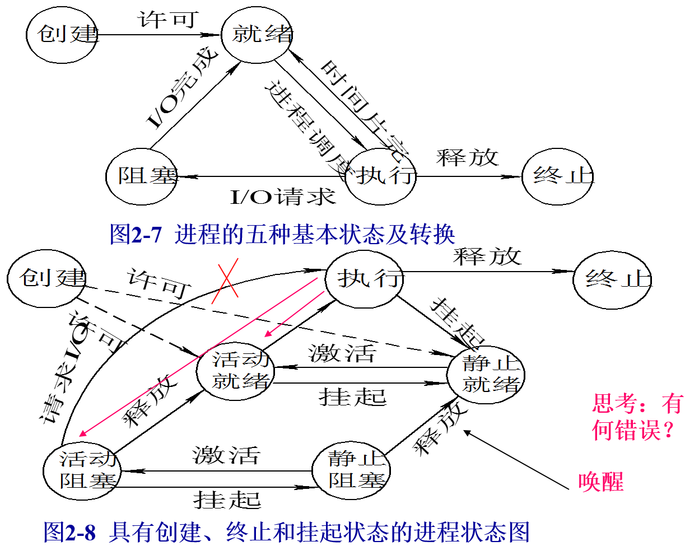
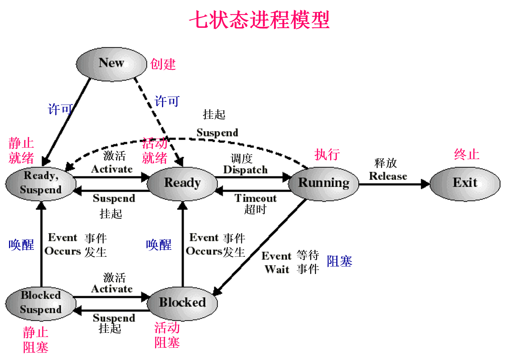

# 五、进程控制块PCB
### 1．进程控制块的作用

 系统为了管理进程设置的一个专门的数据结构，存放了用于描述该进程情况和控制进程运行所需的全部信息。

 系统利用PCB来控制和管理进程，所以PCB是系统感知进程存在的唯一标志。

 进程与PCB是一一对应的。当创建一个进程时，就是建立一张PCB表；当撤销一个进程时，就是撤销PCB。

### 2．进程控制块中的信息

 进程标识符：标识一个进程的编号，也称为进程的内部名；

 现行状态：说明进程的当前状态；

 现场保留区：保存进程由执行状态变为其它状态时的CPU现场信息；

 程序与数据地址：该进程的程序和数据所在位置信息；

 互斥与同步机构：实现进程间互斥与同步时所必须的机构；

 进程通信机制：用于实现进程间的通信所需的数据结构；

 优先级：表示进程使用CPU时优先级别的一个整数；

 资源清单：列出进程拥有的资源的记录；

 链接字(链接指针）：给出本进程所在队列中的下一个进程的PCB首址；

 家族联系：用于说明本进程与其它家族成员间的关系。

### 5. 进程控制块的组织方式

 为了有效地对进程控制块进行管理，应该采用适当的方式把它们组织起来。

 目前常用的组织方式有以下两种：

 1、链接方式组织PCB (队列)

 不同状态进程分别组成队列，运行队列、就绪队列、等待队列。
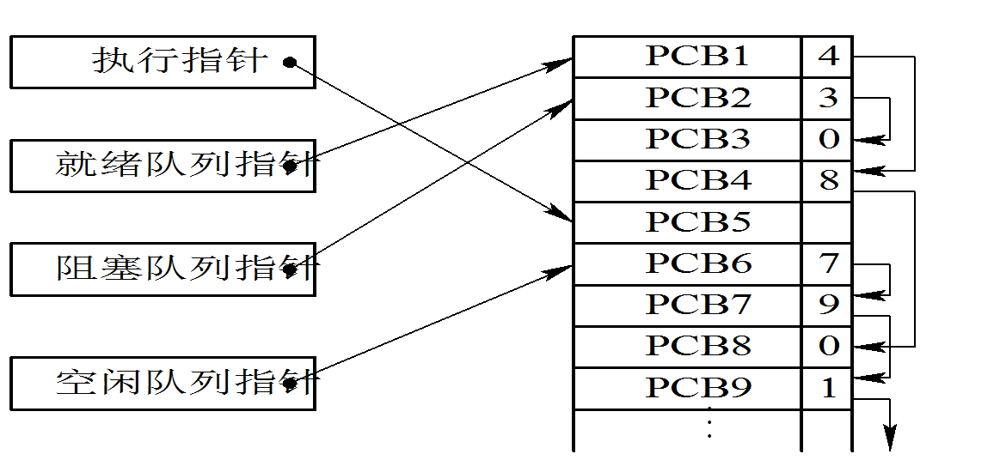
2、按索引方式组织PCB (表)

 对具有相同状态的进程，分别设置各自的PCB索引表，表明PCB在PCB表中的地址。

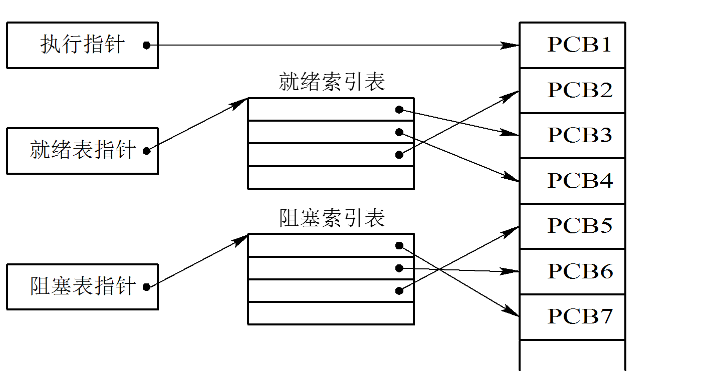
