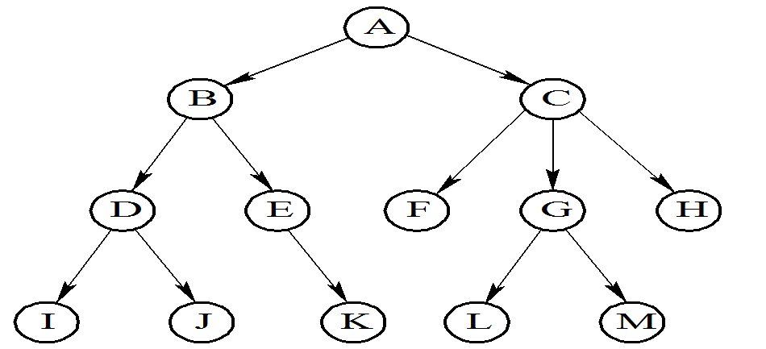
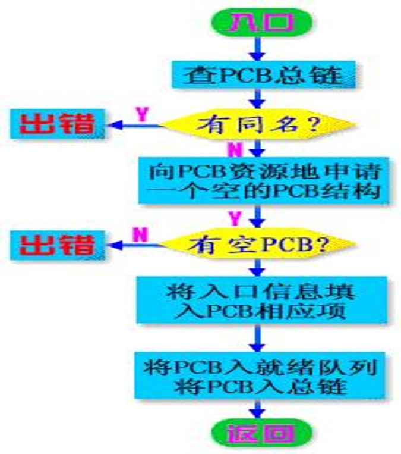
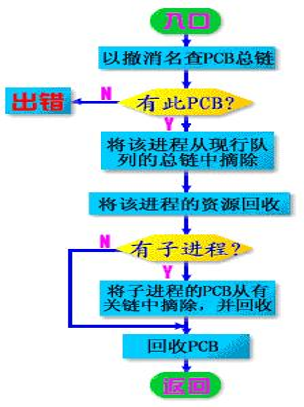
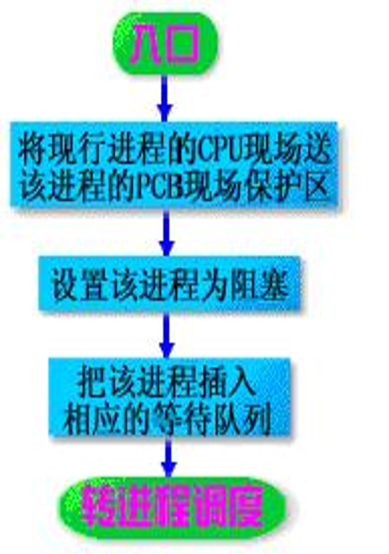
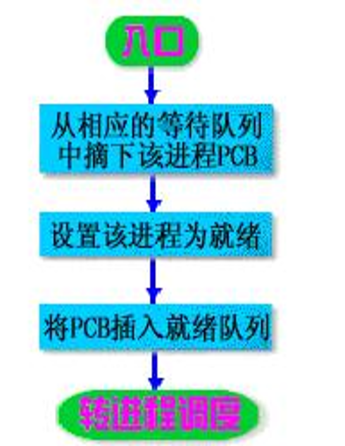
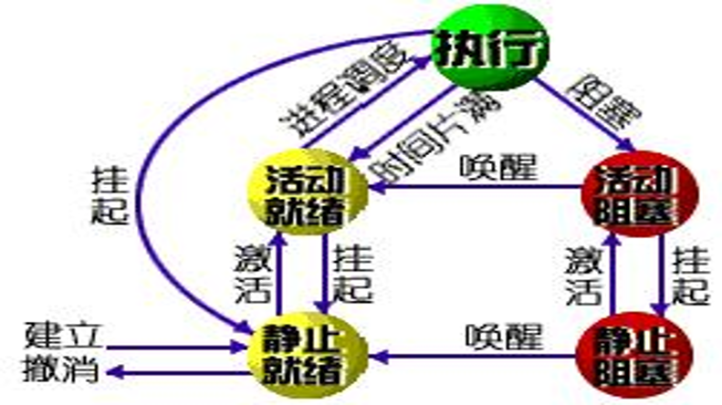
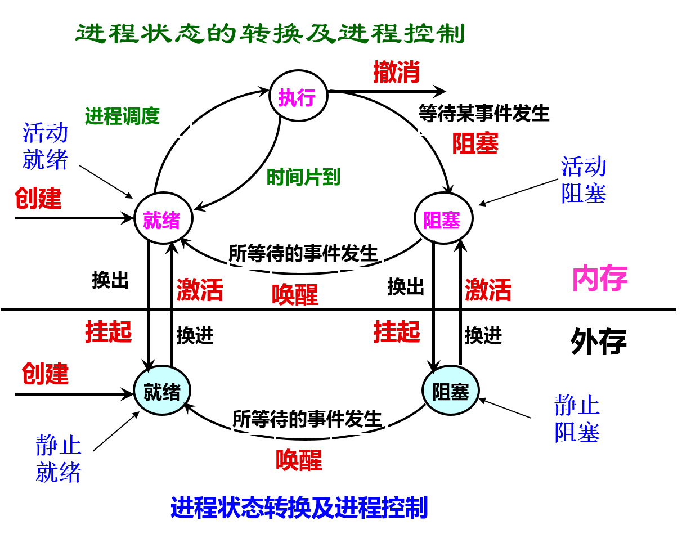

# 2. 进程控制

 进程控制是对系统中所有进程从产生、存在到消亡的全过程实行有效的管理和控制。进程控制一般是由操作系统的内核来实现，内核在执行操作时，往往是通过执行各种原语操作来实现的。

 原语(Primitive，原子操作，不可中断): 由若干条指令组成的，用于完成一定功能的一个过程。

 内核：加在硬件上的第一层软件，通过执行各种原语操作来实现各种控制和管理功能，具有创建、撤消、进程通信、资源管理的功能。

 进程原语：

 创建原语 撤消原语

 阻塞原语 唤醒原语

 挂起原语 激活原语

## 一、进程的创建

### 1．进程图(Process Graph)

 进程图是一棵有向树(如下图)，结点代表进程。一棵树表示一个家族，根结点为该家族的祖先(Ancestor)。

 思考：进程图和前趋图之间的差异？

#### 进程图和前趋图之间的差异

 前趋图描述的是任务(或进程)之间的前趋关系；只有在前趋进程完成后，其后继进程才能运行；

 在进程图中，创建者和被创建者可以并发执行，也可以父进程等待其所有的子进程结束后再执行，这完全取决于创建原语和创建者的需要。

### 2．引起创建进程的事件

 在多道程序环境中，程序是静止的，只有为它创建进程，才能运行。创建进程的事件: (其中：1、2、3为内核创建)

 (1)用户登录。分时系统

 (2) 作业调度。 批处理系统

 (3) 提供服务。当用户程序提出某种请求后，系统专门创建一个进程为用户服务。例如：打印进程。

 (4) 应用请求。基于应用需求，创建一个新进程，新进程以并发运行方式完成特定任务。例如，应用程序并发创建三个进程：输入、计算、打印。

### 3．进程的创建(Creation of Process)

 一旦OS发现了要求创建新进程的事件后，便调用进程创建原语Create( ) 创建一个新进程。

# 二、进程的终止

### 1．引起进程终止的事件

 1)正常结束（批处理Holt、分时Logs off）

 2) 异常结束：运行期间，出现某些错误和故障而迫使进程终止。

 常见的有下述几种：

 (1) 越界错误 (2) 保护错 (3) 非法指令。(4) 特权指令错。

 (5) 运行超时。(6) 等待超时。(7) 算术运算错 (8) I/O故障。

 3) 外界干预，这些干预有：

 (1) 操作员或操作系统干预。如，发生了死锁

 (2) 父进程请求。由于父进程具有终止自己的任何子孙进程的权力，因而当父进程提出请求时，系统将终止该进程。

 (3) 父进程终止。当父进程终止时，OS也将它的所有子孙进程终止。

### 2．进程的终止(撤消)过程

　　系统中发生了要求终止进程的某事件，OS便调用进程终止原语destroy （），终止指定的进程。

# 三、进程的阻塞与唤醒 

### 1. 引起进程阻塞和唤醒的事件

 1) 请求系统服务

 当正在执行的进程请求操作系统提供服务时，由于某种原因，操作系统并不立即满足该进程的要求时，该进程只能转变为阻塞状态来等待。例如: 一进程请求使用打印机(被占用)。

 2) 启动某种操作

 当进程启动某种操作后，如果该进程必须在该操作完成之后才能继续执行，则必须先使该进程阻塞，以等待该操作完成。例如，进程启动了某I/O设备。

 3) 新数据尚未到达 。对于相互合作的进程。

 4) 无新工作可做。系统往往设置一些具有某特定功能的系统进程，每当这种进程完成任务后，便把自己阻塞起来以等待新任务到来。

### 2．进程阻塞、唤醒过程 

 通过调用阻塞原语block（）把自己阻塞,调用唤醒原语wakeup( )，将等待该事件的进程唤醒。阻塞通常是一个主动行为，唤醒被动行为，一对相反的原语。

# 四、进程的挂起与激活 

### 1．进程的挂起

 当出现了引起进程挂起的事件时，系统将利用挂起原语suspend( )将指定进程或处于阻塞状态的进程挂起。

 挂起原语的功能：自身挂起、挂起具有指定标识符的进程、将其进程及其全部或部分“子孙”挂起。

### 2．进程的激活过程

 当发生激活进程的事件时，系统将利用激活原语active( )将指定进程激活。

 激活原语功能：使处于静止状态的进程变为活动。

