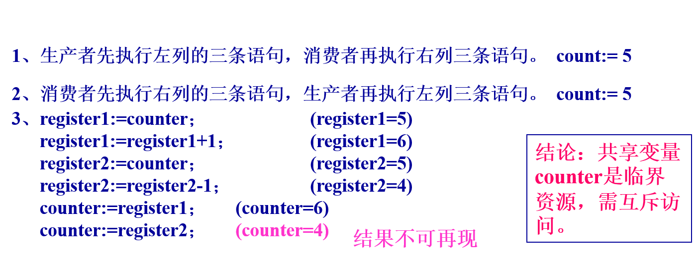

### 1．进程间两种主要关系

进程间的关系是在进程间相对独立的前提下发展的。

* 独立获得资源

* 独立调度

1) 直接作用---相互合作引起---进程同步：

进程间的相互联系是有意识的安排的，直接作用只发生在相交进程间。

2) 间接作用---资源共享引起---进程互斥：

进程间要通过某种中介发生联系，是无意识安排的，可发生在相交进程之间，也可发生在无关进程之间。

进程间的同步关系（一）
 

进程间的同步关系（二）

进程间的同步关系（三）

进程间的同步关系

| 相互感知程度 | 交互关系 | 一个进程对其他进程的影响 |
| --- | --- | --- |
| 相互不感知(完全不了解其它进程的存在) | 竞争(competition） | 一个进程的操作对其他进程的结果无影响 |
| 间接感知(双方都与第三方交互，如共享资源) | 通过共享进行协作 | 一个进程的结果依赖于从其他进程获得的信息 |
| 直接感知(双方直接交互，如通信) | 通过通信进行协作 | 一个进程的结果依赖于从其他进程获得的信息 |

### 2. 进程的同步（直接作用）

指系统中多个进程中发生的事件存在某种时序关系，需要相互合作，共同完成一项任务。具体说，一个进程运行到某一点时要求另一伙伴进程为它提供消息，在未获得消息之前，该进程处于等待（阻塞）状态，获得消息后被唤醒进入就绪状态。多个相关进程在执行次序上的协调。

### 3. 进程的互斥（间接作用）

由于各进程要求共享资源，而有些资源需要互斥使用，因此各进程间竞争使用这些资源，进程的这种关系为进程的互斥。

### 4、 临界资源

系统中某些资源一次只允许一个进程使用，称这样的资源为临界资源或互斥资源。

1\) 资源状态为临界：0 或 1

2\) 对临界资源的访问必须是互斥。

3\) 许多硬件资源如打印机、磁带机是属于临界资源。

思考：除此之外，软件中的共享变量是否是临界资源呢？

** 生产者-消费者\(producer-consumer\)著名的进程同步问题。**

问题描述：有一群生产者进程在生产产品，并将这些产品提供给消费者进程去消费。为使生产者进程与消费者进程能并发执行，在两者之间设置了一个具有n个缓冲区的缓冲池（循环缓冲），生产者进程将它所生产的产品放入一个缓冲区中；消费者进程可从一个缓冲区中取走产品去消费。

数据定义：

1）var buffer: array［0，1，…，n-1］ of item：

用一个数组表示具有n个\(0，1，…，n-1\)缓冲区的缓冲池。

2）输入指针 in:

下一个可投放产品的缓冲区。 in:= \(in+1\) mod n；

3）输出指针 out：

下一个可从中获取产品的缓冲区。 out:= \(out+1\) mod n。

4）整型变量 counter：生产者和消费者两进程共享。

初始值为0;

生产者进程向缓冲池中投放一个产品后，使counter加1；

消费者进程从中取走一个产品时，使counter减1；

5）局部变量 nextp：

存放每次刚生产出来的产品；

6）局部变量 nextc：

存放每次要消费的产品。
 

思考：

1、生产者程序和消费者程序顺序执行时其结果是否正确？

2、生产者程序和消费者程序并发执行时其结果是否正确？

3、原因何在？

问题: 共享变量counter。生产者、消费者对其操作，这两个操作在用机器语言实现时，用下面的形式描述： 设： counter:=5

执行顺序：

### 5. 临界区

每个进程用于访问临界资源的那段程序。

若能保证诸进程互斥地进入自己的临界区，便可实现诸进程对临界资源的互斥访问。

#### 6.进程同步应遵循的原则
1）空闲让进

当资源空闲时，应当允许访问资源的进程进入临界区。

2）忙则等待

 当资源被占用时，应使申请访问该资源的进程等待，等待使用者归还资源。

**两个基本原则，必须遵循**

3）让权等待

 在进程等待资源时，从执行态转为阻塞态，应当让出CPU的使用权。系统将把CPU分配给其它进程使用，以提高系统效率。

4）有限等待

 系统应保证等待的进程能在有限的时间内获得资源，继续执行，以防止无限等待浪费该进程已占用的资源。
 
