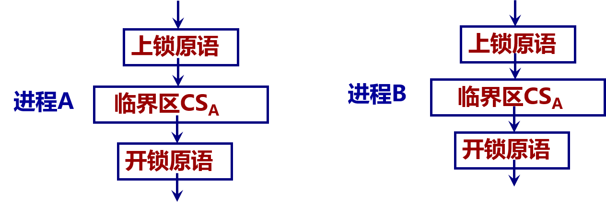

# 2.3.2 临界资源锁机制--解决进程互斥

例：商场的试衣间

* 是互斥资源

* 是临界资源

* 是共享资源

每个顾客必须遵循以下过程使用试衣间：


临界资源锁机制

每个进程必须按照以下过程操作资源：

一种简单的锁操作实现

锁操作模拟过程

锁操作的一般模型

    Pi：..... lock\( L \)--&gt; C\( i \)--&gt; unlock\( L \) ......
    Pj：...... lock\( L \)--&gt; C\( j \)--&gt; unlock\( L \) .....

    Pi： 进程i      C\( i \)： Pi的临界区

出了问题的锁


### 利用上锁原语和开锁原语实现进程互斥

 利用上锁原语和开锁原语可以解决并发进程对临界区访问的互斥问题。

 任何申请进入临界区的进程，必须先执行上锁原语。若上锁原语顺利通过，则进程可以进入临界区，这时临界区已被上锁原语锁住，其它申请进入临界区的进程只能等到临界区开锁之后才有可能进入临界区；当进程完成对临界资源的访问退出临界区时再执行开锁原语，以释放该临界资源。


### 锁操作的特点：
– 实现了进程互斥访问临界资源。

– 不遵循让权等待原则。——忙等

```
     void lock( L ){ 
         check: if ( L = = 1 )
                     goto check;
         //资源正在使用，继续反复测试；忙等；
                 else
                     L = 1;// 上锁
      }
       
 Lock(L)、UnLock(L)原子操作，不许中断。
```

–

