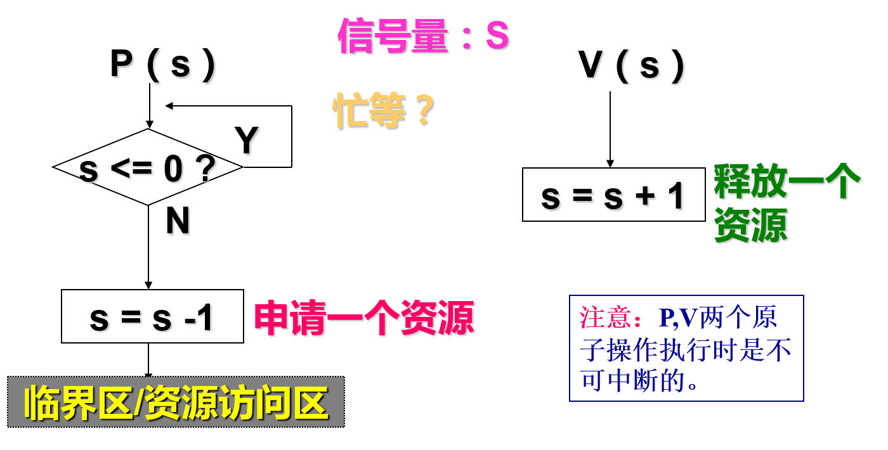
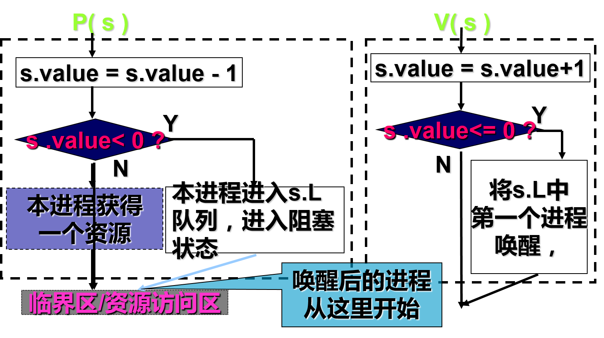
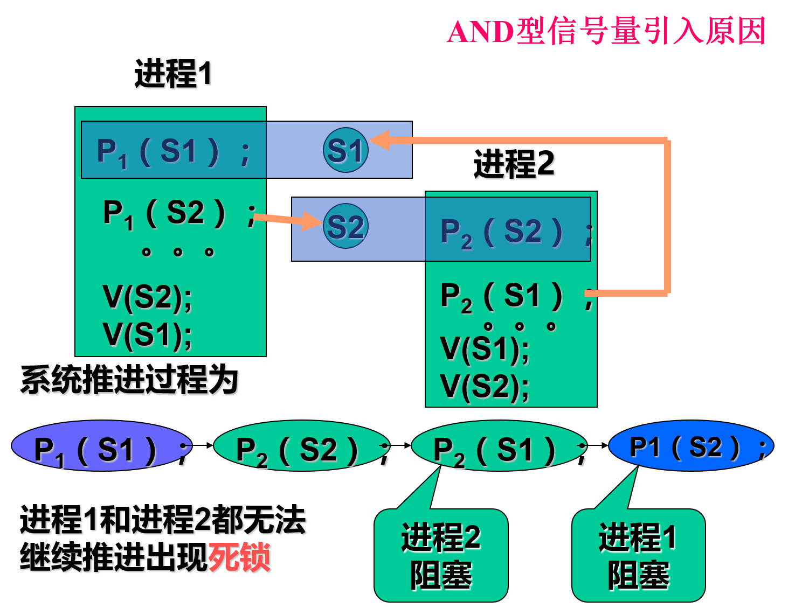
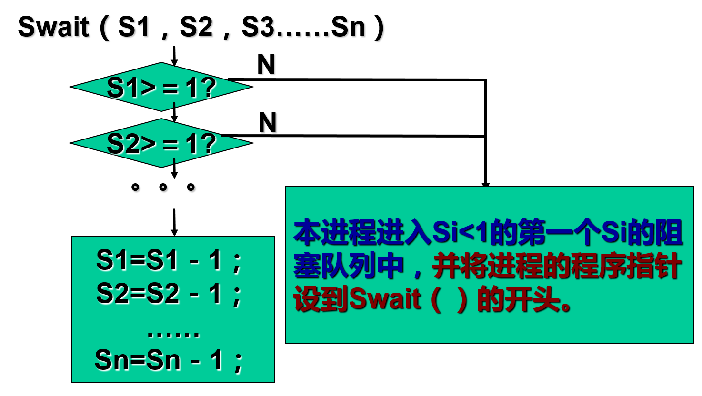
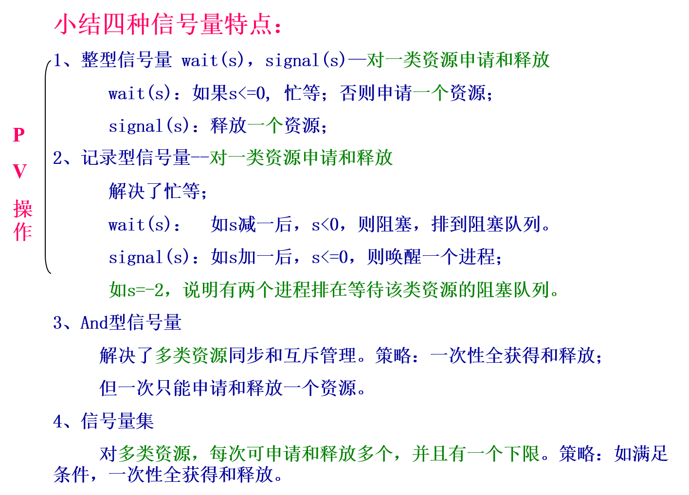
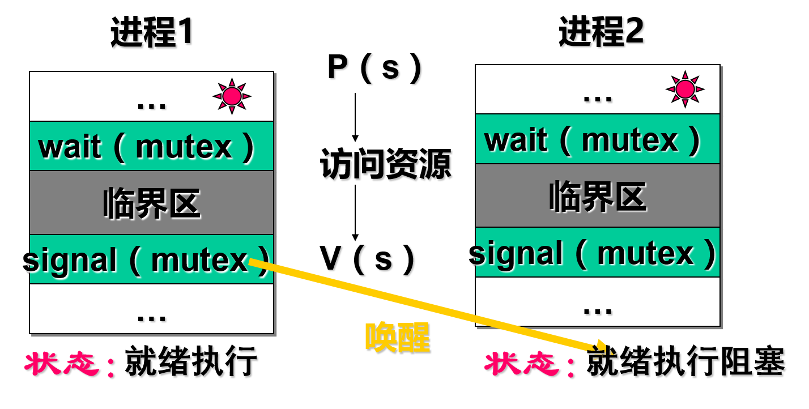
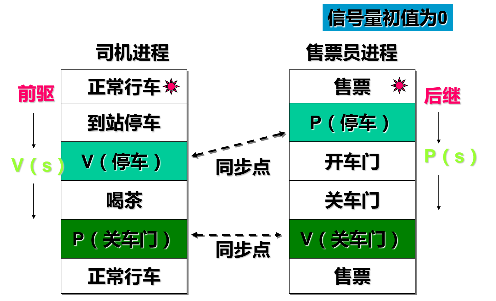
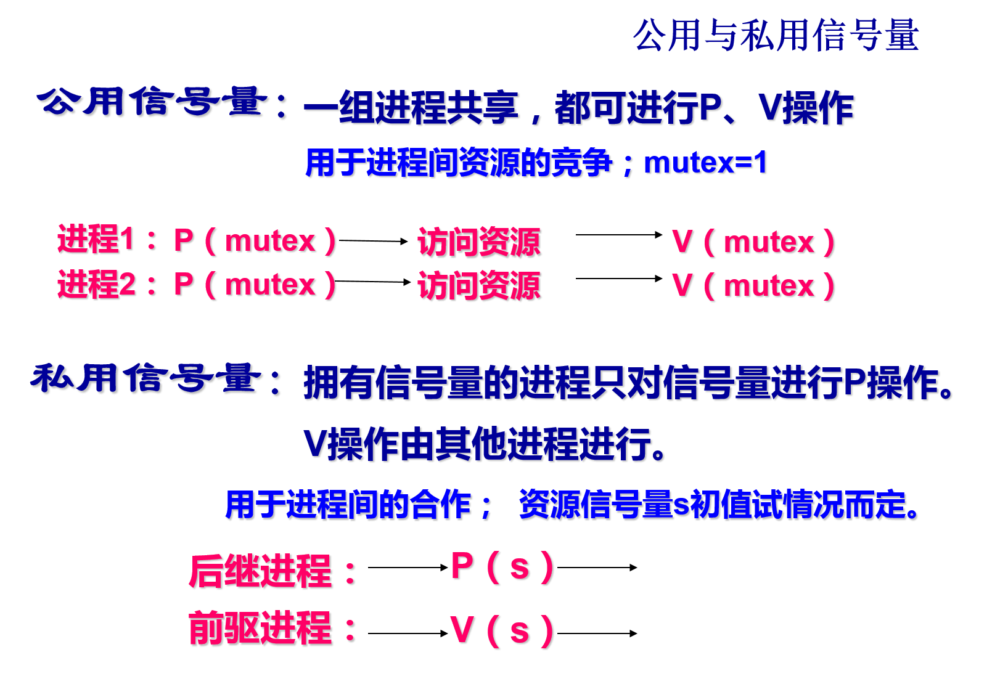

# 2.3.3 进程同步的信号量

经典信号量、记录型信号量、AND信号量、信号量集

### 1. 信号量机制的基本概念

信号量

- 信号量是对具体物理资源的抽象。

- 不同类的资源用不同名称的信号量代表。

- 同类资源的个数用> 0的信号量值表示。

- 信号量值为 0 或 1 的信号量表示临界资源。

### 2. 经典(整型)信号量的P，V操作

资源的申请与释放－原语

- P操作 wait(S)： while S<=0 do no-op； S:=S-1； 申请一个资源；

- V操作 signal(S)：S:=S+1；释放一个资源；

### 3. 记录型信号量

- 解决经典信号量机制中未遵循“让权等待”。

- 引入进程阻塞机制

- 在信号量里增加对阻塞进程的纪录。

纪录型信号量的P，V操作 

纪录型信号量机制特点：

- 进程对资源访问的过程：

- 原语保证
    - p（s），v（s）操作都是原语；

    - 保证不出现“锁不住”资源的现象；

- 主动阻塞与被动唤醒

### 4. AND型信号量

- AND型信号量引入原因

- AND型信号量基本思想

    - 将多次对多个信号量的申请改为一次，用一个原子操作完成。

    - 进程要么一次获得所有的资源，要么一个也申请不到。
        - 不会存在互相等待的局面

- AND型信号量集流程

    - AND型信号量集流程－－资源申请

 
    - AND型信号量集流程－－资源释放

 
    - 信号量集流程 

### 5. 信号量集

- 引入原因
    - 更灵活

- 基本思想
    - si：各信号量;
    - ti：申请下限
        - ti > 0时，可进行资源预留；
    - di：申请个数

   一次可申请一种资源的多个。

“信号量集”的几种特殊情况：

 (1) Swait(S，d，d)。此时在信号量集中只有一个信号量S，但允许它每次申请d个资源，当现有资源数少于d时，不予分配。

 (2) Swait(S，1，1)。此时的信号量集已蜕化为一般的记录型信号量(S>1时)或互斥信号量(S=1时)。

 (3) Swait(S，1，0)。这是一种很特殊且很有用的信号量操作。当S≥1时，允许多个进程进入某特定区；当S变为0后，将阻止任何进程进入特定区。换言之，它相当于一个可控开关。

### 6 . 信号量的应用

#### 6.1 利用信号量实现进程互斥
资源竞争时的进程同步。
- 对竞争资源的互斥访问－互斥信号量mutex=1。

#### 6.2 利用信号量实现进程同步
--相互合作时的进程同步
    - 保证进程间的前驱、后继关系

#### 6.3 利用信号量实现前趋关系 

- 条件：设有两个并发执行的进程P1和P2。P1中有语句S1；P2中有语句S2。

- 目标：S1 S2 前驱关系

- 实现： P1和P2共享一个公用信号量，初值S=0;

    - P1： S1；signal(S)；

    - P2： wait(S)；S2；
