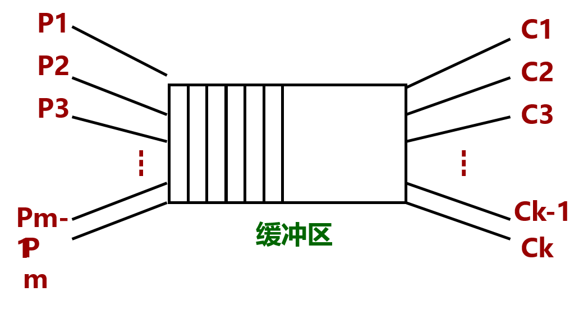
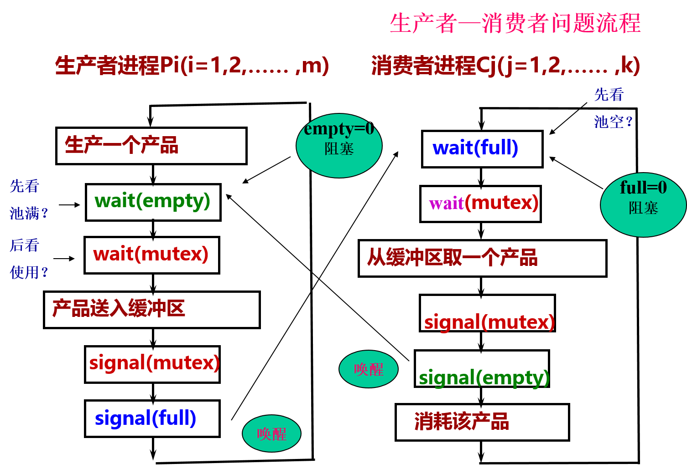

# 一、生产者—消费者问题---典型的同步例子

  它描述了一组生产者向一组消费者提供产品（数据），它们共享一个有界缓冲区，生产者向其中投放产品，消费者从中取出产品消费。这样的一个问题是许多相互合作进程存在的内在关系的一种抽象。 

一组生产者P1、P2、…、Pm

一组消费者C1、C2、…、Ck

有界缓冲区——长度为n（n ＞0）



 只要缓冲区未满，生产者就可把产品送入缓冲区；只要缓冲区未空，消费者便可从缓冲区取走产品并消耗它。

 仅当缓冲区满时，生产者被阻塞，类似地，缓冲区空时，消费者被阻塞。
 生产者和消费者的同步关系将禁止生产者向满的缓冲区输送产品，也禁止消费者从空的缓冲区中提取物品。

算法分析




生产者消费者算法小结：

- 在分析进程同步问题中，逐个分析进程间的关系是关键。

- 不管多复杂的关系，总能归结为两种基本关系（竞争与合作），总是这两种关系的组合。

- 不管公用还是私用，信号量的使用必须成对出现。

- P(s1) ，P(s2)两操作在一起，P的顺序至关重要，同步P和互斥P在一起，同步P操作在前。

- 互斥操作时，PV处于同一进程；同步操作时，不在同一进程。
 
# 二、哲学家进餐问题

问题描述

- 五位哲学家围桌而坐。

- 哲学家在思考问题时不需要任何资源，思考完问题后进入进餐态。

- 每人必须获得左右两支筷子才能进餐。


1．利用记录型信号量解决哲学家进餐问题
放在桌子上的筷子是临界资源，在一段时间内只允许一位哲学家使用。用一个信号量表示一只筷子，由这五个信号量构成信号量数组。
信号量初始值均为1；
```
Var chopstick: array[0，…，4] of semaphore；
活动描述：
repeat
    wait(chopstick[i])；
    wait(chopstick[(i+1)mod 5])；
    eat；
    signal(chopstick[i])；
    signal(chopstick[(i+1)mod 5])；
    think；
until false；
```


可采取以下几种解决死锁问题方法：

(1) 至多只允许有四位哲学家同时去拿左边的筷子，最终能保证至少有一位哲学家能够进餐，并在用毕时能释放出他用过的两只筷子，从而使更多的哲学家能够进餐。

(2) 仅当哲学家的左、右两只筷子均可用时，才允许他拿起筷子进餐。

(3) 规定奇数号哲学家先拿他左边的筷子，然后再去拿右边的筷子，而偶数号哲学家则相反。


2．利用AND信号量机制解决哲学家进餐问题
在哲学家进餐问题中，要求每个哲学家先获得两个临界资源(筷子)后方能进餐，AND信号量机制可获得最简洁的解法。描述如下： 
```
Var chopsiick array of semaphore:=(1,1,1,1,1)；
    processi
        repeat
            think；
            Swait(chopstick[(i+1)mod 5]，chopstick[i])；
            eat；
            Ssignal(chopstick[(i+1)mod 5]，chopstick[i])；
        until false；
```


# 三、读者—写者问题（Reader and Writer ）


问题描述

- 一个数据记录(共享数据)，有多个进程进行读操作，另一些进程进行修改操作。

    - （Reader）

    - （Writer）

- 读写策略

    - 允许多个进程同时进行读操作——读不互斥

    - 不允许多于一个进程进行写操作——写互斥

    - 不允许读写操作同时进行——读写互斥
 用一个计数器Readcount来统计读者的数量，每当有一个读者欲访问共享数据时，对Readcount计数加1，每当有一个读者结束对共享数据的访问时，对Readcount计数减1，在第一个读者到达共享数据区之后以及最后一个读者离开共享数据区之前，写者不能访问共享数据区。

 思考：需要几个信号量？是什么类型信号量？
 为了解决读者—写者问题，我们设置了两个互斥信号量：

 信号量wmutex，用于写者与写者之间、读者与写者、写者与读者之间对共享数据区操作的互斥，初值为1；

 信号量rmutex，用于多个读者对共享计数器Readcount(临界资源)操作的互斥，初值为1。

