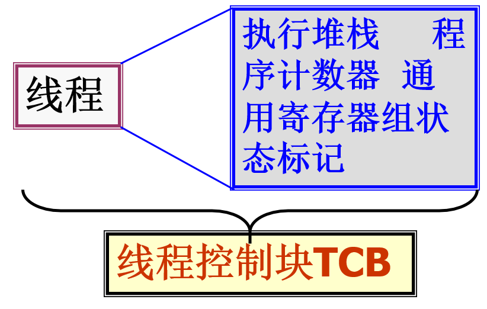

一、线程的基本概念

 进程的概念和结构是传统操作系统工作的基础。但是，随着计算机体系结构从早期的单处理机结构发展到目前的多处理机结构，在多任务的环境中，为了减少处理机的空转时间以及处理机调度切换时的时间和空间开销，提高系统的并行能力，因此产生了更小的控制单位：线程。

1．线程的引入原因

 进程独立性的两个基本属性：

 资源分配的单位：给每个进程分配一虚拟地址空间，保存进程映像，控制一些资源（文件，I/O设备），有状态、优先级、调度。

 调度单位：进程是一个执行轨迹。

 以上两个属性构成进程并发执行的基础。

 进程两个属性分开的原由：

 1) 从CPU执行所必须的硬件现场来考察，只包含程序计数器、程序状态字、 执行堆栈、通用寄存器组等。PCB中的绝大多数表目与CPU执行程序代码是没有关系的。

 2) 进程切换系统开销较大（数据和程序的地址空间）。

 3）对进程系统必须完成的操作：创建进程；撤消进程； 进程切换；

 缺点：时间空间开销大，限制并发度的提高。

 在操作系统中，进程的引入提高了计算机资源的利用效率。但在进一步提高进程的并发性时，人们发现进程切换开销占的比重越来越大，同时进程间通信的效率也受到限制。

 线程的引入正是为了简化进程间的通信，以小的开销来提高进程内的并发程度。
 操作系统将进程独立性的两个属性分别赋予了两个不同实体: 拥有资源所有权的仍称为进程，而调度的单位称为线程，或轻量级进程。
2. 线程结构与线程控制块TCB
   
    由于同一个进程多个线程共享同一地址空间，带来了系统时/空管理的改善。
   

3. 线程的特点 
•是进程的一个实体，可作为系统独立调度和分派的基本单位。

•不拥有系统资源（只拥有从属进程的全部资源，资源是分配给进程）。

•一个进程中的多个线程可并发执行。（进程可创建线程执行同一程序的不同部分）

•系统开销小、切换快。（进程的多个线程都在进程的地址空间活动）

4. 线程和进程的关系

 单进程、单线程

 单进程、多线程

  多进程、一个进程一个线程 

 多进程、一个进程多个线程

 >

5.引入线程的好处
