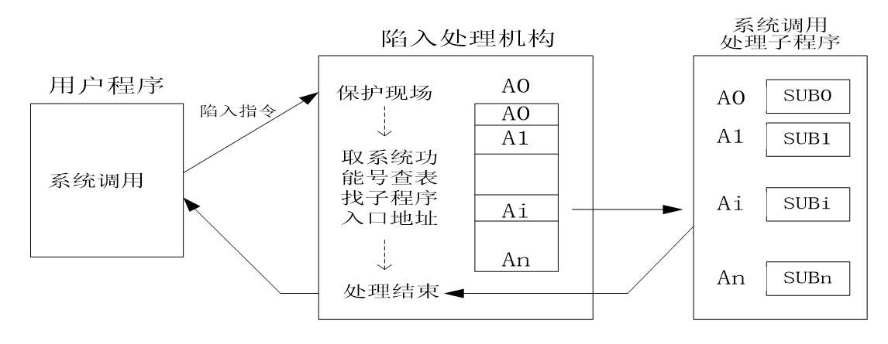

# 7.2.1 系统调用简介

系统调用(SYSTEM CALL)，也称程序接口

- 操作系统提供给编程人员的唯一接口，编程人员利用系统调用，完成与机器硬件部分相关的工作。用户得以在程序中调用操作系统所提供的一些子功能。

- OS核心中都有一组实现系统功能的过程（子程序），系统调用就是对上述过程的调用。编程人员利用系统调用，向OS提出服务请求，由OS代为完成。

- 每个系统都有上百种系统调用，涉及进程、文件和设备控制等。

- 系统调用是由特殊的机器指令实现的。

- 系统的系统调用越多，功能就越强，使用更加灵活。

# 7.2.2 系统调用的类型（UNIX） 

不同的操作系统有一定的差异.

- 进程控制

    - 创建一进程（fork）

    - 结束进程（exit）

    - 等待子进程结束（wait）

    - 执行一个文件(exec)

- 文件操纵

    - 创建文件(creat)

    - 打开文件(open)

    - 关闭文件(close)

    - 读文件(read)

    - 写文件(write)
- 进程通信

    - 建立消息队列（msgget）

    - 发送消息（msgsend）

    - 接收消息（msgrcv）)

- 系统维护

    - 设置时间（stime）

    - 获得时间（time）

    - 获得进程和子进程时间（times）

    - 设置文件访问和修改时间（Utime）

    - 获得当前unix系统的名称（Uname）

# 7.2.3 系统调用的实现

# 7.2.3.1 系统调用的实现-实现机制 

- 当编程人员给定了系统调用名和参数之后，由陷入处理机构（类似于硬件中断处理机构)完成。陷入处理机构是系统专门为控制系统调用服务设立的。

- 当用户使用系统调用时，产生一条相应的指令（陷入指令，trap指令），CPU在执行到该指令时发生相应的中断，发出有关信号给该处理机构，并启动相应的处理程序来完成该系统调用所要求的功能。

- 陷入指令（或访管指令）:由于系统调用引起处理机中断的指令。

- 在陷入中断发生时，从用户态－>核心态。这一转换在发生访管中断时由硬件自动实现。

- 系统调用语句本身是硬件提供的（机器指令），但其所调用的功能是操作系统提供的。每种机器的机器指令集中都有一条系统调用指令。（IBM个人计算机INT指令，SUN工作站上的TRAP，SGI工作站上SYSCALL指令）。

### 7.2.3.2 执行过程

- 保护用户程序的现场；

- 执行相应功能：根据系统调用提供的功能号，访问系统功能入口地址表，得到相应功能的人口地址，然后转去执行；

- 返回处理：在系统调用处理结束之后，还要恢复处理器现场。在操作系统中，处理器的现场一般被保护在特定的内存区或寄存器中。

### 7.2.3.3 参数传递
- 目的：实现用户程序和系统程序间的参数传递。

- 常用实现方法：

    - 由陷入指令自带参数：陷入指令的长度有限的，且还要携带系统调用功能号，只能自带有限的参数。

    - 通过有关通用寄存器来传递参数：这些寄存器应是系统程序和用户程序都能访问，由于寄存器长度较短，无法传递较多的参数。

    - 更为常见的是在内存中开辟专用堆栈区来传递参数。

### 7.2.3.4 系统调用与过程调用的区别

- 相同点：

    - 改变指令流程

    - 重复执行和公用

    - 改变指令流程后需要返回原处

- 不同点：

    - 运行在不同的系统状态

        - 一般过程调用，其调用程序和被调用程序都运行在相同状态：核心态或用户态。

        - 系统调用：调用程序在用户态，被调用程序在系统态。

    - 进入方式不同，状态的转换

        - 通常利用call 或jump 指令进入普通的过程调用，而进行系统调用则需要利用int或trap指令通过软中断进入 。

        - 一般的过程调用不涉及系统状态的转换，可直接由调用过程转向被调用过程。

        - 运行系统调用时，调用和被调用过程在不同系统状态，不允许由调用过程直接转向被调用过程。

        - 通过软中断机制先由用户态转换为核心态。

        - 在OS核心分析后，转向相应的系统调用处理子程序。
    - 返回方式不尽相同

        - 一般过程调用在被调用过程执行完后，返回调用过程。

        - 抢占式调度的系统中，被调用过程执行完后，系统将对所有要求运行的进程进行优先级分析。如果调用进程仍有最高优先级，则返回到调用进程执行。

        - 否则，引起重新调度，让优先级最高的进程优先执行。此时，系统把调用进程放入就绪队列。

    - 被调用代码的位置也有所不同

        - 系统调用是动态调用，其调用位置和返回位置都是不固定的。由于同一程序中不包含被调用代码 。

        - 一般过程调用属静态调用，被调用代码与调用代码在同一程序之内。

    - 注意：系统调用也允许嵌套调用，但每个系统对嵌套调用的深度会有限制。

### 7.2.3.1 win32应用程序接口

- 在Windows中，定义了一系列程序(应用程序接口Win32 API) ，提供OS服务。

- 该接口（部分）支持Win95 以后的Windows版本Win32 API调用的种类非常多，以千计算。

- 在Windows中不好分辨哪些是系统调用（被内核执行），哪些是用户空间的库调用。

- 事实上，一个Windows版本中的系统调用也许在另一个Windows版本中会在用户空间执行。

- 由于图形子系统在内核中运行（在某些Windows版本中），它们也是系统调用，否则是库调用。

