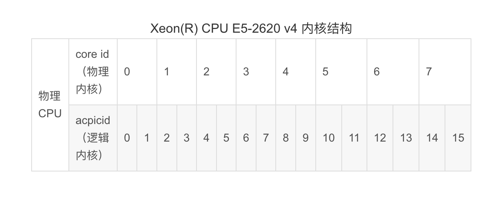

# Linux命令

## top

linux下的任务管理器

   top命令是Linux下常用的性能分析工具，能够实时显示系统中各个进程的资源占用状况，类似于Windows的任务管理器。top是一个动态显示过程,即可以通过用户按键来不断刷新当前状态.如果在前台执行该命令,它将独占前台,直到用户终止该程序为止.比较准确的说,top命令提供了实时的对系统处理器的状态监视.它将显示系统中CPU最“敏感”的任务列表.该命令可以按CPU使用.内存使用和执行时间对任务进行排序；而且该命令的很多特性都可以通过交互式命令或者在个人定制文件中进行设定。

 ```sh
 $top
   top - 09:14:56 up 264 days, 20:56, 1 user, load average: 0.02, 0.04, 0.00
   Tasks:  87 total,  1 running, 86 sleeping,  0 stopped,  0 zombie
   Cpu(s): 0.0%us, 0.2%sy, 0.0%ni, 99.7%id, 0.0%wa, 0.0%hi, 0.0%si, 0.2%st
   Mem:    377672k total,  322332k used,  55340k free,  32592k buffers
   Swap:   397308k total,  67192k used,  330116k free,  71900k cached
   PID USER   PR NI VIRT RES SHR S %CPU %MEM  TIME+   COMMAND
     1 root   20  0 2856 656 388 S  0.0  0.2  0:49.40 init
     2 root   20  0   0   0   0  S  0.0  0.0  0:00.00 kthreadd
     3 root   20  0   0   0   0  S  0.0  0.0  7:15.20 ksoftirqd/0
     4 root   RT  0   0   0   0  S  0.0  0.0  0:00.00 migration/0
 ```

**第一行**

* 09:14:56 ： 系统当前时间
* 264 days, 20:56 ： 系统开机到现在经过了多少时间
* 1 users ： 当前2用户在线
* load average: 0.02, 0.04, 0.00： 系统1分钟、5分钟、15分钟的CPU负载信息

**第二行**

* Tasks：任务;
* 87 total：很好理解，就是当前有87个任务，也就是87个进程。
* 1 running：1个进程正在运行
* 86 sleeping：86个进程睡眠
* 0 stopped：停止的进程数
* 0 zombie：僵死的进程数

**第三行**

* Cpu(s)：表示这一行显示CPU总体信息

* 0.0%us：用户态进程占用CPU时间百分比，不包含renice值为负的任务占用的CPU的时间。

* 0.7%sy：内核占用CPU时间百分比

* 0.0%ni：改变过优先级的进程占用CPU的百分比

* 99.3%id：空闲CPU时间百分比
* 0.0%wa：等待I/O的CPU时间百分比
* 0.0%hi：CPU硬中断时间百分比
* 0.0%si：CPU软中断时间百分比
* 注：这里显示数据是所有cpu的平均值，如果想看每一个cpu的处理情况，按1即可；折叠，再次按1；

**第四行**

* Men：内存的意思
* 8175320kk total：物理内存总量
* 8058868k used：使用的物理内存量
* 116452k free：空闲的物理内存量
* 283084k buffers：用作内核缓存的物理内存量

**第五行**

* Swap：交换空间

* 6881272k total：交换区总量

* 4010444k used：使用的交换区量

* 2870828k free：空闲的交换区量

* 4336992k cached：缓冲交换区总量 

**进程信息**: 再下面就是进程信息：

* PID：进程的ID
* USER：进程所有者
* PR：进程的优先级别，越小越优先被执行
* NInice：值
* **VIRT：进程占用的虚拟内存**
* **RES： 进程占用的物理内存**
* SHR：进程使用的共享内存
* S：进程的状态。S表示休眠，R表示正在运行，Z表示僵死状态，N表示该进程优先值为负数
* %CPU：进程占用CPU的使用率
* %MEM：进程使用的物理内存和总内存的百分比
* TIME+：该进程启动后占用的总的CPU时间，即占用CPU使用时间的累加值。
* COMMAND：进程启动命令名称

 

**top命令交互操作指令**:下面列出一些常用的 top命令操作指令

* q：退出top命令
* <Space>：立即刷新
* s：设置刷新时间间隔
* c：显示命令完全模式
* t:：显示或隐藏进程和CPU状态信息
* m：显示或隐藏内存状态信息
* l：显示或隐藏uptime信息
* f：增加或减少进程显示标志
* S：累计模式，会把已完成或退出的子进程占用的CPU时间累计到父进程的MITE+
* P：按%CPU使用率排行
* T：按MITE+排行
* **M：按%MEM排行**
* e: 调整内存显示单位m/G
* **u：指定显示用户进程**
* r：修改进程renice值
* kkill：进程
* i：只显示正在运行的进程
* W：保存对top的设置到文件^/.toprc，下次启动将自动调用toprc文件的设置。
* h：帮助命令。 

注：强调一下，使用频率最高的是P、T、M，因为通常使用top，我们就想看看是哪些进程最耗cpu资源、占用的内存最多； 注：通过”shift + >”或”shift + <”可以向右或左改变排序列 

如果只需要查看内存：可用free命令。

只查看uptime信息（第一行），可用uptime命令；


## CPU

在linux系统中，提供了/proc目录下文件，显示系统的软硬件信息


物理CPU、核数、逻辑cpu数的概念: 

①物理CPU数（physical id）：主板上实际插入的cpu数量，可以数不重复的 physical id 有几个

②CPU核心数（cpu cores）：单块CPU上面能处理数据的芯片组的数量，如双核、四核等 

③逻辑CPU数：一般情况下，

　　逻辑CPU=物理CPU个数×每颗核数   　#不支持超线程技术或没有开启次技术

　　逻辑CPU=物理CPU个数×每颗核数 *2 　 #表示服务器的CPU支持超线程技术（简单来说，它可使处理器中的1 颗内核如2 颗内核那样在操作系统中发挥作用。这样一来，操作系统可使用的执行资源扩大了一倍，大幅提高了系统的整体性能）





### 查看cpu相关信息 `cat /proc/cpuinfo`

**1)查看cpu信息**

```
[root@fp-web-126 ~]# cat /proc/cpuinfo 
信息包括有 cpu型号 Intel(R) Xeon(R) CPU E5-2660 v3 @ 2.60GHz，2个cpu，8核
指令集是64bit
机器配置8核、16G
```

```sh
[root@fp-web-126 ~]cat /proc/cpuinfo # 查看cpu相关信息
-------------------------------------cpu1,4核------------------------------------------------------------
processor : 0 # 系统中逻辑处理核的编号,从0开始排序。
vendor_id : GenuineIntel # CPU制造商
cpu family : 6 # CPU产品系列代号
model : 63 # CPU属于其系列中的哪一代的代号
model name : Intel(R) Xeon(R) CPU E5-2660 v3 @ 2.60GHz 英特尔至强处理器,主频:2.6 GHz, 产品型号 E5-2660 # CPU属于的名字及其编号、标称主频
stepping : 2 # CPU属于制作更新版本
microcode : 0x38
cpu MHz : 2593.993 # CPU的实际使用主频
cache size : 25600 KB # CPU二级缓存大小
physical id : 0 # 单个物理CPU的标号
siblings : 4 # 单个物理CPU的逻辑CPU数。siblings=cpu cores [*2], 可理解为同一时刻最大并发线程数
core id : 0 #当前物理核在其所处CPU中的编号，这个编号不一定连续
cpu cores : 4 # 该逻辑核所处CPU的物理核数。比如此处cpu cores 是4个，那么对应core id 可能是 1、3、4、5
apicid : 0 # 用来区分不同逻辑核的编号，系统中每个逻辑核的此编号必然不同，此编号不一定连续
initial apicid : 0
fpu : yes # 是否具有浮点运算单元（Floating Point Unit）
fpu_exception : yes # 是否支持浮点计算异常
cpuid level : 15 # 执行cpuid指令前，eax寄存器中的值，根据不同的值cpuid指令会返回不同的内容
wp : yes # 表明当前CPU是否在内核态支持对用户空间的写保护（Write Protection）
flags : fpu vme de pse tsc msr pae mce cx8 apic sep mtrr pge mca cmov pat pse36 clflush dts mmx fxsr sse sse2 ss ht syscall nx pdpe1gb rdtscp lm constant_tsc arch_perfmon pebs bts nopl xtopology tsc_reliable nonstop_tsc aperfmperf eagerfpu pni pclmulqdq ssse3 fma cx16 pcid sse4_1 sse4_2 x2apic movbe popcnt tsc_deadline_timer aes xsave avx f16c rdrand hypervisor lahf_lm abm arat epb pln pts dtherm fsgsbase tsc_adjust bmi1 avx2 smep bmi2 invpcid xsaveopt # 当前CPU支持的功能
bogomips : 5187.98 # 在系统内核启动时粗略测算的CPU速度（Million Instructions Per Second
clflush size : 64 # 每次刷新缓存的大小单位
cache_alignment : 64 # 缓存地址对齐单位
address sizes : 42 bits physical, 48 bits virtual # 可访问地址空间位数
power management: # 对能源管理的支持

processor : 1 ####逻辑id
vendor_id : GenuineIntel ###因特尔原装CPU
cpu family : 6
model : 63
model name : Intel(R) Xeon(R) CPU E5-2660 v3 @ 2.60GHz
stepping : 2
microcode : 0x38
cpu MHz : 2593.993

cache size : 25600 KB
physical id : 0
siblings : 4
core id : 1
cpu cores : 4
apicid : 1
initial apicid : 1
fpu : yes
fpu_exception : yes
cpuid level : 15
wp : yes
flags : fpu vme de pse tsc msr pae mce cx8 apic sep mtrr pge mca cmov pat pse36 clflush dts mmx fxsr sse sse2 ss ht syscall nx pdpe1gb rdtscp lm constant_tsc arch_perfmon pebs bts nopl xtopology tsc_reliable nonstop_tsc aperfmperf eagerfpu pni pclmulqdq ssse3 fma cx16 pcid sse4_1 sse4_2 x2apic movbe popcnt tsc_deadline_timer aes xsave avx f16c rdrand hypervisor lahf_lm abm arat epb pln pts dtherm fsgsbase tsc_adjust bmi1 avx2 smep bmi2 invpcid xsaveopt
bogomips : 5187.98
clflush size : 64
cache_alignment : 64
address sizes : 42 bits physical, 48 bits virtual
power management:

processor : 2 #系统中逻辑处理核的编号
vendor_id : GenuineIntel
cpu family : 6
model : 63
model name : Intel(R) Xeon(R) CPU E5-2660 v3 @ 2.60GHz
stepping : 2
microcode : 0x38
cpu MHz : 2593.993
cache size : 25600 KB
physical id : 0
siblings : 4
core id : 2
cpu cores : 4
apicid : 2
initial apicid : 2
fpu : yes
fpu_exception : yes
cpuid level : 15
wp : yes
flags : fpu vme de pse tsc msr pae mce cx8 apic sep mtrr pge mca cmov pat pse36 clflush dts mmx fxsr sse sse2 ss ht syscall nx pdpe1gb rdtscp lm constant_tsc arch_perfmon pebs bts nopl xtopology tsc_reliable nonstop_tsc aperfmperf eagerfpu pni pclmulqdq ssse3 fma cx16 pcid sse4_1 sse4_2 x2apic movbe popcnt tsc_deadline_timer aes xsave avx f16c rdrand hypervisor lahf_lm abm arat epb pln pts dtherm fsgsbase tsc_adjust bmi1 avx2 smep bmi2 invpcid xsaveopt
bogomips : 5187.98
clflush size : 64
cache_alignment : 64
address sizes : 42 bits physical, 48 bits virtual
power management:

processor : 3 #系统中逻辑处理核的编号
vendor_id : GenuineIntel
cpu family : 6
model : 63
model name : Intel(R) Xeon(R) CPU E5-2660 v3 @ 2.60GHz
stepping : 2
microcode : 0x38
cpu MHz : 2593.993
cache size : 25600 KB
physical id : 0
siblings : 4
core id : 3
cpu cores : 4
apicid : 3
initial apicid : 3
fpu : yes
fpu_exception : yes
cpuid level : 15
wp : yes
flags : fpu vme de pse tsc msr pae mce cx8 apic sep mtrr pge mca cmov pat pse36 clflush dts mmx fxsr sse sse2 ss ht syscall nx pdpe1gb rdtscp lm constant_tsc arch_perfmon pebs bts nopl xtopology tsc_reliable nonstop_tsc aperfmperf eagerfpu pni pclmulqdq ssse3 fma cx16 pcid sse4_1 sse4_2 x2apic movbe popcnt tsc_deadline_timer aes xsave avx f16c rdrand hypervisor lahf_lm abm arat epb pln pts dtherm fsgsbase tsc_adjust bmi1 avx2 smep bmi2 invpcid xsaveopt
bogomips : 5187.98
clflush size : 64
cache_alignment : 64
address sizes : 42 bits physical, 48 bits virtual
power management:

-------------------------------------cpu2,4核------------------------------------------------------------
processor : 4 #系统中逻辑处理核的编号
vendor_id : GenuineIntel
cpu family : 6
model : 63
model name : Intel(R) Xeon(R) CPU E5-2660 v3 @ 2.60GHz
stepping : 2
microcode : 0x38
cpu MHz : 2593.993
cache size : 25600 KB
physical id : 1 ##单个CPU的标号
siblings : 4 ##单个CPU逻辑物理核数
core id : 0 ##当前物理核在其所处CPU中的编号，这个编号不一定连续
cpu cores : 4 ##该逻辑核所处CPU的物理核数
apicid : 4 ##用来区分不同逻辑核的编号，系统中每个逻辑核的此编号必然不同，此编号不一定连续
initial apicid : 4
fpu : yes ##是否具有浮点运算单元
fpu_exception : yes ##是否支持浮点计算异常
cpuid level : 15 ##执行cpuid指令前，eax寄存器中的值，根据不同的值cpuid指令会返回不同的内容
wp : yes
flags : fpu vme de pse tsc msr pae mce cx8 apic sep mtrr pge mca cmov pat pse36 clflush dts mmx fxsr sse sse2 ss ht syscall nx pdpe1gb rdtscp lm constant_tsc arch_perfmon pebs bts nopl xtopology tsc_reliable nonstop_tsc aperfmperf eagerfpu pni pclmulqdq ssse3 fma cx16 pcid sse4_1 sse4_2 x2apic movbe popcnt tsc_deadline_timer aes xsave avx f16c rdrand hypervisor lahf_lm abm arat epb pln pts dtherm fsgsbase tsc_adjust bmi1 avx2 smep bmi2 invpcid xsaveopt
bogomips : 5187.98
clflush size : 64
cache_alignment : 64
address sizes : 42 bits physical, 48 bits virtual
power management:

processor : 5 #系统中逻辑处理核的编号
vendor_id : GenuineIntel
cpu family : 6
model : 63
model name : Intel(R) Xeon(R) CPU E5-2660 v3 @ 2.60GHz
stepping : 2
microcode : 0x38
cpu MHz : 2593.993
cache size : 25600 KB
physical id : 1
siblings : 4
core id : 1
cpu cores : 4
apicid : 5
initial apicid : 5
fpu : yes
fpu_exception : yes
cpuid level : 15
wp : yes
flags : fpu vme de pse tsc msr pae mce cx8 apic sep mtrr pge mca cmov pat pse36 clflush dts mmx fxsr sse sse2 ss ht syscall nx pdpe1gb rdtscp lm constant_tsc arch_perfmon pebs bts nopl xtopology tsc_reliable nonstop_tsc aperfmperf eagerfpu pni pclmulqdq ssse3 fma cx16 pcid sse4_1 sse4_2 x2apic movbe popcnt tsc_deadline_timer aes xsave avx f16c rdrand hypervisor lahf_lm abm arat epb pln pts dtherm fsgsbase tsc_adjust bmi1 avx2 smep bmi2 invpcid xsaveopt
bogomips : 5187.98
clflush size : 64
cache_alignment : 64
address sizes : 42 bits physical, 48 bits virtual
power management:

processor : 6 #系统中逻辑处理核的编号
vendor_id : GenuineIntel
cpu family : 6
model : 63
model name : Intel(R) Xeon(R) CPU E5-2660 v3 @ 2.60GHz
stepping : 2
microcode : 0x38
cpu MHz : 2593.993
cache size : 25600 KB
physical id : 1
siblings : 4
core id : 2
cpu cores : 4
apicid : 6
initial apicid : 6
fpu : yes
fpu_exception : yes
cpuid level : 15
wp : yes
flags : fpu vme de pse tsc msr pae mce cx8 apic sep mtrr pge mca cmov pat pse36 clflush dts mmx fxsr sse sse2 ss ht syscall nx pdpe1gb rdtscp lm constant_tsc arch_perfmon pebs bts nopl xtopology tsc_reliable nonstop_tsc aperfmperf eagerfpu pni pclmulqdq ssse3 fma cx16 pcid sse4_1 sse4_2 x2apic movbe popcnt tsc_deadline_timer aes xsave avx f16c rdrand hypervisor lahf_lm abm arat epb pln pts dtherm fsgsbase tsc_adjust bmi1 avx2 smep bmi2 invpcid xsaveopt
bogomips : 5187.98
clflush size : 64
cache_alignment : 64
address sizes : 42 bits physical, 48 bits virtual
power management:

processor : 7 #系统中逻辑处理核的编号
vendor_id : GenuineIntel
cpu family : 6 #CPU产品系列代号
model : 63 #CPU属于其系列中的哪一代的代号
model name : Intel(R) Xeon(R) CPU E5-2660 v3 @ 2.60GHz
stepping : 2 #CPU属于制作更新版本
microcode : 0x38
cpu MHz : 2593.993 ##CPU的实际使用主频
cache size : 25600 KB ##CPU二级缓存大小
physical id : 1 ##单个CPU的标号
siblings : 4
core id : 3
cpu cores : 4
apicid : 7
initial apicid : 7
fpu : yes
fpu_exception : yes
cpuid level : 15
wp : yes
flags : fpu vme de pse tsc msr pae mce cx8 apic sep mtrr pge mca cmov pat pse36 clflush dts mmx fxsr sse sse2 ss ht syscall nx pdpe1gb rdtscp lm constant_tsc arch_perfmon pebs bts nopl xtopology tsc_reliable nonstop_tsc aperfmperf eagerfpu pni pclmulqdq ssse3 fma cx16 pcid sse4_1 sse4_2 x2apic movbe popcnt tsc_deadline_timer aes xsave avx f16c rdrand hypervisor lahf_lm abm arat epb pln pts dtherm fsgsbase tsc_adjust bmi1 avx2 smep bmi2 invpcid xsaveopt
bogomips : 5187.98
clflush size : 64
cache_alignment : 64
address sizes : 42 bits physical, 48 bits virtual
power management:

------------------------------------------------------------------------------------------------------------------------------------------------------------------------------------

以上输出项的含义如下：
processor　：系统中逻辑处理核的编号。对于单核处理器，则课认为是其CPU编号，对于多核处理器则可以是物理核、或者使用超线程技术虚拟的逻辑核
vendor_id　：CPU制造商 
cpu family　：CPU产品系列代号
model　　　：CPU属于其系列中的哪一代的代号
model name：CPU属于的名字及其编号、标称主频
stepping　 ：CPU属于制作更新版本
cpu MHz　 ：CPU的实际使用主频
cache size ：CPU二级缓存大小
physical id ：单个CPU的标号
siblings ：单个CPU逻辑物理核数
core id ：当前物理核在其所处CPU中的编号，这个编号不一定连续
cpu cores ：该逻辑核所处CPU的物理核数
apicid ：用来区分不同逻辑核的编号，系统中每个逻辑核的此编号必然不同，此编号不一定连续
fpu ：是否具有浮点运算单元（Floating Point Unit）
fpu_exception ：是否支持浮点计算异常
cpuid level ：执行cpuid指令前，eax寄存器中的值，根据不同的值cpuid指令会返回不同的内容
wp ：表明当前CPU是否在内核态支持对用户空间的写保护（Write Protection）
flags ：当前CPU支持的功能
bogomips ：在系统内核启动时粗略测算的CPU速度（Million Instructions Per Second）
clflush size ：每次刷新缓存的大小单位
cache_alignment ：缓存地址对齐单位
address sizes ：可访问地址空间位数
power management ：对能源管理的支持
```


### **查看cpu信息概要** `lscpu`

```sh
[root@ht2 src]# lscpu
Architecture:          x86_64  #x86架构下的64位
CPU op-mode(s):        32-bit, 64-bit  #表示支持运行模式，getconf LONG_BIT 命令可以得到当前CPU运行在什么模式下，如果是64，但不代表CPU不支持32bi
Byte Order:            Little Endian #Intel的机器（X86平台）一般都采用小端,Little Endian代表小段字节对齐
CPU(s):                80  #逻辑cpu颗数
On-line CPU(s) list:   0-79 #正在运行的cpu逻辑内核
Thread(s) per core:    2   #每个核的线程数(每个 Core 的硬件线程数)
Core(s) per socket:    10  #多少核
Socket(s):             4   #服务器面板上有4个cpu槽位
NUMA node(s):          4   #numa nodes的数量
Vendor ID:             GenuineIntel    #cpu厂商ID
CPU family:            6   #CPU产品系列代号
Model:                 62  #CPU属于其系列中的哪一代的代号
Model name:            Intel(R) Xeon(R) CPU  #cpu型号
E7-4830 v2 @ 2.20GHz  //型号
Stepping:              7  　　　　     #步长
CPU MHz:               2180.664      #CPU的时钟频率（主频），是指CPU运算时的工作的频率，决定计算技术的运行速度，单位是Hz
CPU max MHz:           2700.0000     #cpu时钟最大频率
CPU min MHz:           1200.0000     #cpu时钟最小频率
BogoMIPS:              4389.73 　　　　 #BogoMips 是衡量 CPU 速度的方法,它衡量的是“ CPU 每秒钟什么都不能做的百万次数”
Virtualization:        VT-x    　　　　 #cpu支持的虚拟化技术,需要进入进入bios设置
//要结合着理解L1d cache和L1i cache，他们两个差一个字母d和i
L1d cache:             32K   　　　　   #ld cache 内容缓存
L1i cache:             32K   　　　　　　#li cache 指令缓存，L1是最靠近CPU核心的缓存。
L2 cache: 256K                         #CPU未命中L1的情况下继续在L2寻求命中,L2二级缓存比L1一级缓存的容量要更大，但是L2的速率要更慢,离cpu远
L3 cache:              20480K 　　　　  #  
#这里看到，cpu是采用numa硬件体系架构，首先确认看到cpu硬件是否支持numa的.
#通过lscpu 、numactl  --hardware、grep -i numa  /var/log/dmesg等命令可以看到相关配置。
#缓存速度上 L1 > L2 > L3 > DDR
NUMA node0 CPU(s):     0-9,40-49     #0-9和40-49 是由numa node0 来管理的
NUMA node1 CPU(s):     10-19,50-59   #...
NUMA node2 CPU(s):     20-29,60-69   #...
NUMA node3 CPU(s):     30-39,70-79   #...
Flags: fpu .....                     #cpu支持的技术特征 这里省略了.另外章节介绍
```


### **查看cpu是否支持64bit**

```
[root@fp-web-126 ~]# cat /proc/cpuinfo | grep flags | grep ' lm ' | wc -l
8 
(结果大于0, 说明支持64bit计算. lm指long mode, 支持lm则是64bit)
```


### 查看cpu运行模式

```
[root@fp-web-126 ~]# getconf LONG_BIT
64
```


查询系统有几颗物理CPU：cat /proc/cpuinfo | grep "physical id" |sort |uniq

查询系统每颗物理CPU的核心数：cat /proc/cpuinfo | grep "cpu cores" | uniq


查询系统的每颗物理CPU核心是否启用超线程技术。如果启用此技术那么，每个物理核心又可分为两个逻辑处理器。

　　cat /proc/cpuinfo | grep -e "cpu cores" -e "siblings" | sort | uniq

如果cpu cores数量和siblings数量一致，则没有启用超线程，否则超线程被启用。

④查询系统具有多少个逻辑CPU：cat /proc/cpuinfo | grep "processor" | wc -l


## Linux内存命令

Linux内存命令


### free 

```sh
[ / home / weber #]free
                 total           used         free         shared      buffers       cached
Mem :         501820     452028      49792      37064       5056        136732
-/+ buffers / cache :      310240     191580
Swap : 0 0 0
```

```sh
[ / home / weber #]
top top - 17 : 52 : 17 up 42 days , 7 : 10 , 1 user , load average : 0.02 , 0.02 , 0.05
Tasks : 80 total , 1 running , 79 sleeping , 0 stopped , 0 zombie
% Cpu ( s ): 0.0 us , 0.0 sy , 0.0 ni , 100.0 id , 0.0 wa , 0.0 hi , 0.0 si , 0.0 st
KiB Mem : 501820 total , 452548 used , 49272 free , 5144 buffers
KiB Swap : 0 total , 0 used , 0 free . 136988 cached Mem
```

top工具显示了free工具的第一行所有信息，但真实可用的内存，还需要自己计算才知道; 系统实际可用的内存为free工具输出第二行的free+buffer+cached；也就是第三行的free值191580；关于free命令各个值的详情解读，请参考这篇文章  free 查询可用内存  ;


在 Linux 下 free 命令可以看出系统当前内存状况。以某台 Linux Ecs 为例，运行 free -m 后的输出如下：

```sql
root@localhost ~]# free -m
              total        used        free      shared  buff/cache   available
Mem:           3789         229         621           0        2937        3261
Swap:             0           0           0
```

1. 首先看行：

   * Mem ：表示物理内存统计

   * **-/+ buffers/cache看作两部分：**

     * -buffers/cache：正在使用的内存大小（注意不是used部分，因为buffers和cached并不是正在使用的，组织和人民需要是它们是可以释放的），其值=used-buffers-cached。

     * +buffers/cache：可用的内存大小（同理也不是free表示的部分），其值=free+buffers+cached。

   * Swap ：表示硬盘上交换分区的使用情况。设计的目的就是当上面提到的+buffers/cache表示的可用内存都已使用完，新的读写请求过来后，会把内存中的部分数据写入磁盘，从而把磁盘的部分空间当做虚拟内存来使用。

   * 注意：系统的总物理内存：3789M，但系统当前真正可用的内存并不是第一行 free 标记的 621M，它仅代表未被分配的内存。

2. 接下来看列：

   * total ：总计物理内存的大小。

   * used ：已使用内存大小。（这里面包含cached和buffers和shared部分）

   * free ：可用有多少。空闲的内存大小。

   * Shared ：多个进程共享的内存总额。一般不会用，可以忽略）现在已经deprecated，其值总是0（当然在一些系统上也可能不是0，主要取决于free命令是怎么实现的）。

   * Buffers/cached ：磁盘缓存的大小。A buffer is something that has yet to be "written" to disk. A cache is something that has been "read" from the disk and stored for later use. 也就是说buffer是用于存放要输出到disk（块设备）的数据的，而cache是存放从disk上读出的数据。这二者是为了提高IO性能的，并由OS管理。
     * **buffers：内存中写完的东西缓存起来，这样快速响应请求，后面数据再定期刷到磁盘上。**
     * **cached：内存中读完缓存起来内容占的大小（这部分是为了下次查询时快速返回）。**

### vmstat

```
nafeiy@pok1-qz1-sr1-rk010-s20:~$ vmstat
procs -----------memory---------- ---swap-- -----io---- -system-- ------cpu-----
 r  b   swpd   free   buff  cache   si   so    bi    bo   in   cs us sy id wa st
 0  0   2076 203852 2884752 11011788    0    0     0     4    1    1  0  0 100  0  0
```


### /proc/meminfo

/proc/meminfo是了解Linux系统内存使用状况的主要接口，我们最常用的”free”、”vmstat”等命令就是通过它获取数据的 ，/proc/meminfo所包含的信息比”free”等命令要丰富得多。负责输出/proc/meminfo的源代码是：fs/proc/meminfo.c : meminfo_proc_show()

通过cat /proc/meminfo取得物理内存信息

/proc/meminfo信息打印的地方在[kernel/msm-5.4/fs/proc/meminfo.c]的meminfo_proc_show函数当中；其中主要是调用show_val_kb()函数将字符串和具体的数值凑成一个字符串，然后把这些字符串打印出来。


我们还可以查看Linux内存更加复杂的东西，例如：

```sh
cat /proc/meminfo

MemTotal:        3880404 kB      //总内存
MemFree:          637548 kB      //空闲内存
MemAvailable:    3340664 kB
Buffers:          178760 kB      //给文件的缓冲大小
Cached:          2535436 kB      //高速缓冲存储器使用的大小
SwapCached:            0 kB      //被高速缓冲存储用的交换空间大小
Active:          1370440 kB      //活跃使用中的高速缓冲存储器页面文件大小
Inactive:        1506936 kB      //不经常使用的高速缓冲存储器页面文件大小
Active(anon):     163452 kB
Inactive(anon):      216 kB
Active(file):    1206988 kB
Inactive(file):  1506720 kB
Unevictable:           0 kB
Mlocked:               0 kB
SwapTotal:             0 kB      //交换空间总大小
SwapFree:              0 kB      //空闲交换空间
Dirty:                76 kB      //等待被写回到磁盘的大小
Writeback:             0 kB      //正在被写回的大小
AnonPages:        163320 kB      //未映射的页的大小
Mapped:            65100 kB      //设备和文件映射的大小
Shmem:               492 kB     
Slab:             294180 kB      //内核数据结构缓存的大小，可减少申请和释放内存带来的消耗
SReclaimable:     278620 kB      //可收回slab的大小
SUnreclaim:        15560 kB      //不可收回的slab的大小15560 + 278620 = 294180
KernelStack:        2624 kB
PageTables:         5720 kB       //管理内存分页的索引表的大小
NFS_Unstable:          0 kB       //不稳定页表的大小
Bounce:                0 kB
WritebackTmp:          0 kB
CommitLimit:     1940200 kB
Committed_AS:     586464 kB
VmallocTotal:   34359738367 kB    //虚拟内存大小
VmallocUsed:       14160 kB       //已经被使用的虚拟内存大小
VmallocChunk:   34359715580 kB
HardwareCorrupted:     0 kB
AnonHugePages:     10240 kB
CmaTotal:              0 kB
CmaFree:               0 kB
HugePages_Total:       0         //大页面的分配
HugePages_Free:        0
HugePages_Rsvd:        0
HugePages_Surp:        0
Hugepagesize:       2048 kB
DirectMap4k:       98176 kB
DirectMap2M:     4096000 kB
DirectMap1G:     2097152 kB
```

1、MemTotal：内存总数

系统从加电开始到引导完成，firmware/BIOS要保留一些内存，kernel本身要占用一些内存，最后剩下可供kernel支配的内存就是MemTotal。这个值在系统运行期间一般是固定不变的。可参阅解读DMESG中的内存初始化信息。

2、MemFree：空闲内存数

表示系统尚未使用的内存。**MemUsed=MemTotal-MemFree** 就是已被用掉的内存。

3、MemAvailable：可用内存数

应用程序可用内存数。有些应用程序会根据系统的可用内存大小自动调整内存申请的多少，所以需要一个记录当前可用内存数量的统计值，MemFree并不适用，因为MemFree不能代表全部可用的内存。系统中有些内存虽然已被使用但是可以回收的，比如cache/buffer、slab都有一部分可以回收，所以MemFree不能代表全部可用的内存，这部分可回收的内存加上MemFree才是系统可用的内存，即：**MemAvailable≈MemFree+Buffers+Cached**，它是内核使用特定的算法计算出来的，是一个估计值。它与MemFree的关键区别点在于，MemFree是说的系统层面，MemAvailable是说的应用程序层面。


```bash
MemTotal
物理内存大小。MemTotal并不等于所有内存条内存容量之和，是因为在系统加电之后，firmware和kernel本身需要占用一些内存，这些占用的内存不会被统计到meminfo文件当中，因此MemTotal表示的内存大小是去掉了这些内存之后剩余可供系统使用的物理内存总大小，在系统运行过程中，MemTotal的值固定不变。
 
MemFree
当前系统的空闲内存大小，是完全没有被使用的内存
 
MemAvailable
可用内存大小。MemFree表示的是当前系统的空闲内存大小，而MemAvailable表示的是当前系统的可用内存大小，这两个的含义是不同的。MemFree表示完全没有被使用的内存。但是实际上来说我们能够使用的内存不仅仅是现在还没有被使用的内存，还包括目前已经被使用但是可以被回收的内存，这部分内存加上MemFree才是我们实际可用的内存，cache、buffer、slab等其中都有一部分内存可以被回收，MemAvailable就是MemFree加上这部分可回收的内存之后的结果，当然因为这部分可回收的内存当前还没有被回收，因此只能够通过算法来估算出这部分内存的大小，所以MemAvailable是一个估算值，并不是真实的统计值。
 
Buffers
直接对块设备进行读写操作使用的缓存。主要包括：直接读写块设备，文件系统元数据（比如superblock，不包括文件系统中文件的元数据）。它与Cached的区别在于，Cached表示的普通文件的缓存。
Buffers占用的内存存在于lru list中，会被统计到Active(file)或者Inactive(file)中。
 
Cached
Cached是所有的文件缓存，Cached是Mapped的超集。Cached中不仅包含了mapped的页面，也包含了unmapped的页面。当一个文件不再和进程关联之后，在pagecache中的页面不会被马上回收，仍然存在于Cached中，还保留在lru list上，但是Mapped不再统计这部分内存。
Cached还包含tmpfs中文件，以及shared memory，因为shared memory在内核中也是基于tmpfs来实现的。
 
SwapCached
匿名页在必要的情况下，会被交换到Swap中，shared memory和tmpfs虽然不是匿名页，但是它们没有磁盘文件，所以也是需要交换分区的，为了方便说明，在这里我们将匿名页、shared memory和tmpfs统称为匿名页。因此SwapCached中可能包含有AnonPages和Shmem。SwapCached可以理解为是交换区设备的page cache，只不过page cache对应的是一个个的文件，而swapcached对应的是一个个交换区设备。
并不是每一个匿名也都在swap cache中，只有以下情况中匿名页才在swap cache中：
1）匿名页即将被交换到swap分区上，这只存在于很短的一个时间段中，因为紧接着就会发生pageout将匿名页写入交换分区，并且从swap cache中删除；
2）曾经被写入到swap分区现在又被加载到内存中的页会存在与swap cache，直到页面中的内容发生变化，或者原来用过的交换分区空间被回收。
SwapCached实际的含义是：系统中有多少匿名页曾经被swap-out，现在又被swap-in并且swap-in之后页面中的内容一直没有发生变化。也就是说，如果这些页需要被重新swap-out的话，是不需要进行IO操作的。
需要注意的是，SwapCached和Cache是互斥的，二者没有交叉。当然SwapCached也是存在于lru list中的，它和AnonPages或者Shmem有交集。
 
Active
lru list组中active list对应的内存大小，这主要包括pagecache和用户进程的内存，不包括kernel stack和hugepages。active list中是最近被访问的内存页。
Active(anon)和Active(file)分别对应LRU_ACTIVE_ANON和LRU_ACTIVE_FILE这两个lru list，分别表示活跃的文件内存页和匿名页，它们的加和等于Active。文件页对应着进程的代码、映射的文件，匿名页对应的是如进程的堆、栈等内存。文件页在内存不足的情况下可以直接写入到磁盘上，直接进行pageout，不需要使用到交换分区swap，而匿名页在内存不足的情况下因为没有硬盘对应的文件，所以只能够写入到交换区swap中，称为swapout。
 
Inactive
lru list组中inactive list对应的内存大小，也是包括pagecache和用户进程使用的内存，不包括kernel stack和hugepages。Inactive list中是最近没有被访问的内存页，也是内存自动回收机制能够回收的部分。
Inactive(anon)和Inactive(file)分别对应LRU_INACTIVE_ANON和LRU_INACTIVE_FILE这两个例如list，分别表示最近一段时间没有被访问的匿名页和文件页内存，他们的加和等于Inactive。
Unevictable
Unevictable对应的是LRU_UNEVICTABLE链表中内存的大小，unevictable lru list上是不能够pageout和swapout的内存页。
 
Mlocked
Mlocked统计的是被mlock()系统调用锁定的内存大小，被锁定的内存因为不能够pageout/swapout，它是存在于LRU_UNEVICTABLE链表上。当然LRU_UNEVICTABLE链表上不仅包含Mlocked的内存。
Dirty
Dirty并未完全包括系统中所有的dirty pages，系统上所有的dirty pages应该还包括NFS_Unstable和Writeback，NFS_Unstable是发送给了NFS Server当时没有写入磁盘的缓存页，Writeback是正准备写磁盘的缓存。
 
AnonPages
AnonPages统计了匿名页。需要注意的是，shared memory和tmpfs不属于匿名页，而是属于Cached。Anonymous pages是和用户进程相关联的，一旦进程退出了，匿名页也就被释放了，不像是page cache，进程退出后仍然可以存在于缓存中。
AnonPages中包含了THP使用的内存。
 
Mapped
Mapped是Cached的一个子集。Cache中包含了文件的缓存页，这些缓存页有一些是与正在运行的进程相关联的，如共享库、可执行文件等，有一些是当前不在使用的文件。与进程相关联的文件使用的缓存页就被统计到Mapped中。
进程所占的内存分为anonymous pages和file backed pages，所以理论上来讲：
所有进程占用的PSS之和 = Mapped + AnonPages
 
Shmem
Shmem统计中的内存是shared memory和tmpfs、devtmpfs之和，所有的tmpfs文件系统使用的空间都算入共享内存中。devtmpfs是/dev文件系统类型，也属于一种内存文件系统。
shared memory存在于shmget、shm_open和mmap(…MAP_ANONYMOUS|MAP_SHARED…)系统调用。
由于shared memory也是基于tmpfs实现的，所以这部分内存不算是匿名内存，虽然mmap使用了匿名内存标识符，因此shmem这部分内存被统计到了Cached或者Mapped中。但是shmem这部分内存存在于anon lru list中或者在unevictable lru list中，而不是在file lru list中，这一点需要注意。
 
Slab
Slab是分配块内存时使用的，详细的slab信息可以在/proc/slabinfo中看到，SReclaimable和SUnreclaim中包含了slab中可回收内存和不可回收内存，它们的加和应该等于Slab的值。
KernelStack
KernelStack是操作系统内核使用的栈空间，每一个用户线程都会被分配一个内核栈，内核栈是属于用户线程的，但是只有通过系统调用进入内核态之后才会使用到。KernelStack的内存不在LRU list中管理，也没有包含进进程的RSS和PSS中进行统计。
 
PageTables
PageTables用于记录虚拟地址和物理地址的对应关系，随着内存地址分配的增多，PageTables占用的内存也会增加。
NFS_Unstable
NFS_Unstable记录了发送给NFS server但是还没有写入硬盘的缓存。
 
Bounce
有些老设备只能够访问低端内存，比如16M以下的内存，当应用程序发出一个IO请求，DMA的目的地址却是高端内存时，内核将低端内存中分配一个临时buffer作为跳转，把位于高端内存的缓存数据复制到bounce中，这种额外的数据拷贝会降低性能，同时也会占用额外的内存。
 
AnonHugePages
AnonHugePages统计的是THP内存，而不是Hugepages内存。AnonHugePages占用的内存是被统计到进程的RSS和PSS中的。
 
CommitLimit
Commit相关内存涉及到进程申请虚拟内存溢出的问题。
当进程需要使用物理内存的时候，实际上内核给分配的仅仅是一段虚拟内存，只有当进程需要对内存进行操作的时候才会在缺页中断处理中对应分配物理内存，进程使用的物理内存是有限的，虚拟内存也是有限的，当操作系统使用了过多的虚拟内存的时候，也会差生问题，这个时候需要通过overcommit机制来判断。在/proc/sys/vm/下面有几个相关的参数：
overcommit_memory：overcommit情况发生时的处理策略，可以设置为0,1,2
0：OVERCOMMIT_GUESS 根据具体情况进行处理
1：OVERCOMMIT_ALWAYS 无论进程使用了多少虚拟内存都不进行控制，即允许overcommit出现
2：OVERCOMMIT_NEVER 不允许overcommit出现
在overcommit_memory中如果设置为2，那么系统将不会允许overcommit存在，如何判断当前是否发生了overcommit呢？就是判断当前使用内存是否超过了CommitLimit的限制。
当用户进程在申请内存的时候，内核会调用__vm_enough_memory函数来验证是否允许分配这段虚拟内存
Committed_AS
当前已经申请的虚拟内存的大小。
VmallocTotal：可用虚拟内存总大小，内核中常量
VmallocUsed：内核常量0
VmallocChunk：内核常量0
可以在/proc/vmallocinfo中看到所有的vmalloc操作。一些驱动或者模块都有可能会使用vmalloc来分配内存。
grep vmalloc /proc/vmallocinfo | awk ‘{total+=$2}; END {print total}’
HardwareCorrupted
当系统检测到内存的硬件故障时，会把有问题的页面删除掉，不再使用，/proc/meminfo中的HardwareCorrupted统计了删除掉的内存页的总大小。相应的代码参见 mm/memory-failure.c: memory_failure()
 
AnonHugePages
AnonHugePages统计的是透明大页的使用。它和大页不同，大页不会被统计到RSS/PSS
中，而AnonHugePages则存在于RSS/PSS中，并且它完全包含在AnonPages中
HugePages_Total、HugePages_Free、HugePages_Rsvd、HugePages_Surp
Hugepages在/proc/meminfo中是独立统计的，既不会进入rss/pss中，也不计入lru active/inactive， 也不会被计入cache/buffer。如果进程使用hugepages，它的rss/pss也不增加。
THP和hugepages是不同的，THP的统计值是在/proc/meminfo中的AnonHugePages，在/proc/pid/smaps中也有单个进程的统计，这个统计值和进程的rss/pss是有重叠的，如果用户进程使用了THP，那么进程的RSS/PSS也会增加，这和Hugepages是不同的。
HugePages_Total对应内核参数vm.nr_hugepages，也可以在运行的系统之上直接修改，修改的结果会立即影响到空闲内存的大小，因为HugePages在内核上是独立管理的，只要被定义，无论是否被使用，都不再属于free memory。当用户程序申请Hugepages的时候，其实是reserve了一块内存，并没有被真正使用，此时/proc/meminfo中的HugePages_Rsvd会增加，并且HugePages_Free不会减少。只有当用户程序真正写入Hugepages的时候，才会被消耗掉，此时HugePages_Free会减少，HugePages_Rsvd也会减少。

```


简要说明：

```

（1）MemTotal: 所有可用RAM大小。（即物理内存减去一些预留位和内核的二进制代码大小） 
（2）MemFree: LowFree与HighFree的总和，被系统留着未使用的内存。 
（3）Buffers: 用来给文件做缓冲大小。 
（4）Cached: 被高速缓冲存储器（cache memory）用的内存的大小（等于diskcache minus SwapCache）。 
（5）SwapCached:被高速缓冲存储器（cache memory）用的交换空间的大小。已经被交换出来的内存，仍然被存放在swapfile中，用来在需要的时候很快的被替换而不需要再次打开I/O端口。 
（6）Active: 在活跃使用中的缓冲或高速缓冲存储器页面文件的大小，除非非常必要，否则不会被移作他用。 
（7）Inactive: 在不经常使用中的缓冲或高速缓冲存储器页面文件的大小，可能被用于其他途径。 
（8）SwapTotal: 交换空间的总大小。 
（9）SwapFree: 未被使用交换空间的大小。 
（10）Dirty: 等待被写回到磁盘的内存大小。 
（11）Writeback: 正在被写回到磁盘的内存大小。 
（12）AnonPages：未映射页的内存大小。 
（13）Mapped: 设备和文件等映射的大小。 
（14）Slab: 内核数据结构缓存的大小，可以减少申请和释放内存带来的消耗。 
（15）SReclaimable:可收回Slab的大小。 
（16）SUnreclaim：不可收回Slab的大小（SUnreclaim+SReclaimable＝Slab）。 
（17）PageTables：管理内存分页页面的索引表的大小。 

```

***\**\*问题：Buffer与Cache的区别？\*\**\***

这里说下buffer与cache的区别，首先，从字面意义上讲，buffer是缓冲的意思，cache是缓存的意思。举个现实中的例子，比说铁道头上像弹簧一样的东西，就叫缓冲；部署在森林里的存应急物资的保管箱，名叫“Food Cache”，类似一种保存箱。其次，常见的说法，叫write-buffer和read-cache，buffer一般用作写操作上，cache一般用在读操作上，不过也不是一成不变的； 举例说明，每秒要写100次硬盘，对系统冲击很大，浪费了大量时间在忙着处理开始写和结束写这两件事嘛。用buffer暂存起来，变成每10秒写一次硬盘，对系统的冲击就很小，写入效率高了；Cache 是为了弥补高速设备和低速设备的鸿沟而引入的中间层，最终起到加快取速度的作用。比如你一个很复杂的计算做完了，下次还要用结果，就把结果放手边一个好拿的地方存着，下次不用再算了，加快了数据取用的速度。


三、Linux内存计算公式：

参照 free 的输出结果，这里有几个计算公式：

````
[root@localhost ~]# free
 
            total       used       free     shared    buffers     cached
 
Mem:      16433020    1827360   14605660        740     203540    1051400
 
-/+ buffers/cache:     572420   15860600
 
Swap:      8388604          0    8388604
````


为了直观说明，简述：

第2行，Mem 行，这里称作 OS Mem；

第3行，buffers/cache 行，称作 APP buffer/cache：

```
OS Mem total = OS Mem used + OS Mem free

APP buffers/cache used = OS Mem used - OS Mem buffers - OS Mem cached

APP buffers/cache free = OS Mem free + OS Mem buffers + OS Mem cached

APP buffers/cache total = APP buffers/cache used + APP buffers/cache free = OS Mem total

```

举例：系统设置可用为52.11GB


可知：52.11*1024*1024=54641295.36(kb)

结果参考cat /proc/meminfo值，对应项。

## disk

### disk管理

#### df -h

英文全称：disk free. 列出文件系统的整体硬盘使用量，也可以用来列出系统中挂载的硬盘，使用`-h`选项可以以人类可读的格式输出硬盘使用状况：    `df`命令无法显示未挂载的硬盘。

```sh
~$ df -h
文件系统         容量    已用  可用  已用% 挂载点
/dev/sda2        55G  3.7G   49G    8% /
udev            2.0G  4.0K  2.0G    1% /dev
tmpfs           394M  776K  394M    1% /run
none            5.0M     0  5.0M    0% /run/lock
none            2.0G  220K  2.0G    1% /run/shm
/dev/sda1       487M  3.3M  483M    1% /boot/efi
```

```sh
将 /etc 底下的可用的磁盘容量以易读的容量格式显示

[root@www ~]# df -h /etc
Filesystem            Size  Used Avail Use% Mounted on
/dev/hdc2             9.5G  3.7G  5.4G  41% /
```


#### du -h

（英文全称：disk used）：检查磁盘空间使用量. Linux du 命令也是查看使用空间的，但是与 df 命令不同的是 Linux du 命令是对文件和目录磁盘使用的空间的查看，还是和df命令有一些区别的，与 df 不一样的是，du 这个命令其实会直接到文件系统内去搜寻所有的文件数据。

```
只列出当前目录下的所有文件夹容量（包括隐藏文件夹）:

[root@www ~]# du -h
8       ./test4     <==每个目录都会列出来
8       ./test2
....中间省略....
12      ./.gconfd   <==包括隐藏文件的目录
220     .           <==这个目录(.)所占用的总量
```

#### fdisk

fdisk 是 Linux 的磁盘分区表操作工具。

```
列出所有分区信息

[root@AY120919111755c246621 tmp]# fdisk -l

Disk /dev/xvda: 21.5 GB, 21474836480 bytes
255 heads, 63 sectors/track, 2610 cylinders
Units = cylinders of 16065 * 512 = 8225280 bytes
Sector size (logical/physical): 512 bytes / 512 bytes
I/O size (minimum/optimal): 512 bytes / 512 bytes
Disk identifier: 0x00000000

    Device Boot      Start         End      Blocks   Id  System
/dev/xvda1   *           1        2550    20480000   83  Linux
/dev/xvda2            2550        2611      490496   82  Linux swap / Solaris

Disk /dev/xvdb: 21.5 GB, 21474836480 bytes
255 heads, 63 sectors/track, 2610 cylinders
Units = cylinders of 16065 * 512 = 8225280 bytes
Sector size (logical/physical): 512 bytes / 512 bytes
I/O size (minimum/optimal): 512 bytes / 512 bytes
Disk identifier: 0x56f40944

    Device Boot      Start         End      Blocks   Id  System
/dev/xvdb2               1        2610    20964793+  83  Linux
```

### 磁盘挂载与卸除

Linux 的磁盘挂载使用 `mount` 命令，卸载使用 `umount` 命令。

磁盘挂载语法：

```
mount [-t 文件系统] [-L Label名] [-o 额外选项] [-n]  装置文件名  挂载点
```

用默认的方式，将刚刚创建的 /dev/hdc6 挂载到 /mnt/hdc6 上面！

```
[root@www ~]# mkdir /mnt/hdc6
[root@www ~]# mount /dev/hdc6 /mnt/hdc6
[root@www ~]# df
Filesystem           1K-blocks      Used Available Use% Mounted on
.....中间省略.....
/dev/hdc6              1976312     42072   1833836   3% /mnt/hdc6
```

磁盘卸载命令 `umount` 语法：

```
umount [-fn] 装置文件名或挂载点
```

选项与参数：

- -f ：强制卸除！可用在类似网络文件系统 (NFS) 无法读取到的情况下；
- -n ：不升级 /etc/mtab 情况下卸除。

卸载/dev/hdc6

```
[root@www ~]# umount /dev/hdc6     
```


### blkid

`blkid`命令可以打印块设备的一些信息：

```
$ sudo blkid 
/dev/sda1: UUID="AB45-3BA0" TYPE="vfat" 
/dev/sda2: UUID="802daf3d-fe98-4f0c-a9a8-b02e6fa83f2d" TYPE="ext4" 
/dev/sda3: UUID="e313a026-1e9b-4b5d-87ca-f604199984c4" TYPE="swap"
```

# lsscsi

`lsscsi`工具可以打印`SCSI`硬盘信息，这个工具在`Ubuntu12.04`中默认没有安装，需要自行安装：

```
$ lsscsi 
[3:0:0:0]    cd/dvd  NECVMWar VMware SATA CD01 1.00  /dev/sr0
[32:0:0:0]   disk    VMware,  VMware Virtual S 1.0   /dev/sda
[32:0:1:0]   disk    VMware,  VMware Virtual S 1.0   /dev/sdb
```