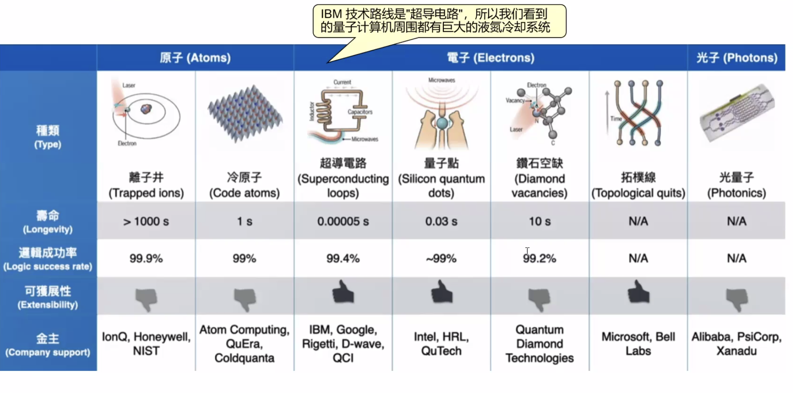
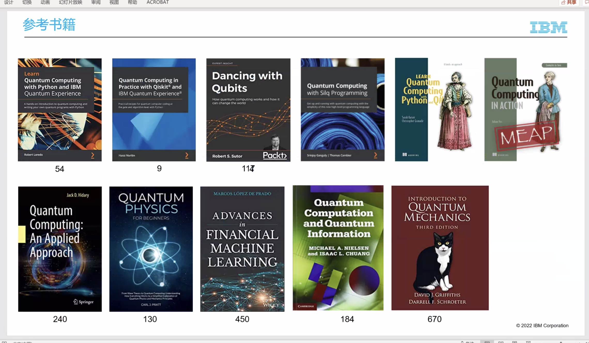

# Quantum_Computing

## 量子计算关键技术

* 量子叠加 Superposition
* 量子纠缠  Entanglement

## 量子计算技术路线

Quantum Computing Fundamentals：https://learning.oreilly.com/library/view/quantum-computing-fundamentals/9780136793830/?sso_link=yes&sso_link_from=IBM-Prod

https://quantum-computing.ibm.com/

## 量子电路转译与纠错码

### 量子转译电路

转移：transpile

将量子逻辑电路经过映射到目标量子器件上，也就是量子物理电路，这个过程为转译，转译过程通常伴随着优化

大多数量子机都有其硬件固有限制，它们同限制了量子设备的有效计算能力

* 有限连接性
* 有限门集
* 环境噪声和门错误

### 量子电路

量子软件和硬件的分层

* 软件：
  * Qiskit：IBM开源的，跨平台的设计理念; https://qiskit.org/
  * Cirq：谷歌
  * Q#：微软
  * IONQ
  * QPanda
* 硬件：
  * 
  * 超导电路：火热

127 -473-1121

量子计算的优势

传统计算：串行计算

量子计算：状态叠加

## 相关书籍

Quantum Computing with Python and IBM Quantum Experience

Quantum Computing in Pratice with Qiskit and IBM Quantum Experience

Dancing with Qubits

Quantum Computing with Silly Programming

Lean Quantum Computing with Python and Q#

Quantum Computing in Action

Quantum Computing: An Applied Approach

Quatum Physics

Advances in Financial Machine Learning

Quantum Computation and Quantum Information

Introduction Quantum Mechanics

